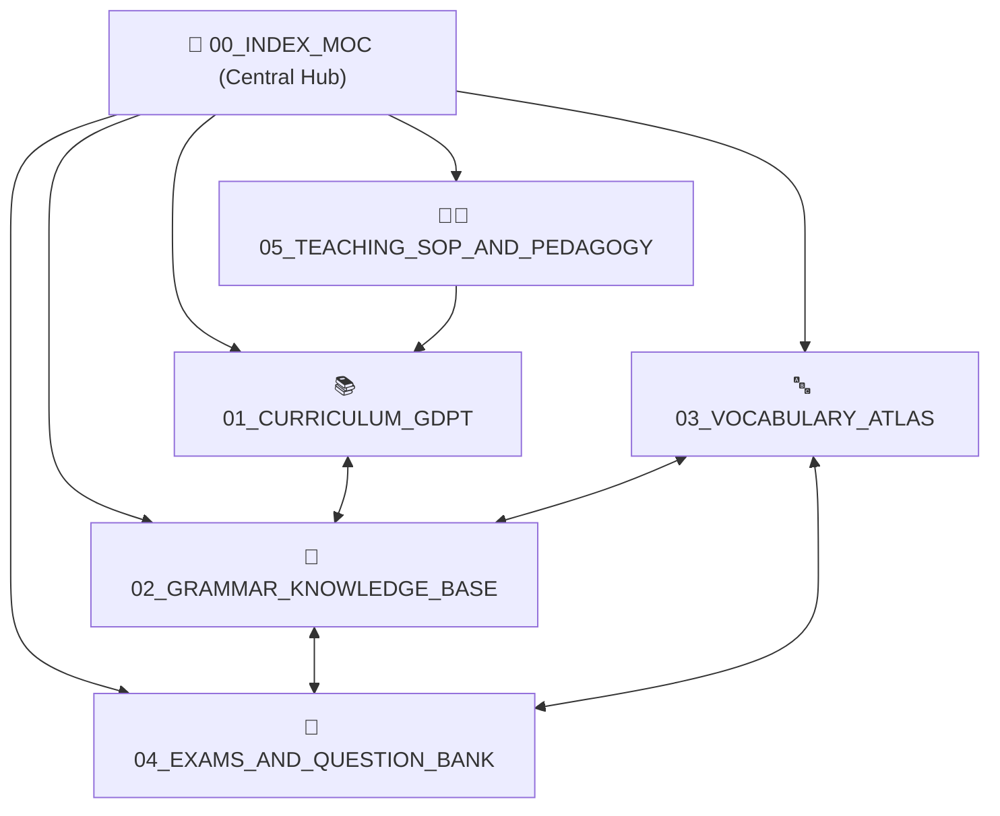

# 🧠 TIẾNG ANH CÔ DUNG: SECOND BRAIN KNOWLEDGE GRAPH

> [!abstract] BẢN ĐỒ TRI THỨC TOÀN DIỆN (MAP OF CONTENT)
> Chào mừng bạn đến với **Lớp Tri Thức Thứ Hai (Second Brain)** của Hệ thống Đào tạo Tiếng Anh Cô Dung. 
> Toàn bộ tri thức được kết nối bằng **mạng lưới liên kết 2 chiều (Bi-directional WikiLinks `[[...]]`)**, chuẩn hóa theo Chương trình GDPT 2018/2026 của Bộ GD&ĐT và Khung năng lực Châu Âu CEFR (A1 - C2).

---

## 🗺️ 5 TRỤ CỘT TRI THỨC CHÍNH (CORE PILLARS)

### 1. [[GDPT_Master_Curriculum_MOC|📚 01. Chương Trình GDPT & Lộ Trình 12 Năm]]
- [[Tieu_Hoc_Lop_1_5|🌱 Bậc Tiểu Học (Lớp 1 - 5)]]: Phonics tự nhiên, TPR, phản xạ nghe nói Cambridge Young Learners.
- [[THCS_Lop_6_9|🌿 Bậc THCS (Lớp 6 - 9)]]: Chuyên đề ngữ pháp cốt lõi, bồi dưỡng HSG, luyện thi Vào 10 Chuyên Anh.
- [[THPT_Lop_10_12|🌳 Bậc THPT (Lớp 10 - 12)]]: Ngữ pháp học thuật nâng cao, luyện thi Tốt nghiệp THPT 2026.
- [[International_IELTS_TOEIC_CEFR|🌏 Hệ Thống Chứng Chỉ Quốc Tế]]: KET (A2), PET (B1), IELTS Academic (6.5 - 8.0+), TOEIC.

### 2. [[Grammar_Master_MOC|📐 02. Cơ Sở Tri Thức Ngữ Pháp Toàn Diện (Grammar Vault)]]
- **Thì & Dạng Động Từ:** [[Present_Simple_and_Continuous]], [[Past_Simple_and_Continuous]], [[Present_Perfect_Mastery]], [[Future_Forms_and_Intentions]].
- **Cấu Trúc Câu Mệnh Đề:** [[Conditionals_Type_1_2_3_Mixed]], [[Relative_Clauses_Defining_NonDefining]], [[Passive_Voice_and_Causative]], [[Reported_Speech_and_Reporting_Verbs]].
- **Chuyên Đề Nâng Cao (HSG & THPT):** [[Inversion_and_Cleft_Sentences]], [[Subjunctive_Mood_and_Wish]], [[Stative_vs_Dynamic_Verbs]], [[Phrasal_Verbs_Top_100]], [[Conjunctions_and_Adverbial_Clauses]], [[Comparison_Equal_Comparative_Superlative]].

### 3. [[Vocabulary_Atlas_MOC|🔤 03. Bản Đồ Từ Vựng & Âm Vị Học (Lexicon Atlas)]]
- [[Phonics_and_IPA_Sound_System|🔊 Hệ Thống 44 Âm Quốc Tế IPA & Quy Tắc Ngữ Âm]]: Phát âm đuôi -ed, -s/-es, trọng âm 2-3-4 âm tiết.
- [[Word_Formation_and_Affixes|🧩 Cấu Tạo Từ & Tiền Tố - Hậu Tố]]: 1000 dạng bài Word Formation trích xuất từ đề thi HSG.
- **Từ Vựng Theo Cấp Độ CEFR:**
  - [[Lexicon_Primary_G1_G5|Pre-A1 -> A1 (Tiểu học)]]
  - [[Lexicon_Secondary_G6_G9|A2 -> B1 (THCS)]]
  - [[Lexicon_HighSchool_G10_G12|B1+ -> B2 (THPT)]]
  - [[Lexicon_Academic_IELTS_C1_C2|C1 -> C2 (Học sinh giỏi & IELTS)]]
- [[Collocations_and_Idiomatic_Expressions|💡 Cụm Từ Cố Định & Thành Ngữ Điểm Cao]]

### 4. [[Exams_MOC|📝 04. Ngân Hàng Đề Thi & Kỹ Thuật Làm Bài]]
- [[HSG_Grade7_YenLap_Breakdown|🏆 Đề HSG Lớp 7 Huyện Yên Lập (Phân tích chi tiết)]]
- [[HSG_Grade12_QuangNam_Breakdown|🥇 Đề HSG Tỉnh Lớp 12 Quảng Nam (Phân tích đáp án)]]
- [[THPT_QuocGia_2026_Format|🎯 Định Dạng Đề Thi Tốt Nghiệp THPT Mới 2026]]
- [[Sentence_Transformation_Techniques_700|✍️ 700 Dạng Bài Viết Lại Câu Tuyển Chọn]]
- [[IELTS_Academic_Reading_Techniques|📖 Kỹ Thuật Skimming/Scanning Reading IELTS 8.0+]]

### 5. [[Pedagogy_MOC|👩‍🏫 05. Sổ Tay Nghiệp Vụ & Quy Chuẩn Giảng Dạy Cô Dung]]
- [[Co_Dung_Teaching_Philosophy|✨ Triết Lý Giáo Dục Đa Trí Thông Minh]]
- [[Gamification_and_Star_Rewards_Rubric|⭐ Quy Chuẩn Thưởng Sao & Đấu Trường Game]]
- [[Tuition_and_Parent_Communication_SOP|📱 Quy Trình Báo Cáo Học Phí & Zalo Bot Tự Động]]

---

## ⚡ HƯỚNG DẪN TRUY XUẤT NHANH (QUICK ACTIONS)
- **Mở trong Obsidian:** Nhấn `Ctrl + O` để tìm nhanh bất kỳ khái niệm nào.
- **Xem Đồ Thị Tri Thức:** Nhấn `Ctrl + G` để mở **Graph View**, chiêm ngưỡng toàn bộ mạng lưới node tri thức liên kết 3D.
- **Tra cứu trên Web:** Truy cập trực tiếp tại endpoint `/second-brain` trên ứng dụng SvelteKit.

## 📥 Kho 35 Tài Liệu Giáo Án & Đề Thi Mới Đồng Bộ (Google Drive)
- [[00_GOOGLE_DRIVE_INDEX|📁 Thư Mục Trung Tâm: Mục Lục Toàn Bộ 35 Tài Liệu Google Drive]]

### Nhóm Tài Liệu Phân Hệ GDPT
- [[drive-nhom-7-chuyen-e-phoi-hop-thi-thpt-huong-khe-d9cc7ef9|Nhóm 7. Chuyên Đề Phối Hợp Thì Thpt Hương Khê]]
- [[drive-photo-quiz-reading-giaoandethitienganh-info-6433023a|Photo Quiz Reading-Giaoandethitienganh.Info]]
- [[drive-unit-5-lesson-5d-speaking-page-73-e4725c58|Unit 5 - Lesson 5D - Speaking - Page 73]]
- [[drive-unit-5-lesson-5f-skills-reading-page-76-56753164|Unit 5 - Lesson 5F - Skills Reading - Page 76]]
- [[drive-although-despite-key-39982d3b|Although Despite Key]]
- [[drive-because-because-of-key-e15b69cf|Because Because Of Key]]
- [[drive-so-that-in-order-to-key-b1ded2bc|So That In Order To Key]]
- [[drive-viet-lai-cau-1-100-b72ba5fe|Viet Lai Cau 1 100]]
- [[drive-yen-lap-g7-ea81ca75|Yen Lap G7]]
- [[drive-grade-6-u8-global-success-84c3528b|Grade 6 - U8 - Global Success]]

### Nhóm Tài Liệu Chuyên Đề Ngữ Pháp
- [[drive-phrasal-verbs-ab32816d|Phrasal Verbs]]
- [[drive-conditional-sentences-key-fe8b7273|Conditional Sentences Key]]
- [[drive-phrasal-verbs-key-debcaeec|Phrasal Verbs Key (Bản trùng)]]
- [[drive-relative-clause-key-ca933f8f|Relative Clause Key]]
- [[drive-reported-speech-key-35c13cb9|Reported Speech Key]]

### Nhóm Tài Liệu Từ Vựng & Phonics
- [[drive-1000-word-formation-cd360c3f|1000 Word Formation]]
- [[drive-22000-tu-toefl-ielts-harold-levine-b48772e8|22000 Tu Toefl Ielts Harold Levine]]
- [[drive-becoming-independent-vocab-972b3e6a|Becoming Independent Vocab]]
- [[drive-cities-urbanisation-vocab-73d9904c|Cities Urbanisation Vocab]]
- [[drive-our-heritage-vocab-d749c408|Our Heritage Vocab]]

### Nhóm Tài Liệu Đề Thi & Ngân Hàng Câu Hỏi
- [[drive-1000-cau-trac-nghiem-ngu-phap-hsg-268c76ae|1000 Cau Trac Nghiem Ngu Phap Hsg]]
- [[drive-31-viet-lai-cau-thi-hsg-lop-10-11-12-223fbdc9|Viet Lai Cau - Thi Hsg Lop 10 11 12]]
- [[drive-chuyen-de-so-1-viet-lai-cau-thi-hsg-lop-10-11-12-045c09d3|Chuyen De So 1 Viet Lai Cau - Thi Hsg Lop 10 11 12 (Bản trùng)]]
- [[drive-ioe-lop-5-tron-bo-3d9eda8c|Ioe Lop 5 Tron Bo]]
- [[drive-key-chuyen-de-so-1-viet-lai-cau-thi-hsg-10-11-12-371e03a0|Key- Chuyen De So 1 Viet Lai Cau Thi Hsg 10 11 12]]
- [[drive-speaking-test-4-units-9-10-26d51a71|Speaking Test 4 Units 9-10]]
- [[drive-chuyen-de-ngu-phap-18444328|Chuyen De Ngu Phap]]
- [[drive-g3-ck1-test-eb751cc4|G3 Ck1 Test]]
- [[drive-g4-ck1-test-f16f49cc|G4 Ck1 Test]]
- [[drive-g5-ck1-test-9ab6f4b1|G5 Ck1 Test]]
- [[drive-g7-hsg-de2-7c5b41f9|G7 Hsg De2]]
- [[drive-hsg-lop-11-6fed2b0b|Hsg Lop 11]]
- [[drive-hsg-lop-12-quang-nam-437fe0cf|Hsg Lop 12 Quang Nam]]
- [[drive-e-hsg-anh-8-so-23-801e422c|Đề Hsg Anh 8 Số 23]]
- [[drive-e-hsg-anh-8-so-24-af2d9e46|Đề Hsg Anh 8 Số 24]]
