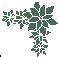
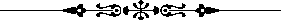
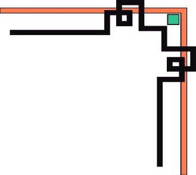
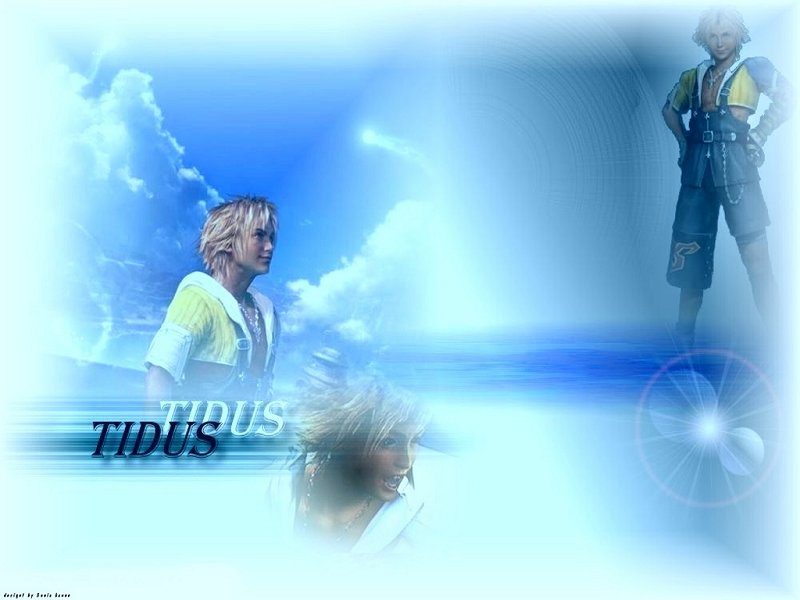
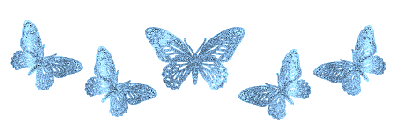
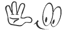
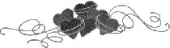

# 22000 tu toefl ielts harold levine

Nguồn: 22000_tu_toefl_ielts_harold_levine.docx

[[00_GOOGLE_DRIVE_INDEX|Mục lục tài liệu Google Drive]]

Nội dung trích xuất từ tài liệu gốc; các ô bảng được đọc lần lượt. Bố cục và định dạng có thể khác bản Word.

## Nội dung tài liệu

|                              

|

22000 ESSENTIAL WORDS FOR

IELTS AND TOEFL

|

Cũng có 1 chút kinh nghiệm về kỳ thi IELTS, nên hôm nay chia sẻ cùng mọi người.

Muốn đạt điểm cao ở kỳ thi IELTS, có 1 điểm rất quan trọng mà Bear nghĩ ai cũng biết: LUYỆN TẬP THƯỜNG XUYÊN.

Tuy nhiên, cũng có 1 điểm cực kỳ quan trọng mà đa số thường không chú trọng lắm. Đó là phần từ vựng dạng ACADEMIC (học thuật).

Nên để đạt điểm cao trong kỳ thi IELTS, ôn luyện từ trong quyển 22.000 từ THI TOEFL/IELTS của Harold Levine là cực kỳ cần thiết. Mỗi ngày chỉ cần học 3 từ, thì lượng từ vựng của bạn sẽ tăng đáng kể.

Số từ vựng này giúp bạn trong cả 4 phần thi LISTENING / SPEAKING / READING / WRITING.

Ví dụ: Nếu bạn dùng từ:

SIMULTANEOUSLY thay cho từ AT THE SAME TIME,

hay PORTABLE thay cho từ EASY TO CARRY

hay MITIGATE thay cho từ LESSEN …

trong phần WRITING và SPEAKING thì điểm của bạn sẽ cao chót vót không ngờ luôn đấy. Chưa kể, nhất là trong phần READING, những từ trong quyển sách này xuất hiện nhiều lắm, và cả LISTENING nữa chứ.

Sự lợi hại của quyển sách này, chắc chắn chỉ khi nào học rồi, bạn mới thấy rõ.

Quyển này (nhà xuất bản TPHCM) đã hết bán rồi. Nên nếu bạn nào cần phôtô thì liên lạc Uyên Uyên: UyenUyen@englishtime.us

Tuy nhiên mỗi tuần Bear vẫn sẽ post lên đây 20 từ trong quyển sách đó, để nếu bạn nào ở xa, vẫn có thể học được.

Đương nhiên mỗi người có 1 cách học riêng và trí nhớ khác nhau. Có người nhìn qua là nhớ liền, có người nhìn hoài vẫn không nhớ, nên Bear suggest cách học này, bạn nào thấy thích hợp với mình thì áp dụng:

1/ Mỗi ngày học 3 từ: giống như ăn cơm vậy: sáng 1 từ, trưa 1 từ, tối 1 từ. Vui lòng đừng thấy cuốn sách quá hay mà học 1 ngày vài ba chục từ rồi ngày mai nhìn lại thấy ngán.. rồi.. bỏ luôn quyển sách hay này nhé.

2/ Làm sao mà trước khi đi ngủ, có thể đọc (hoặc viết) ra 3 câu ví dụ có chứa từ đó là xem như ok. Nhớ là đừng học kiểu: teacher : giáo viên, mà hãy cho nó vào câu hẳn hoi. Nên học câu ví dụ trong sách, (giúp mình biết thêm nhiều từ mới khác + quan sát từ loại, ngữ pháp của câu) chứ đừng học nghĩa tiếng Việt rồi tự đặt câu, có khi lại sai ngữ pháp, sai luôn cả từ loại nữa !

3/ Có bạn hỏi Bear, nếu học hôm nay nhớ, ngày mai quên 3 từ đã học thì sao. Câu trả lời là: thì cứ việc quên thoải mái! Bộ não làm việc thì phải cho nó nghỉ ngơi, có ra có vô chứ. Miễn sao, cuối ngày, bạn vẫn nhớ được 3 từ trong ngày bạn học là OK lắm rồi. Lâu lâu ôn đi ôn lại những từ đã học, thì sẽ nhớ dai thôi.

4/ 3 từ x 7 ngày = 21 từ. Nhưng Bear chỉ post 20 vì.. tối chủ nhật nên thư giãn (đi ăn kem chẳng hạn) thì não sẽ hoạt động tốt hơn 

5/ Giải thích:

Concur / 28: => Tức là từ CONCUR này xuất hiện ở trang 28 của quyển sách.

Agree, be of the same opinion => Từ đồng nghĩa. Ví dụ, ở phần READING, trong đoạn văn thì dùng từ CONCUR, đến lúc, câu hỏi, người ta dùng AGREE. Do đó, học luôn từ đồng nghĩa, sẽ giúp mình có tiết kiệm thời gian và có nhiều đáp án đúng trong lúc làm bài thi. Hoặc ở phần WRITING, để tránh lập lại từ AGREE, mình có thể dùng CONCUR.

Đồng ‎ý, cùng 1 ‎ý kiến => Nghĩa tiếng Việt

Good sportsmanship requires you to accept the umpire’s decision even if you do not concur with it. => Câu ví dụ, có bối cảnh hẳn hoi, dễ hiểu.

Tinh thần thể thao tốt đòi hỏi bạn phải chấp nhận quyết định của trọng tài dù cho bạn không đồng ‎ý với ông ta. => Phần dịch tiếng Việt để bạn nào làm biếng tra từ (có khi trong câu ví dụ, nó lại xuất hiên những từ mình không biết), vẫn có thể hiểu được.

6/ Ghi chú: Có nhiều bạn, muốn điểm cao, nhưng lại làm biếng học từ vựng, thì vẫn cứ ở mãi trong cái vòng lẩn quẩn.. không thể nào thoát ra được. Lời khuyên chân thành của Bear là: ráng học từ vựng trong quyển này, sẽ cải thiện số điểm đáng kể!

Sau đây là 20 từ cho tuần này:

Giaoandethitienganh.info sưu tầmGiaoandethitienganh.info sưu tầm

Giaoandethitienganh.info sưu tầm

Giaoandethitienganh.info sưu tầm

IELTS VOCABULARY – WEEK 1

1.     Civilian / 28 : [ n, adj ]

/ sə'vɪliən /
 = A person who is not a member of the armed forces, or police, or fire-fighting forces.
( Người không phải là thành phần của các lực lượng vũ trang, hoặc cảnh sát, hoặc lực lượng cứu hỏa.)
Ex: Eight of the passengers were soldiers, and one was a marine; the rest were civilians.
( Tám hành khách là lính, 1 người là lính thủy, số còn lại là những thường dân.)

2.        Complicated/ 28: [ adj ]
/ 'kɒmplɪkeɪtɪd /
 = Not simple or easy; intricate
( Không đơn giản hoặc dễ dàng; tinh vi và phức tạp.)
Ex: If some of the requirements for graduation seem complicated, see your guidance counselor. He will be glad to explain them to you.
( Nếu như 1 số điều kiện để tốt nghiệp có vẻ phức tạp, bạn hãy đến gặp vị giáo sư hướng dẫn. Ông ta sẽ vui vẻ giải thích cho bạn.)

3.                 Concur / 28: [ v ]

/ kən'kɜr / 
= Agree, be of the same opinion
(Đồng ‎ý, cùng 1 ‎ý kiến)
Ex: Good sportsmanship requires you to accept the umpire’s decision even if you do not concur with it.
( Tinh thần thể thao tốt đòi hỏi bạn phải chấp nhận quyết định của trọng tài dù cho bạn không đồng ‎ý với ông ta.)

4.                 Confirm / 28: [ v ]
/ kən'fɜrm /
= State or prove the truth of; substantiate

( Xác nhận, chứng thực)
Ex: My physician thought I had borken my wrist, and an X ray later confirmed his opinion.
( Vị bác sĩ của tôi nghĩ rằng tôi đã bị gãy cổ tay và việc chụp X quang sau đó đã xác nhận ‎y kiến của ông là đúng.)

5.                 Digress / 30: [ v ]
/ daɪ'gress /
=Turn aside, get off the main subject in speaking or writing.
( Đi lệch, lạc khỏi chủ đề chính khi nói hoặc viết.)
Ex: At one point in his talk, the speaker digressed to tell us of an incident in his childhood, but then he got right back to his topic.
(Có lúc trong cuộc nói chuyện, ngừơi diễn giả đã đi khỏi đề tài để kể cho chúng tôi nghe 1 sự việc trong thời trẻ thơ của ông, nhưng rồi sau đó, ông đã trở lại với chủ đề.)

6.                Fragile / 30: [ adj ]
/  'frædʒaɪl /
= Easily borken; breakable; weak; frail.
(Dễ gãy; có thể gãy, bẻ gãy; yếu; mảnh khảnh.)
Ex: The handle is fragile; it will easily break if you use too much pressure.
(Tay cầm ấy rất mỏng manh; nó sẽ dễ dàng bị gãy nếu như anh ấn xuống quá mạnh.)

7.               Galore / 30: [ adj ]
/ gə'lɔ: /
= Plentiful; abundant (galore always follows the word it modifies)
( Nhiều; phong phú (galore luôn luôn đi theo sau từ mà nó phẩm định)
Ex: There were no failures on the final test, but on the midterm there were failures galore.
(Không có ai rớt trong kỳ thi trắc nghiệm cuối cùng, nhưng vào giữa khóa thì số người rớt nhiều.)

8.     Genuine / 30: [ adj ]
/ 'dʒenjuɪn /
= Actually being what it is claimed or seems to be; true; real; authentic.
( Thật sự đúng như tên gọi hoặc đúng như người ta thấy; thật; thật sự; đích thực.)
Ex: Jane wore an imitation fur coat that every one thought it was made of genuine leopard skin.
(Jane mặc 1 chiếc áo lông thú giả mà mọi người nghĩ rằng nó làm bằng da báo thật.)

9.      Hostile / 30 : [ adj, n ]
/ 'hɔstaɪl /
= Of or relating to an enemy or enemies; unfriendly
( Thuộc hoặc có liên quan đến kẻ thù; không thân hữu.)
Ex: It was not immediately announced whether the submarine reported off our coast was of a friendly or a hostile nation.
(Người ta không loan báo lập tức rằng chiếc tàu lặn được báo cáo xuất hiện ngòai khơi bờ biển của chúng ta là của 1 quốc gia bạn hay 1 quốc gia thù nghịch.)

10.    Impatient / 30: [adj]
/ ɪm'peɪʃənt /
= Not patient; not willing to bear delay; restless; anxious
( Không kiên nhẫn; không chịu được sự trì hoãn; bồn chồn; lo lắng.)
Ex: Five minutes can seem like five hours when you are impatient.
( 5 phút có thể xem như 5 giờ khi bạn nôn nóng, không kiên nhẫn.)

11.             Inter / 30: [ v ]
/ ɪn'tɜ: /
= Put into the earth or in a grave; bury
( Chôn xuống đất hoặc trong huyệt mộ; chôn cất.)
Ex: Many American heroes are interred in Arlington National Cemetery.
(Nhiều anh hùng nước Mỹ được an táng ở nghĩa trang quốc gia Arlington.)

12.             Mitigate / 30: [ v ]
/ 'mɪtɪgeɪt /
= Make less severe; lessen; soften; relieve.
( Làm giảm đi; giảm bớt; làm diụ; làm cho nhẹ nhỏm)
Ex: With the help of novocaine, your dentist can greatly mitigate the pain of drilling.
( Nhờ sự trợ giúp của chất Novocaine, nha sĩ của anh có thể làm giảm bớt cơn đau rất nhiều khi khoan răng.)

13.             Novice / 30: [ n ]
/ 'nɒvɪs /
= One who is new to a field or activity; beginner
( Người mới gia nhập 1 lĩnh vực hoạt động; người mới bắt đầu.)
Ex: Our Dance Club has two groups; one for experienced dancers and one for novices.
( Câu lạc bộ khiêu vũ của chúng tôi có 2 nhóm; 1 nhóm dành cho những người nhảy đã có kinh nghiệm và 1 nhóm dành cho người mới bắt đầu.)

14.             Original / 32: [ adj, n ]
/ ə'rɪdʒənl /
= A work created firsthand and from which copies are made
( 1 công trình gốc đuợc sáng tạo và từ đó có thể sao chép ra các phiên bản.)
= Belonging to the beginning; first; earliest.
( Thuộc về lúc bắt đầu; đầu tiên; sớm nhất.)
Ex: Most of us can buy copies of a masterpiece, but few can afford the original.
( Phần đông chúng ta có thể mua phiên bản của các danh tác, nhưng chỉ có 1 số ít người là có đủ tiền để có thể mua nguyên bản.)
Ex: Miles Standish was one of the original colonists of Massachusetts; he cam over on the ‘Mayflower’.
( Miles Standich là 1 trong những người định cư nguyên thủy tại bang Massachusetts; ông ta đến trên con tàu của Mayflower.)

15.             Rarity / 32: [ n ]
/ 'reərəti /
= Something uncommon, infrequent, or rare
( 1 điều gì đó không phổ biến, không thường xuyên, hoặc hiếm)
Ex: Rain in the Sahara Desert is a rarity.
( Mưa ở sa mạc Sahara là 1 điều hiếm có.)

16.             Resume / 32: [ v, n ]
/ rɪ'zju:m /
= Begin again
Bắt đầu lại
Ex: School closes for the Christmas recess on December 24 and resumes on January 3.
( Trường học đóng cửa vào kỳ nghỉ giáng sinh 24/12 và bắt đầu lại vào ngày 3/1.)

17.             Shrink / 32: [ v ]
/ ʃrɪηk /
= Draw back; recoil
( Thụt lùi; lùi lại vì sợ)
Ex: Wendy shrank from the task of telling her parents about her low French mark, but she finally got the courage and told them.
( Wendy ngại không dám nói với cha mẹ cô về điểm số thấp môn Pháp văn của cô, nhưng cuối cùng cô cố can đảm để nói.)

18.             Sober / 32: [ adj ]
/ 'səʊbə /
= Not drunk: không say
= Serious; free from excitement or exaggeration: nghiêm túc; không bị kích động hoặc phóng đại
Ex1: Our driver had refused all strong drinks because he wanted to be sober for the trip home.
( Tài xế của chúng tôi đã từ chối mọi thức uống có rượu mạnh bởi vì ông ấy muốn được tỉnh táo trong chuyến đi về nhà.)
Ex2: When he learned of his failure, George thought of quitting school. But after sober consideration, he realized that would be unwise.
( Khi biết rằng mình đã thi rớt, George đã nghĩ đến việc thôi học. Nhưng sau khi suy nghĩ nghiêm túc, anh nhận thấy rằng điều đó là không khôn ngoan.)

19.             Suffice / 32: [ v ]
/ sə'faɪs /
= Be enough, adequate, or sufficient
( Đủ, tương ứng, hoặc đầy đủ) 
Ex: I told Dad that $3 would suffice for my school supplies. As it turned out, it was not enough.
( Tôi nói với bố tôi rằng 3,5 đô la thì đủ để mua những thứ cần thiết cho việc học của tôi. Sau đó hóa ra số tiền ấy không đủ.)

20.             Vacant / 32: [ adj ]
/ 'veɪkənt /
= Empty; unoccupied; not being used
( Trống; bỏ trống; không được sử dụng)
Ex: I had to stand for the first half of the performance because I could not find a vacant seat.
( Tôi phải đứng trong suốt nửa buổi trình diễn đầu tiên bởi vì tôi đã không tìm được ghế trống nào.)

IELTS VOCABULARY – WEEK 2

1.  Adjourn / 44: [ v ] 
/ ə'dʒə:n /
= Close a meeting; suspend the business of a meeting; disband.
( Kết thúc cuộc họp; ngưng công việc trong 1 phiên họp, giải tán.)
Ex: When we visited Washington, D.C., Congress was not in session; it had adjourned for the Thanksgiving weekend.
( Khi chúng tôi viếng thăm thủ đô Washington D.C, Quốc hội không đang họp; quốc hội đã nghỉ lễ Tạ Ơn cuối tuần.)

2.     Astute / 46: [ adj ] 
/  əs'tju:t /
= Shrewd; wise; crafty; cunning
( Tinh ranh; khôn; mưu mô; quỷ quyệt)
Ex: The only one to solve the riddle before the five minutes were up was Joel; he is a very astute thinker.
( Người duy nhất giải được bài toán đố trước khi năm phút chấm dứt là Joel; anh ta là 1 người suy nghĩ tinh khôn).

| 3.    Censure / 46: [ n, v ] 
= Act of blaming; expression of disapproval; hostile criticism; rebuke
( Hành động quở trách; bày tỏ sự không hài lòng.)
Ex: Cathy was about to reach for a third slice of cake but was stopped by a look of censure in Mother’s eyes.
( Cathy sắp sửa với tay lấy lát bánh thứ ba, nhưng dừng lại vì cái nhìn quở trách trong đôi mắt mẹ cô.)

4.     Demolish / 46: [ v ] 
/  dɪ'mɔlɪ∫/
= Tear down; destroy, raze
( Phá sập; hủy diệt, san bằng.)
Ex: It took several days for the wrecking crew to demolish the old building.
( Phải tốn nhiều ngày để tóan đập phá phá đổ và san bằng tòa nhà cũ.)

5.    Discharge / 46: [ n, v ] 
/ dɪs't∫ɑ : dʒ /
= Unload
( Bốc; dỡ xuống)
Ex: After discharging her cargo, the ship will go into dry dock for repairs.
( Sau khi bốc dỡ hàng hóa xuống, chiếc tàu sẽ tiến vào ụ tàu khô nước để sửa chữa.)

6. Dissent / 46: [ n, v ] 
/  dɪ'sent /
= Differ in opinion; disagree; object.
( Khác y kiến; không đồng ‎y; phản bác.)
Ex: There was nearly complete agreement on Al’s proposal to raise the dues. Enid and Alice were the only ones who dissented.
(Gần như có sự đồng ý hoàn tòan về đề nghị tăng lệ phí của Al. Enid và Alice là những kẻ không đồng ý.)

7.       Equitable / 46: [ adj ] 
/  'ekwɪtəbl /
= Fair to all concerned; just.
( Tốt với mọi người; bình đẳng.)
Ex: The only equitable way for the three partners to share the $60 profit is for each to receive $20.
( Cách công bằng duy nhất để 3 người tham dự chia nhau số lãi 60 đô la là mỗi người lấy 20 đô.)

8.      Exonerate /46: [ v ] 
/  ɪg'zɔnəreɪt /
= Free from blame; clear from accusation.
( Làm cho khỏi bị khiển trách, làm cho khỏi bị kết tội.)
Ex: The other driver exonerated Dad of any responsibility for the accident.
( Người tài xế khác đã giải trừ cha tôi khỏi trách nhiệm đối với tai nạn.)

9.      Extemporaneous / 46: [ adj ] 
/  eks,tempə'reɪnjəs /
= Composed or spoken without preparation; off-hand; impromptu; improvised
( Thảo hoặc nói ra mà không chuẩn bị trước; ứng khẩu, ứng chế; làm ra ngay mà không chuẩn bị.)
Ex: It was easy to tell that the speaker’s talk was memorized, though he tried to make it seem extemporaneous.
( Thật là dễ để nhận ra rằng bài nói chuyện của diễn giả đã được học thuộc lòng, tuy nhiên ông ta cố gắng làm ra như thể là ứng khẩu.)

10.             Extricate / 46: [ v ] 
/  'ekstrɪkeɪt /
= Free from difficulties; disentangle.
( Vượt khỏi sự khó khăn; thoát ra được.)
Ex: If you let your assignments pile up, you will get into a situation from which you will not be able to extricate yourself.
( Nếu bạn để cho bài làm của bạn chồng chất lên, bạn có thể rơi vào tình trạng mà bạn không thể nào thoát ra được.)

11.             Forfeit / 48: [ n, adj, v ] 
/  'fɔ:fɪt /
= Lose or have to give up as a penalty for some error, neglect, or fault
( Mất hoặc phải chịu mất, bỏ qua.)
Ex: Our neighbour gave a $20 deposit on an order of slipcovers. When they were delivered, she decided she didn’t want them. Of course, she foreited her deposit.
( Người láng giềng của chúng tôi đặt 20 đô la tiền cọc để đặt hàng mua các nắp rời. Khi hàng được giao, bà ấy quyết định là không cần nữa. Lẽ dĩ nhiên, bà chịu mất đi số tiền đặt cọc.)

12.         Illegible / 48: [ adj ] 
/  ɪ'ledʒəbl /
= Not able to be read; very hard to read; not legible
( không thể đọc được; rất khó đọc.)
Ex: Roger ought to type his reports because his handwriting is illegible.
(Roger phải đánh máy bản cáo của ông vì chữ viết tay của ông không thể đọc đuợc.)

13.             Inadvertently / 48: [ adv ] 
/  ɪnəd'və:təntli /
= Not done on purpose; unintentionally; thoughtlessly; accidentally.
( Không dụng tâm; không chủ ‎; vô ý ‎; ngẫu nhiên.)
Ex: First I couldn’t locate my math homework, but after a while, I found it in my English notebook. I must have put it there inadvertently.
( Trước tiên tôi không thể nào xác định được bài tập toán của tôi ở đâu; nhưng sau 1 hồi, tôi tìm thấy nó trong vở ghi bài tiếng Anh. Hẳn là tôi đã vô ý‎ để nó rơi vào trong đó.)

14.             Inappropriate / 48: [ adj ] 
/ ɪnə'prəʊpriət /
= Not fitting; unsuitable; unbecoming; not appropriate.
( Không thích hợp; không phù hợp; không khớp với.)
Ex: Since I was the one who nominated Bruce, it would be inappropriate for me to vote for another candidate.
( Bởi vì tôi là người đã đề cử Bruce, nên việc tôi bầu cho 1 ứng cử viên khác là không thích hợp.)

15.         Lucrative / 48: [ adj ] 
/  'lu:krətɪv /
= Money-making; profitable.
( Làm ra tiền; có lời.)
Ex: This year’s school dance was not so lucrative; we made only $17, compared to $41 last year.
( Buổi khiêu vũ trong trường năm nay thì không lời lắm; chúng ta kiếm được có 17 đô la so với năm rồi là 42 đô la.)

16.             Permanent / 48: [ adj ] 
/  'pə:mənənt /
= Lasting; enduring; intended to last; stable (antonyms: temporary; transient)
( Lâu dài; kéo dài; bền vững.)
Ex: When my friend moved to San Francisco, he asked me to write to him at his temporary address, the Gateway Hotel. He promised to send me his permanent address as soon as his family could find an apartment.
( Khi bạn tôi chuyển đến San Francisco, anh ấy bảo tôi viết thư cho anh ta ở địa chỉ tạm thời là khách sạn Gateway. Anh ta hứa sẽ gửi cho tôi địa chỉ ổn định ngay khi gia đình anh có thể tìm mua được 1 căn hộ.)

17.      Prohibit / 48: [ v ] 
/  prə'hɪbɪt /
= Fobid; ban
( Cấm; không cho.)
Ex: Our library’s regulations prohibit the borrowing of more than four books at a time.
( Nội quy thư viện của chúng tôi cấm không cho mượn sách quá 4 quyển trong 1 lần.)

18.         Punctual / 50: [ adj ] 
/  'pʌηkt∫uəl /
= On time; prompt.
( Đúng giờ.)
Ex: Be punctual. If you are late, we shall have to depart without you.
( Hãy đúng giờ. Nếu bạn đến trễ, chúng tôi sẽ phải khởi hành mà không có bạn.)

19.             Rebuke / 50: [ n, v ] 
/  rɪ'bju:k /
= Express diapproval of ; criticize sharply; censure severely; reprimand; reprove.
( Bày tỏ sự không hài lòng; phê bình mạnh mẽ; khiển trách nặng; quở trách, la mắng)
Ex: Our coach rebuked the two players who were late for practice, but praised the rest of the team for being punctual.
( Huấn luyện viên của chúng tôi khiển trách 2 vận động viên đến thực tập trễ, nhưng khen ngợi những người còn lại đã đến đúng giờ.)

20.    Transient / 50: [ adj, n ] 
/  'trænzɪənt /
= Not lasting; passing soon; fleeting; short-lived; momentary
( Không tồn tại lâu; chóng qua; thoáng qua; sống ngắn ngủi; chốc lát.)
Ex1: It rained all day upstate,but here we had only a transient shower;it was over in minutes.

(Trời mưa cả ngày phía trên bang, nhưng ở đây chúng tôi chỉ có 1 cơn mưa rào chóng qua; nó chỉ trong 1 vài phút.)
= Visitor or guest staying for only a short time.
( Khách viếng thăm trong 1 thời gian ngắn, khách vãng lai.)
Ex2: The hotel’s customers are mainly transients;only a few are permanent guests

(Khách hàng của khách sạn chủ ‎yếu là khách vãng lai; chỉ có 1 vài người là khách thường xuyên.)

IELTS VOCABULARY – WEEK 3

1. Cache / 62: [n , v ]
/  kæ∫/ 
= Hiding place to store something.
( Chỗ cất giấu, lưu trữ.)
Ex: After his confession, the robber led detectives to a cache of stolen gems in the basement.
( Sau khi thú nhận, tên cướp đã dẫn các thám tử đến nơi cất giấu các viên ngọc được đánh cắp trong tầng hầm.)

2.                 Commend / 62: [ v ] (ant. Censure, reprimand)
/kə'mend / 
= Praise; mention favorably.
( Ca ngợi, đề cập đến 1 cách thuận lợi.)
Ex: Our class was commended for having the best attendance for January.
( Lớp học tôi được khen ngợi vì đi học đều vào tháng giêng.)

3.                 Cur / 62   [ n ]
/kə /
= Worthless dog.
( Con chó vô dụng.)
Ex: Lassie is a kind and intelligent animal. Please don’t refer to her as a ‘cur’.
( Lassie là 1 con vật hiền và thông minh. Xin đừng kêu nó là 1 ‘con chó vô dụng’)

4.                 Despotic / 64: [ adj ]
/ des'pɔtɪk/
= Of a despot (a monarch having absolute power); domineering; dictatorial; tyrannical.
( Thuộc về nhà độc tài _1 vị vua có quyền hành tuyệt đối; áp đảo thống trị, độc đoán.)
Ex: The American colonists revolted against the despotic governement of King George III.
( Những người dân định cư tại Mỹ đã nổi dậy chống lại chính quyền độc tài của vua George đệ tam.)

5.                 Dispute / 64: [ n, v ]
/ dɪs'pju:t /
= Argue about; debate; declare not true; call in question; oppose.
( L‎y’ luận, biện bác; tranh luận, tuyên bố là không đứng; đặt thành vấn đề; đối lập.) 
Ex: Charley disputed my answer to problem 9 until I showed him definite proof that I was right.
( Charley tranh cãi về trả lời của tôi cho vấn đề số 9, cho đến khi tôi chỉ cho anh ta thấy bằng chứng rõ ràng là tôi đúng.)

6.                 Edifice / 64: [ n ] 
/ 'edɪfɪs /
= Building, especially a large or impressive building.
( Cao ốc, nhất là cao ốc lớn và đồ sộ.)
Ex: The huge edifice under construction near the airport will be a modern hotel.
( Tòa nhà khổng lồ đang xây cất gần sân bay sẽ là 1 khách sạn hiện đại.)

7.                 Era / 64: [n]
/ 'ɪərə /
= Historical period; period (of time)
( Giai đoạn lịch sử; thời kỳ.)
Ex: The atomic era began with the dropping of the first atomic bomb in 1945.
( Thời đại nguyên tử bắt đầu với quả bom nguyên tử đầu tiên được thả xuống năm 1945.)

8.                 Initiate / 64: [ v ]
/ ɪ'nɪʃɪət /
= Begin; introduce; originate.
( Bắt đầu; du nhập vào; nguồn.)
Ex: The Pilgrims initiated the custom of celebrating Thanksgiving Day.
( Tổ phụ người Mỹ di dân Pilgrims đã khởi đầu tập tục Ngày Lễ Tạ Ơn.)
= Admit or induct into a club by special ceremonies.
( Nhận vào câu lạc bộ với nghi thức đặc biệt.)
Ex: Next Friday our club is going to initiate three new memebers.
( Thứ 6 tới, câu lạc bộ của chúng tôi sẽ làm lễ nhận vào 3 hội viên mới.)

9.                 Jolly Roger / 64: [n]
/ 'dʒɔlɪ'rəʊdʒə /
= Prirate’s flag; black flag with white skull and crossbones.
( Lá cờ của hải tặc; lá cở đen với đầu lâu trắng và hai khúc xương chéo nhau.)
Ex: The Jolly Roger flying from the mast of the approaching ship indicated that it was a pirate ship.
( Lá cờ đầu lâu bay trên cột buồm của con tàu đang tiến tới cho biết đây là con tàu của hải tặc.)

10.    Multitude / 64: [n]
/ 'mʌltɪtju/

= Crowd; throng; horde; swarm.
( Đám đông, bầy, đàn.)
Ex: There was such a multitude outside the store waiting for the sale to begin that we decided to shop on another day.
( Có 1 đám thật đông bên ngòai cửa hiệu chờ cho giờ bán hàng bắt đầu, do đó, chúng tôi quyết định sẽ đi mua sắm vào 1 ngày khác.)

11. Perceive  / 64:[ v]

/pə’si:v/

= Become aware of through the senses; see; note; boserye

(biết được nhờ giác quan; thấy; ghi nhận; quan sát )

Ex: When the lights went out, I couldn’t see a thing, but gradually I was able to perceive the outlines of the larger pieces of furniture.

(Khi đèn tắt, tôi không thể nhìn thấy một vật gì, nhưng từ trí tôi đã có thể nhận ra đường nét cuả những đồ đạc lớn hơn.)

12. Portal / [n]

/’pɔ: tl/

= door; entrance; especially; a grand or impressive one

(cửa; lối vào; nhất là cưả to và đồ sộ )

Ex: The original doors at the main entrance to our school have been replaced by bronze portals.

(Chiếc cưả ban đầu ở lối vào trường tôi đã được thay thế bằng cánh cổng bằng đồng )

13. Reserved / [adj]

/ri’zə:vd/

= restrained in speech or action; uncommunicative

(ít nói hoặc hạn chế hành động; không giao tiếp )

Ex: Mark was reserved at first but became much more communicative when he got to know us better.

(Ban đầu Mark dè dặt nhưng đã trở nên cởi mở nhiều hơn khi anh ấy biết nhiều hơn về chúng tôi )

14. Restrain / [v]

/ri’strein/

= hold back; check; curb; repress

(giữ lại; ngăn lại; chận lại; đè xuống )

Ex: Midred could not restrain her desire to open the package immediately, even though it read, “Do not open before Christmas!”

(Mildred không thể kiềm chế được lòng ham muốn mở gói quà ngay, mặc dù trên đó có viết: “Đừng mở trước lễ Giáng Sinh”

15. Retract / [v]

/ri’trækt/

= draw back; with draw; take back

(rút lui; rút lại; lấy lại )

Ex: You can depend on Frank. Once he has given his promise, he will not retract it.

(Anh có thể tin tưởng ở Frank. Một khi anh ấy đã hưá, anh ấy sẽ không rút lại lời hưá đâu. )

16. Spine / [n]

/spain/

= chain of small bones down the middle of the back; backbone

(một chuỗi các đốt xương ngắn chạy dọc xuống giưã lưng; cột sống )

Ex: The ribs are curved bones extending from the spine and enclosing the upper part of the body.

(Những chiếc xương sườn là những khúc xương vòng cung xuất phát từ xương sống và bao bọc phần trên cuả cơ thể. )

17. Stroll / [n]

/stroul/

= idle and leisurely walk

(đi bộ nhàn tản, đi dạo )

Ex: It was a warm spring afternoon, and many people were out for a stroll on the boulevard.

(Bấy giờ là buổi xế chiều ấm áp vào muà xuân và nhiều người đi bách bộ trên đại lộ )

18. Timorous / [adj]

/’timərəs/

= full of fear; afraid; timid

(sợ hãi; e sợ; rụt rè )

Ex: I admit I was timorous when I began my speech, but as I went along, I felt less and less afraid.

(Tôi công nhận rằng tôi nhút nhát khi bắt đầu bài diễn văn, nhưng khi đã nói được một lúc, tôi cảm thấy tự tin hơn )

19. Tuition / [n]

/tju:’i∫n/

= payment for instruction

(tiền trả cho việc được giảng dạy, tiền học phí )

Ex: When I go to college, I will probably work each summer to help pay the tuition.

(Khi tôi lên đại học, có lẽ tôi sẽ làm việc vào mỗi muà hè để có tiền trả học phí )

20. Version / [n]

/’və:∫n/

= Account of description from a particular point of view

(Bảng tường thuật hoặc miêu tả từ một quan điểm nào đó )

Ex1: Now that we have Sam’s description of the accident, let us listen to your version.

(Bây giờ một khi chúng tôi đã có bảng miêu tả tai nạn cuả Sam, hãy để chúng tôi được lắng nghe lời miêu tả cuả anh )

= Translation

(Bản dịch )

Ex2: THE COUNT OF MONTE CRISTO was written in French, but you can read it in the English version.

(Tác phẩm THE COUNT OF MONTE CRISTO được viết bằng tiếng Pháp, nhưng anh có thể đọc nó qua bản dịch tiếng Anh )

IELTS VOCABULARY – WEEK 4

| (POSTED BY thanhtruc_panda)

|

|

Aggressor / [n]

/ə’gresə/

= Person or nation that begins quarrel assailant

(người hoặc quốc gia mở đầu cuộc xung đột; kẻ xâm lược; kẻ tấn công )

Ex: In the war with the United States, Japan was the aggressor; the surprise attack on Pearl Harbor started the conflict.

(Trong cuộc chiến với Hoa Kỳ, Nhật Bản là quốc gia gây chiến; cuộc tấn công tình thình cuả Nhật vào Trân Châu cảng đã mở đầu cho cuộc xung đột )

Altitude / [n]

/’æltitju /

= Height; elevation; high position; eminence

(Chiều cao; độ nâng cao; vị trí trên cao; trổi vượt lên )

Ex: Mount Washington, which rises to an altitude of 6,288 feet, is the highest peak in the White Mountains.

(Ngọn núi Washington vươn lên đến độ cao 6288 feet là ngọn cao nhất trong dãy núi White Mountains )

Calamity / [n]

/kə’læmiti/

= Great misfortune; catastrophe; disaster

(đại bất hạnh; tai hoạ; đại hoạ )

Ex: The assassination of President Kennedy was a national calamity.

(Việc ám sát tổng thống Kennedy là một đại nạn cho quốc gia )

4.     Congregate / [n]

/’kɔhgrigeit/

= Come together into a crowd; assemble; gather

Ex: Some homeowners near the school object to pupil’s congregating on their property in the morning, others don’t mind.

(Một vài chủ nhà gần trường học phản đối việc học sinh tụ tập lại trên mảnh đất cuả họ vào buổi sáng, còn những người khác thì không quan tâm )

5.Convene / [n]

/kən’vi:n /

= Meet or come together in a group for a specific purpose

(họp hoặc tập họp lại trong một nhóm nhằm một mục tiêu nào đó )

Ex: The board of directors will convene next Tuesday to elect a new corporation president.

(Hội đồng Quản trị sẽ họp vào thứ 3 tuần sau để bầu chủ tịch mới cho công ty )

Cordiality / [n]

/,kɔ i’ælity/

= Friendliness; warmth of regard

(Sự thân tình bạn bè; sự quan tâm thân thiết )

Ex: Dan’s parents greeted me with cordiality and made me feel like an old friend of the family.

(Cha mẹ cuả Dan chào đón tôi với sự thân tình và làm tôi cảm thấy như một người bạn cố tri cuả gia đình )

Crony / [n]

/’krouni/

= Close companion; intimate friend; chum

(Bồ bịch thân; bạn thân; bè bạn cũ )

Ex: Some students associate only with their cronies and rarely try to make new friends.

(Một vài sinh viên chỉ kết thân với những bạn bè cũ cuả họ và ít khi cố gắng kết bạn mới )

Deliberately / [adv]

/di’libəritly/

= in a carefully thought out manner; on purpose; purposely

(Một cách có suy tính cẩn thận; chủ đích; có dụng ý )

Ex 1: We deliberately kept Glenda off the planning committee because we didn’t want her to know that the party was to be in her honor.

(Chúng tôi cố ý không cho Glenda vào ban trù hoạch bởi vì chúng tôi không muốn cô ấy biết rằng buổi tiệc họp mặt được tổ chức nhằm tôn vinh cô )

= In an unhurried manner; slowly

(Một cách không vội vã; chầm chậm )

Ex 2: Dad was late because he had to drive deliberately, the roads were icy.

(Bố tôi đến trễ bởi vì ông phải lái chậm, các con đường đều bị phủ băng )

Dispense with / [v]

/dis’pens wiÝ/

= do without; along without

(không phải; không cần làm )

Ex: When our club has a guest speaker, we dispense with the reading of the minutes to save time.

(Khi câu lạc bộ cuả chúng tôi có người khách đến nói chuyện, chúng tôi bỏ qua việc đọc biên bản để khỏi tốn thì giờ )

Dubious / [adj]

/’dju:bjəs/

= Doubtful; uncertain; questionable

(Đầy sự ngờ vực; không chắc chắn; có thể đặt thành câu hỏi )

Ex: There is no doubt about my feeling better, but it is dubious that I can be back at school by tomorrow.

(Việc tôi cảm thấy khoẻ hơn thì không nghi ngờ gì, nhưng việc tôi có thể đi học lại vaò ngày mai thì không chắc )

Extremity / [adj]

/iks’tremiti/

= Very end; utmost limit

(Ngay chỗ tận cùng; giới hạn tận cùng )

Ex: Key West is at the southern extremity of Florida.

(Key West nằm ở mũi tận cùng phiá Nam cuả bang Florida )

Forecast / [v,n]

/’fɔ:kɑ:st/

= Predict; foretell; prophesy

(Tiên đoán; nói trước; tiên tri )

Ex: Mr. Walsh gave a short vocabulary quiz today, as you had forecasted.

(Ông Walsh đã cho một bài đố ngắn về từ vựng hôm nay, đúng như anh đã tiên đoán )

Hibernate / [v]

/’haibə:neit/

= Spend the winter

(Nghỉ vào muà đông )

Ex: If my grandparents had had the funds to hibernate in Florida, they would not have spent the winter at home.

(Nếu ông bà tôi đã có tiền để đi nghỉ đông tại Florida thì ông bà sẽ không nghỉ ở nhà )

Host / [n.v]

/houst/

= Person who receives or entertains a guest or guests

(Người tiếp khách hoặc chiêu đã khách )

Ex 1: Dad treats his guests with the utmost cordiality, he is an excellent host.

(Cha tôi tiếp đãi khách ân cần vào bậc nhất, ông là một chủ khách tuyệt vời )

= Large number; multitude; throng; crowd

(Một số lớn; đám đông; bầy )

Ex 2: The merchant had expected a host of customers, but only a few appeared.

(Ông thương gia hy vọng có một đám đông khách hàng nhưng rồi chỉ có một vài người xuất hiện )

Intimidate / [v]

/in’timideit/

= Frighten; influence; by fear; cow; overawe

(Làm cho hoảng sợ; bị ảnh hưởng bởi sự sợ hãi; co rúm lại; quá sợ )

Ex: A few of the children were intimidated by the lion’s roar, but most of them were not frightened.

(Một vài đưá trẻ hoảng sợ vì tiếng rống cuả con sư tử nhưng phần đông thì không )

16. Preface / [n,v]

/prefis/ (noun; verb)

= Introduction (to a book or speech); foreword; prologue

[Lời giới thiệu (một quyển sách hoặc bài diễn văn]; lời nói đầu; lời phát đoan ]

Ex1: Begin by reading the preface, it will help you to get the most out of the rest of the book.

(Hãy bắt đầu bằng cách đọc Lời Nói Đầu, nó sẽ giúp bạn nắm bắt được phần lớn phần còn lại cuả quyển sách )

= Introduce or begin with a preface; usher in; precede

(Giới thiệu hoặc mở đầu bằng lời tựa; dẫn vào; đi trước )

Ex2: Usually, I begin my speech at once, but this time I prefaced it with amusing anecdote.

(Thường thường tôi bắt đầu bài diễn văn cuả mình ngay, nhưng lần này để giới thiệu mở đầu tôi kể một câu chuyện vui )

17.  Recoil / [n,v]

/’ri:kɔil/

= Draw back because of fear; shrink; wince; flinch.

(Thụt lùi lại vì sợ; co lại; co rúm lại )

Ex: Jerry recoiled at the thought of singing in the amateur show, but he went through with it because he had promised to participate.

(Jerry thụt lùi khi nghĩ đến việc hát trong một buổi trình diễn tài tử, nhưng anh đã chấp nhận bởi vì anh đã hưá tham dự )

18. Reflection / [n]

/ri’fek∫n/

= Thought; especially careful thought

(Suy nghĩ; nhất là suy nghĩ cẩn thận )

Ex 1: When a question is complicated, don’t give the first answer that comes to mind. Take time for reflection.

(Khi gặp một câu hỏi phức tạp, bạn chớ nên đưa ra câu trả lời đầu tiên trong đầu. Hãy để thời gian để suy nghĩ )

= Blame; discredit; reproach

(Quở trách; bất tín nhiệm; khiển trách )

Ex 2: Yesterday’s defeat was no reflection on our players; they did their very best.

(Việc thua trong cuộc đấu hôm qua không phải là một sự quở trách các đấu thủ cuả chúng ta; họ đã làm hết sức cố gắng cuả họ )

19. Relinquish / [v]

/ri’lihkwi∫/

= Give up; abandon; let go; release; surrender

(Nhường; bỏ; đổ; không giữ; đầu hàng )

Ex: When an elderly lady entered the crowed bus, one of the students relinquished he seat to her.

(Khi một bà lớn tuổi bước vào xe buýt, một trong những sinh viễn đã nhường chỗ cho bà )

20. Tolerate / [v]

/’tɔləreit/

= Endure; bear; put up with; allow; permit

(Chịu đựng; cam chịu; chịu đựng; cho phép )

Ex: Some young children will cry when rebuked, they cannot tolerate criticism.

(Một vài trẻ nhỏ sẽ khóc khi bị khiển trách, chúng không chịu được sự phê phán )

IELTS VOCABULARY – WEEK 5

(POSTED BY thanhtruc_panda)

Contend / [v]

/kәn’tend/

= Compete; vie; take part in a contest; fight; struggle

(tranh; thi dưa; tham dự cuộc đấu; đánh nhau; chiến đấu )

Ex 1: Every spring some baseball writers try to predict the two teams that will contend in the next world series.

(Mỗi muà xuân vài cây bút viết về bóng đá cố gắng tiên đoán hai đội nào sẽ đấu với nhau trong vòng đấu thế giới sắp tới )

= Argue; maintain as true; assert

(Lập luận; cho là đúng; khẳng định )

Ex 2: Don’t argue with the umpire. If he says you are out, it’s no use contending you are safe.

(Đừng cãi lý với trọng tài. Khi ông ta bảo anh sai thì chẳng ích lợi gì khẳng định là anh đúng. )

Decease / [n,v]

/di’si:s/

= Death (cái chết, chết )

Ex: Shortly after President Kennedy’s decease Vice President Johnson was sworn in as the new Chief Executive.

(Một thời gian ngắn sau cái chếtcuả tổng thống Kennedy, phó tổng tổng Johnson tuyên thệ nhậm chức với tư cách người cầm đầu ngành hành pháp mới )

Din / [n,v]

/din/

= Loud noise; uproar

(Tiếng động lớn; ồn ào )

Ex: I couldn’t hear what you were saying because the jet plane that was passing made such a din.

(Tôi không thể nghe được những gì anh đang nói bởi vì chiếc máy bay phải lực đang bay ngay qua phát ra tiếng động thật lớn )

Distinguish / [v]

/dis’tihgwi∫/

= Tell apart; differentiate

(Phân biệt; nhận ra chỗ khác nhau )

Ex: The twins are so alike that it is hard to distinguish one from the other.

(Hai đưá bé sinh đôi thật là giống nhau đến độ khó phân biệt đưá này với đưá kia

Divulge / [v]

/dai’vʌldʒ/

= Make known; reveal; disclose

(Công bố cho biết; tiết lộ; để lộ ra )

Ex: Yesterday our teacher read us a composition without divulging the name of the writer.

(Ngày hôm qua thầy giáo cuả chúng tôi đọc cho chúng tôi nghe một bài luận mà không cho biết tên cuả người viết )

Drought / [n]

/drauθ/

= Long period of dry weather; lack of rain; dryness

(Giai đoạn dài cuả thời tiết khô; thiếu mưa; khô hạn )

Ex: While some regions are suffering from drought, others are experiencing heavy rains and floods.,/

Famish / [v]

/’fæmi∫/

= Starve; be or make extremely hungry

(Đói khổ; đói hoặc làm cho đói dữ dội )

Ex: The missing hikers were famished. When we found them, they had not eaten for more than twelve hours.

(Những người đi dã ngoại mất tích bị đói. Khi chúng tôi tìm thấy họ, họ không có ăn gì hơn 12 tiếng đồng hồ rồi )

Illuminate / [v]

/i’lu:mineit/

= Light up; make bright with light

(Soi sáng; chiếu sáng )

The bright morning sun illuminate the kitchen, there was no need for the lights to be on.

(Mặt trời buổi sáng rực rỡ chiếu ánh sáng vào nhà ăn, không cần phải bật đèn lên nưã )

|

Inaudible / [adj]

/in’ɔәbl/

= Incapable of being heard; not audible

(Không thể nghe được )

Ex: The only part of your answer I could hear was the first word, the rest was inaudible.

(Phần duy nhất trong câu trả lời cuả anh mà tôi có thể nghe được là từ đầu tiên, phần còn lại không thể nghe được gì cả)

Incense / [v]

/’insens/

= Make extremely angry; enrage; madden; infuriate

(Làm cho giận dữ; nổi cơn thịnh nộ; điên lên, tức giận )

Ex: Some of the members were so incensed by the way Jack opened the meeting that they walked right out.

(Một vài hội viên tức giận cái cách mà Jack khai mạc buổi họp đến độ họ bỏ đi ra ngoài )

Inundate / [n,v]

/’inʌndeit/

= Flood; swamp; deluge

(ngập lụt; làm ngập lụt; tràn ngập )

Ex: A number of streets in low-lying areas were inundated by the rainstorm.

(Một số đường phốở những vùng thấp bị ngập lụt bởi trận mưa bão )

Jeopardy / [n]

/’dʒepәdi/

= Danger; peril

(Nguy hiểm; hiểm nguy )

Ex: If you are late for the employment interview, your chance of getting the job will be in serious jeopardy.

(Nếu anh đến trễ trong cuộc phỏng vấn việc làm thì cơ hội có được công việc cuả anh sẽ bị nguy )

Magnify / [v]

/’mægnifai/

= Cause to be or look larger; enlarge; amplify

(Làm cho lớn hoặc trông thấy lớn hơn; phóng đại; làm to lên )

Ex: The bacteria shown in your textbook have been greatly magnified; their actual size is considerably smaller.

(Những vi trùng in trên sách giáo khoa cuả anh đã phóng đại lên rất nhiều; kích thước thật sự cuả chúng thì vô cùng nhỏ)

Municipal / [adj]

/mju:’nisipәl/

= Of a city or town

(Thuộc về thành phố, đô thị)

Ex: Your father works for the city? How interesting! My father is also a municipal employee.

(Cha anh làm việc cho thành phố? Thật là thú vị. Cha tôi cũng là một nhân viên cuả thành phố )

Puncture / [n,v]

/’pʌhkt∫ə/

= Make a hole with a pointed object; pierce; perforate

(Đâm một lỗ bằng một vật nhọn; đâm xuyên qua; làm thủng )

Ex: Our neighbor swept a nail off his curb, and later it punctured one of his own tires.

(Người láng giềng cuả chúng tôi quét một cây đinh ra ngoài lề đường và sau đó cây đinh này đâm thủng một chiếc bánh xe cuả chính ông ta )

Rummage / [n,v]

/’rʌmidʒ/

= Search thoroughly by turning over all the contents; ransack

(Tìm bằng cách lục lạo mọi thứ bên trong; lùng sục để tìm )

Ex: Someone must have rummaged my desk; everything in it is in disorder.

(Ai đó đã lục lạo bàn viết cuả tôi; mọi thứ trong đó hết sức lung tung )

Simultaneous / [adj]

/,siml’teiniəsli/.

= happening or done at the same ttime as st else

( Đồng thời, cùng một lúc)

Ex: There were several simultaneous attacks by the rebels.

( Có đồng thời vài cuộc tấn công của những kẻ phản động.)

IELTS VOCABULARY – WEEK 6

(POSTED BY thanhtruc_panda)

Page 110 -> 117

Accommodate / [v]

/ә’kɔmәdeit/

= Hold without crowding or inconvenience; have room for

(Chưá được; đủ chỗ cho )

Ex: The new restaurant will accommodate 128 persons [=> people; sao trong sách người ta dùng persons vậy ta???].

(Nhà hàng mới có thể chưá đến 128 người )

= Oblige; do a favor for; furnish with something desired

(Làm thoả mãn ai; ban ân huệ cho ai; cung ứng điều mà người khác muốn )

Ex: I’m sorry I have no pen to lend you. Ask Norman. Perhaps he can accommodate you.

(Tôi lấy làm tiếc tôi không có bút mực để cho anh mượn. Anh hãy hỏi Norman. Có lẽ ông ta có thể giúp anh )

Apprehed / [v]

/,æpri’hend/

= Anticipate (foresee) with fear; dread

(Tiên liệu và lo sợ; sợ)

Ex 1: Now I see how foolish I was to apprehend the outcome of the test. I passed easily.

(Bây giờ tôi mới thấy thật là ngu khi tôi lo sợ kết quả cuả kỳ thi. Tôi đã đậu một cách dễ dàng )

= Arrest

(Bắt giữ)

Ex 2: The escaped prisoner was apprehended as he tried to cross the border.

(Người tù vượt ngục đã bị bắt lại khi anh ta cố gắng vượt qua biên giới )

Cleave / [v]

/kli:v/

= Stick; adhere; cling; be faithful

(Bám chặt; gắn bó với; đeo sát; trung thành )

Ex: Some of the inhabitants are hostile to new ways; they cleave to the customs and traditions of the past.

(Một số cư dân thì thù ghét những lề thói mới; họ bám lấy phong tục và truyền thống quá khứ)

Conceal / [v]

/kәn’si:l/

= Keep secret; withdraw from observation; hide

(Giữ bí mật; tránh bị quan sát; ẩn náo )

Ex: I answered all questions truthfully, for I had nothing to conceal.

(Tôi trả lời tất cả câu hỏi một cách trung thực vì tôi không có gì để giữ bí mật)

Content / [n,adj,v]

/’kɔntent/

= Satisfied; pleased

(Thoả mãn; hài lòng )

Ex: If you are not content with the merchandise, you may return it for an exchange or a refund.

(Nếu ông không hài lòng với hàng hoá ấy, ông có thể hoàn về để đổi lấy cái khác hoặc là lấy tiền lại )

Culprit / [n]

/’kʌlprit/

= One guilty of a fault or crime; offender

(Người phạm lỗi hoặc có tội; người tội phạm )

Ex: The last time we were late for the party, I was the culprit. I wasn’t ready when you called for me.

(Lần cuối cùng chúng tôi đến trễ cho buổi tiệc, tôi là người có lỗi. Tôi đã không sẵn sàng khi ông cần đến tôi )

Eliminate / [v]

/i’limineit/

= Drop; exclude; remove; get rid of; rule out

(Ngưng; loại ra; lấy khỏi; loại bỏ)

Ex: The new director hopes to reduce expenses by eliminating unnecessary jobs.

(Ông giám đốc hy vọng cắt giảm chi phí bằng cách loại bỏ những việc làm không cần thiết )

Facetious / [adj]

/fә’si:∫әs/

= Given to joking; not to be taken seriously; witty

(Đuà không chủ ý; nghiêm túc; dí dỏm )

Ex: Bob meant it when he said he was quitting the team. He was not being facetious.

(Bob có ý nói thật khi anh ta bảo anh ta sẽ rời khỏi toánấy. Anh không có ý đuà )

Fatigue / [n,v]

/fә’ti:g/

= Tire; exhaust; weary

(Mệt mỏi; kiệt sức; rã rời )

Ex: Why not take the elevator? Climbing up the stairs will fatigue you.

(Tại sao không dùng thang máy? Leo lên bậc thang sẽ làm anh mệt )

10)Infallible / [adj]

/in’fælәbl/

= Incapable of error; sure; certain; absolutely reliable

(Không thể sai lầm; chắc chắn; chắc; tuyệt đối tin tưởng được )

Ex: When Phil disputes my answer or I question his, we take it to our math teacher. We consider her judgment infallible.

(Khi Phil tranh cãi giải đáp của tôi hoặc tôi nghi ngờ giải đáp của hắn, Chúng tôi bèn nhờ cô giáo dạy toán xem xét. Chúng tôi thấy phán định của cô không thể sai lầm )

Pilfer / [v]

/’pilfә(r)/

= Steal (in small amounts )

(Ăn cắp vặt )

Ex: The shoplifter was apprehended with a number of pilfered articles in his possession.

(Tên cắp vặt trong cửa tiệm đã bị bắt giữ cùng với một số món hàng đánh cắp mà anh ta đang mang giữ)

Province /[n]

/’prɔvins/

= Proper business or duty; sphere; jurisdiction

(Công việc riêng hoặc nhiệm vụ; lãnh vực; thẩm quyền pháp lý )

Ex: If your brother misbehaves in school, you have no right to punish him; that is your parent’s province.

(Nếu em trai anh cư xử mất tư cách ở nhà trường, anh không có quyền phạt nó; đó là nhiệm vụ của cha mẹ anh )

)Reflect /[v]

/ri’flekt/

= Think carefully; meditate; contemplate

(Suy nghĩ cẩn thận; suy tư; suy tưởng )

Ex: I could have given a much better answer if I had had time to reflect.

(Tôi đã có thể đưa ra một câu trả lời tốt hơn nhiều nếu tôi có thì giờ suy nghĩ )

Reverse / [adj,v,n]

/ri’vә:s/

= Turn completely about; change to the opposite position; revoke; annul

(Xoay ngược trở lại hoàn toàn; chuyển sang lập trường đối lập; thu hồi; huỷ bỏ)

Ex 1: If I found guilty, a person may appeal to a higher court in the hope that it will reverse the verdict.

(Nếu bị toà cho là có tội, người ta có thể chống án lên một toà án cao hơn với hy vọng là toà này sẽ đảo ngược lại phán quyết trước )

= A defeat

(Sự bại trận )

Ex 2: In 1805, Napoleon’s fleet met with a serious reverse at the Battle of Trafalgar.

(Vào năm 1805, hạm đội của Napoléon gặp phải một thất bại nặng nềở trận Trafalgar )

Shallow / [adj,n,v]

/∫ælou/

= Not deep

(Không sâu, cạn )

Ex: Non-swimmers must use the shallow part of the pool.

(Những người không biết bơi phải sử dụng phần cạn của hồ)

Superfluous /[adj]

/su:’pә:fluәs/

= Beyond what is necessary or desirable; surplus; needless

(Dư thừa, không cần thiết)

Ex: She gave him a look that made words superfluous.

IELTS VOCABULARY – WEEK 7

(POSTED BY thanhtruc_panda)

Page 128 -> 134

Abate / [v]

/ ә’beit/

= Become less; decrease; diminish

(Giảm bớt; trở nên ít đi; sút giảm )

Ex 1: The water shortage in abating, but it is still a matter of some concern.

(Sự khan hiếm nước đã giảm bớt nhưng vẫn còn là một vấn đề phải lo âu )

= Make less; reduce; moderate

(Làm cho ít đi; sút giảm; điều hoà để khỏi phải thái quá )

Ex 2: Mike’s close defeat in the tennis tournament has not abated his zeal for the game.

(Việc Mike thua sát nút trong vòng đấu tennis đã không làm giảm bớt nhiệt tình của anh đối với trò chơi này )

Accord /[n,v]

/ә’kɔ : d /

= Agreement; understanding

(Thoả hiệp; sự hiểu biết )

Ex 1: If both sides to the dispute can be brought to the conference table, perhaps they can come to an accord.

(Nếu hai bên trong cuộc tranh chấp có thể được mang đến bàn hội nghị, có lẽ họ có thể đi đến một thoả hiệp )

= Agree; correspond

(Đồng ý; phù hợp; tương ứng )

Ex 2: Check to see if your definition accords with the one in the dictionary.

(Bạn hãy soát lại xem định nghĩa của bạn có phù hợp với định nghĩa trong từ điển không )

Aggravate / [v]

/’ægrәveit/

= Make worse; intensify

(Làm cho tồi tệ hơn; trầm trọng hơn; gia tăng cường độ )

Ex: If your sunburn itches, don’t scratch; that will only aggravated it.

(Nếu như lớp da bị nắng ăn làm anh ngứa khó chịu, anh chớ nên gãi; vì gãi chỉ làm cho nó trở nên trầm trọng hơn )

Belligerent /[adj,n]

/bi'lidʒərənt/

= Fond of fighting; warlike; combative

(Hiếu chiến; thích chiến tranh; có tinh thần chiến đấu )

Ex: Bert still likes to settle his arguments with his fists. When will he learn that it’s childish to be so belligerent?

(Bert vẫn thích giải quyết các vấn đề tranh luận của anh ta bằng quả đấm. Bao giờ ông ta mới hiểu rằng thật là ấu trĩ khi tỏ ra hiếu chiến như thế? )

Conspicuous /[adj]

/ kən'spikjuəs/

= Noticeable; easily seen; prominent; striking

(Đáng lưu ý; dễ thấy; nổi bật lên; đập vào mắt )

Ex: Among of Manhattan’s skyscrapers, the Empire State Building is conspicuous for its superior height.

(Trong số các toà nhà chọc trời ở khu Manhattan cao ốc Empire State Building nổi bật do chiều cao vượt trội của nó )

Craft / [n]

/ krɑ:ft/

= Skill; art

(Kỹ năng; tài nghệ)

Ex 1: The weavers of Oriental rugs are famous for their superior craft.

(Những người dệt loại thảm Đông Phương nổi danh vì tài nghê siêu việt của họ)

= Skill or art in a bad sense; cunning; guile

(Kỹ năng hoặc tài nghệ hiểu theo nghĩa xấu; mưu mô; thủ đoạn )

Ex 2: The Greeks took Troy by craft; they use the trick of the wooden horse.

(NgườI Hy Lạp đã chiếm thầy Troy bằng mưu mẹo; họ sử dụng con ngữa gỗ để đánh lừa )

Craven / [adj, n]

/ 'kreivən/

= Cowardly

(Nhát gan)

Ex: Henry Flemming thought he would be a hero, but as the fighting began he fled from the field in craven fear.

(Henry Flemming nghĩ mình là một kẻ anh hùng, nhưng khi cuộc chiến bắt đầu thì anh ta bỏ chạy khỏi trận địa trong sự sợ hãi hèn nhát )

Currency / [n]

/ 'kʌrənsi/

= Something in circulation as a medium of exchange; money; coin; bank notes

(Vật trung gian trong lưu thong dùng làm phương tiện để trao đổi; tiền; tiền xu; giấy bạc ngân hàng )

Ex: The Indians of New England used beads as currency.

(Những ngườI da đỏở vùng New England dùng những hạt chuỗi làm tiền )

Deter /[v]

/ di'tə: /

= Turn aside through fear; discourage; hinder; keep back

(Làm cho đổi ý vì sợ; làm nản chí; làm trở ngại; giữ lại )

Ex: The heavy rain did not deter people from coming to the school play. Nearly every seat was occupied.

(Cơn mưa to không làm cản trở người ta đến đấu trường xem diễn kịch. Hầu như tất cả chỗ ngồi đều có người )

Duplicate / [adj,n,v]

/'djulikit/

= One of two things exactly alike; copy

(Một trong 2 vật giống hệt nhau; phiên bản; bản sao)

Ex: If I had had carbon paper, I could have made a duplicate of my history notes for my friend who was absent.

(Nếu tôi có giấy carbon tôi có thể thực hiện một bản thứ nhì bài ghi lịch sử cho bạn tôi vì anh ta vắng mặt trong buổi học )

Fictitious / [adj]

/fik'ti∫əs/

= Made up; imaginary; not real

(Bịa ra; có tính cách tưởng tượng; không thật )

Ex 1: In JOHNNY TREMAIN, there are fictitious characters like Johnny and Rad, as well as real ones, like Samuel Adams and Paul Revere.

(Tron Johnny Tremain, có những nhân vật tưởng tượng như Johnny và Rad, cũng như có những nhân vật có thật như Samuel Adams và Paul Revere )

= False; pretended; assumed for the purpose of deceiving

(Giả; giả vờ; cho như vậy nhằm mục tiêu đánh lừa[nghĩa là: ra vẻ/ giả tạo một điều gì đó để đánh lừa người khác])

Ex 2: The suspect said he lived at 423 Green Street, but he later admitted it was a fictitious address.

(Nghi can nói rằng ông ta sốg ở địa chỉ 423 Green Street, nhưng sau đó ông ta thú nhận đó là một địa chỉ giả )

Immaculate / [adj]

/i'mækjulit/

= Spotless; without a stain; absolutely clean

(Không vấy bẩn; không một vết dơ; tuyệt đối sạch )

Ex: The curtains were spotless; the tablecloth was immaculate, too.

(Những bức màn không một vết bẩn; tấm khăn trải bàn cũng hoàn toàn sạch )

Intervene / [v]

/,intə'vi:n/

= Occur between; be between; come between

(Xảy ra ở giữa; xen vào giữa; can thiệp )

Ex 1: More than two months intervene between a President’s election and the day he takes office.

(Từ khi tổng thống được bầu đến ngày ông nhận chức là khoảng thời gian trên 2 tháng )

= Come between to help settle a quarrel; intercede

(Xen vào để dàn xếp một vụ cãi vã; xen vào để giúp đỡ; can thiệp )

Ex 2: Ralph is unhappy that I stopped the fight between him and his brother. He did not want me to intervene.

(Ralph không hài lòng khi tôi can cuộc đánh nhau giữa hắn và em hắn. Hắn không muốn tôi can thiệp )

Miniature / [n,v]

/'minət∫ə/

= Small; tiny

(Nhỏ; nhỏ nhắn )

Ex: Joan has a miniature stapler in her purse. It takes up very little room.

(Joan có một đồ đóng tập nhỏtrong túi. Nó chiếm rất ít chỗ)

Quintet / [n]

/kwin'tet/

= Group of five

(nhóm 5 người )

Ex: Because it has five players, a basketball team is often called a quintet

(Bởi vì  có 5 người chơi, 1 đội bóng rổ thường được goil là 1 nhóm 5 người.

IELTS VOCABULARY – WEEK 8

(POSTED BY thanhtruc_panda)

Page 144 ->150

Alternative / [adj,v]

/ɔ:l'tə:nətiv/

= Choice; one of two or more things offered for choice

(Lựa chọn; một hoăc hai phương án hoặc nhiều hơn để lựa chọn )

Ex: If I were given the choice of making either an oral or a written report, I should pick the second alternative.

(Nếu tôi được lựa chọn báo cáo miệng hay báo cáo bằng văn bản, tôi sẽ chọn phương pháp thứ nhì )

Beverage / [n]

/'bevəridʒ/

= Drink; liquid for drinking

(Thức uống; chất lỏng để uống )

Ex: Orange juice is a healthful beverage.

(Nước ép cam là một thức uống bổ dưỡng )

Blunder /[n,v]

/'blʌndə/

= Mistake or error caused by stupidity or carelessness

(Sai lầm, hoặc lỗi lầm gây ra do sự ngu xuẩn hoặc cẩu thả )

Ex: Have you ever committed the blunder of mailing a letter without a postage stamp?

(Bạn có bao giờ phạm phải sự lầm lẩn là gởi một lá thư mà không dán tem? )

Custody /[n]

/'kʌstədi/

= Care; safekeeping; guardianship

(Sự chăm sóc; sự trông nom; sự giữ gìn )

Ex: Our treasurer has custody of our club’s financial records.

(NgườI thủ quỷ của chúng tôi giữ gìn các hồ sơ tài chính của câu lạc bộ chúng tôi )

Diminutive /[adj]

/di'minjutiv/

= Below average size; small; tiny

(Kích thước dưới trung bình; nhỏ; bé tí )

Ex: To an observer in an airplane high over the city, the largest buildings seem diminutive.

(Đối với một quan sát viên trong một chiếc máy bay trên thành phố, những toà nhà lớn nhất dường như nhỏ bé )

Dispel [v]

/dis'pel/

= Drive away by scattering; scatter; disperse

(Đẩy lùi đi bằng cách phân tán; giải tán; làm tản mát ra )

Ex: The two officers were commended for their skill in dispelling the mob and preventing violence.

(Hai viên chức cảnh sát được khen ngợi vì có khả năng giải tán đám đông và ngăn ngừa bạo động )

Dormant / [adj]

/'dɔ:mənt/

= Inactive; as if asleep; sleeping; quiet; sluggish; resting

(Bất động; như đang ngủ; đang ngủ; yên lặng; chậm chạp; yên nghỉ )

Ex: In early spring, new buds begin to appear on trees and shrubs that have been dormant all winter.

(Vào đầu mùa xuân, những nụ non mới bắt đầu xuất hiện trên cây cối mà vào suốt mùa đông đã như ngủ yên )

Exclusively /[adv]

/iks'klu:sivli/

= Solely; without sharing with others; undividedly

(Chỉ riêng cho; không chia sẻ với những người khác; một cách không phân chia )

Ex: Mrs. Carter had bought the encyclopedia for all of her sons, but the oldest behaved as if it was exclusively his

(Bà Carter đã mua bộ từ điển bách khoa cho tất cả con trai của bà, nhưng đứa lớn nhất cư xử như thể thuộc riêng về của nó )

Exempt /[adj,n,v]

/ig'zempt/

= Freed or released from a duty, liability, or rule to which others are subject

(Miễn trừ khỏi nhiệm vụ, trách nhiệm hoặc quy định mà kẻ khác phải theo )

Ex: Three students are exempt from taking the spelling retest; they got 100% in the original test.

(Ba sinh viên được miễn không phải thi trắc nghiệm lại về chính tả; chúng đã đạt được 100% trong bài trắc nghiệm đầu tiên )

Imperil / [v]

/im'peril/

= Endanger; jeopardize

(Làm nguy hiểm; làm hại cho)

Ex: The fishing vessel was imperiled by high winds, but it managed to reach port safely.

(Chiếc thuyền đánh cá bị nguy hiểm vì những cơn gió to, nhưng đã cố gắng về bến cảng an toàn )

Lineage / [n]

/'linidʒ/

= Descent (in a direct line from a common ancestor); ancestry; family; extraction

(Dòng dõi {trực hệ từ một tổ tiên chung}; tổ tiên; gia đình; nguồn gốc địa phương )

Ex: If you study Franklin D. Roosevelt’s lineage, you will find that he was descended from a Dutch ancestor who settled in America about 1638.

(Nếu bạn nghiên cứu dòng dõi Franklin Roosevelt, bạn sẽ thấy ông ấy bắt nguồn từ tổ tiên người Hà Lan đã định cư tại Hoa Kỳ vào khoảng năm 1638 )

Major /[n,v.adj]

/'meidʒə/

(từ trái nghĩa: minor = thứ yếu )

= Greater; larger; more important; principal

(Lớn hơn; to hơn; quan trọng hơn; chính yếu )

Ex: When the major companies in an industry raise prices, the smaller ones usually follow suit.

(Khi những công ty lớn trong một ngành công nghiệp tăng giá, thì những công ty nhỏ hơn cũng làm theo )

Objective / [adj,n]

/ɔb'dʒektiv/

= Aim or end (of an action); goal

(Mục tiêu hoặc mục đích của một hành động hoặc tiêu điểm )

Ex 1: Our fund has already raised $650; its objective is $1000.

(Quỹ của chúng tôi đã quyên góp được 650 đô la, mục tiêu của qũy là 1000 đô. )

= Involving facts; rather than personal feeling or opinions

(Khách quan; liên hệ đến sự kiện hơn là cảm xúc hoặc ý kiến cá nhân )

Ex 2: When a college considers your application, it examines two kinds of data: subjective evidence, such as letters of recommendation; and objective evidence, such as your scores on college-entrance tests.

(Khi một trường đại học xem xét đơn của bạn, họ xét đến hai loại dữ kiện: dữ kiện chủ quan chẳng hạn như thư giới thiệu; và dữ kiện khách quan chẳng hạn như điểm số của bạn trong kỳ thi trắc nghiệm nhập học )

Opinionated / [adj]

/ə'pinjəneitid/

= Unduly attached to one’s own opinion; obstinate; stubborn

(Bám lấy ý kiến của mình một cách không hợp lý; ngoan cố; bướng bỉnh )

Ex: It’s hard to reason with an opinionated person; he won’t change his mind even if you show him objective evidence.

(Thật khó để lý luận với một người ngoan cố; ông ta sẽ không thay đổi ý kiến mặc dù anh trình bày với ông ta bằng chứng khách quan )

Presently /[adv]

/'prezntli/

= In a short time; soon; before long

(Trong một thời gian ngắn; không bao lâu; chẳng bao lâu )

Ex: We won’t have to wait long for our bus. It will be here presently.

(Chúng tôi sẽ không phải chờ lâu chuyến xe buýt của chúng tôi. Nó sẽ đến đây không lâu )

Procrastinate /[v]

/prou'kræstineit/

= Put things off; delay; postpone; defer

(Hoãn công việc lại; làm chậm; đình hoãn; hoãn lại )

Ex: When a book is due, return it to the library promptly. Otherwise you will be fined 2# for every day you procrastinate.

(Khi tới hạn trả sách, hãy hoàn trả lại cho thư viện ngay. Nếu không bạn sẽ bị phạt 2 xu cho mỗi ngày trễ hạn )

Prodigious / [adj]

/prə'didʒəs/

= Extraordinary in size, quantity, or ex-ten; vast; enormous; huge; immense

(Kích thước, số lượng, hoặc mức độ vô cùng lớn; rất lớn; khổng lồ; bao la )

Ex: The average American city requires a prodigious amount of fresh milk daily.

(Thành phố trung bình ở Mỹ mỗi ngày cần đến một số lượng sữa tươi khổng lồ )

Protract /[v]

/prə'trækt/

= Draw put; lengthen in time; prolong; extend

(Kéo dài ra; kéo dài thời gian; kéo dài; mở rộng )

Ex: My aunt had planned to stay with us for the weekend only, but mother persuaded her to protract her visit for a full week.

(Dì tôi dự trù ở lại với chúng tôi chỉ đến cuối tuần, nhưng mẹ tôi thuyết phục bà kéo dài thời gian đến thăm cho tròn một tuần lễ )

Retain /[v]

/ri'tein/

= Keep; continue to have, hold or use

(Giữ; tiếp tục duy trì; hoặc sử dụng )

Ex: The department store is closing down its restaurant but retaining its lunch counter.

(Thương xá định đóng cửa nhà hàng của họ nhưng giữ lại quầy bán ăn trưa )

IELTS VOCABULARY – WEEK 9

(POSTED BY thanhtruc_panda)

(Page 162)

1.    Skill

Adroit /[adj]

/ə'drɔit/

= Expert in using the hands or mind; skillful; clever; deft; dexterous

(Thành thạo trong những việc sử dụng hai tay hoặc trí óc; nhiều kỹ năng; thông minh; nhanh và khéo; khéo tay )

>> Từ trái nghĩa với Adroit: maladroit; inept

Ex: Out adroit passing enabled us to score four touchdowns.

(Sự khéo léo giao banh của chúng tôi đã làm cho chúng tôi ghi được 4 bàn thắng )

Ambidextrous /[adj]

/,æmbi'dekstrəs/

= Able to use both hands equally well

(Khéo cả 2 tay)

Ex: Russ is an ambidextrous hitter; he can bat right-handed or left-handed.

(Russ là một đối thủ sử dụng khéo cả 2 tay; anh ta có thểđánh banh bằng tay mặt hoặc tay trái )

Apprentice /[n,v,adj]

/ə'prentis/

= Person learning an art or trade under a skilled worker; learner; beginner; novice; tyro

(Người học một ngành công nghệ hoặc một nghề với một người thợ chuyên môn; người học việc; người bắt đầu; người mới học việc; người ít kinh nghiệm )

Ex: Young Ben Franklin learned the printing trade by serving as an apprentice to his half brother James.

(Chàng trai Ben Franklin học nghề in bằng cách làm việc với tư cách người thực tập với một người anh cùng cha là James )

Aptitude /[n]

/'æptitju /

= Natural tendency to learn or understand; bent; talent

(Khuynh hướng học tập hoặc hiểu biết tự nhiên; khả năng tự nhiên; tài năng )

Ex: Eric is clumsy with tools; he has little mechanical aptitude.

(Eric vụng về khi sử dụng dụng cụ; anh ta không có khả năng máy móc bao nhiêu )

Craftsman /[n]

/'krɑ:ftsmən/

= Skilled workman; artisan

(Người công nhân có kỷ năng; thợ chuyên môn )

Ex: To build a house, you need the services of carpenters, bricklayers, plumbers, electricians, and several other craftsmen.

(Để xây một ngôi nhà, bạn cần đến dịch vụ của những người thợ mộc, thợ lát gạch, thợ ống nước, thợđiện và những người thợ chuyên môn khác )

Dexterity /[n]

/deks'teriti/

= Skill in using the hands or mind; deftness; adroitness

(Kỹ năng khi sử dụng tay hoặc trí óc; sự khéo léo kỷ xảo )

Ex: You can’t expect an apprentice to have the same dexterity as a master craftsman.

(Bạn không thể hy vọng một người đang học việc có được cùng một kỹ năng khéo léo như một người thợ cả)

Versatile / [adj]

/'və:sətail/

= Capable of doing many things well; many-sided; all-around

(Có thể làm tốt được nhiều việc, đan năng; toàn diện, toàn năng )

Ex: Leonardo da Vinci was remarkably versatile. He was a painter, sculptor, architect, musician, engineer and scientist.

(Leonardo da Vinci rấtđa năng. Ông là một hoạ sĩ, một nhà điêu khắc, một kiến trúc sư, một nhạc sĩ, kỹ sư và một nhà khoa học )

2.    Poverty

(Page 164 -> 173)

Destitute / [adj]

/'destitju:t/

= Not possessing the necessaries of life such as food, shelter, and clothing; needy; indigent.

(Không có những gì cần thiết cho đời sống như thức ăn, nhà cửa và quần áo; thiếu thốn; sự nghèo khổ)

Ex: The severe earthquake killed hundred of persons and left thousands destitute.

(Trận động đất khủng khiếp đã giết chết hàng trăm người và làm cho hàng ngàn người lâm vào cảnh nghèo khổ )

Economize /[v]

/i:'kɔnəmaiz/

= Cut down expenses; be frugal

(Cắt giảm chi phí; tiết kiệm )

Ex: Housewives can economize by buying their milk in gallon containers.

(Các bà nội trợ có thể tiết kiệm bằng cách mua sữa trong các bình gallon )

Frugal / [adj]

/'fru:gəl/

= Barely enough: scantly

(Chỉđủ; rất ít )

Ex 1: The old man had nothing to eat but bread and cheese; yet he offered to share this frugal meal with his visitor.

(Ông già ấy không có gì đểăn ngoại trừ bánh mì và phô mai; vậy mà ông ta đề nghị chia sẻ bữa ănđạm bạc này với người khách viếng thăm ông ta )

= Avoiding waste; economical; sparing; saving; thrifty

(Tránh phung phí; tiết kiệm; để dành; dè sẻn )

Ex 2: An allowance of $5 a week for lunches and fares isn’t much, but you can get by on it if you are frugal.

(Trợ cấp năm đô la một tuần lễ cho ăn trưa và tiền di chuyển thì không nhiều nhưng cũng có thểđược nếu như anh tiết kiệm )

Impoverish / [v]

/im'pɔvəri∫/

= Make very poor; reduce to poverty

(Làm cho bần cùng; làm cho nghèo đi )

Ex: The increase in dues is only 10 cents. It will not impoverish any member.

(Lệ phí chỉ gia tăng có 10 cent. Nó sẽ không làm cho bất cứ một hội viên nào trở nên nghèo đi )

Indigence /[n]

/'indidʒəns/

= Poverty

(Sự nghèo khổ)

Ex: By handwork, countless thousands of Americans have raised themselves from indigence to wealth.

(Bằng sự làm việc nặng nhọc, hàng ngàn người Hoa Kỳđã vươn lên giàu có từ sự nghèo khổ )

3.     Wealth

Affluent / [adj,n]

/'æfluənt/

= Very wealthy; rich; opulent

(Rất giàu; giàu có; giàu sang )

Ex: The new wing to the hospital was made possible by a gift of $500,000 from an affluent contributor.

(Cánh bên phải bệnh viện đựơc thực hiện nhờở khoản tiền 500.000 đô la được tặng bởi một người đóng góp giàu có )

Avarice /[n]

/'ævəris/

= Excessive desire for wealth; greediness

(Sự tham lam tài sản thái quá, sự tham lam )

Ex: People who suffer from avarice spend much less and save much more than they should.

(Những người đau khổ vì lòng tham của cải sẽ chi ra quá ít và tiết kiệm quá nhiều so với mức bình thừơng )

Covet /[v]

/'kʌvit/

= Desire; long for; crave especially something belonging to another

(Sự ham muốn; ao ước; thèm khát nhất là những thứ của kẻ khác )

Ex: Chicot coveted his neighbor’s farm but could not get her to sell it

(Chicot ham muốn nông trang của người láng giềng, nhưng lại không thể làm cho người ấy bán nó đi )

IELTS VOCABULARY – WEEK 10

(POSTED BY thanhtruc_panda)

(Page 168 –> 174)

3. Wealth

Lucrative /[adj]

/'lu:krətiv/

= Profitable; moneymaking

(Sinh lợi; làm ra tiền )

Ex: Because his gas station did not produce a sufficient profit, the owner decided to go into a more lucrative business.

(Bởi vì trạm xăng của ông ta không sinh lợi đủ, nên chủ nhân đã quyết định chuyển sang ngành kinh doanh khác sinh lợi nhiều hơn )

Means

/min:nz/

= Wealth; property; resources

(Sự giàu có; tài sản; tài nguyên )

Ex: To own an expensive home, a yacht, and a limousine, you have to be a man of means.

(Để làm chủ một ngôi nhà đắt tiền, một chiếc du thuyền, và một chiếc Limousine, bạn phải là một người giàu có )

Opulence /[n]

/'ɔpjuləns/

= Wealth; riches; affluence

(Sự giàu có; có nhiều của cải; giàu sang )

Ex: Dickens contrasts the opulence of France’s nobility with the indigence of her peasants.

(Dicken đã miêu tả một cách tương phản sự giàu sang của giai cấp quý tộc Pháp với sự bần cùng của giai cấp nông dân Pháp )

Sumptuous /[adj]

/'sʌmpt∫uəs/ = Involving large expense; luxurious; costly; lavish

(Sự xa hoa, chi tiêu nhiều; xa xỉ; đắt giá; phung phí )

Ex: The car with the leather upholstery and thick rugs is beautiful but a bit sumptuous for a person of my simple tastes.

(Chiếc xe ấy với nệm da và thảm lót dày thì đẹp nhưng hơi xa hoa đối với một người có thị hiếu đơn giản như tôi )

4.    Fear

Apprehensive / [adj]

/,æpri'hensiv/

= Expecting something unfavorable; afraid; anxious

(Lo sợ một điều gì đó không thuận lợi, sợ hãi lo lắng )

Ex: Several apprehensive parents telephoned the school when the children were late in getting home from the museum trip.

(Một vài phụ huynh lo âu đã gọi điện thoại cho nhà trường khi các con của họ trở về nhà trễ trong một chuyến tham quan viện Bảo tàng. )

Cower /[v]

/'kauə/

= Draw back tremblingly; shrink or crouch in fear; cringe; recoil

(Thụt lùi và run sợ; co hoặc thu mình lại vì sợ hãi; co rút lại; lùi lại vì sợ )

Ex: Brave men defy tyrants, instead of cowering before them.

(Những người dũng cảm thách thức với những kẻ độc tài thay vì thụt lùi vì sợ hãi )

Dastardly /[adj]

/'dæstədli/

= Cowardly and mean

(Một cách hèn nhát và đê tiện )

Ex: It was dastardly of the captain to desert the sinking vessel and leave the passengers to fend for themselves.

(Thật là hèn nhát khi một người thuyền trưởng bỏ rơi con tàu đang chìm của mình và để cho hành khách tự lo liệu lấy )

Intimidate /[v]

/in'timideit/

= Make fearful or timid; frighten; force by fear; cow; bully

(Làm cho sợ hoặc nhút nhát; làm cho hốt hoảng; cưỡng bách bằng cách làm cho sợ; làm cho sợ để khuất phục; bắt nạt )

Ex: They younger boys would not have given up the playing field so quickly if the older boys hadn’t intimidated them.

(Các cậu trai nhỏ hơn sẽ không chịu rời khỏi sân chơi nhanh chóng nếu như những đứa lớn hơn không đe doạ chúng )

Timid /[v]

/'timid/

= Lacking courage or self-confidence; fearful; timorous; shy

(Thiếu sự can đảm hoặc tự tin; sợ hãi, nhút nhát; e lệ )

Ex: If the other team challenges us, we should accept. Let’s not be so timid!

(Nếu đội khác thách thức chúng tôi, chúng tôi sẽ chấp nhận. Chúng ta đừng tỏ ra quá nhút nhát )

Trepidation /[n]

/,trepi'dei∫n/

= Nervous agitation; fear; fright; trembling

(Lo lắng bồn chồn; sợ hãi; kinh sợ; run sợ )

Ex: I thought Carol would be nervous when she made her speech, but she delivered it without trepidation.

(Tôi nghĩ rằng Carol sẽ run khi cô ta đọc diễn văn, nhưng cô ấy đã đọc bài diễn văn mà không run sợ gì cả )

5.    Courage

Audacious /[adj]

/ɔ:'dei∫əs/

= Bold; fearlessly daring

(Can đảm; gan dạ không biết sợ )

Ex 1: Risking serious injury, the outfielder made an audacious leap against the concrete wall and caught the powerfully hit ball.

(Bất chấp nguy hiểm có thể bị thương, đấu thủ ngoại biên nhảy một cách can đảm vào bức tường bê tông và bắt trái banh được đánh một cách mạnh mẽ )

= Too bold; insolent; impudent

(Quá bạo dạn; cả gan; hỗn xược )

Ex 2: After we had waited for about twenty minutes, an audacious freshman came along and tried to get in at the head of our line.

(Sau khi chúng tôi đã chờ đợi khoản 20 phút, một anh sinh viên năm thứ nhất đến và cả gan cố gắng chen để đứng vào vị trí đầu tiên trong hàng của chúng tôi )

Dauntless /[adj]

/'dɔ:ntlis/

= Fearless; intrepid; very brave; valiant

(Không biết sợ; quả cảm; rất can đảm; dũng cảm )

Ex: The frightened sailors wanted to turn back, but their dauntless leader urged them to sail on.

(Những người thuỷ thủ lo sợ muốn rút lui, nhưng người thủ lãnh gan dạ của họ thúc giục họ giương buồm tiến lên )

Exploit / [n,v] Giaoandethitienganh.info sưu tầmGiaoandethitienganh.info sưu tầm

Giaoandethitienganh.info sưu tầm

Giaoandethitienganh.info sưu tầm

/'eksplɔit/

= Heroic act; daring deed; feat

(Hành vi anh hùng; hành động gan dạ; hành vi quả cảm )

Ex: Robert E. Peary won worldwide fame for his exploits as an Arctic explorer.

(Robert E. Peary đã nổi danh toàn thế giới do hành vi quả cảm với tư cách là một nhà thám hiểm Bắc cực )

Fortitude / [n]

/'fɔ:titju /

= Courage in facing danger, hardship, or pain; endurance; bravery; pluck; backbone; valor

(Can đảm khi đối đầu với nguy hiểm, gian khổ hoặc đau đớn; sự chịu đựng; can trường; chịu đựng phấn đấu; dũng cảm )

Ex: The captain showed remarkable fortitude in continuing to lead his men despite a painful wound.

(Vị thuyền trưởng tỏ ra rất can trường khi tiếp tục dẫn đầu các thuộc viên của ông mặc dù vết thương đang làm ông đau đớn )

Indomitable /[adj]

/in'dɔmitəbl/

= Incapable of being subdued; unconquerable; invincible

(Không thể bị khuất phục; không thể chinh phục; vô địch; không thể bị chiến thắng )

Ex: Columbus had an indomitable belief that he would reach land by sailing west.

(Columbus đã có một niềm tin không gì khuất phục được là ông sẽ đi đến đất liền khi tiến về phía tây bằng thuyền buồm )

Plucky / [adj]

/'plʌki/

= Courageous; brave; valiant; valorous

(Can đảm; can trường; dũng cảm; anh dũng )

Ex: Though defeated, our team put up a plucky defense against their taller and huskier opponents.

(Mặc dù đã bị thua, đội bóng của chúng tôi đã bảo vệ một cách anh dũng chống lại các đối thủ to con hơn và mạnh khoẻ hơn )

Rash / [n, adj]

/ræ∫/

[Từ trái nghĩa: Deliberate /di'libərit/: thận trọng ]

= Overhasty; foolhardy; reckless; impetuous; taking too much risk

(Quá vội vã; can đảm một cách khờ dại; nhanh và ẩu; nhanh và thiếu suy nghĩ; quá nguy hiểm )

Ex: When a person loses his temper, he may say or do something rash and regret it afterwards.

(Khi một người mất bình tĩnh, anh ta có thể nói hoặc làm một cách vội vã và rồi hối tiếc về sau )

(Tuần này học 17 từ thôi cộng với mấy cái tiêu đề nữa là đủ 20 ^-^ . Tại vì phần 5. Courage này là hết rồi, tuần sau tiếp tục phần 6. Concealment )

IELTS VOCABULARY – WEEK 11

(POSTED BY thanhtruc_panda)

(Trang 184 ->190)

6. Concealment

Concealment /[n]

/ kən'si:lmənt/

= The act of hiding st, the state of  being hidden

(Hành động che dấu)

Ex: Stay in concealment until the danger has passed

(Hãy cứ nấp kín cho đến khi nào hết nguy hiểm )

Alias  /n.v]

/ 'eiliæs/

= Assumed name 
(Biệt danh )

Ex 1: Inspector Javert discovered that Monsieur Madeleine was not the mayor’s real name but an alias for Jean Valjean, the ex-convict.

(Thanh tra Javert đã khám phá ra rằng ông Madeleine không phải là tên thật của ông thị trưởng mà là biệt danh của Jean Valjean, một cựu tội phạm )

= Otherwise called; otherwise known as

(Còn được gọi là; được biết với tên là )

Ex 2: Jean Valjean, alias Monsieur Madeleine, was arrested by Inspector Javert.

(Jean Valjean, còn được gọi là ông Madelaine, đã bị bắt bởi thanh tra Javert. )

Clandestine /[adj]

/ klæn'destin/

= Carried on in secrecy and concealment; secret; concealed; underhand

(Được tiến hành trong sự bí mật và che giấu; bí mật; được giấu kín; bí mật và bất lương )

Ex: Before the Revolutionary War, an underground organization, known as the Sons of Liberty, used to hold clandestine meetings in Boston.

(Trước chiến tranh cách mạng, một tổ hcức chính trị bí mật được biết dưới tên là Sons of Liberty thường tổ chức những buổi họp kín tại Boston )

Enigma /[n]

/ i'nigmə/

= Puzzling statement; riddle; mystery; puzzling problem or person

(Ẩn ngữ; câu đố; điều bí mật; vấn đề hoặc con người khó hiểu )

Ex: I have read the first homework problem several times but can’t understand it. Maybe you can help me with this enigma.

(Tôi đã đọc bài toán làm ở nhà đầu tiên nhiều lần nhưng vẫn không thể hiểu. Có lẽ anh có thể giúp tôi giải bài rắc rối ấy )

Latent /[adj]

/ 'leitənt/

= Present but not showing itself; hidden but capable of being brought to light; dormant; potential

(Hiện diện nhưng không hiển lộ ra; ẩn bên dưới nhưng có thể được mang ra anh sáng; đang hoạt động tiềm tàng như ngủ; tiềm năng, tiềm tàng )

Ex: A good education will help you discover and develop your latent talents.

(Một nền giáo dục tốt sẽ giúp bạn khám phá và phát triển tài năng tiềm tàng )

Lurk /[v]

/ lə:k/

= Be hidden; lie in ambush

(Ẩn náu; nằm phục kích )

Ex: General Braddock’s troops, marching in column, were easy targets for the Indians lurking behind trees.

(Quân của Đại tướng Braddock tiến lên trong đội hình, là mục tiêu ngon lành cho những người da đỏ nằm phục kích phía sau các lùm cây. )

Seclude /[v]

/ si'klu /

= Shut up apart from others; confine in a place hard to reach; hide

(Cách ly khỏi những người khác; giữ vào một chỗ khó đến; ẩn giấu )

Ex: To find a quiet place to study, Bruce had to seclude himself in the attic.

(Để tìm một nơi yên lặng để học Bruce tự giam mình trên gác xép )

Stealthy /[adj]

/ 'stelθi/

= Secret in action or character; sly

(Bí mật trong hành động hoặc trong cách đi đứng; lén lút )

Ex: The burglar must have been very stealthy if he was able to get past the two watchmen without being noticed.

(Tên trộm hẳn phải hành động rất bí mật, lén lút  nếu muốn qua khỏi hai người canh gác mà không bị nhận ra/ phát hiện). Trong đó: Was able to … = xoay sở để … ]

7. Disclosure

Disclosure /[n]

/ dis'klouz/

= Exposition, revelation

(Sự vạch trần; sự phát hiện, sự tiết lộ )

Ex: When my secrets were proclaimed by her disclosure became I an evil girl in everybody's eyes.

(Khi các bí mật của tôi bị tiết lộ bởi sự vạch trần của chị ta tôi biến thành một kẻ xấu xa trong mắt mọi người.)

Apprise /[v]

/ ə'praiz/

= Inform; notify

(Thông báo, thông tri )

Ex: The magazine has apprised its readers of an increase in rates beginning January 1.

(Tạp chí ấy đã thông báo cho các độc giả biết sự tăng giá báo sẽ bắt đầu vào ngày 1 tháng giêng )

Avowal /[n]

/ ə'vauəl/

= Open acknowledgement; frank declaration; admission; confession

(Sự công nhận công khai; thành thật khai báo; công nhận; thú nhận )

Ex: The white flag of surrender is an avowal of defeat.

(Lá cờ trắng của những người đầu hàng là một sự thú nhận đã bại trận )

Divulge /[v]

/ dai'vʌldʒ/

= Make public; disclose; reveal; tell

(Công bố; tiết lộ; kể ra )

Ex: I told my secret only to Margaret because I knew she would not divulge it.

(Tôi chỉ kể điều bí mật của tôi cho Margaret bởi vì tôi biết cô ấy sẽ không tiết lộ.)

Elicit /[v]

/ i'lisit/

= Draw forth; bring out; evoke; extract

(Rút ra; mang ra; gợi ra; tạo ra; trích lý ra )

Ex: By questioning the witness, the attorney elicited the fact that it was raining at the time of the accident.

(Bằng cách đặt câu hỏi cho các nhân chứng, ông luật sư đã rút ra sự kiện là trời đang mưa vào lúc xảy ra tai nạn. )

Enlighten /[v]

/in’laintn/

[Từ trái nghĩa: confuse]

= Shed the light of truth and knowledge upon; free from ignorance; inform; instruct

(Soi sáng sự thật và sự hiểu biết; giải phóng khỏi sự dốt nát; thông báo; chỉ dẫn )

Ex: The new student was going in the wrong direction until someone enlightened him that his room is at the other end of the hall.

(Anh tân sinh viên đang đi vào hướng sai cho đến khi có người chỉ cho anh ta rằng phòng của anh ấy ở đầu bên kia hành lang )

Manifest /[n,v]

/ 'mænifest/

= Show; reveal; display; evidence

(Biểu lộ; tiết lộ; trưng bày; chứng tỏ )

Ex 1: My art teacher told my parents that I have failed to manifest any interest in her subject.

(Cô gíao môn kỹ thuật nói với cha mẹ tôi rằng tôi đã không cho thấy một sự quan tâm nào đối với môn học của cô ta. )

= Plain; clear; evident; not obscure; obvious (adjective)

(Giản dị; rõ ràng; hiển nhiên; không tối tăm; rõ )

Ex 2: It is now manifest that, if I do not do my work, I will fail the course.

(Bây giờ thì rõ ràng là nếu tôi không làm bài làm của tôi, tôi sẽ bị hỏng khoá học.)

Overt / [adj]

/ 'ouvə:t/

= Open to view; not hidden; public; manifest

(Mở ra; không che giấu; công cộng; biểu lộ )

Ex: The teacher didn’t believe that Ned was annoying me until she saw him in the overt act of pulling my hair.

(Cô giáo không tin rằng Ned đang làm phiền tôi cho đến khi cô ấy thấy hắn trong hành động rõ ràng là đang nắm kéo tóc tôi. )

IELTS VOCABULARY – WEEK 12

(POSTED BY thanhtruc_panda)

(Page 190 -> 197)

8. Agreement

Compromise /[n,v]

/'kɔmprəmaiz/

= Settlement reached by a partial yielding on both sides

(Thoả thuận đạt được bằng cách nhượng bộ một phần từ cả hai phía )

Ex: At first, the union and management were far apart on wages, but they finally came to a compromise.

(Thoạt tiên, nghiệp đoàn và ban giám đốc khác biệt nhau về lương bổng, nhưng cuối cùng họ đã đi đến thoả hiệp.)

Conform / [v]

/kən'fɔ:m/

= Be in agreement or harmony with; act in accordance with accepted standards or customs; comply

(Phù hợp với; hành động theo tiêu chuẩn hoặc tập quán đã được chấp thuận; tuân thủ, hành động theo )

Ex: When a new style in clothes appears, women usually hasten to conform.

(Khi một kiểu áo quần mới xuất hiện, phụ nữ thường hay vội vã chạy theo.)

Consistent /[adj]

/kən'sistənt/

[Từ trái nghĩa: inconsistent /,inkən'sistənt/: mâu thuẫn nhau, trái nhau]

= Keeping to the same principles throughout; showing no contradiction; in accord; compatible

(Theo cùng những nguyên tắc xuyên suốt; nhất quán không mâu thuẫn; tương hợp với; phù hợp với )

Ex: By bringing up an unrelated matter you are not being consistent with your previous statement that we should stick to the topic.

(Bằng cách đề cập vấn đề không liên hệ bạn đã không nhất quán với lời khẳng định trước là chúng ta sẽ không đi lạc khỏi đề tài. )

Correspond / [in.verb]

/,kɔris'pɔnd/ [in.verb = intransitive verb]

= Be in harmony; match; fit; agree; be similar

(Phù hợp; kết với; thích hợp với; đồng ý; tương tư )

Ex: The rank of second lieutenant in the Army corresponds to that of ensign in the Navy.

(Cấp bậc thiếu uý trong quân đội tương ứng với cấp bậc thiếu uý trong hải quân. )

Dovetail / [n,v]

/'dʌvteil/

= To fit together with, so as to form a harmonious whole; interlock with

(Kết hợp hoàn hảo với nhau để tạo thành một đoàn thể hài hoà; kết chặt với )

Ex: Gilbert’s skill as a writer dovetailed Sullivan’s talent as a composer, resulting in the famous Gilbert and Sullivan operettas.

(Kỹ năng của Gilbert với tư cách là một nhà văn đã kết hợp hài hoà với tài năng của Sullivan với tư cách là một nhà soạn nhạc đã dẫn đến sự ra đời một vở ca nhạc kịch nổi danh. (của Gilbert và Sullivan ))

Reconcile / [t.verb]

/'rekənsail/ [t. verb = transitive verb]

= Cause to be friendly again; bring back to harmony

(Hoà giải, làm cho thuận thảo bạn bè lại; làm cho hoà hợp trở lại )

Ex: After our quarrel, my brother and I refused to talk to each other until Mother reconciled us.

(Sau cuộc cãi vã, anh tôi và tôi từ chối không nói chuyện với nhau mãi đến khi mẹ tôi hoà giải. )

Relent / [in.verb]

/ri'lent/

= Become less harsh, severe, or strict; soften in temper; yield

(Dễ dãi, nới lỏng; trở nên bớt khó khăn, nghiêm ngặt, hoặc bớt chặt chẽ; làm cho cá tính bớt khó chịu; nhượng bộ )

Ex: They Mayor has banned all lawn sprinkling because of the water shortage. However, if the reservoirs fill up, he may relent somewhat.

(Ông thị trưởng đã cấm không cho tưới nước các bồn cỏ vì nước thiếu hụt. Tuy nhiên nếu như các hồ chứa đầy, ông ấy có thể nới lỏng đôi chút.)

9. Disagreement

Altercation /[ n]

/,ɔ:ltə:'kei∫n/

= Noisy, angry dispute; quarrel; wrangle

(Cãi vã ồn ào, giận dữ; cãi lộn; đôi co )

Ex: The teacher halted the altercation by separating the two opponents before they could come to blows.

(Thầy giáo đã chấm dứt sự đôi co bằng cách tách rời hai kẻ đối nghịch trước khi chúng có thể đi tới đánh nhau.)

Antagonize  [t.verb]

/æn'tægənaiz/

= Make an enemy of; arouse the hostility of

(Tạo sự thù địch; gây ra sự đối nghịch xung đột )

Ex: The official antagonized the leader of his own party by accusing him of cowardice.

(Viên chức ấy đã tạo ra sự thù nghịch với thủ lãnh chính đảng của ông ta bằng cách kết tộI ông này là một kẻ hèn nhát.)

Cleavage / [n]

/'kli:vidʒ/

= Split; division

(Chia rẽ; phân ly )

Ex: Our party hopes to repair the cleavage in its ranks so that it may present a united front in the coming elections.

(Đảng của chúng tôi hy vọng hàn gắn được sự chia rẽ trong hàng ngũ của mình sao cho đảng có thể xuất hiện như một mặt trận đoàn kết trong các kỳ bầu cử sắp tới.)

Discord /[n, in.verb]

/'diskɔ /

[Từ trái nghĩa: Accord, harmony ]

= Disagreement; conflict; dissension; strife

(Sự không thuận thảo; xung đột; sự chia rẻ; xung đột )

Ex: Billy Budd put an end to the discord aboard the RIGHT-OF-MAN. He was an excellent peacemaker.

(Billy Buld đã chấm dứt được mối bất hoà trên con tàu RIGHT-OF-MAN. Anh ta là một nhà hoà giải xuất sắc.)

Discrepancy / [n]

/dis'krepənsi/

[Từ trái nghĩa: agree, concur]

= Difference; disagreement; variation; inconsistency

(Sự dị biệt; sự không đồng ý; sự đa dạng; sự không phù hợp )

Ex: Eighty students came to the dance but only seventy-four tickets were collected at the door. Can you account for this discrepancy?

(Tám mươi sinh viên đã đến dự cuộc khiêu vũ, nhưng chỉ có 74 vé được thu ở cửa. Anh có thể giải thích được sự chênh lệch này không?)

Embroil / [t.verb]

/im'brɔil/

= Involve in conflict

(Dẫn đến xung đột )

Ex: Motorists who disregard traffic regulations eventually become embroiled with law.

(Những người lái xe coi thường luật lệ giao thông rốt cuộc rồi sẽ dẫn đến vi phạm luật pháp )

Estrange /[ in.verb]

/is'treindʒ/

= Turn (someone) from affection to dislike or enmity; make unfriendly; separate, alienate

(Làm thay đổi tình cảm từ thân thích sang ghét hoặc thù nghịch; làm cho không thân thiện; làm cho xa cách; làm cho trở thành xa lạ )

Ex: A quarrel over an inheritance estranges the brothers for many years.

(Sự cãi vã về vấn đề thừa kế đã làm cho hai anh em ghét bỏ nhau trong nhiều năm.)

Friction /[n]

/'frik∫n/

= Conflict of ideas between persons or parties of opposing views; disagreement

(Xung đột ý kiến giữa những người hoặc đảng phái có quan điểm đối lập; va chạm, không đồng ý.)

Ex: At the budget hearing, there was considerable friction between the supporters and the opponents of higher taxes.

(Trong cuộc họp về ngân sách, có một sự va chạm đáng kể giữa những người ủng hộ và những người chống đối tăng thuế.)

Irreconcilable /[adj]

/i'rekənsailəbl/

= Unable to be brought into friendly accord or understanding; hostile beyond the possibility of reconciliation; not reconcilable

(Không thể hoà giải; làm cho đồng ý hoặc hiểu biết; xung đột vượt khỏi khả năng hoà giải; không thể hoà giải )

Ex: It is doubtful whether anyone can make peace between the estranged partners; they have become irreconcilable.

(Người ta nghi ngờ là không ai có thể giảng hoà giữa các bên thù nghịch; họ đã trở nên không thể hoà giải được.)

Litigation /[n]

/,liti'gei∫n/

= Lawsuit; act or process of carrying on a lawsuit

(Vụ kiện; hành vi hoặc tiến trình kiện tụng )

Ex: Some business disputes can be settled out of court; others require litigation.

(Một vài sự tranh chấp kinh doanh có thể được giải quyết bên ngoài toà án; những tranh chấp khác thì đòi phải thưa kiện ra toà.)

At variance /[adj]

/æt'veəriəns/

= In disagreement; at odds

(Không phù hợp; khác với )

Ex: Cynthia is an independent thinker. Her opinions are often at variance with those of the rest of the class.

(Cynthia là một người suy nghĩ độc lập. Những ý kiến của cô thường khác với ý kiến của những người khác trong lớp.)

Wrangle /[n, in.verb]

/'ræηgl/

= Quarrel noisily; dispute angrily; brawl; bicker

(Cãi vã ồn ào; tranh chấp giận dữ; đôi co; cãi vặt, cãi vã vì những vấn đề không quan trọng )

Ex: When I left, two neighbors were quarreling noisily. When I returned an hour later, they were still wrangling.

(Khi tôi rời khỏi, hai người láng giềng đang cãi nhau ồn ào. Khi tôi trở lại một giờ sau đó, họ vẫn còn đôi co.)

IELTS VOCABULARY – WEEK 13

(POSTED BY thanhtruc_panda)

(Page 198 -> 212)

10. Eating

Condiment /[n]

/'kɔndimənt/

= Something (such as pepper or spices) added to or served with food to enhance its flavor; seasoning

(Thứ thêm vào hoặc dùng chung với thức ăn để tăng gia vị ngon; gia vị )

Ex: There is a shelf in our kitchen for pepper, salt, mustard, catsup, and other condiments.

(Có một cái kệ trong nhà bếp chúng tôi để tiêu, muối, mù tạt, sốt cà chua và những thứ gia vị khác.)

Devour /[t.verb]

/di'vauə/

= Eat up greedily; feast upon like an animal or a glutton

(Ăn một cách ngon lành; ăn như con vật hoặc như một người tham ăn )

Ex: The hikers were so hungry that they devoured the hamburger as fast as they were served.

(Những người đi dã ngoại đói đến độ họ ăn hamburger một cách ngon lành và nhanh chóng đến độ người ta không kịp mang ra.)

Edible /[adj]

/'edibl/

= Fit for human consumption; eatable; nonpoisonous

(Thích hợp để ăn; có thể ăn được; không độc.)

Ex: Never eat wild mushroom even though they look edible. They may be poisonous.

(Chớ nên ăn nấm dại, cho dù chúng có vẻ ăn được. Chúng có thể độc đấy.)

Glutton /[n]

/'glʌtn/

= Greedy eater; person in the habit of eating too much

(Kẻ tham ăn; người có thói quen ăn nhiều quá )

Ex: I had a second helping and would have taken a third except that I didn’t want to be considered a glutton.

(Tôi đã ăn hết suất (phần thức ăn ) thứ nhì và đáng lẽ đã ăn thêm một suất thứ ba nếu như tôi muốn bị gọi là kẻ háu ăn.)

Luscious / [adj]

/'lʌ∫əs/

= Delicious; juicy and sweet

(Ngon lành; có nước và ngọt )

Ex: The watermelon was very luscious. Everyone wanted another slice.

(Dưa hấu rất ngon. Mọi người ai cũng muốn được thêm một miếng nữa.)

Palatable /[adj]

/'pælətəbl/

= Agreeable to the taste; pleasing; savory

(Hợp khẩu vị; làm ngon miệng; thơm ngon )

Ex: The main dish has little flavor, but I made it palatable by adding condiments.

(Món ăn chín không hương vị bao nhiêu, nhưng tôi đã làm cho nó thơm ngon hơn bằng cách cho thêm các gia vị.)

Slake /[t.verb]

/sleik/

= (With reference to thirst) bring to and end through refreshing drink; satisfy; quench

(Liên hệ đến sự khát nước ) làm cho hết khát bằng nước giải khát; làm thoả mãn cơn khát; làm hết khát.

Ex: ON a sultry afternoon, you may find a long line of people at the drinking fountain, waiting to slake their thirst.

(Vào một buổi xế chiều oi ả, bạn có thể thấy một hàng người dài ở chỗ vòi nước đang chờ để được giải [giải toả, thoả mãn] cơn khát của họ.)

Succulent /[adj]

/'sʌkjulənt/

= Full of juice; juicy

(Đầy nước; mọng nước )

Ex: The steak will be dry if you leave it in the oven longer. Take it out now if you want it to be succulent.

(Miếng bít tết sẽ khô cứng nếu bạn để nó trên lò lâu hơn. Bạn hãy lấy ra ngay nếu bạn muốn nó mềm ngon.)

Voracious /[adj]

/və'rei∫əs/

= Having a huge appetite; greedy in eating; gluttonous

(Rấn muốn ăn; ham ăn; tham ăn )

Ex: Chester would not be overweight if be were not such a voracious eater.

(Chester sẽ không bị mập quá cỡ nếu như hắn không ăn uống nhiều quá như vậy.)

11. Size, Quantity

Colossal [adj]

/kə'lɔsl/

= Huge; enormous; gigantic; mammoth; vast

(Khổng lồ; rất lớn; to như khổng tượng; mênh mông )

Ex: The game will be played in a colossal sports arena with a seating capacity of more than 60,000.

(Trận đấu diễn ra trong đấu trường thể thao khổng lồ với số chỗ ngồi trên 60.000.)

Commodious /[adj]

/kə'moudjəs/ = Spacious and comfortable; roomy; ample not confining

(Rộng rãi và thoải mái; có chỗ rộng; rộng rãi, không bị hạn chế )

Ex: Even during change of classes there is no crowding because the halls and stairways are commodious.

(Ngay vào lúc đổi giờ học cũng không có cảnh đông đúc bởi vì các hành lang và cầu thang thì rộng rãi, thoải mái.)

Gamut /[n]

/'gæmət/ = Entire range of anything from one extreme to another

(Bao gồm nhiều, từ thái cực này đến thái cực khác )

Ex: After the test I thought at first I had done very well, then quite well, and finally, poorly. I ran the gamut from confidence to despair.

(Sau khi thi xong, mới đầu tôi nghĩ tôi làm rất tốt, rồi thì thấy làm cũng được và cuối cùng thấy mình làm dở. Tôi đã trải qua từ thái cực này đến thái cực khác, từ sự tự tin đến sự tuyệt vọng.)

Infinite [adj,n]

/’infinit/

= Without ends or limits; boundless; endless; inexhaustible

(Vô biên; không giới hạn; không làm cạn, làm hết được )

Ex: In our science lesson tomorrow we shall consider whether space is bounded or infinite.

(Trong bài học khoa học của chúng tôi vào ngày mai, chúng tôi sẽ xem xét không gian là hữu hạn hay vô cùng.)

Infinitesimal /[adj,n]

/,infini'tesiməl/

= So small as to be almost nothing; immeasurably small; very minute

(Nhỏ vô cùng; nhỏ không thể đo lường được; rất chi tiết, rất nhỏ )

Ex: If there is any salt in this soup, it must be infinitesimal. I can’t taste it.

(Nếu như có muối trong món súp này thì hẳn phải là rất ít. Tôi không thấy có vị gì cả. )

Inflate /[t.verb, v]

/in’fleit/ = Swell with air or gas; expand; puff up

(Phồng lên do không khí hoặc hơi; thổi làm phồng lên )

Ex: Since the football has lost air, we shall need a pump to inflate it.

(Vì trái banh đã mất hết hơi, chúng tôi sẽ cần cái bơm để làm phồng nó lên.)

Inordinate

/in'ɔ init/

= Much to great; not keep within reasonable bounds; excessive; immoderate

(Quá lớn; không giữ trong giới hạn hợp lý; thái quá; quá độ )

Ex: Alex kept my book for such an inordinate length of time that I shall never lend him anything again.

(Alex đã giữ quyển sách của tôi trong một thời gian quá lâu như thế nên tôi sẽ không bao giờ cho hắn mượn bất cứ cái gì nữa.)

Iota /[n]

/ai'outə/

= (Ninth and smallest letter of the Greek alphabet) very small quantity; infinitesimal amount; bit

(Mậu tự thứ chín và nhỏ nhất trong mẫu tự Hy Lạp ) Khối lượng nhỏ; một miếng; một mảnh nhỏ

Ex: If you make the same mistake again, despite all my warnings, I will not have one iota of sympathy for you.

(Nếu như anh phạm cùng một lỗi lầm như thế nữa mặc dù tôi đã cảnh cáo với anh nhiều lần, tôi sẽ không dành cho anh một chút cảm tình nào nữa. )

Magnitude /[n]

/'mægnitju /

= Size; greatness; largeness; importance

(Kích thước; sự to lớn; sự rộng lớn; sự quan trọng )

Ex: Shopping for clothes can be a small matter for some, but a problem of the greatest magnitude for others.

(Đi mua sắm quần áo có thể là vấn đề nhỏ đối với một số người, nhưng là một vấn đề quan trọng lớn lao nhất đối với kẻ khác.)

Picayune /[n,adj]

/,piki’ju:n/

= Concerned with trifling matters; petty; small; of little value

(Chỉ sự quan hệ đến những việc nhỏ nhất; không quan trọng; không có giá trị bao nhiêu )
Ex: The trouble with your studying is that you spend too much time on picayune details and not enough on the really important matters.

(Điều phiền hà trong việc học của anh là anh đã dành quá nhiều thì giờ vào những chi tiết nhỏ nhặt, không quan trọng và không đủ thì giờ cho những vấn đề thật sự quan trọng.)

Pittance /[n]

/'pitns/

= Small amount; meager wage or allowance

(Số lượng nhỏ; tiền lương hoặc phụ cấp thấp )

Ex: At those low wages, few will apply for the job. Who want to work for a pittance?

(Với số lương thấp đó, ít người nộp đơn xin việc. Ai mà muốn làm với số lương ít ỏi như vậy?)

IELTS VOCABULARY – WEEK 14

(POSTED BY thanhtruc_panda)

11. Size, Quantity

Puny /adj/

/’pju:ni/

= Slight or inferior in size, power, or importance; weak; insignificant

(Kích thước nhỏ hoặc thấp hơn, quyền lực hoặc tầm quan trọng thấp hơn; yếu; không ý nghĩa; không nghĩa lý gì )

Ex: The skyscraper dwarfs the surrounding buildings. By comparison to it, they seem puny.

(Toàn nhà chọc trời như làm cho các toàn nhà chung quanh trở nên bó nhỏ. So sánh với toà nhà chọc trời ấy, chúng dường như nhỏ bé.)

Superabundance /[n]

/,su ərə'bʌndəns/

= Great abundance; surplus; excess

(Rất nhiều; thừa; thặng dư; vừa quá mức )

Ex: Our committee doesn’t need any more help. We have a superabundance of helpers.

(Uỷ ban của chúng tôi không cần thêm sự giúp đỡ nào nữa. Chúng tôi có quá nhiều người giúp rồi.)

12. Weakness

Debilitate /[v]

/di’biliteit/  [Từ trái nghĩa: invigorate ]

= Impair the strength of; enfeeble; weaken

(Làm giảm sức mạnh; làm yếu đi; làm mất sức. )

Ex: The patient had been so debilitated by the fever that he lacked the strength to sit up.

(Bệnh nhân đã bị yếu đi vì cơn sốt đến độ ông ta không đủ sức để ngồi dậy.)

Decadent /[adj,n]

/'dekədənt/

[Từ trái nghĩa: Flourishing /'flʌri∫/: Hưng thịnh ]

= Marked by decay or decline; falling off; declining; deteriorating

(Mục nát hoặc suy tàn; sự sụp đổ; sự suy tàn; làm cho xấu đi )

Ex: When industry moves away, a flourishing town may quickly become decadent.

(Khi ngành kỹ nghệ di chuyển đi nơi khác, một thành phố đang phồn thịnh có thể nhanh chóng trở nên một nơi suy tàn.)

Decrepit /[adj]

/di’krepit/

[Từ trái nghĩa: Sturdy /'stə i/: Vững chắc, quyết tâm ]

= Broken down or weakened by old age or use; worn out

(Sụp đổ hoặc làm suy yếu do tuổi già hoặc do sử dụng; hào mòn đi )

Ex: Billy Dawes rode past the redcoats on a horse that looked decrepit and about to collapse.

(Billy Dawes cưỡi một con ngựa trông ốm yếu như muốn quỵ xuống đi ngang qua những người lính Anh mặc áo đỏ.)

Dilapidated [adj]

/di'læpideitid/

= Falling to pieces; decayed; partly ruined or decayed through neglect

(Rã ra từng mảnh; mục nát; một phần suy tàn hoặc mục nát vì bỏ hoang )

Ex: Up the road was an abandoned farmhouse, partially in ruins, and near it a barn, even more dilapidated.

(Phía trên con đường là một nông trại bỏ hoang đã suy tàn một phần, và gần đó là một nhà kho lại càng tàn tạ hơn.)

Enervate /[v]

/'enə:veit/

= Lessen the vigor or strength of; weaken; enfeeble

(Làm giảm sinh lực hoặc sức mạnh; làm yếu đi; làm mất sức )

Ex: Enervate by the heat; we rested under a shady tree until our strength was restored.

(Mệt lả người vì hơi nóng, chúng tôi nghỉ dưới một gốc cây có bong râm cho đến khi khoẻ trở lại.)

Flimsy [adj]

/’flimzi/

= Lacking strength or solidity; frail; unsubstantial

(Thiếu sức mạnh hoặc sự rắn chắc; mảnh khảnh; không mạnh, không rắn chắc )

Ex: Judy understands algebra well, but I have only a flimsy grasp of the subject.

(Judy hiểu biết đại số tường tận, nhưng tôi chỉ có sự hiểu biết không vững chắc môn này.)

Frail /[adj]

/freil/

[Từ trái nghĩa: robust /rou'bʌst/: cường tráng ]

= Not very strong; weak; fragile

(Không mạnh; yếu; mảnh mai )

Ex: To be an astronaut, you must be in robust health. It is not an occupation for a frail person.

(Để trở thành một nhà du hành vũ trụ, bạn phải có sức khoẻ cường tráng. Đây không phải là một nghề nghiệp dành cho người yếu đuối.)

Incapacitate /[t.verb]

/,inkə'pæsiteit/

= Render incapable or unfit; disable

(Làm cho không khả năng hoặc không thích nghi; làm cho tàn tật )

Ex: Ruth will be absent today. She is incapacitated by a sore throat.

(Ruth sẽ vắng mặt hôm nay. Cô ấy không làm việc được vì đau cổ họng.)

Infirmity

/in'fə:miti/

= Weakness; feebleness; frailty

(Sự yếu đuối; sự mất sức; sự mảnh mai )

Ex: On leaving the hospital, the patient felt almost too weak to walk, but he soon overcame this infirmity.

(Khi rời bệnh viện, nhưng người bệnh ấy cảm thấy hầu như rất yếu không đi bộ được, nhưng không bao lâu ông ta đã khắc phục được sự yếu đuối.)

18. Strength

Bulwark /[n]

/'bulwək/

= Wall-like defensive structure; rampart; defense; protection; safeguard

(Cấu trúc phòng thủ như bức tường; thành luỹ; sự phòng vệ; sự giữ vững an toàn yên ổn )

Ex: For centuries the British regarded their navy as their principal bulwark against invasion.

(Từ nhiều thế kỷ nay, người Anh đã xem hải quân của họ là bức tường thành để bảo vệ chống sự xâm lăng.)

Citadel /'sitədl/

= Fortress; stronghold

(Pháo đài; thành luỷ)

Ex: The fortified city of Singapore was once considered unconquerable. In 1942, however, this citadel fell to the Japanese.

(Thành phố pháo đài Singapore có một thời được xem là không thể chinh phục được. Tuy nhiên vào năm 1942, thành trì này đã bị sụp đổi trứơc sự tấn công của người Nhật.)

Cogent /[adj]

/'koudʒənt/

= Forcible; compelling; powerful; convincing

(Vững chắc; có sức thuyết phục; thúc đẩy mạnh mẽ.)

Ex: Excuses for not handing work in on time vary. Some are flimsy, as, for example, “I left it at home.” Others are more cogent, such as a physician’s note. 
(Lý do để không nộp bài đúng thời hạn thì có nhiều và đa dạng. Một vài trường hợp thì khó tin, chẳng hạn như “Tôi đã bỏ quên bài làm ở nhà.” Những lý do khác thì có sức thuyết phục hơn chẳng hạn như ra giấy báo của bác sĩ.)

Dynamic /[adj,n]

/dai'næmik/

= Forceful; energetic; active

(Mạnh mẽ; đầy nghị lực; tích cực )

Ex: If you elect Audrey, you may be sure she will present our views forcefully and energetically. She is a very dynamic speaker.

(Nếu bạn bầu cho Audrey, bạn có thể chắc chắn rằng cô ấy sẽ trình bày quan điểm của chúng ta mạnnh mẽ và tích cực. Cô ấy là một diễn giả rất năng động.)

Formidable /[adj]

/'fɔ:midəbl/

= Exciting fear by reason of strength, size, difficulty, etc.; hard to overcome; to be dreaded

(Làm phát sinh sự sợ hãi do sức mạnh, kích thước; sự khó khăn, … khó khắc phục, sợ hãi.)

Ex: Our hopes for an easy victory sank when our opponents took the field. They were much taller and huskier, and they looked formidable.

(Niềm hy vọng chiến thắng dễ dàng của chúng tôi chìm xuống khi các đối thủ của chúng tôi tiến ra sân. Họ to con và mạnh mẽ hơn nhiều, và họ trông thật ghê gớm.)

Forte /[n]

/'fɔ:ti/

= Strong point; that which one does with excellence

(Điểm mạnh; điểm xuất sắc )

Ex: I am better than Jack in English and social studies but not in math; that is his forte.

(Tôi hơn Jack môn tiếng Anh và các môn xã hội, nhưng môn toán thì không. Môn đó là sở trường của hắn.)

Impregnable /[adj]

/im'pregnəbl/

= Incapable of being taken by assault; unconquerable; invincible

(Không thể tiến công mà thắng được; không thể chinh phục được; vô địch )

Ex: Before World War II, the French regarded their Maginot Line as an impregnable bulwark against a German invasion.

(Trước chiến tranh thế giới thứ 2, người Pháp coi phòng tuyến Magino là thành trì không thể chinh phục được đối với cuộc xâm lăng của Đức.)

Invigorate /[t.verb]

/in'vigəreit/

= Give vigor to; fill with life and energy; animate; strengthen

(Mang sinh lực cho; làm cho đầy sức sống và nghị lực; làm cho sinh động; làm cho mạnh lên; tăng cường )

Ex: If you feel enervated by the heat, try a swim in the cool ocean. It will invigorate you.

(Nếu anh cảm thấy trong người yếu đi vì sức nóng, hãy thử bơi trong đại dương mát mẻ. Biển cả sẽ tăng cường sinh lực cho anh.)

IELTS VOCABULARY – WEEK 15

(POSTED BY thanhtruc_panda)

(Page 218 -> 223 )

13. Strength

Robust /[adj]

/rou'bʌst/

[Từ trái nghĩa: Frail, feeble ]

= Strong and healthy; vigorous; sturdy; sound

(Mạnh và đầy sức khoẻ; mạnh mẽ; cứng cáp; khoẻ mạnh; tráng kiện )

Ex: The lifeguard was in excellent physical condition. I had never seen anyone more robust.

(Người cứu hộ có một thể chất tuyệt hảo. Tôi chưa bao giờ thấy ai cường tráng hơn.)

Tenacious /[adj]

/ti'nei∫əs/

= Holding fast or tending to hold fast; not yielding; stubborn; strong

(Gan lỳ; ngoan cố; không nhượng bộ; bướng bỉnh; mạnh mẽ )

Ex: After the dog got the ball, I tried to dislodge it from her tenacious jaws, but I couldn’t.

(Sau khi con chó ấy lấy được quả banh, tôi cố gắng giật lại từ hàm răng cắn chặt của nó, nhưng không tài nào lấy được.)

Vehement /[adj]

/'vi:əmənt/

= Showing strong feeling; forceful; violent; furious

(Bày tỏ cảm xúc mạnh mẽ; mạnh; dữ dội; mãnh liệt )

Ex: Your protest was too mild. If it had been more vehement, the dealer might have paid attention to it.

(Sự phản đối của anh thì quá ôn hoà. Nếu nó mạnh mẽ hơn thì người thương lượng hẳn đã chú ý đến.)

Vigor /[n]

/'vigə/

= Active strength or force; strength; force; energy

(Sức mạnh, tích cực; sự cường tráng; sự mạnh mẽ; năng lực )

Ex: The robust young pitcher performed with his usual vigor for seven innings, but he weakened in the eight and was removed from the game.

(Người ném bóng trẻ tuổi cường tráng ném bóng với sức mạnh của anh trong suốt bảy hiệp, nhưng ở hiệp thứ tám anh ném yếu đi và đã bị thay thế trong trận đấu.)

14. Neglect

Default /[v,n]

/di'fɔ:lt/

= Failure to do something required; neglect; negligence

(Không thể thực hiện được một việc gì đó; bỏ cuộc; sự bỏ cuộc )

Ex 1: The Royals must be on the playinjg field by 4 p.m. If they do not appear, they will lose the game by default.

(Đội Hoàng Gia phải có mặt ở sàn đấu lúc 4 giờ chiều. Nếu họ không đến, họ sẽ bị thua vì bỏ cuộc.)

= Fail to pay or appear when due

(Không thể trả tiền được hoặc không hiện diện lúc cần )

Ex 2: The finance company took away Mr. Lee’s car when he defaulted on the payments.

(Công ty tài chính đã lấy xe của ông Lee khi ông không thể trả được khoản tiền mua.)

Heedless /[adj]

/’hi lis/

[Từ trái nghĩa: heedful, attentive]

= Not taking heed; inattentive; careless; thoughtless; unmindful; reckless

(Không chú ý; không để ý; vô ý vô tứ; không chú tâm vào; ẩu tả )

Ex: Before his injury, Mike used to jump from the stairs, heedless of “No Jumping” sign. Now he pays attention to it.

(Trước khi bị thương, Mike vẫn thường nhảy xuống từ trên cầu thang, không chú ý đến bảng ghi: “Cấm Nhảy”. Bây giờ thì nó đã để ý rồi.)

Ignore/ [v]

/ig'nɔ:/

[Từ trái nghĩa: heed]

= Refuse to take notice of; disregard; overlook

(Không thèm chú ý; không quan tâm; bỏ qua )

Ex: The motorist was given a ticket for ignoring a stop sign.

(Người lái xe ấy đã bị phạt vì không quan tâm đến bảng yêu cầu dừng lại.)

Inadvertent /[adj]

/,inəd'və:tənt/

= (Used to describe blunders, mistakes, etc., rather than people) heedless; thoughtless; careless

(Dùng miêu tả những sự sai lầm lớn lao, những lỗi lầm … hơn là con người ) vô ý vô tứ; cẩu thả; không cẩn thận

Ex: Unfortunately, I made an inadvertent remark about Irma’s failure while she was present.

(Thật là không may, tôi đã vô ý phê bình sự thất bại của Irma trong khi cô ta có mặt.)

Neglect /[v,n]

/’niglekt/

= Give little or no attention to; leave undone; disregard

(Ít hoặc không chú ý đến; xao lãng - thờ ơ không làm; không quan tâm )

Ex 1: Some of the students in the play neglected their studies during rehearsals, but after the performance they caught up quickly.

(Một vài sinh viên trong vở kịch đã xao nhãng việc nghiên cứu học tập vai diễn trong lúc tập dượt nhưng sau khi trình diễn họ đã bắt kịp một cách nhanh chóng.)

= Lack of proper care or attention; disregard; negligence

(Thiếu sự chú ý hoặc lưu tâm đúng mức; không chú ý; bê trễ, bỏ phế )

Ex 1: For leaving his post, the guard was charged with neglect of duty.

(Do rời bỏ vị trí, người lính gác bị buộc tội xao lãng nhiệm vụ.)

Remiss [adj]

/ri’mis/

[Từ trái nghĩa: Scrupulous]

= Negligent; careless; lax

(Bê trễ; không cẩn thận; không quan tâm; xao lãng; biếng trễ )

Ex: The owner of the stolen car was himself remiss. He left the keys in the vehicle.

(Chính người chủ của chiếc xe bị đánh cắp đã không cẩn thận. Ông ta đã bỏ quên chìa khoá trong xe.)

Slovenly /[adj]

/'slʌvnli/

[Từ trái nghĩa: neat; tidy]

= negligent of neatness or order in one’s dress, habits, work, etc.; slipshod; sloppy

(Nhếch nhác lôi thôi trong y phục, trong thói quen, trong công việc, …; luộm thuộm; không cẩn thận )

Ex: You would not expect anyone so neat in her personal appearance to be slovenly in her housekeeping.

(Bạn đừng hòng nghĩ rằng một phụ nữ nào đó rất gọn ghẽ trong y phục, diện mạo cá nhân mà lại bê trễ nhếch nhác trong công việc gia đình.)

15. Care

Discreet /[adj]

/dis’kri:t/

[Từ trái nghĩa: indiscreet]

= Showing good judgment in speech and action; wisely cautious

(Có phán đoán tốt trong lời nói và hành động; cẩn thận một cách khôn ngoan )

Ex: You were discreet not to say anything about our plans when Harry was here. He can’t keep a secret.

(Bạn cẩn thận đừng nói bất cứ điều gì về kế hoạch của chúng ta khi Harry có mặt ở nơi đây. Hắn không thể giữ bí mật được đâu.)

Heed /[n,t.verb]

/hi /

= Take notice of; give careful attention to; mind

(Lưu ý đến; chú ý cẩn thận đến; lưu tâm )

Ex: Our teacher said that we might have a test, but I didn’t heed her. That’s why I was unprepared.

(Cô giáo chúng tôi nói rằng có lẽ chúng tôi sẽ thi một bài trắc nghiệm, nhưng tôi đã không lưu ý đến cô ta. Đó là lý do tại sao tôi đã không được chuẩn bị.)

Meticulous /[adj]

/mi'tikjuləs/

= Extremely or excessively careful about small details; fussy

(Cực kỳ hoặc rất cẩn thận về những chi tiết nhỏ; cầu kỳ, kiểu cách vì chú ý đến chi tiết nhỏ )

Ex: Before signing a contract, one should read it carefully, including the fine print. This is one case where it pays to be meticulous.

(Trước khi ký hợp đồng, người ta phải đọc cẩn thận hợp đồng bao gồm cả những điều khoản được in bằng chữ nhỏ. Đây là một trường hợp mà sự chú ý chi li sẽ bỏ ra có lợi. )

Scrupulous /[adj]

/'skru juləs/

[Từ trái nghĩa: Unscrupulous, remiss]

= Having painstaking regard for what is right; conscientious; strict; precise

(Rất quan tâm đến những gì là phải là đúng; có lương tri, lương tâm; chặt chẽ; chính xác, nghiêm ngặt )

Ex: Mr. Brooks refused to be a judge because his wife’s niece is a contestant. He is very scrupulous.

(Ông Brooks từ chối đóng vai người thẩm định bởi vì cháu gái vợ ông là một người dự tranh. Ông là một người rất nghiêm ngặt.)

Scrutinize /[t.verb]

/’skru:tinaiz/

= Examine closely; inspect

(Xem xét cẩn thận; khám xét )

Ex: The guard at the gate scrutinized Harvey’s pass before letting him in, but he just glanced at mine.

(Người gác cổng đã xem xét cẩn thận giấy phép cho vào của Harvey trước khi cho hắn vào, nhưng ông ta chỉ liếc qua giấy cho phép của tôi.)

Solicitude /[n]

/sə'lisitju /

= Anxious or excessive care; concern; anxiety

(Lo âu hoặc quá cẩn thận; sự lo âu; lo lắng )

Ex: My brother’s solicitude over getting into college ended when he received word that he had been accepted.

(Niềm lo âu của em trai tôi về việc được vào đại học đã chấm dứt khi nó được giấy báo rằng nó đã được chấp nhận.)

Vigilance /[n]

/'vidʒiləns/

= Alert watchfulness to discover and a void danger; alertness; caution; watchfulness

(Sự cảnh giác để nhanh chóng phát hiện và tránh được nguy hiểm; sự báo động; sự cẩn thận; đề phòng theo dõi )

Ex: The night watchman who apprehended the thief was praised for his vigilance.
(Người gác đêm canh chừng trộm cướp được khen là rất cảnh giác.)

Wary /[adj]

/'weəri/

[Từ trái nghĩa: Foolhardy]

= On one’s guard against danger, deception, etc.; cautious; vigilant

(Cẩn thận đề phòng nguy hiểm, lừa gạt …; cẩn thận; cảnh giác )

Ex: General Braddock might not have been defeated if he had been wary of an ambush.

(Đại tướng Braddock có lẽ đã không bị đánh bại nếu như ông ấy cảnh giác đối với cuộc phục kích.)

IELTS VOCABULARY – WEEK 16

(POSTED BY thanhtruc_panda)

Adequate /[adj]

/'ædikwit/

= Sufficient, enough

(Đủ )

Ex 1: I have no adequate money to pay for the tuition of this semester. Part time job can help me solve this problem, so I cannot quit it.

(Tớ không có đủ tiền để trả học phí cho học kỳ này. Công việc ngoài giờ có thể giúp tớ giải quyết vụ này vì vậy mà không bỏ được.)

= Appropriate, suitable

(Tương ứng, thích hợp )

Ex 2: Write down a letter A, B, C, or D into adequate blank.

(Đìên A, B, C, hoặc D vào chỗ trống thích hợp )

Financial aid /[n]

/fai'næn∫l eid/

= Scholarship, financial grant

(Học bổng, tiền trợ cấp )

Ex: If you try your best to study and get the highest scores, you can get financial aid to pay for your tuition.

(Nếu như cố gắng học và đạt được điểm số cao nhất, bạn sẽ có thể lấy được học bổng để trang trải học phí.)

Mandatory /[adj]

/'mændətəri/

= Obligatory, compulsory, required

(Bắt buộc, ép buộc )

Ex: Primary education is mandatory program.

(Giáo dục bậc tiểu học là một chương trình mang tính bắt buộc.)

Heading in /[v]

= Coming

(Ập tới )

Ex: A strong storm is heading in into our city.

(Cơn bão đang ập đến thành phố của chúng ta.)

Harp /[n]

/ha /

= Cái đàn hạc (Dụng cụ âm nhạc )

Ex: We need one more instrumentalist for our band. Can you play the harp?

(Chúng tôi cần thêm một nhạc công cho bang nhạc của chúng tôi. Bạn chơi đàn hạc được không?)

Cab /[n]

/kæb/

= Taxi

Ex: Hurry up! The cab driver is waiting. You let him wait about a half hour already.

(Nhanh lên coi! Ông tài xế taxi đang chờ kìa. Em để ổng chờ chắc cũng cỡ nửa tiếng đồng hồ rồi đó.)

Recital / [n]

/ri’saitl/

= Performance

(Buổi trình diễn )

Ex: Yesterday, I went to the Music recital at City theatre.

(Hôm qua tôi đi xem buổi trình diễn âm nhạc tại nhà hát thành phố.)

Defendant /[n]

/di'fendənt/

= Accused

(Bị cáo )

Ex: The judge called the defendant a murderer.

(Toà án phán bị cáo là kẻ giết người.)

Infuriated /[adj]

/in'fjuərieitid/

= Angry, furious

(Tức giận, nổi điên lên )

Ex: My teacher was infuriated with Jack, a boisterous student in my class.

(Giáo viên của tôi phát điên lên với Jack, một cậu học trò phá phách của lớp tôi.)

Exaggeration /[n]

/ig,zædʒə'rei∫n/

= The act of making something more noticeable than usual.

(Hành động của việc làm cái gì đó được chú ý nhiều hơn bình thường )

Ex: It would be an exaggeration to say that we are enemies. We just extremely hate each other.

(Quá cừơng điệu/ phóng đại để nói rằng chúng tôi là kẻ thù của nhau. Chúng tôi chỉ là ghét cay ghét đắng nhau mà thôi.)

Intriguing /[adj]

/in'tri:giη/

= Fascinating, interesting, exciting

(Hấp dẫn, lôi cuốn )

Ex: Don’t be an intriguing girl if you do not want to be an object of some jealous girls and boys.

(Đừng tỏ ra là một cô gái lôi cuốn nếu như bạn muốn không trở thành mục tiêu của một số đứa con gái hay ghanh tỵ và đám con trai. [cùng lớp ])

Latitude /[n]

/'lætitju /

= Vĩ độ

Ex: (Từ sách ) The North Pole has a latitude of 90 degrees north.

(Miền bắc Pole nằm trong vĩ tuyến 90 độ bắc.)

Coral reefs / [n]

/'kɔrəlfi∫/

= Dải san hô

Ex: Nemo’s dad, a clown fish that lives in a peaceful coral reefs, rush into dangers of boundless ocean to find his only son.

(Cha của Nemo, một con cá hề sống trong một rạng san hô thanh bình, lao vào những nguy hiểm của đại dương bao la để tìm lại đứa con độc nhất của mình.)

Vulcanize /[v]

/'vʌlkənaiz/

= Lưu hoá

Ex: (Từ sách ) Rubber produced from vulcanized silicones with a high molecular weight is difficult to distinguish.

(Những cao su mà được sản xuất bằng cách lưu hoá silicone khi bỏ qua khối lượng phân tử thì khó mà phân biệt với cao su tự nhiên.)

Scope /[n]

/skoup/

= Phạm vi, tầm (kiến thức ).

Ex: “That he said I was a lie made me furious. I promised that I would help him willingly if his problems were in my scope. Resuscitating his mom is not my job,” said two genies chat to each other about their masters in the bar.

(“Cái vụ mà ông ta gọi tôi là kẻ dối trá làm tôi tức điên lên được. Tôi đã hứa là sẽ sẵn sàng giúp đỡ nếu vấn đề của ông ấy nằm trong phạm vi của tôi. Làm cho mẹ ổng sống lại đâu phải việc của tôi,” hai thần đèn tán gẫu với nhau trong quán bia về ông chủ của mình.)

Neoclassical /[adj]

/,niu'klæsikəl/

= Tân cổ điển

Ex: My roommate and I have a contrast in hobbies. For example, I love smooth music, neoclassical whereas she loves dance music, rock.

(Bạn cùng phòng của tôi và tôi có những sở thích trái ngược nhau. Ví dụ, tôi thì thích dòng nhạc êm dịu, như nhạc tân cổ điển trong khi cổ lại khoái loại nhạc giật, như rock.)

Quarantine /[n,v]

/'kwɔrənti:n/

= Sự cách ly, sự kiểm dịch

Ex: In the height of H1N1 flu epidemic, he should have been in quarantine if he had not said he is working at Tân Sơn Nhất airport.

(Trong thời khắc cao điểm của dịch cúm H1N1 này, anh ta đáng lẽ đã không trong tình trạng cách ly nếu như anh ta không nói mình làm việc trong sân bay Tân Sơn Nhất.)

|  |  Sirius /[n]

/'siriəs/

= Thiên lang tinh

Ex: Sirius, the Dog Star, is the brightest start in the sky with an absolute magnitude about twenty-three times that of the Sun.

(Thiên lang tinh, hay còn gọi là Dog Star, là ngôi sao sáng nhất trên bầu trời với độ lớn gấp 23 lần độ lớn của mặt trời.)

Preclude /[v]

/pri’klu /

= Prevent

(Ngăn ngừa)

Ex: “We cannot preclude she from demolishing our town even though we tried,” said Jane – Tom asked: “Who is she?” – Jane answered: “She is a storm. Her name is Anila.”

(“Chúng tôi không thể ngăn chặn việc cô ta phá huỷ thị trấn của chúng tôi dù đã cố” Jane nói – Tom hỏi: “Cô ấy là ai?” – Jane trả lời: “Cô ta là một cơn bão. Tên cô ấy là Anila.” )

Renewal /[n]

/ri'nju:əl/

= Restoration

(Sự khôi phục, sự trùng tu )

Ex: Renewal of ancient houses is a challenge job.

(Việc trùng tu lại những căn nhà cổ xưa là một công việc đầy thử thách.)

IELTS VOCABULARY – WEEK 17

POSTED BY thanhtruc_panda

1) Flawless /'flɔ:lis/ (adjective)

= Perfect

(Hoàn hảo, hoàn mỹ )

Ex: Using our cosmetic, you can be a flawless girl.

(Sử dụng mỹ phẩm của chúng tôi, bạn có thể trở thành một cô gái hoàn hảo.)

2) Unequalled /ʌn'i:kwəld/ (adjective)

= Unparalleled

(Vô song)

Ex: This restaurant gave unequalled service.

(Cái nhà hàng này có phong cách phục vụ không nơi nào sánh kịp )

3) Reject /'ri ʒekt/ (t. verb)

= Turn down, refuse

(Từ chối, bác bỏ )

Ex: He rejected all my advices and did the things that I warned not to do.

(Hắn bỏ ngoài tai những lời khuyên của tôi và làm những gì mà tôi đã cảnh báo là đừng có làm.)

= Deny hotly, turn down

Ex: Our god was rejected by his most intimate disciple.

(Thiên chúa của chúng ta bị chối bỏ bởi người môn đệ than cận nhất của ngài.) [Tự nhiên quên mất ông đó là ông nào rồi ^-^ ]

4) Delighted /di’laitid/ (adjective)

= Glad, happy, pleased

(Vui mừng, hạnh phúc, hài lòng )

Ex: Jack is an unambitious man. He is always delighted at his scores even though they have never higher than C.

(Jack là một người không có hoài bão/ không có chí cầu tiến. Cậu ta luôn thoả mãn với các điểm số của mình mặc dù chúng chưa bao giờ đạt đến điểm B-.)

5) Spectacular /spek'tækjulə/ (adjective)

= Excellent

(Xuất sắc, ngoạn mục )

Ex: She is an extraordinary student. Her spectacular speeches always persuade and attract her audience.

(Cô ấy là một sinh viên đặc biệt. Những bài thuyết trình xuất sắc của cô luôn thuyết phục và lôi cuốn người nghe.)

(L, 14)

6) Gravity /'græviti/ (noun)

= Gravitational force, force of gravity

(Lực hút )

Ex: If our planet has no gravity, we cannot stand on the earth.

(Nếu như hành tinh của chúng ta không có lực hấp dẫn, chúng ta không thể đứng trên mặt đất.)

7) Distort /dis'tɔ:t/ (t. verb)

= Bóp méo, xuyên tạc.

Ex: Why don’t you believe me? Marry is not a good person. She distorts everything what I did.

(Sao anh không tin tôi chứ? Marry không phải người tốt đâu. Cô ấy xuyên tạc tất cả những gì tôi làm.)

Erratic /i'rætik/ (adjective, noun)

= Irregular, abnormal

(Không theo quy luật, không bình thường, thất thường )

Ex: A: “The weather on Everest mountain is erratic like your girl friend’s character.” – B: “Really? That’s horrible! I don’t think I want to visit it.”

(A: “Thời tiết ở Everest thất thường như là tính khí của bạn gái mày vậy.” – B: “Thiệt hả? Khinh khủng vậy! Thôi chắc khỏi đến đó luôn quá.”

9) Deluge with /'delju ʒ/ (verb)

= Tràn ngập

Ex: How dare you go into Jackson’s room? It is deluged with dirty food and clothe. I often get sick when I go past it.

(Sao cậu dám vào phòng của Jackson vậy? Nó tràn ngập thức ăn và quần áo dơ bẩn. Tớ phát bệnh khi đi ngang qua cái phòng đó.)

10) Prairie /'preəri/ (noun)

= Grassland, steppe

(Đồng cỏ, thảo nguyên )

Ex: My dream house must be located on a boundless prairie where is peaceful, quiet place and has many animals and flowers.

(Ngôi nhà mơ ước của tôi sẽ nằm ở một vùng thảo nguyên bao la một nơi thanh bình, yên ả và có nhiều muông thú và hoa lá - cỏ cây.)

11) Roughly /'rʌfli/ (adjective)

= Approximately, closely

(Xấp xỉ, gần như )

Ex: That dress costs roughly 20.000 VND.

(Cái áo đó xấp xỉ 20.000 đồng.)

12) Requisite /’rekwizit/ (adjective, noun)

= Necessary

(Cần thiết, thiết yếu )

Ex: Check your baggage to make sure that you do not leave things requisite for travel.

(Kiểm tra hành lý trước khi đi để chắc rằng bạn không bỏ quên cái gì cần thiết cho chuyến đi.)

13) Allegiance to somebody /ə'li ʒəns/ (noun)

= lòng trung thành

Ex: (Từ điển ) These musketeers pledged full allegiance to their dynasty.

(Những chàng ngự lâm này nguyện trung thành với triều đại của họ.)

14) Trigger /'trigə/ (verb)

= Cause

(Gây ra )

Ex: Not only air pollution but also noise pollution can trigger some negative effect on citizens’ health.

(Không chỉ ô nhiễm không khí, ô nhiễm tiếng ồn cũng gây ra một vài ảnh hưởng xấu đến sức khỏe của người dân thành thị.)

15) Mandate /'mændeit/ (noun, verb)

= Confide something to somebody, entrust something to somebody, delegate something to somebody

(Uỷ nhiệm, uỷ thác )

Ex: “Mom and dad mandated me to be a leader of this house while they are visiting our grandma’s house. You and Max have to obey all my order,” said Justin.

(Justin nói: “Ba và mẹ uỷ thác quyền cho anh làm chủ của cái nhà này trong khi cả hai đến thăm bà của chúng ta. Em và Mad phải tuân thủ theo những gì anh sai bảo đó.&rdquo

16) Reservoir /'rezəvwɑ:/ (noun)

= Nguồn cung cấp hoặc tích trữ lớn về cái gì đó.

Ex: Moglin is a reservoir of knowledge. He knows everything. Ask him any question and you will see I do not exaggerate.

(Moglin là một kho kiến thức. Ông ta biết mọi thứ. Thử hỏi bất kỳ câu hỏi nào xem và bạn sẽ thấy là tui không hề phóng đại sự việc tí nào.)

17) Loom /lu:m/ (verb)

= Hiện ra lờ mờ

Ex: When Wendy half opened her eyes, Peter Pan’s shadow loomed.

(Khi Wendy hé mở mắt nhìn, bóng của Peter Pan hiện ra lờ mờ (trước mắt cô ).

1 Spawning /'spɔ:niη/ (noun)

= Sự đẻ trứng, thời gian đẻ trứng.

Ex: (Từ sách ) Kokanee salmon begin to deteriorate and die soon after spawning at the age of four.

(Cá hồi Kokanee bắt đầu kiệt sức và chết đi sau sự “vượt cạn” khi được 4 năm tuổi.)

19) Artifact /'ɑ:tifækt/ (noun)

= Artefact

(Tạo tác )

Ex: Nuclear weapon is one of the most dangerous artifacts that human created.

(Vũ khí hạt nhân là một trong những tạo tác nguy hiểm nhất mà con người đã tạo ra.)

20) Mussel /'mʌsl/ (noun) [Khác với muscles /'mʌsl /: cơ bắp]

= Con trai. (Cái con mà làm ra ngọc trai )

Ex: I wonder how ugly mussels can create such exquisite gems.

(Tôi thắc mắc là tại sao loài trai xấu xí như vậy lại có thể tạo ra những viên ngọc tuyệt đẹp đến thế.)

IELTS VOCABULARY – WEEK 18

POSTED BY thanhtruc_panda

1) Preferential /,prefə'ren∫l/ (adjective)

= Concessionary

(Ưu đãi )

Ex: Students who is younger than fifteen years old can enjoy 15% preferential price in every game of our leisure center.

(Những học sinh từ 15 tuổi trở xuống được hưởng giá ưu đãi 15% cho mỗi trò chơi tại khu giải trí của chúng tôi.)

2) Overlook /,ouvə'luk/ (t. verb)

= Miss out

(Bỏ qua, bỏ sót )

Ex: People say it sometimes extremely dangerous that you overlook some details in a contract.

(Người ta nói là đôi lúc sẽ rất nguy hiểm nếu như ta bỏ sót một vài chi tiết trong bản hợp đồng.)

3) Observatory /əb'zɜ:vətri/ (noun)

= Watch-tower, turret

(Đài quan sát, tháp canh )

Ex: In the observatory, a young soldier did not pay attention to his task. His heart and mind put on a love-letter he wrote to his girl friend.

(Trên đài quan sát, người lính trẻ không chú tâm đến nhiệm vụ của mình. Tâm trí anh đang dồn hết vào lá thư từ anh gửi cho người con gái anh yêu.)

4) Replenish /ri'pleni∫/ (t. verb)

= Làm đầy lại

Ex: Tom used water to replenish a milk bottle to cover his “crime”, eating on the sly.

(Tom lấy nước để làm đầy lại chai sữa để che dấu tội lỗi của mình, đó là ăn vụng.)

(G, 19)

5) Potassium /pə'tæsiəm/ (noun)

= Kali [nguyên tố hoá học ]

Ex: Potassium, a chemical element was disconnected from KOH, was found by Sir Humphry Davy in 1807.

(Kali, nguyên tố hoá học tách ra từ muối Carbonat Kali, được ông Sir Humphry Davy tìm ra vào năm 1807.)

6) Legislation /,ledʒis'lei∫n/ (noun)

= Việc lập pháp, pháp luật, pháp chế

Ex: (Từ điển ) New legislation is to be introduced to help single-parent families.

(Luật mới sẽ được đưa ra để giúp các gia đình chỉ còn bố hoặc mẹ.)

7) Lacrimal gland /'lækriml  glænd/ (noun)

= Lachrymal gland

(Tuyến lệ )

Ex: (Từ sách ) Located behind each eyelid are the two lacrimal glands.

(Nằm ở 2 bên mý mắt là 2 tuyến lệ.)

Carnation /kɑ:'nei∫n/ (noun)

= Sweet William, pinks, gilliflower

(Hoa cẩm chướng )

Ex: “My princess” loves a graceful carnation more than exquisite roses.

(“Nàng công chúa của tôi” yêu thích cánh hoa Cẩm Chướng thanh tú hơn là những đoá hoa hồng kiêu sa.)

(G, 20)

9) Dartboard /'dɑ:tbɔ / (noun)

= Tấm bia chơi trò phóng phi tiêu

Ex: Bob: “Wow! How fast you are! How can you evade all the eggs that we throw into your place?” – Cody: “Well, there is nothing special. When my brother is mad at me, he considers me as a dartboard. Therefore, my reflection is perfect.”

(Bob: “Trời, sao cậu nhanh thế! Sao mà né được hết những quả trứng mà chúng tôi ném về phía cậu vậy?” – Cody: “Ờ, cũng chẳng có gì đặc biệt. Khi anh của tớ giận lên, ảnh thường dùng tớ như cái bia phóng phi tiêu. Vì vậy mà khả năng phản xạ của tớ là tuyệt hảo. ”

10) Brainwave /'brein'weiv/ (noun)

= Sudden inspiration, impromptu

(Ngẫu hứng, ý tửơng hay bất chợt )

Ex: Tod: “Ask him. As usual, he likes a silly but sometime he has a brain-wave.” – Riley: “Ok, let’s wing it! I have no choice”

(Tod: “Hỏi anh ta thử xem. Bình thường thì ây ấy giống như một tên ngốc nhưng đôi lúc anh ta cũng có những ý tưởng hay bất chợt đó.” – Riley: “Thôi được, liều vậy! Chứ chị cũng chẳng còn sự lựa chọn nào khác.&rdquo

11) Manuscript /'mænjuskript/ (noun) [Viết tắt là: MS]

= Bản viết tay

Ex: A manuscript letter with a good handwriting often touches your lovers more easily than a typed one.

(Một lá thư viết tay sẽ làm cho những người thân yêu của bạn cảm động hơn là một bức được đánh máy.)

12) Elaborate /i'læbərit/ (adjective)

= Meticulous, painstaking

(Tỉ mỉ, chịu khó )

Ex: Processing jewelry is the work involves an elaborate character/ elaboration.

(Gia công đồ trang sức là một công việc đòi hỏi một tính cách tỉ mỉ/ sự tỉ mỉ.)

13) Osteoporosis /,ɒstiəʊpə'rəʊsis/ (noun)

= A condition in which your bones lose calcium and become more likely to break.

(Tình trạng xương bị thiếu hụt canxi và trở nên dễ gãy hơn = Chứng loãng xương )

Ex: Use our product, Anlen, to preclude osteoporosis.

(Hãy uống Anlen để ngăn ngừa loãng xương.)

14) Fortify /'fɔ:tifai/ (t. verb)

= Reinforce, strengthen, consolidate

(Củng cố, làm cho vững chắc, làm cho mạnh thêm.)

Ex: Before had had a real competition, Shan shogun had to spend a long time to fortify his defeated army.

(Trước khi tham chiến và một trận đấu thật sự, tướng quân Shan phải bỏ ra một thời gian dài để chỉnh đốn lại đám bại quân của mình cái đã.)

15) Cyclical /'saiklikəl/ (adjective)

= Cyclic

(Tuần hoàn, theo chu kỳ )

Ex: (Từ sách ) The growth of hair is a cyclical process, with phases of activity and inactivity.

(Quá trình mọc tóc là một quá trình tuần hoàn, với giai đoạn động và nghỉ.)

(G, 26)

16) Precise /pri’sais/ (adjective)

= Exact, clear

(Chính xác, rõ ràng )

Ex: (Từ sách )One difference between mathematics and language is that mathematic is precise while language is not.

(Có sự khác biệt giữa toán và ngôn ngữ đó là toán thì rõ ràng trong khi ngôn ngữ thì không.)

17) Grizzly bear /'grizli  beə/ (noun)

= Gấm xám Bắc-Mỹ

Ex: People assume grizzly bears rubs their backs against the tree trunk to scratch them but the truth is by doing that do they communicate with the other. [Dùng cấu trúc chủ từ giả nên rub sau grizzly bears chia ở số ít. Và cấu trúc đảo ngữ vì có cụm giới từ đưa lên trước: by doing that ]

(Người ta tưởng rằng những con gấu xám Bắc Mỹ cọ xát lưng của chúng vào thân cây là để gãi ngứa nhưng sự thật là chúng làm như vậy để giao tiếp với những con gấu khác.)

1 Timber wolf /'timbə'wulf/ (noun)

= Chó sói rừng

Ex: (Từ sách ) The coyote is somewhat smaller in size than a timber wolf.

(Chó sói đồng cỏ thì có kích thước nhỏ hơn lòai chó sói sống ở rừng.)

19) Casualty /'kæʒjuəlti/ (noun)

= Person who die in accident

(Người tử vong, người tử nạn )

Ex: All passengers on A330-200 flight, belong to Air France airport, became the most famous casualties after that destiny flight was in danger with terrible storm on Atlantic Ocean.

(Tất cả hành khách trên chuyến bay A330-200, thuộc hãng Air France, biến thành những người tử nạn được biết đến nhiều nhất sau khi chuyến bay định mệnh đó gặp bạb trong cơn bão khủng khiếp khi bay ngang qua vùng Đại Tây Dương.)

20) Aerospace /'eərouspeis/ (noun)

= Không gian vũ trụ.

Ex: Cosmography is a science researching on aerospace.

(Vũ trụ học là một môn khoa học nghiên cứu về không gian vũ trụ.)

IELTS VOCABULARY – WEEK 19

POSTED BY thanhtruc_panda

1) Cuticle // (noun)

= Waterproof covering

(Lớp phủ không thấm nước, lớp biểu bì )

Ex: (Sách ) Most leaves are coated with a waterproof covering or cuticle.
(Hầu hết những chiếc lá được bao phủ bởi một lớp màng không thấm nước hay còn gọi là lớp biểu bì.)

2) Evaporate // (verb)

= Bay hơi, làm bay hơi

Ex: (Từ điển ) Heat evaporates water into stream.

(Nhiệt làm nước bốc hơi.)

3) Volatile // (adjective)

= Dễ bay hơi

Ex: Camphor is a volatile substance. In a normal atmosphere pressure, changes solid into gas.[Câu này đặt bậy bạ chứ không biết đúng sai. Chỗ cái: a normal atmosphere pressure]

(Long não là một loại vật chất dễ bay hơi. Trong điều kiện bình thường của áp suất không khí, long não chuyển từ thể rắn sang thể khí.)

4) Pollen //

= (Noun) Anther-dust

(Phấn hoa)

Ex: Pollen is tiny durst located on a stamen of a flower.

(Phấn hoa là những hạt bụi nhỏ ở trên nhị của một bông hoa.)

5) Stamen // (noun) [Khác với: Pistil // = Nhuỵ hoa (Ở hoa đực )]

= Nhi hoa (Ở hoa cái )

Ex: We can recognize a male flower by depending on its pistil. While a female flower has many stamens, a male has only pistil.

(Ta có thể phân biệt được hoa đực dựa vào nhuỵ của nó. Trong khi hoa cái có rất nhiều nhị thì hoa đực chỉ có một nhuỵ duy nhất.)

6) Smith // (noun)

= Blacksmith, blacksmithing

(Thợ rèn )
Ex: Hephaistos, who is a weapon smith on Olymper peak, is Zeus and Hera’s son.

(Hephaistos, người thợ rèn vũ khí trên đỉnh Olymper, là con trai của thần Zeus và Hera.)

7) Intrepid /in’trepid/ (adjective)

= Dauntless, valiant

(Gan dạ, dũng cảm )

Ex: An intrepid fox overcame his fear to rescues his friend from a fierce bear.

(Con cáo dũng cảm đã vượt qua nỗi sợ của mình để cứu một người bạn khỏi con gấu hung tợn.)

Fierce // (adjective)

= Ferocious, cruel

(Dữ tợn, hung ác ) [Cruel còn có nghĩa: hiểm nghèo, tàn khốc, thảm khốc ]

Ex: We will never have a life of comfort with such a fierce king and a wretched dynasty.

(Chúng ta sẽ không bao giờ có một cuộc sống ấm no với một vị vua tàn bạo và một triều đại cơ hàn như thế này được.)

9) Wretched // (adjective)

= Pathetic

(Bất hạnh, thảm hại, tồi tệ )

Ex: Estiban: “Do you like that restaurant?” – Cody: “Well, the service is good but the food is really wretched.”

(Estiban: “Bạn có thích cái nhà hàng đó không?” – Cody: “Ờ thì, phong cách phục vụ thì khá tốt nhưng thức ăn ở đó thì cực kỳ tồi.)

= Đáng ghét (Dùng để biểu lộ sự bực mình )

Ex: (Từ điển ) The wretched car won’t start!

(Cái xe hơi chết tiệt này không chịu nhúc nhích!)

10) Rigorous // (adjective)

= Strict, stern, stringent

(Nghiêm khắc, khắt khe, nghiêm ngặt )

Ex: Rigorous discipline may help the people who are addicted to game online changes their life style.

(Kỷ luật thép có thể giúp những người nghiện trò chơi trực tuyến thay đổi lối sống của mình.)

= Severe, harsh

(Khắc nghiệt )

Ex: Even though deserts have rigorous climate, many kinds of animals and plants consider those place wonderful residences.

(Mặc dù sa mạc có khí hậu khắc nghiệt, nhiều loài động vật và thực vật xem những nơi ấy như một nơi ở tuyệt vời của mình.)

11) Tarnish // (t. verb, i. verb)

= Blacken, go black and dark

(Bị mờ đi, xỉn đi )

Ex: (Từ điển ) Mirrors that have tarnished with age.

(Những chiếc gương bị mờ đi với thời gian.)

12) Opaque // (adjective)

= Mờ đục, không trong suốt

Ex: Son: “Look at me. Look at my opaque glasses. I cannot see you face.” – Mom: “What did you do?” – Son: “I look at a steaming boiler.”

(Cậu con trai: “Mẹ nhìn con nè. Mắt kính của con bị mờ đi, giờ con không thấy cái mặt của mẹ đâu luôn.” - Mẹ: “Con đã làm gì vậy?” - Cậu con trai: “Con nhìn vào nồi nước đang bốc hơi.&rdquo

13) Interrelate // (i. verb)

= Có quan hệ với nhau, tương quan với nhau.

Ex: (Từ điển ) Poverty, backwardness and injustice interrelateclosely.[Tiền tố: Inter- = between]

(Nghèo đói, lạc hậu và bất công có quan hệ chặt chẽ với nhau.)

14) Flea /fli:/ (noun)

= A wingless parasitic insect noted for ability to leap

(Loài côn trùng không có cánh sống ký sinh nổi tiếng với khả năng nhảy = Con bọ chét )

Ex: Fleas are one of many external parasites of mammals and birds.

(Bọ chét là một trong nhiều loài sống ký sinh trên cơ thể động vật có vú và chim chóc.)

15) Relief /ri’li:f/ (noun)

= Solace, alleviation

(Sự giảm nhẹ, sự khuây khoả )

Ex: After his wife’s death, he roamed everywhere to help some relief from sorrowful memories.

(Sau cái chết của vợ ông ta, ông đi khắp nơi để giúp ông giảm bớt phần nào những kí ức đau buồn.)

16) Consumption // (noun)

= Việc tiêu thụ, sự tiêu thụ

Ex: (Sách ) Current health guidelines recommend that people restrict their consumption of foods high in fat.

(Người hướng dẫn về sức khoẻ khuyên mọi người nên hạn chế lại sức tiêu thụ thức ăn có hàm lượng chất béo cao.)

17) Gauge // (t. verb)

= To judge how people feel about something or what they are likely to do

(Đánh giá, phán đoán )

Ex: (Từ điển ) I looked at Chris, trying to gauge his reaction.

(Tôi quan sát Chris, cố để phán đoán phản ứng của anh ta thế nào.)

1 Hub of the universe (noun)

= Trung tâm của vũ trụ, rốn của vũ trụ.

Ex: That’s the last straw. Gotta go now. I can’t stand such a person who always wants to make oneself a hub of the universe like you.

(Đủ lắm rồi. Tôi đi đây. Tôi không thể chịu đựng một người luôn xem mình là trung tâm của vũ trụ như bạn được nữa.)

19) Livestock // (noun)

= Pet

(Vật nuôi, thú nuôi )

Ex: This pig is you pet? When I was in Radiato Spring, my livestock are not only pigs but also cows and sheep.

(Con lợn này là thú cưng của cậu sao? Khi tớ còn ở thị trấn Radiato Spring, những con thú nuôi của tớ không chỉ có lợn mà còn có bò và cừu nữa kìa.)

IELTS VOCABULARY - WEEK 20

1) Astound / əs'taund/ (verb)

= Surprise

(Gây kinh ngạc, làm sững sờ )

Ex: Newt: “That my girl friend got marriage astounded me. What I gotta do?”

(Newt: “Việc người tôi yêu lấy chồng làm tôi sững sốt. Tôi phải làm gì đây?&rdquo

2) Undergo / ,ʌndə'gou/ (t. verb)

= Bear, experience

(Chịu đựng, trải qua )

Ex: Becoming his wife, I know my life will not good as normal women’s. I must undergo hard trials. But I content myself with that life.

(Trở thành vợ của anh, tôi biết rằng rồi cuộc đời của mình sẽ không tốt đẹp như những người phụ nữ khác. Tôi phải trải qua nhiều thử thách gian nan. Nhưng vẫn tôi cam tâm để theo anh.)

3) Myriad / 'miriəd/ (noun)

= Innumerable, countless, numberless

(Hằng hà sa số, vô số )

Ex: We have myriad styles for you to choose. Which one do you want?

(Chúng tôi có vô số mẫu mã cho bạn lựa chọn. Bạn thích cái nào?)

4) Evolve / i'vɔlv/ (i. verb)

= Undergo development or evolution

(Trải qua một quá trình phát triển hoặc tiến hoá = Tiến hoá )

Ex: Eliot: “Can you believe human evolved from man ape?” – Mimi: “That’s horrible!”

(Eliot: “Cậu có tin là loài người chúng ta tiến hoá từ loài vượn người không?” – Mimi: “Sao mà ghê quá vậy&rdquo

5) Vertebrate / 'və:tibreit/

= (noun) Animals having a bony with segmented spinal column and large brain enclosed in a skull or cranium.

(Loài động vật có nhiều xương với đốt sống dọc và một cái não lớn được bao bọc bởi hộp sọ )

Ex: A jellyfish is not a vertebrate.

(Sứa không phải là loài động vật có xương sống.)

= (adjective) Having a backbone or spinal column

(Có xương sống )

Ex: Fish are vertebrate animal.

(Cá là loài động vật có xương sống.)

6) Durable / 'djuərəbl/ (adjective)

= Enduring, lasting

(Lâu bền, trường cửu )

Ex: I do not want my life is to be durable.

(Tôi không muốn cuộc đời của tôi cứ kéo dài mãi.)

7) Locomotion / ,loukə'mou∫n/ (noun)

= Movement

(Sự di động, sự vận động )

Ex: Continents are the result of tectonics locomotion.

(Các lục địa là kết quả của sự vận động kiến tạo.)

Exert / ig'zə:t/ (verb)

= Use, apply

(Sử dụng, ứng dụng )

Ex: He exerted all his knowledge and abilities to find out the truth.

(Anh ta vận dụng hết những kiến thức và khả năng của mình để tìm ra sự thật.)

9) Assemblage / ə'semblidʒ/ (noun)

= A group of things collected together.

(Sự sưu tập, sự tập họp, bộ sưu tập )

Ex: I used to watch a movie that told about a killer’s horrible hobby. His assemblage is his girl friends’ heads. They were preserved in a freeze machine.

(Tôi đã từng xem một bộ phim về một sở thích kinh dị của một tên sát nhân. Bộ sưu tập của hăn là những chiếc đầu của những người bạn gái hắn quen. Chúng được bảo quản trong một cái tủ cấp đông.)

10) Immune /i’mju:n/ (adjective)

= A person who is immune to particular infection

(Người được miễn nhiễm khỏi bệnh lây nhiễm )

Ex: That little girl is the only immune who can fight back aliens' poison.

(Cô bé ấy là người duy nhất miễn nhiễm với chất động của người ngoài hành tinh.)

11) Improvisation / ,imprəvai'zei∫/ (noun)

= The changing of a musical phrase according to the player’s inspiration.

(Khúc tức hứng, sự thay đổi cách diễn đạt âm nhạc tuỳ theo cảm hứng của người chơi nhạc )

Ex: (Từ sách ) Improvisation is one of two characteristics which distinguish jazz from other dance music.

(Khúc tức hứng là một trong hai nét đặc trưng giúp phân biệt được nhạc Jazz và những loại nhạc khiêu vũ khác.)

12) Rhythmic / 'riđmik/ (adjective)

= Có nhịp điệu, nhịp nhàng

Ex: A rhythmic drive is the rest of two characteristics distinguish jazz from other dance music.

(Sự chuyển động nhịp nhàng là yếu tố còn lại của đặc trưng giúp phân biệt nhạc jazz với những loạI nhạc khiêu vũ khác.)

13) Consciously / 'kɔn∫əsli/ (adverb)

= Purposely

(Một cách có ý thức, chủ định, chủ tâm )

Ex: (Từ sách ) A  musician consciously departs from strict meter to create a relaxed sense of phrasing that also emphasizes the underlying rhythms.

(Nhạc gia đi trệch một cách có ý thức khỏi những thước đo – nguyên lý khắt khe để tạo ra những tiết nhạc thư thái cũng như nhấn mạnh cái nền – căn bản của nhịp điệu.)

14) Unadorned / ,ʌnə'dɔ:nd/ (adjective)

= Plain, simple

(Không tô điểm, không trang trí, đơn giản )

Ex: Emma Watson has an unadorned beauty. Unlike most of actresses, hardly, she hardly has scandal to improve her reputation.

(Emma Watson có một vẻ đẹp đơn giản - tự nhiên. Không giống như những nữ diễn viên khác, hầu như cô ấy không có một vụ bê bối [tự tạo] nào để khuyếch trương sự nổi tiếng của cô.)

Giaoandethitienganh.info sưu tầmGiaoandethitienganh.info sưu tầm

Giaoandethitienganh.info sưu tầm

Giaoandethitienganh.info sưu tầm

15) Enable /i’neibl/ (t. verb)

= Become able to do something, help, allow

(Có khả năng làm cái gì đó, giúp đỡ, cho phép )

Ex: This imitate near-sighted glasses will enable me to look at your test paper easily.

(Cặp kính cận giả này có thể giúp tớ liếc bài của cậu một cách dễ dàng.)

16) Considerable / kən'sidərəbl/ (adjective)
= Much, remarkable, significant, extraordinary

(To tát, đáng kể, lớn lao, phi thường )

Ex: Do not say any thing like that. What you have done has considerable meaning.

(Đừng nói như vậy chứ. Tất cả những gì em làm đều có ý nghĩa to lớn [đối với chúng tôi])

17) Linger / 'liηgə/ (t. verb)

= Leave slowly and hesitantly

(Rời khỏi một cách chậm chạp và do dự; nấn ná, chần chừ )

Ex: Lingering at hometown after Tet holiday is one of Vietnamese’s styles.

(Nấn ná lại ở nhà sau kỳ nghỉ Tết Nguyên Đán là một trong những phong cách của người Việt Nam.)

1 Grasshopper / 'gra:shɔpə/ (noun)

= Terrestrial plant-eating insect with hind legs adapted for leaping

(Một loài công trùng ăn cây cỏ sống trên mặt đất với chân sâu phù hợp với việc nhảy, con châu chấu )

Ex: Grasshopper pandemic is one of ten God’s furies that laid on Pharaoh’s people.

(Trận dịch châu chấu là một trong 10 cơn thịnh nộ của thiên chúa giáng xuống thần dân của vua Pharaon.)

19) Hail /heil/ (noun)

= Mưa đá

Ex: I have never seen a hail.

(Tôi chưa bao giờ nhìn thấy một trận mưa đá nào cả.)

IELTS VOCABULARY - WEEK 21

1) Exceed /ik’si

/ (verb)

= Surpassed, to have more than

(Có nhiều hơn )

Ex: I just need someone to talk with but what my puppy has done exceed what I hope.

(Tôi chỉ cần có ai đó để tâm sự nhưng những gì chú cún con của tôi đã làm còn nhiều hơn cả những gì tôi mong đợi.)

2) Rigid / 'ridʒid/ (adjective)

= Firm, steady, solid

(Rắn chắc, vững vàng, vững chắc )

Ex: Even though most of ancient French villas were not built with concrete, they are still rigid architectures now.

(Mặc dù là những toà cổ thời Pháp không được xây dựng bằng xi-măng, chúng vẫn là những công trình kiến trúc vững chắc cho tới ngày nay.)

3) Adversity / əd'və:siti/ (noun)

= A very difficult or unfavorable situation

(Một tình huống khó khăn hoặc không thuận lợi; nghịch cảnh )

Ex: Mary’s life is a chain of adversities.

(Cuộc đời của Mary là một chuỗi những nghịch cảnh.)

4) Feasible / 'fi:zəbl/ (adjective)

= Realizable, possible

(Có thể thực hiện được, khả thi )

Ex: Have you ever think your project is not a feasible task?

(Cậu có bao giờ nghĩ là dự án của mình không phải là một nhiệm vụ khả thi chưa?)

5) Catastrophe / kə'tæstrəfi/ (noun)

= Disaster, calamity

(Thảm hoạ )

Ex: Did you see that? It is what you did that caused many troubles. You are a catastrophe of my life.

(Có gì chưa? Chính những gì cậu làm đã gây ra biết bao rắc rối [cho tôi]. Cậu là một đại hoạ của cuộc đời tôi.)

6) Accurate / 'ækjurit/ (adjective)

= Exact

(Chính xác )

Ex: I have assumed his information is accurate until my friend told the truth to me.

(Tôi cứ ngỡ rằng thông tin anh ta đưa ra là xác thực cho đến khi bạn của tôi cho tôi biết sự thật.)

7) Prevalent / 'prevələnt/ (adjective)

= Common, popular

(Phổ biến, thịnh hành )

Ex: Meat is the most prevalent element in a carnivore’s diet.

(Thịt là nguyên tố phổ biến có trong khẩu phần ăn của động vật ăn thịt.)

Constituent / kən'stitjuənt/ (noun)

= Part, component

(Thành phần, phần tử, yếu tố cấu tạo.)

Ex: (Sách ) Helium nuclei have also been found to be constituents of cosmic rays.

(Các hạt nhân Helium được tìm thấy là cách thành phần cấu tạo của tia vũ trụ.)

(R, T – 2, page 4)

9) Cease /si:s/ (verb)

= Stop  [To work without cease = làm việc không ngơi nghỉ]

(Dừng lại.)

Ex: (Từ điển ) Cease fire!
(Ngừng bắn!)

10) Seize /si:z/ (verb)

= Catch, arrest

(Bắt giữ, chộp lấy, nắm lấy )

Ex: (Từ điển ) An eagle seizing its prey.

(Con đại bàng chộp lấy con mồi của nó.)

11) Coarse / kɔ:s/ (adjective)

= Rough

(Thô ráp, không mịn )

Ex: This carpet is too coarse. I need another smoother.

(Cái thảm này sần sùi quá. Tôi cần một cái mịn màng hơn )

12) Afforded / ə'fɔ

id/ (adverb)

= Provided, providing (Với điều kiện là, miễn là )

Ex: I will consider your scores in the final exam afforded you have to show me your exertion.

(Cô sẽ cân nhắc khi chấm điểm cho lớp chúng ta vào kỳ thi cuối kỳ sắp tới nhưng với điều kiện là các em phải cho cô thấy rằng các em có chịu khó phấn đấu/ sự nỗ lực của các em.)

13) Companion / kəm'pænjən/ (noun)

=  Friendship

(Tình bạn hữu, bạn )
Ex: Zeke follows his companion’s dream. Before she died, she had hoped she could travel everywhere around the world.

(Zeke làm theo mơ ước của một người bạn tri kỉ. Trước khi cô ấy qua đời, cô đã mong rằng mình có thể ngao du khắp chốn trên thế giới này.)

14) Modify / 'mɔdifai/ (verb)

= Change

(Sửa đổi, thay đổi )

Ex: His wife modified the lazy guy’s characteristic quietly.

(Người của anh ta đã thay đổi hoàn toàn tính cách của một con người lười biếng đó.)

(R, T – 4)

15) Rapid / 'ræpid/ (adjective) -> Rapidity (noun)

= Quick, fast, swift -> Swiftness (noun)

(Nhanh, lẹ, mau)

Ex: He is the most rapid football-player of my team. If you want me to leave him goes, you have to pay a lot.

(Anh ta là cầu thủ nhanh nhẹn nhất trong đội bóng của tôi. Nếu ông muốn tôi để anh ta đi, ông phải trả rất nhiều tiền cho việc này đấy.)

16) Rear / riə/ (verb)

= Raise, bring up

(Nuôi dạy )

Ex: Alvin, a squirrel, said: “Unlike human, squirrel mothers do not rear their child. After three months when squirrel kids are born, they have to go out and find food by themselves.”

(Alvin, một con sóc chuột nói rằng: “Không giống như con người, sóc mẹ không không nuôi dạy con của mình [đến lúc chúng trưởng thành]. Sau 3 tháng được sinh ra, lũ sóc con như chúng con buộc phải tự lập và tự kiếm lấy thức ăn.)

17) Scale /skeil/ (verb)

= Climb

(Leo lên, trèo lên [bằng thang])

Ex: “Do not scale my room with your sandals.”

(Đừng có mang dép lên phòng của tui nghe chưa.)

(Voc, W – 20, 10)

1

 Immunity /i’mju:niti/ (noun)

= Protection

(Sự bảo vệ, sự miễn dịch )

Ex: By building their nests on cliffs, seagulls give a perfect immunity for their eggs from dangerous hunters.

(Bằng việc xây tổ trên những vách núi, loài mòng biển đã tạo ra một sự bảo vệ hoàn hảo cho những quả trứng khỏi những kẻ đi săn nguy hiểm.)

19) Conceal / kən'si:l/ (verb)

= Hide, cover

(Ẩn, giấu, che đậy )

Ex: I hate that girl from the day she revealed my secrets, which I tried to conceal for a long time.

(Tôi ghét cô gái ấy từ cái ngày cô ta tiết lộ những bí mật mà tôi cố để che dấu suốt một thời gian dài.)

20) Conspicuous / kən'spikjuəs/ (adjective)

= Noticeable

(Dễ nhận thấy.)

Ex: Robert: “My girl friend is the most conspicuous person.” – Cody: “Really? Is she beautiful?” – Robert: “No, she is 1.95 meters of height.”

(Bạn gái của tôi là một người dễ nhận ra nhất.” – Cody: “Vậy à? Chắc là cô ấy đẹp lắm nhỉ?” – Robert: “Không phải, cô ấy cao 1 mét 95.”

IELTS VOCABULARY - WEEK 22

1) Bias / 'baiəs/ (noun)

= Prejudice

(Thành kiến )

Ex: (Sách ) Throughout the nineteenth century and into the twentieth, citizens of the United States maintained a bias against big cities.

(Trong suốt thế kỷ thứ 19 đến thế kỷ thứ 20, người dân thành thị tại Hoa Kỳ duy trì thành kiến đối với những thành phố lớn.)

2) Exorbitant / ig'zɔ:bitənt/ (adjective)

= Very expensive

(Đắt đỏ, giá cao cắt cổ )

Ex: The goods in that store always have exorbitant prices.

(Những mặt hàng trong cái cửa hiệu đó lúc nào cũng có giá cao cắt cổ.)

3) Outbreak / 'autbreik/ (noun)

= Onset, start, beginning

(Sự bắt đầu mạnh mẽ, sự bắt đầu, sự bắt đầu; sự bùng nổ )

Ex: (Sách ) By the outbreak of the Revolution against British rule in 1776, the status of the artist had already undergone change.

(Với sự bùng nổ của cuộc cách mạng chống lại luật lệ của Anh Quốc năm 1776, vị trí xã hội của hoạ sĩ mới thay đổi.)

4) Consort / 'kɔnsɔ:t/ (verb)

= Associate

(Kết giao với )

Ex: To consort with that company, you have to prepare little money for flattering its superior staffs before the meeting.

(Để kết giao với cái công ty đó, anh phải chuẩn bị một ít tiền để làm vui lòng các cán bộ cấp cao trước buổi họp mặt cái đã.)

5) Aptly / 'æptli/ (adverb)

= Appropriately

(thích hợp, thích đáng)

Ex: You should have decided aptly before you talked such words.

(Đáng lẽ ra phải quyết định một cách thích đáng trước khi nói ra những lời như vậy )

6) Ascribe to / əs'kraib/ (verb)

= Assume to be true of

(Cho là đúng )

Ex: (R – T 3, page 1) Although the phlogiston theory was self-consistent, it was awkward because it required that imaginative, even mysterious, properties be ascribed to phlogiston.

(Mặc dù thuyết quy trình đốt cháy là không thay đổi, nó vẫn rắc rối bởi vì nó đòi hỏi những thuộc tính mang tính trù tượng, thậm chí là bí ẩn cũng được cho là đúng với quá trình đốt cháy.) [Lưu ý: Câu này không biết dịch. Dịch bậy bạ đó ]

7) Evolution / ,i:və'lu:∫n/ (noun)

= Gradual development -> gradually develop (verb)

(Sự tiến hoá, sự phát triển dần dần )

Ex: (R – T 3, page 3) The evolution of use of iron in architecture during the 1800’s

(Sự chuyển tiếp chậm rãi trong việc sử dụng kim loại cho ngành kiến trúc suốt những năm 1800.)

Revolutionize / ,revə'lu:∫n/ (verb)

= Dramatically change

(Thay đổi một cách đột ngột, cách mạng hoá )

Ex: (P – 2, line 1) Iron production was revolutionized in the early eighteenth century when coke was first used instead of charcoal for refining iron ore.

(Việc sản xuất kim loại thay đổi nhanh chóng từ đầu thế kỷ thứ 18 khi than cốc lần đầu được sử dụng thay vì than củi để luyện quặng sắt.)

9)  Spawn / spɔ:n/ (verb)

= Create

(Xuất hiện, tạo ra )

Ex: (R – T3, page 3) The use of exposed iron occurred mainly in the new building types spawned by the Industrial Revolution: in factories, warehouses, commercial offices, exhibition halls, and railroad station.

(Việc để lộ ra phần kim lọai ở các công trình xây dựng được tao ra bởi cuộc cách mạng công nghiệp: trong các nhà máy, các khu vực chứa hang, cao ốc văn phòng, khu triễn lãm, và ga xe lửa.)

10) Core / kɔ:/ (noun)

= Main part, root, center

(Phần chính yếu, căn nguyên, điểm trung tâm, nòng cốt )

Ex: (Sách) Meteorites composition is thought to be similar to that of Earth’s iron core and indeed they might have one made up the core of a large planetoid that disintegrated long ago.

(Hợp chất của những thiên thạc đó thì giống với lại phần lõi kim lọai của trái đất chính vì vậy mà chúng có thể bù đắp cho phần lõi đã bị phân hủy đi từ rất lâu rồi.)

11) Embed /im’bed/ (verb)

= Imbed, encase, incase

(Bao bọc bởi, ôm lấy, bao lấy )

Ex: (T3, p 5) When meteorites fall on the continent they are embedded in the moving ice sheets.

(Khi những mảnh thiên thạc rơi xuống đất liền, chúng bị bao bọc bởi những tảng băng trôi.)

12) Enhance /in’ha:ns/ (t.verb)

= Make something stronger

Ex: She enhances her reputation by lowering mine.

(Cô ta tự đề cao danh tiếng của mình bằng cách hạ thấp danh tiếng của tôi.)

13) Dogma / 'dɔgmə/ (noun) => [plural]: dogmas, dogmata

= Belief

(Niềm tin )

Ex: (Sách ) A pioneering set off experiments has been important in the revolution in our understanding of animal behavior – a revolution that eroded the behaviorist dogma that only humans have minds.

(Việc tiên phong trong các nghiên cứu quan trọng về một cuộc cách mạng trong trong việc tiềm hiểu về cách hành xử của động vật – một cuộc cách mạng mà đã làm xói mòn những niềm tin nói rằng chỉ có con người mới có lương tri.)

14) Milestone / 'mailstoun/ (noun)

= Significant development

(Một sự phát triển quan trọng, mốc lịch sử, sự kiện quan trọng )

Ex: (Sách) Gallup’s report of the experiment was a milestone in our understanding of animal minds and psychologists wondered how widespread self-recognition would prove to be.

(Bản báo cáo của Gallup về mẫu thí nghiệm là một bước phát triển quan trọng trong việc am hiểu về tính lương tri của động vật và các nhà tâm lý cũng tự hỏi làm thế nào để chứng minh các kết luận của họ.)

15) Critical / 'kritikəl/ (adjective)

= Essential, necessary

(Then chốt, thiết yếu, cần thiết )

Ex: (Sách ) Biological diversity has become widely recognized as a critical conservation issue only in the past two decades.

(Tính đa dạng sinh học được biết đến nhiều như một vấn đề then chốt trong 2 thập niên trước đây.)

16) Jolting / dʒoulting/ (noun)

= Shocking

(Sự thất vọng, sững sốt, chóang váng )

Ex: (R – T3, page 9) The high rate of species extinctions in these environments is jolting, but it is important to recognize the significance of biological diversity in all ecosystems.

(Tỉ lệ lòai bị tiệt chủng là một điều đáng ngại nhưng điều quan trọng cần phải nhận ra sự đa dạng sinh học trong hệ sinh thái.) [Không biết dịch ]

17) Hinterland / 'hintəlænd/ (noun)

= Region, area

(Vùng nội địa, vùng, miền )

Ex: (Sách ) As Philadelphia grew from a small town into a city in the first half of the eighteenth century, it became an increasingly important marketing center for a vast and growing agricultural hinterland.

(Philadelphia được biết đến như một thành phố phát triển từ một thị trấn nhỏ vào nửa đầu thế kỷ thứ 18, nó trở thành một trung tâm thương mại cho sự mở rộng và phát triển vùng đất nông nghiệp.)

1

 Eradicate / i'rædikeit/ (verb)

= Eliminate, kill completely

(Lọai trừ, trừ khử, tiêu diệt hòan tòan )

Ex: This fight will never end. We must find another way to eradicate that monster.

(Cuộc chiến này sẽ không bao giờ kết thúc được. Ta phải tìm một cách khác để tiêu diệt tận gốc con quái vật đó.)

19) Prosper / 'prɔspə/ (t.verb)

= Thrive, develop well

(Thịnh vượng, phát đạt, thành công )

Ex: (Từ điển ) The business is prospering.

(Công cuộc kinh doanh đang phát đạt )

20) Suspend / sə'spend/ (t. verb)

= Hang

(Treo lên)

Ex: (R – T9, page 4) When incubators are not used, aviculturists sometimes suspend wooden boxes outdoors to use as nests in which to place eggs.

(Khi những cái lò ấp không được sử dụng nữa, những nhà nông học treo những cái hộp gỗ ở bên ngòai để làm những cái tổ đựng trứng.)

IELTS VOCABULARY – WEEK 23

1) Fundamental / ,fʌndə'mentl/ (adjective)

= Basic

(Cơ bản, nền tảng )

Ex: Salt, sugar, pepper and sodium glutamate are fundamental seasonings for normal daily meals.

(Muối, đường, tiêu và bộ ngọt là những gia vị cơ bản cho các món ăn thường nhật.)

2) Extract /

'ekstrækt - iks'trækt/ (verb)

= Remove

(chiết, nhổ, rút ra )

Ex: Zack: “That a dentist extracted my broken tooth makes me feel pain the whole week.”

(Zack: “Việc mà ông bác sĩ nhổ cái răng của anh làm cho anh đau cả tuần lễ nay rồi nè.”

3) Scorching / 'skɔ:t∫iη/ (adjective)

= Burning

(Nóng bỏng, nóng như thiêu như đốt )

Ex: That guy always wears that sweater even in scorching days.

(Thằng cha đó lúc nào cũng bận cái áo lên ấy thậm chí là vào những ngày nóng bức nhất.)

4) Striking / 'straikiη/ (adjective)

= Noticeable; conspicuous; easy to see, easy to understand

(Dễ nhận thấy; đáng chú ý )

Ex: Asley is a striking young actress. She is more beautiful with her dyed hair.

(Asley là một nữ diễn viên trẻ có sức hút. Cô ấy trông đẹp hơn với mái tóc nhuộm của mình.)

(R – S12, 7)

5) Norm / nɔ:m/ (noun)

= Standard

(Tiêu chuẩn, tiêu chí )

Ex: (P 7) Industrial Revolution (1760 – 1840) when 10 to 12 hours workdays with six workdays per week were the norm.

(Giai đọan cách mạng công nghiệp từ 1760 đến 1840, làm việc từ 10 đến 12 giờ mỗi ngày với 6 ngày trong tuần là tiêu chí của thời đó.)

6) Henceforth / hens'fɔ:wəd/ (adverb)

= Henceforward; from that time on

(Từ nay trở đi, từ nay về sau )

Ex: An American soldier talked to his friend, a Vietnamese one: “You barbecued my dog? How dear you! Henceforth, you are my archenemy.”

(Một người lính Mỹ nói với đồng đội của anh ta, là một người Việt Nam: “Mày thịt con chó của tao hả. Sao mà dám làm vậy. Từ nay trở đi, mày là kẻ thù không đội trời cung của tao.”

7) Immutable / i'mju:təbl/ (adjective)

= Unchangeable

(Không thể thay đổi được, bất biến )

Ex: God is a steady person but his decisions are not always immutable. Let’s ask his tolerance.

(Chúa là một người kiên định nhưng không có nghĩa là những quyết định của ngài đều không thể thay đổi được. Hãy cầu xin sự khoan hồng.)

Revere / ri'viə/ (t. verb)

= Respect

(Tôn kính, tôn sung, tôn trọng )

Ex: Elvin reveres his girl friend. He considers her a goddess.

(Elvin tôn sùng cô bạn gái của mình. Anh ấy xem cô ta như một thánh nữ.)

9) Extol / iks'tɔl/ (t. verb)

= Praise, commend

(Tán dương, ca tụng )

Ex: Because young actors and actresses are often extolled to the skies, they can easily got Star syndrome.

(Vì các diễn viên nhí thường được ca tụng đến tận mây xanh, họ có thể dễ mắc phải một số hội chứng ngôi sao – bệnh ngôi sao. )

10) Consistent / kən'sistənt/ (adjective)

= Constant

(Kiên định, trước sau như một, nhất quán )

Ex: The policy is consistent but it was built by human and it can be changed.

(Chính sách thì nhất quán nhưng nó được lập ra bởi con người thì cũng có thể được thay đổi.)

= Firm, steady

(Đặc chắc )

11) Attribute / 'ætribju:t/ (noun)

= Property; characteristic

(Thuộc tính )

Ex: (Sách ) The complexity of their design is an attribute of handcrafted objects.

(Sự phức tạp trong thiết kế của họ là tính chất đặc trưng của các đồ vật làm bằng thủ công.”

12) Patronage / 'peitrənidʒ/ (noun)

= Support

(Sự nâng đỡ, sự đỡ đầu, sự bảo trợ )

Ex: (Sách ) That customer is a patronage of our store. He buys one hundred napkins monthly.

(Ông khác đó là khách hàng thân thiện của cửa hàng chúng tôi [Người đỡ đầu, người hay lui tới ]. Hàng tháng ông ta thường mua 100 cái khăn ăn.)

13) Monopolize / mə'nɔpəlaiz/ (t. verb)

= Dominate

(Giữ độc quyền, thống trị, chi phối )

Ex: (Từ điển ) Don’t monopolize our guest of honor. There are others who would like to talk to him.

(Đừng lấy vị thương khách của chúng tôi làm của riêng. Còn nhiều người muốn nói chuyện với ông ấy nữa đấy.)

14) Flatter / 'flætə/ (noun)

= Complimentary; praise => [Xem lại 9) Extol ]

(Tâng bốc, ca tụng, làm nổi bật )

Ex: They are not your friends. They flatter you because after each such a word you give them money. A real friend tells you the truth about your bad, what you never want to know.

(Họ không phải là bạn của cậu. Họ tâng bốc cậu là vì cứ sao mỗi lần như thế, cậu cho họ tiền. Một người bạn thật sự nói sự thật về những mặt xấu tồn tại trong con người của cậu, là những gì mà cậu chẳng bao giờ muốn nghe đến.)

15) Discourse / dis'kɔ:s/ (noun)

= Speech

(Bài thuyết trình )

Ex: Your discourse is excellent but you need speak louder.

(Bài thuyết trình của em thật là xuất sắc nhưng em cần nói to lên hơn xíu.)

16) Disseminate /di’semineitid/ (adjective)

= Spread

(Phổ biết, lan rộng, gieo rắc )

Ex: Some evil components are disseminating bad ideals about our party.

(Một số phần tử xấu rêu rao gieo rắc những lý tưởng xấu xa về đảng của chúng ta.)

17) Accelerate / ək'seləreit/ (verb)

= To make something happen faster and faster, increase

(Làm nhanh thêm, thúc giục )

Ex: Accelerate this process and you can go home before the Tet holiday.

(Làm cho nhanh lẹ thì chúng bay có thể về nhà trước kỳ lễ Tết Nguyên Đán.)

1

 Assert / ə'sə:t/ (t. verb)

= Be sure, confirm

(Chắc chắn, xác nhận )

Ex: I do not like the style of that man. He always asserts but do not argue. Sometimes I got mistakes but he just said: “Wrong” and had no explanation. When I asked: “Why?” he replied me: “I said you did the wrong decision. If you want you can do whatever you want.”

(Tôi chẳng thích cái kiểu của ông đó chút nào. Ổng luôn xác nhận nhưng không bao giờ tranh cãi. Đôi lúc tôi làm sai nhưng ông ta chỉ nói: “Sai rồi” và chẳng hề đưa ra lời giải thích. Khi tôi hỏi, ông ta trả lời: “Tôi nói là anh làm sai rồi. Nếu anh thích thì có thể làm theo ý mình. [sai ráng chịu].)

19) Reliance / ri'laiəns/ (noun) => Rely on = depend on (verb)

= Dependence, trust

(Sự tin cậy, sự tín nhiệm )

Ex: You got my word. You can place reliance in such a reliable person like me.

(Tôi hứa rồi mà. Bạn có thể đặt sự tín nhiệm lên một người đáng tin cậy như tôi.)

20)  Picture / 'pikt∫ə/ (t. verb)

= Visualize, imagine

(Hình dung, tưởng tượng )

Ex: People who always picture bad things to themselves never feel happy.

(Những người mà luôn tưởng tượng ra những điều xấu trong đầu thì chẳng bao giờ cảm thấy hạnh phúc.)

IELTS VOCABULARY – WEEK 24

(Tuần 16 -> 23 không phải từ vựng trong cuốn 22000 từ )

(Page 234 -> 242)

16. RESIDENCE

1) Abroad / ə'brɔ

/ (adverb)

= In or to a foreign land or lands

(Ở hoặc đến nước ngòai )

Ex: After living abroad for a time, Robert Browning became homesick for his native land.

(Sau khi sống ở nước ngòai một thời gian, Robert Browning cảm thấy nhớ quê hương.)

2) Commute / kə'mju:t/ (verb)

= Travel back and forth daily, as from a home in the suburbs to a job in the city.

(Di chuyển tới lui hằng ngày như từ nhà ở ngọai ô đến nơi làm trong thành phố )

Ex: Hundreds of thousands of suburban residents regularly commute to the city.

(Hàng trăm ngàn cư dân ngọai ô thường xuyên di chuyển ra vào thành phố.)

3) Denizen /’denizn/ (noun)

= Inhabitant; dweller; resident; occupant

(Cư dân, dân cư trú; người trú ngụ )

Ex: On their safari, the hunters stalked lions, tigers, and other ferocious denizens of the jungle.

(Trong chuyến đi săn, những người đi săn đuổi theo những con sư tử, cọp và những con thú dữ ngụ trong rừng sâu.)

4) Domicile / 'dɔmisail/ (noun)

= House; home; dwelling; residence; abode

(Nhà, chỗ cư trú, nơi trú ngụ, chỗ ở )

Ex: The announcement read: “The Coopers have moved and invite you to visit them at their new domicile, 22 Apple Street.”

(Thông báo viết: “Gia đình Copper đã di chuyển và mời bạn đến thăm họ ở ngôi nhà mới, 22 Phố Apple”   )

5) Inmate /’inmeit/ (noun) Giaoandethitienganh.info sưu tầmGiaoandethitienganh.info sưu tầm

Giaoandethitienganh.info sưu tầm

Giaoandethitienganh.info sưu tầm

= Person confined in an institution, prison, hospital, etc.

(Bạn cùng ở tù chung; hoặc cùng chung bệnh viện …

Ex: When the warden took charge, the prison had fewer than 100 inmates.

(Khi viên coi nhà lao ấy đến phụ trách, nhà tù có không tới 100 bạn tù.)

6) Migrate /mai’greit/ (i. verb)

= Move from one place to settle in another

(Di chuyển, đến định cư một nơi khác )

Ex: Because they were persecuted in England, the Puritans migrated to Holland.

(Bởi vì họ bị ngược đãi tại Anh, những người Thanh giáo đã di cư đến Hà Lan.)

= Move from one place to another with the change of season

(Di chuyển từ nơi này đến nơi khác mỗi khi chuyển mùa )
Ex: In winter, many European birds migrate to the British Isles in search of a more temperature climate.

(Vào mùa Đông nhiều lòai chim châu Âu di cư sang các đảo nước Anh để tìm khí hậu ôn hòa hơn.)

7) Native /’neitiv/

= (Từ trái nghĩa: Alien ) Person born in a particular place. (noun)

(Người sinh ra ở một nơi nào đó người địa phương )

Ex: The entire Russo family are natives of New Jersey except the grandparents, who were born in Italy.

(Tất cả gia đình Russo là người [gốc] New Jersey ngọai trừ ông bà được sinh trưởng tại Ý.)

= (Từ trái nghĩa: Foreign) Born or originating in a particular place (adjective)

(Được sinh ra hoặc xuất phát gốc từ mội nơi nào đó )

Ex: Tobacco, potatoes, and tomatoes are native American plants that were introduced into Europe by explorers returning from the New World.

(Thuốc lá, khoai tây và cà chua là những cây gốc gác tại Mỹ đã được du nhập vào châu Âu bởi những người đi thám hiểm trở về từ Tân thế giới.)

Nomad / 'nɔməd/ (noun)

= Member of a tribe that has no fixed abode but wanders from place to place; wanderer

(Thành viên của một câu lạc bộ không có chỗ cư trú cố định, nhưng di chuyển từ nơi này đến nơi khác; dân dư mục )

Ex: Nomads have no fixed homes but move from region to region to secure their food supply.

(Dân du mục không có nhà ở cố định, mà di chuyển từ vùng này sang vùng khác để có nguyồn cung cấp thực phẩm.)

9) Nomadic / nou'mædik/ (adjective)

= Roaming from place to place; wandering; roving

(Đi từ nơi này sang nơi khác; đi lang thang; du mục)

Ex: Would you like to give up your permanent residence for the nomadic adventures of trailer living?

(Bạn có muốn từ bỏ nơi ở cố định lâu dài của mình để thực hiện những chuyến phiêu lưu du mục của cuộc sống trên một chiếc xe rờ-moọc không?)

10) Sojourn / 'sɔdʒən/ (verb)

= Temporary stay

(Dừng lại tạm thời )

Ex: On his trip home, Gerald will stop in St. Louis for a two-day sojourn with relatives.

(Trên chuyến đi về nhà, Gerald sẽ dừng lại St. Louis hai ngày tạm thời với các bà con.)

17. DISOBEDIENCE

11) Defiance / di'faiəns/ (noun)

= Refusal to obey authority; disposition to resist; state of opposition

(Từ chối vâng lời cấp có thẩm quyền, có khuy hướng chống đối; tình trạng chống đối; sự thách thức )

Ex: The union showed defiance of the court order against a strike by calling the workers off their jobs.

(Nghiệp đòan bày tỏ sự chống đối lệnh cấm đình công của tòa án bằng cách kêu gọi công nhân ngương việc.)

12) Infraction / in'fræk∫n/ (verb)

= Breaking (of a law, regulation, etc.); violation; breach

(Vi phạm [luật pháp, nội quy, …], vi phạm, xâm phạm )

Ex: Parking at the bus stop is illegal. Motorists committing this infraction are heavily fined.

(Đậu xe tại chỗ xe bus đỗ là bất hợp pháp. Những người lái xe vi phạm điều này sẽ bị phạt nặng.)

13) Insubordinate / ,insə'bɔ

init/ (adjective)

= Not submitting to authority; disobedient; mutinous; rebellious

(Không vâng phục nhà cầm quyền; không vâng lời; hay nổi lọan; chống đối )

Ex: Do as mother says. If you are insubordinate, father will probable hear of it.

(Hãy làm như mẹ đã bảo. Nếu con không vâng lời, có lẽ cha sẽ nghe thấy đấy.)

14) Insurgent / in'sə

ʒənt/ (noun)

= Rebel

(Người nổi lọan )

Ex: When the revolt broke out, the government ordered its troops to arrest the insurgents.

(Khi cuộc nổi lọan bộc phát, chính phủ đã ra lệnh cho quân đội bắt những người nổi dậy.)

15) Insurrection / ,insə'rek∫n/ (noun)

= Uprising against established authority; rebellion; revolt

(Nổi dậy chống lại chính quyền hiện hữu, nổi lọan; phản kháng )

Ex: Troops had to be used in 1794 to put down an insurrection in Pennsylvania known as the Whisky Rebellion.

(Quân đội đã được sử dụng vào năm 1794 để dập tắt cuộc nổi lọan tại Pensylvania được biết dưới tên là cuộc nổi lọan Whiskly.)

16) Malcontent / 'mælkəntent/ (noun)

= Discontented person; rebel

(Người bất mãn; kẻ nổi lọan )

Ex: The work stoppage was caused by a few malcontents who felt they had been ignored when the promotions were made.

(Việc bãi công là do một số người bất mãn gây ra. Họ cảm thấy rằng họ đã không được chú ý đến trong các lần tăng lương.)

17) Perverse / pə'və:s/ (adjective)

= Obstinate (in opposing what is right or reasonable); willful; wayward

(Ngoan cố [chống đối điều phải hoặc hợp lý]; cứng đầu; không thể hướng dẫn/ khuyên bảo được )

Ex: Though I had carefully explained the shorter route to him, the perverse youngster came by the longer way.

(Mặc dù tôi đã giải thích cẩn thận con đường ngắn hơn cho hắn, nhưng cái anh chàng trai trẻ ấy vẫn đi con đường dài hơn.) [“Cái chàng trai trẻ” mang nghĩa trách móc. Đã nói rồi mà không chịu nghe, vẫn cứ ngoan cố ]

1

 Sedition / si'di∫n/ (noun)

= Speech; writing or action seeking to overthrow the government

(Lời nói, bài viết hoặc hành động tìm cách lật đổ một chính phủ; họat động khuynh đảo, lật đổ )

Ex: The author of the pamphlet advocating the overthrow of the government was arrested for sedition.

(Tác giả tập truyền đơn kêu gọi lật đổ chính phủ đã bị bắt vì họat động khuynh đảo.)

19) Transgress / trænz'gres/ (verb)

= Go beyond set limits of; violate; break; overstep

(Đi vượt khỏi giới hạn; vi phạm; bất tuân; vượt quá )

Ex: Ronald’s previous record showed he had been an obedient student and had never transgressed school regulations.

(Học bạ trước đây của Ronald cho thấy rằng anh ấy là một học sinh ngoan ngõan và không bao giờ phạm nội quy trường học.)

20) Trespass / 'trespəs/ (verb)

= Encroach on another’s rights, privileges, property, etc.

(Xâm phạm quyền, đặc quyền, tài sản, … của kẻ khác )

Ex: The owner erected a “Keep Off” sign to discourage strangers from trespassing on his land.

(Người chủ đã dựng lên tấm bảng “TRÁNH XA” để cảnh báo những người lạ không được xâm phạm đất của ông ta.)

IELTS VOCABULARY – WEEK 25

(Page 242 – 249)

18. OBEDIENCE

1) Acquiesce / ,ækwi'es/ (t. verb)

= (Used with in) accept by keeping silent; submit quietly; comply

([Được dùng với IN] chấp nhận bằng cách yên lặng; chấp nhận lặng lẽ; tuân thủ )

Ex: Though I wasn’t enthusiastic about Tom’s plan to go fishing, I acquiesced in it because there seemed nothing else to do.

(Mặc dù tôi không nhiệt tình với kế họach đi câu cá của Tom, nhưng tôi mặc nhiên chấp nhận vì dường như chẳng có việc gì khác để làm.)

2) Allegiance / ə'li

ʒəns/ (noun)

= Loyalty; devotion; faithfulness; fidelity

(Lòng trung thành; tận tụy; trung thành )

Ex: Every school day, millions of children “pledge allegiance to the flag of the United States of America and to the republic for which is stands.”

(Mỗi ngày đến trường, hàng triệu trẻ em “tuyên thệ trung thành với quốc kỳ Mỹ và với nước cộng hòa mà lá quốc kỳ tiêu biểu.”

3) Defer / di'fə:/ (verb)

= Yield to another out of respect, authority, courtesy; submit politely

(Giao cho do kính trọng, do uy quyền, do lịch sự; tuân phục một cách lễ phép )

Ex: Husbands as a rule do not decide on the colors of home furnishings but defer to their wives in these matters.

(Các ông chồng theo thường lệ không quyết định về  màu sắc của các đồ đạc trong nhà, nhưng giao cho các bà vợ tòan quyền những việc này.)

4) Discipline / 'disiplin/ (adjective)

= Train in obedience; bring under control

(Huấn luyện để vâng lời; đặt vào sự kiểm sóat; đưa vào kỷ luật )

Ex: Mr. Walker, who had been told that he was getting a disciplined class, was surprised to find it unruly.

(Ông Walker, người đã được bảo rằng ông ta sắp có một lớp học có kỷ luật, đã ngạc nhiên khi thấy rằng chúng thật là bất trị.)

5) Docile / 'dousail/ (adjective) -> docility (noum)

= Easily taught; obedient; tractable; submissive

(Dễ dạy bảo; vâng lời; dễ bảo, vâng phục )

Ex: Dan is easy to teach, but his brother is not so docile.

(Dan thì dễ dạy nhưng em trai nó thì không dễ dạy như thế.)

6) Meek /mi:k/ (adjective) [Từ trái nghĩa: Arrogant / 'ærəgənt/]

= Submissive; yielding without resentment when ordered about or hurt by others; acquiescent

(Tuân phục; tuân phục mà không bất mãn khi được ra lệnh hoặc bị xúc phạm bởi kẻ khác; chấp nhận lặng lẽ; hiền lành; nhu mì )

Ex: Only two of the girls protested when they were ordered off the filed. The rest were too meek to complain.

(Chỉ có hai cô gái là phản đối khi được lệnh rời khỏi sân. Các cô khác thì quá hiền lành nên không than phiền gì.)

7) Pliable / 'plaiəbl/ (adjective) [Từ trái nghĩa: Obstinate]

= Easily bent or influenced; yielding; adaptable

(Dễ uốn nắn hoặc ảnh hưởng; hay nhân nhượng có thể thích nghi )

Ex: We tried to get Joe to change his mind, but he was not pliable. Perhaps you can influence him.

(Chúng tôi cố gắng làm Joe đổi ý, nhưng hắn thì không dễ ảnh hưởng. Có lẽ anh có thể ảnh hưởng hắn.)

Submit / səb'mit/ (verb) [Từ trái nghĩa: Resist, withstand]

= Yield to another’s will, authority, or power; yield; surrender

(Tuân theo ý muốn người khác; tuân phục quyền hành hoặc quyền lực; nhượng bộ; đầu hàng )

Ex: Though he boasted he would never be taken alive, the outlaw submitted without a struggle when the police arrived.

(Mặc dù khóac lác rằng hắn sẽ không bao giờ bị bắt sống, tên cướp ấy đã đầu hàng không chiến đấu khi cảnh sát đến.)

9) Tractable / 'træktəbl/ (adjective) [Từ trái nghĩa: Intractable; unruly]

= Easily controlled, led, or taught; docile

(Dễ điều khiển, hướng dẫn hoặc dạy bảo; dễ bảo )

Ex: For his cabinet, the dictator wanted tractable men. Therefore, he appointed no one whom he could not control.

(Đối với nội các của ông ta, nhà độc tài ấy muốn có những con người dễ bảo. Do đó ông ta không bao giờ bổ nhiệm những người mà ông ta không thể điều khiển.)

19. TIME

10) Chronic / 'krɔnik/ (adjective)

= Marked by long duration and frequent recurrence

(Kéo dài lâu và hay tái phát; kinh niên )

Ex: Carl’s sore arm is not a new development but the return of a chronic ailment.

(Cánh tay của Carl không phải là một biến chứng mới nhưng là sự trở lại của một chứng bệnh kinh niên.)

= Having a characteristic, habit, disease, etc. , for a long time; confirmed; habitual

(Có đặc tính, tập quán, bệnh v.v … lâu dài; thâm căn cố đế; thường xuyên )

Ex: Rhoda is a chronic complainer. She is always dissatisfied.

(Rhoda là một kẻ kêu ca thường xuyên … Cô ấy thì luôn luôn bất mãn.)

11) Concurrent / kən'kʌrənt/ (adjective)

= Occurring at the same time; simultaneous

(Diễn ra cùng một lúc, đồng thời )

Ex: When a strike is settled, there will probably be an increase in wages and a concurrent increase in prices.

(Khi cuộc đình công thu xếp thì có lẽ có gia tăng lương bổng và đồng thời giá cả cũng gia tăng.)

12) Dawdle / 'dɔ

l/ (verb)

= Waste time; loiter; idle
(Làm mất thì giờ; đi la cà; ăn không ngồi rồi )

Ex: My sister dawdles over the dishes. Mother gets them done without wasting time.

(Em gái tôi nhở nhơ trong việc rửa bát đĩa. Mẹ tôi làm ngay và không để kéo dài mất thời giờ.)

13) Imminent / 'iminənt/ (adjective)

= About to happen; threatening to occur soon; near at hand

(Sắp xảy ra; đe dọa sẽ xảy đến sớm; gần kề )

Ex: By the sudden darkening of the skies and the thunder in the distance, we could tell that rain was imminent.

(Bầu trời bỗng tối sầm lại và có tiếng sấm ở nơi xa, chúng tôi có thể đóan rằng cơn mưa sắp đến.)

14) Incipient /in'sipiənt/ (adjective)

= Beginning to show itself; commencing; in an early stage; initial

(Bắt đầu xuất hiện; bắt đầu; vào giai đọan sơ khởi; tiên khởi )

Ex: Certain serious diseases can be successfully treated if detected in an incipient stage.

(Một số chứng bệnh nghiêm trọng có thể chữa trị thành công nếu như được phát hiện vào giai đọan mới bắt đầu.)

15) Intermittent / ,intə'mitənt/ (adjective) [Từ trái nghĩa: Incessant, continuous]

= Đến rồi đi cách khỏang từng lúc một ngừng rồi lại bắt đầu; tái diễn; lien hồi

Ex: There were intervals when the sun broke through the clouds, because the showers were intermittent.

(Có nhiều lúc mặt trời xuất hiện giữa các đám mây, bởi vì các trận mưa rào có tính chất liên hồi.)

16) Perennial / pə'reniəl/ (adjective)

= Lasting indefinitely; incessant; enduring; permanent; constant; perpetual; everlasting

(Kéo dài vô tận; không ngừng; lâu dài; vĩnh viễn; thường xuyên; trường cửu; mãi mãi )

Ex: Don’t think that war has plagued only our times. It has been a perennial curse of man.

(Bạn đừng nghĩ rằng chiến tranh chỉ gây tai họa cho thời đại của chúng ta. Nó là nguyên nhân tai họa vĩnh cửu của con người )

17) Procrastinate / prou'kræstineit/ (verb)

= Put off things that should be done until later; defer; postpone

(Hõan lại những việc phải làm; hõan lại; trì hõan )

Ex: Most of the picnickers took cover when rain seemed imminent. The few that procrastinated got drenched.

(Phần lớn những người đi picnic vào trú mưa khi cơn mưa sắp đến. Một số ít người trì hõan nên đã bị ướt sũng.)

1

 Protract / prə'trækt/ (t. verb) [Từ trái nghĩa: Curtail / kə:'teil/]

= Draw out; lengthen in time; prolong; continue; extend

(Kéo dài; kéo dài thời gian; kéo dài; tiếp tục; nới ra, kéo dài thêm một chút )

Ex: We had planned to stay only for lunch but at our host’s insistence, we protracted our visit until after dinner.

(Chúng tôi dự trù chỉ dừng lại để ăn trưa, nhưng do sự nài nỉ của ông chủ, chúng tôi đã kéo dài cuộc thăm của chúng tôi đến sau bữa cơm chiều.)

19) Sporadic / spə'rædik/ (adjective)

= Occurring occasionally or in scattered instances; isolated; infrequent

(Xuất hiện rãi rác, thỉnh thỏang từng lúc; tách biệt; không thường xuyên )

Ex: Though polio has been practically wiped out, there have been sporadic cases of the disease.

(Mặc dù sốt bại liệt thực tế đã bị quét sạch, nhưng vẫn còn những trường hợp rải rác của bệnh này.)

IELTS VOCABULARY – WEEK 26

(Page 250 - )

20. NECESSITY

1) Compulsory / kəm'pʌlsəri/ (adjective)

= Required by authority; obligatory

(Được, bị đòi hỏi bởi giới chức có thẩm quyền; bắt buộc )

Ex: State law makes attendance at school compulsory for children of certain ages.

(Luật pháp bang quy định việc học có tính cách cưởng bách, bắt buộc đối với trẻ em đến một số tuổi nào đó.)

2) Entail /in'teil/ (verb)

= Involve as a necessary consequence; impose; require

(Dẫn đến hậu quả tất yếu; bắt buộc phải; đòi hỏi )

Ex: Can your family afford the extra expense that a larger apartment entails?

(Gia đình bạn có thể chi thêm một khỏan chi phí phụ trội mà một căn hộ rộng rãi hơn đòi phải có không?)

3) Essence /’esns/ (noun)

= Most necessary or significant part, aspect, or feature; fundamental nature; core

(Phần quan trọng hoặc cần thiết nhất, khía cạnh hoặc tính chất thiết yếu; tính chất nền tảng; cốt lỏi )

Ex: The union and management held a lengthy meeting with out getting to the essence of the men’s dissatisfaction – low wages.

(Nghiệp đòan và ban giám đốc đã họp một buổi họp dài mà không giải quyết được vấn đề thiết yếu nhất của sự bất mãn của nhân viên – Tiền công thấp.)

4) Gratuitous / grə'tju:itəs/ (adjective)

= Uncalled for; unwarranted

(Không cần đến, không có lý do xác đáng )

Ex: Were it not for your gratuitous interference, the children would have quickly settled their dispute.

(Nếu không có sự can thiệp không cần đến của anh, những đứa trẻ đã nhanh chóng giải quyết được việc tranh chấp của chúng rồi.)

5) Imperative / im'perətiv/ (adjective)

= Not to be avoided; urgent; necessary; obligatory; compulsory

(Không thể tránh khỏi; cấp bách; cần thiết phải; bắt buộc; cưỡng bách )

Ex: If you have failed a subject you need for graduation, it is imperative that you go to summer schools.

(Nếu anh rớt một môn cần để tốt nghiệp; anh bắt buộc phải học lớp hè )

6) Incumbent / in'kʌmbənt/ (adjective)

= (With on or upon) imposed as a duty; obligatory

[Dùng với ON hoặc UPON] bắt buộc với tính cách nhiệm vụ; bắt buộc phải

Ex: Dan felt it incumbent on him to pay for the window, since he had hit the ball that broke it.

(Dan cảm thấy mình bị bắt buộc phải đền tiền cho cái cửa sổ, bởi vì anh đã đánh trái banh làm vỡ cửa sổ ấy.)

7) Indispensable / ,indis'pensəbl/ (adjective) [Từ trái nghĩa: Dispensable]

= Absolutely necessary; essential

(Tuyệt đối cần thiết; thiết yếu; không thể thiếu được )
Ex: We can do without luxuries and entertainment. However, food, shelter, and clothing are indispensable.

(Chúng tôi có thể sống mà không cần đến những điều xa hoa và giải trí. Tuy nhiên, thực phẩm, chỗ ở và quần áo thì không thể thiếu được.)

Necessitate /ni’sesiteit/ (verb)

= Make necessary; require; demand

(Làm cho cần thiết; đòi hỏi phải; đòi hỏi )
Ex: Mr. Gans told Ellen that her refusal to work necessitates his sending for her parents.

(Ông Gans nói với Ellen rằng việc cô từ chối làm việc cho ông làm ông phải đưa trả cô về cha mẹ cô.)

9) Oblige /ə'blaidʒ/ (verb)

= Compel; force; put under a duty or obligation

(Bắt buộc; buộc phải; có bổn phận phải )

Ex: If your friend were in trouble, wouldn’t you feel obliged to go his help.

(Nếu bạn của anh gặp khó khăn, bạn không cảm thấy có bổn phận đến giúp đỡ à?)

10) Obviate / 'əbvieit/ (t. verb)

= Make unnecessary; preclude

(Làm cho khỏi phải …, lọai trừ, lọai bỏ )

Ex: Karen has agreed to lend me a book I need. This obviates my trip to the library.

(Karen đã đồng ý cho tôi mượn quyển sách mà tôi cần, điều này làm cho tôi khỏi đến thư viện.)

11) Prerequisite / ,pri:'rekwizit/ (noun)

= Something required beforehand

(Là điều kiện phải có trước )

Ex: A mark of at least 75% in Basic Art is a prerequisite for Advanced Art.

(Một điểm số tối thiểu 75% ở môn Nghệ Thuật căn bản là điều kiện phải có để học môn Nghệ Thuật Cao Cấp.)

12) Pressing / 'presiη/ (adjective)

= Requiring immediate attention; urgent

(Đòi phải chú ý lập tức; cấp bách )

Ex: Before preparing for tomorrow’s party, I have some more pressing matters to attend to, such as finishing my report.

(Trước khi chuẩn bị cho buổi họp mặt ngày mai, tôi có một vài việc cấp bách hơn để lo, chẳng hạn như hòan tất bản báo cáo của tôi.)

13) Superfluous / su:'pə:fluəs/ (adjective)

= More than what is enough or necessary; surplus, excessive; unnecessary

(Vượt quá mức đủ hoặc mức cần thiết; dư thừa; thái quá; không cần thiết )

Ex: Since we already have enough food for the picnic, please don’t bring any because it will only be superfluous.

(Bởi vì chúng tôi đã có đủ thực phẩm cho buổi picnic; xin đừng mang thêm gì nữa vì nó sẽ thừa thải.)

Ôn tập lại một số từ nha vì tuần này chỉ có 13 từ là qua chương khác rồi:

(Week 2)

14) Adjourn / ə'dʒə:n/ (verb)

= Close a meeting, suspend the business of a meeting, disband

(Kết thúc cuộc họp, ngưng công việc trong phiên họp, giải tán )

Ex: When we visited Washington D.C, Congress was not in session, it had adjourned for the Thanks giving weekend.

(Khi chúng tôi viếng thăm thủ đô Washington D.C, Quốc hội không có họp hành gì hết, người ta đã nghĩ lễ Tạ Ơn từ cuối tuần.)

15) Astute / əs'tju:t/ (adjective)

= Shrewd, wise, crafty, cunning

(Tinh khôn, khôn, mưu mô, quỷ quyệt )

Ex: The only one to solve the riddle before the 5 minutes were up was Joel, he is a very astute thinker.

(Người duy nhất giải được bài tóan đố trước khi 5 phút chấm dứt là Joel, anh ta là người suy nghĩ tinh khôn.)

16) Censure / 'sen∫ə/ (noun, verb)

= Act of blaming; expression of disapproval; hostile criticism; rebuke.

(Hành động quở trách; bày tỏ sự không hài lòng )

Ex: Cathy was about to reach for a third slice of cake but was stopped by a look of censure in mother’s eyes.

(Cathy sắp sửa với tay lấy lát bánh thứ 3, nhưng dừng lại vì cái nhìn quở trách/ không hài lòng trong đôi mắt của mẹ nó.)

17) Demolish / di'mɔli∫/ (verb)

= Tear down, destroy, raze

(Phá sập, hủy diệt, san bằng )

Ex: It took several days for the wrecking crew to demolish the old building.

(Phải tốn nhiều ngày để tóan đập phá phá đổ và san bằng tòa nhà cũ.)

1

 Discharge / dis't∫ɑ

ʒ/ (noun, verb)

= Unload

(Bốc/ dỡ xuống )

Ex: After discharging her cargo, the ship will go into a dry dock for repairs.

(Sau khi bốc dỡ hàng xóa xuống, chiếc tàu sẽ tiến vào ụ tàu khô nước để sửa chữa.)

19) Dissent / di'sent/ (noun, verb)

= Differ in opinion; disagree; object

(Khác ý kiến; không đồng ý; phản bác )
Ex: There was nearly complete agreement on Al’s proposal to raise the dues. Enid and Alice were the only ones who dissented.

(Gần như có sự đồng ý hòan tòan về đề nghị tặng lệ phí của Al. Enid và Alice là những kẻ duy nhất không tán thành.)

20) Equitable / 'ekwitəbl/ (adjective)

= Fair to all concerned; just

(Tốt với mọi người; bình đẳng )

Ex: The only equitable way for the three partners to share the $ 60 profit is for each to receive $ 20.

(Cách duy nhất công bằng cho cả 3 là chia cái lợi nhuận 60 đô la thành 20 đô cho mỗi người.)

IELTS VOCABULARY – WEEK 27

LÝ THUYẾT

MỞ RỘNG TỪ VỰNG QUA CÁC TIẾP ĐẦU NGỮ ANGLO-SAXON

(Nguyên văn từ 22.000 từ vựng, trang 265 -266)

1) Tiếp đầu ngữ là gì? (Hay còn gọi là Tiền Tố )

Tiếp đầu ngữ là một âm (hoặc một tổ hợp các âm ) được đặt trước và được nối liền với một từ hoặc từ căn để tạo thành một từ mới. Ví dụ:

TIẾP ĐẦU NGỮ

TỪ HOẶC TỪ CĂN

TỪ MỚI

Fore (= Trước )

+ SEE

=> Foresee (= Thấy trước) Tiên đóan

Dis (= Rời )

+ SECT (= Cắt )

=> Dissect (= Cắt rời ra )

Hyper (= Quá )

+ CRITICAL

=> Critical (= Phê bình quá mức ) Chỉ trích, bới móc

2) Tại sao lại nghiên cứu tiếp đầu ngữ?

Kiến thức về tiếp đầu ngữ và ý nghĩa của chúng có thể giúp bạn mở rộng vốn từ vựng của bạn. Số từ tiếng Anh bắt đầu bằng một tiếp đầu ngữ thì nhiều, đáng kể, và chúng không ngừng gia tăng. Một khi bạn đã biết đọc một tiếp đầu ngữ nào đó có nghĩa là gì, thì bạn có được đầu mối ý nghĩa của từ bắt đầu bằng tiếp đầu ngữ đó. Thí dụ, một khi bạn biết rằng tiếp đầu ngữ Latinh BI có nghĩa là “hai”, bạn sẽ có thể hiểu – và nhớ - tốt hơn ý nghĩa của từ BIPARTISAN (= Tượng trung cho 2 đảng phái chính trị ) = lưỡng đảng; BILINGUAL (= Nói hai ngôn ngữ ) = song ngữ; BISECT (= Cắt ra làm hai ), …

Các tiếp đầu ngữ của tiếng Anh chủ yếu gốc từ Anglo-saxon (tiếng Anh cổ ); Latinh; tiếng Hy Lạp cổ.

TRẮC NGHIỆM SƠ KHỞI 1

Insert the letter of the best answer in the space provided:

(Bạn hãy điền mẫu tự chỉ trả lời tốt nhất vào khỏang trống )

1. An out spoken person is not likely to be _____

(A) Bold                       (B) Frank                     (C) Shy

Dịch nghĩa:

Một người bộc trực hẳn không thể nào là một người nhút nhát e lệ

(A) Mạnh, gan dạ         (B) Thành thật              (C) Nhút nhát, e lệ

2. When you have a foreboding, you feel that something _____ is going to happen.

(A) Unimportant           (B) Unfortunate            (C) Good

Dịch nghĩa:

Khi bạn có một điều xấu, nghĩa là bạn cảm thấy một điều gì đó không may sắp xảy ra.

(A) Không quan trọng               (B) Không may           (C) Tốt.

3. Misgivings result from _____

(A) Doubts and suspicious        (B) Selfishness  (C) Increase output

Dịch nghĩa:

Sự lo sợ xuất phát từ sự hòai nghi và nghi ngờ.

(A) Hòai nghi và nghi ngờ      (B)Sự vị kỷ                  (C) Xuất lượng gia tăng

4. Forebears are associated mainly with the _____

(A) Present                   (B) Past                        (C) Future

Dịch nghĩa:

Tổ tiên ông bà chủ yếu gắn liền với quá khứ

(A) Hiện tại                  (B) Quá khứ               (C) Tương lai

5. If you _____, you are being overconfident.

(A) Strike while the iron is hot

(B) Count your chickens before they are hatched

(C) Lock the barn after the horse are stolen

Dịch nghĩa:

Nếu bạn đếm những con gà con của bạn trước khi chúng nở, bạn là người quá tự tin.

(A)   Dập rèn khi thanh sắt còn nóng

(B)   Đếm gà con trước khi nở

(C)   Khóa chuồng lại sau khi ngựa đã bị đánh cắp.

Những tiếp đầu ngữ học được qua Trắc Nghiệm Sơ Khởi: FORE-; MIS-; OUT- và OVER- .

(Tiếp theo: VOCABULARY WEEK 27)

VOCABULARY WEEK 27

(Page 266 – 27

1. FORE- : “Beforehand,” “front,” “before”

1) Forearm / 'fɔ:rɑ:m/ (noun)

= (Literally, “front part of the arm”

 Part of the arm from the wrist to the elbow.

[(Nghĩa đen: “Phần trước của cánh tay”

, phần tay từ cổ tay đến cùi chỏ -> cánh tay ngòai ]

Ex: Henry protected his face from George’s blows by raising his forearms.

(Henry đã bảo vệ gương mặt của mình khỏi những cú đánh của George bằng cách đưa cánh tay ngòai ra đở.)

2) Forebear / 'fɔ:beə (r)/ (noun) [Từ trái nghĩa: Descendant / di'sendənt/]

= (Literally, “one who has been or existed before”

 ancestor; forefather

[(Nghĩa đen: “Người hiện diện, sống trước” ) tổ tiên; ông bà

Ex: John F. Kennedy’s forebears migrated to America from Ireland.

(Tổ tiên của John F. Kennedy di cư đến Hoa Kỳ từ Ailen.)

3) Foreboding / fɔ:'boudiη/ (noun; adjective)

= Feeling beforehand of coming trouble; misgiving; presentiment

(Cảm thấy trước một điều không tốt, rắc rối sắp đến; ngờ vực, không tin, linh cảm trước )

Ex: The day before the accident, I had a foreboding that something would go wrong.

(Một ngày trước tai nạn, tôi có linh cảm rằng một cái gì đó không tốt sẽ xảy ra.)

4) Forecast / 'fɔ:kɑ:st/ (t. verb)

= Estimate beforehand of a future happening; prediction; prophecy

(Tiên liệu, ước lượng trước một điều xảy ra trong tương lai; tiên đóan; tiên tri )
Ex: Have you listened to the weather forecast for tomorrow?
(Anh có nghe bản dự báo thời tiết cho ngày mai?)

5) Forefront / 'fɔ:frʌnt/ (noun)

= (Literally, “front part of the front”

 foremost place or part; vanguard

[(Nghĩa đen: “Phần phía trước của mặt trận”

 nơi hoặc bộ phận ở phía trước nhất; quân tiền phong -> hàng đầu, tuyến đầu.)]

Ex: In combat the officer was always in the forefront of the attack, leading his men on to victory.

(Trong lúc chiến đấu, vị sĩ quan ấy luôn luôn đi đầu trong cuộc tấn công, dẫn dắt các chiến sĩ của ông đi đến chiến thắng.)

6) Foregoing / fɔ:'gouiη/ (adjective; noun)

= Going before; preceding

(Đi trước )

Ex: Carefully review the foregoing chapter before reading any further.

(Bạn hãy đọc cẩn thận chương đầu tiên trước khi đọc thêm các chương sau.)

7) Foremost / 'fɔ:moust/ (adjective)

= Stranding at the front; first; most advanced; leading; principal; chief

(Đứng ở hàng đầu; đầu tiên tiên tiến nhất; dẫn đầu; chính yếu; quan trọng nhất )
Ex: Did you know that Benjamin Franklin was one of the foremost inventors of the eighteenth century?

(Bạn có biết Benjamin Franklin là một trong những nhà phát minh quan trọng nhất của thế kỷ 18?)

Foreshadow / fɔ:'∫ædou/ (t. verb)

= Indicate beforehand

(Cho thấy trước )
Ex: Our defeat in the championship game was foreshadowed by injuries to two of our star players in a previous game.

(Việc thua trong trận đấu giành chức vô địch đã được tiên báo trước khi hai cầu thủ nổi bật của chúng tôi đã bị thương trong trận đấu trước.)

9) Foresight / 'fɔ:sait/ (noun) [Từ trái nghĩa: Hindsight / 'haindsait/]

= Power of seeing beforehand what is likely to happen; prudence

(Khả năng nhìn thấy trước những gì sẽ xảy ra; cẩn thận )

Ex: Foresight is better than hindsight.

(Khả năng nhìn thấy trước thì tốt hơn khả năng nhận thấy sau.)

10) Foreword / 'fɔ:wə

/ (noun)

= Front matter preceding the text of a book; preface; introduction

(Lời nói đầu của một quyển sách; lời tựa; lời dẫn nhập )
Ex: Before Chapter I, there is a brief foreword in which the author explains why he wrote the book.

(Trước chương 1, có một lời nói đầu vắn tắt trong đó tác giả giải thích tại sao ông lại viết quỷên sách.)

2. MIS- : “bad,” “badly,” “wrong,” “wrongly”

11) Misbelief / ,misbi'li:f/ (noun)

= Wrong or erroneous belief

(Tin tưởng sai, tin lầm )

Ex: People thought the earth was flat until Columbus corrected that misbelief.

(Người ta tin rằng quả đất thì dẹp cho đến khi Columbus đính chính niềm tin sai lạc ấy.)

12) Misdeed / 'mis'di

/ (noun)

= Bad act; wicked deed

(Hành vi xấu xa, hành vi độc ác )

Ex: The wrongdoer was punished for his misdeed by a fine and imprisonment.

(Kẻ làm quấy bị trừng phạt cho hành vi độc ác của mình bằng phạt tiền hoặc phạt tù.)

13) Misfire / 'mis'faiə/ (verb)

= (Literally, “fire wrongly”

 to fail to be fired or exploded properly

[(Nghĩa đen, “Bắn trật”

 bắn hoặc cho nổ không đúng mục tiêu ]

Ex: The bear escaped when the hunter’s rifle misfired.

(Con gấu đã thóat khi khẩu súng người đi săn khai hỏa trật.)

14) Misgiving / mis'giviη/ (noun)

= Uneasy feeling; feeling of doubt or suspicion; foreboding; lack of confidence

(Cảm thấy lo âu; cảm thấy ngờ vực hoặc nghi ngờ; có điểm không may; thiếu tin tưởng )

Ex: Dad has no misgivings when Mother takes the wheel, because she is an excellent driver.

(Cha tôi không cảm thấy lo âu gì khi mẹ tôi lái xe, bởi vì bà ấy là một người lái xe xuất sắc.)

4. OVER- : “too,” “excessively,” “over,” “beyond”

15) Overbearing / ,ouvə'beəriη/ (adjective)

= Domineering over others; inclined to dictate

(Khuynh lóat kẻ khác; có khuynh hướng độc tài; hống hách )

Ex: When the monitor gave too many orders, the teacher scolded him for being overbearing.

(Khi anh trưởng lớp ra quá nhiều mệnh lệnh, thầy giáo đã mắng anh là hống hách.)

16) Overburden / ,ouvə'bə

n/ (t. verb)

= To place too heavy a load on; burden excessively; overtax

(Chất quá nặng; gánh nặng, chở nặng quá mức; đánh thuế nặng )

Ex: It would overburden me to have my piano lesson Thursday because I have so much homework on that day.

(Học piano vào ngày thứ năm thì quá mức đối với tôi bởi vì tôi có rất nhiều bài làm ở nhà vào ngày ấy.)

17) Overconfident / 'ouvə 'kɔnfidənt/ (adjective)

= Too sure of oneself; excessively confident

(Quá tự tin chính mình; tự tin thái quá )

Ex: I was so sure of passing that I wasn’t going to study, but dad advised me not to be overconfident.

(Tôi tin chắc là mình sẽ đậu đến độ tôi sẽ không học, nhưng cha tôi khuyên tôi chớ nên quá tự tin.)

1

 Overdose / 'ouvədous/ (noun, t. verb)

= Quantity of medicine beyond what is to be taken at one time or in a given period; too big a dose

(Lượng thuốc vượt quá liều cần uống trong một lần hoặc trong một khỏang thời gian; một liều quá lớn )

Ex: Do not take more of the medicine than the doctor ordered; an overdose may be dangerous.

(Chớ nên uống thuốc nhiều quá mức bác sĩ đã bảo; uống quá liều có thể nguy hiểm.)

19) Overestimate / 'ouvər'estimit/ (noun; t. verb)

= To make too high an estimate (rough calculation) of the worth or size of something or someone; overvalue

(Đánh giá, lượng giá quá cao; đánh giá quá cao, quá mức )

Ex: Joe overestimate the capacity of the bus when he thought it could hold 60; it has room for only 48.

(Joe đã ước lượng sức chứa của chiếc xe bus quá cao khi anh ta nghĩ rằng nó có thể chở đến 60; nó chỉ đủ chỗ cho 48 người thôi.)

20) Overgenerous /'ouvər  'dʒenərəs/ (adjective)

= To liberal in giving; excessively openhanded

(Quá phóng túng khi cho ra; quá rộng rãi, hào phóng )

Ex: Because the service was poor, mother thought dad was overgenerous in leaving the waiter a 15% tip.

(Vì phục vụ tồi nên mẹ tôi nghĩ rằng cha tôi đã quá hào phóng khi cho người bồi tiền phục vụ 15%.)

21) Overshadow / ,ouvə'∫ædou/ (t. verb)

= To cash a shadow over; be more important than; outweigh

(Làm cho lu mờ; quan trọng hơn; nặng ký hơn, quan trọng hơn )
Ex: Gary’s errors in the field overshadowed his good work at the plate.

(Những sai lầm của Gary trong sân bóng rổ đã làm lu mờ động tác xuất sắc của anh lúc tiến sát vào rổ để thẩy banh vào.)

22) Oversupply / 'ouvəsə'plai/ (noun; t. verb)

= Too great a supply; an excessive supply

(Cung ứng, cung cấp quá nhiều; quá thừa )
Ex: We have a shortage of skilled technicians but an oversupply of unskilled workers.

(Chúng tôi thiếu những chuyên gia có kỹ năng nhưng quá thừa công nhân không chuyên môn.)

23) Overwhelm / ,ouvə'welm/ (t. verb)

= To cover over completely; overpower; overthrow; crush

(Tràn ngập, chôn vùi hòan tòa; áp đảo; lật đổ, đánh bại; đè bẹp )

Ex: The department store guards were nearly overwhelmed by the crowds of shoppers waiting for the sale to begin.

(Những người bảo vệ của thương xá gần như bị tràn ngập bởi đám đông những người đi mua sắm chờ cho việc bán hàng bắt đầu.)

ÁP DỤNG NHỮNG ĐIỀU ĐÃ HỌC

(Page 280 – 282)

Như đã học ở trên, các tiền tố - prefix: fore- mang nghĩa trước, đầu, … mis- mang nghĩa xấu, sai, không đúng, … over- và out- mang nghĩa hơn, quá, nhiều hơn mức đủ, … Việc ghi nhớ các tiền tố này giúp ta dễ nhớ từ vựng và đôi lúc đóan những từ mới một cách chính xác hơn. Thư giãn xíu với bài tập bên dưới.

------------------------------------------------------------------------------

Exercise 5: Change each of the following expressions to a single word beginning with fore-, mis-, out-, or over-. The first answer has been filled in as an example:

Seen beforehand           _____ => Foreseen

Badly matched _____

Grown to excess           _____

Use wrongly                 _____

Cooked too much         _____

Person beyond the law_____

Wrong interpretation     _____

Doom beforehand         _____

Ride faster than _____

Inform incorrectly         _____

To cautious                   _____

Bad calculation _____

Front feet (of a four-legged animal)       _____

Too simplified               _____

Swim better than           _____

Govern badly                _____

Stay too long                _____

One who runs before    _____

Wrong statement          _____

Shout louder than          _____

Làm thử nha:

2. Badly matched => Dùng tiền tố mis- => mismatch

=> Đáp án đúng: Mismatched = Không xứng đôi

3. Grow to excess => Chữ excess có nghĩa là quá mức -> Dùng tiền tố over - => Over grow

=> Đáp án đúng: Outgrown = Đã quá lớn, đã lớn vượt mức

4. Use wrongly => Dùng tiền tố mis- => Misuse

=> Đáp án đúng: Misuse = Sử dụng sai, sử dụng không đúng

5. Cooked too much => Dùng tiền tố over- => Overcooked

=> Đáp án đúng: Overcooked = Nấu quá chín

6. Person beyond the law => Dùng tiền tố over- => …

=> Đáp án đúng: Outlaw = Kẻ sống ngòai vòng pháp luật

7. Wrong interpretation => Dùng tiền tố mis- => Misinterpretation

=> Đáp án đúng: Misinterpretation = Giải thích sai, hiểu sai

8. Doom beforehand => Dùng tiền tố fore- => Foredoom

=> Đáp án đúng: Foredoom = Tiền định phải chịu số phận bất hạnh; tai họa, chết.

Cứ như vậy, dựa vào một số yếu tố có sẵn để thiết lập một từ mới. Đúng sai thì kiểm tra từ điển sau.

9. Ride faster than

=> Đáp án đúng: Outride = Lái nhanh hơn

10. Inform incorrectly

=> Đáp án đúng: Misinform = Thông báo không chính xác

11. Too cautious

=> Đáp án đúng: Overcautious = Quá cẩn thận

12. Bad calculation

=> Đáp án đúng: Miscalculation = Tính tóan sai.

13. Front feet

=> Đáp án đúng: Forefeet = chân trước

14. Too simplified

=> Đáp án đúng: Oversimplified = Quá đơn giản hóa, đơn giản hóa quá mức

15. Swim better than

=> Đáp án đúng: Outswim = Lội hơn, bơi giỏi hơn

16. Govern badly

=> Đáp án đúng: Misgovern  = Cai trị tồi, dở, kém

17. Stay too long

=> Đáp án đúng: Outstay = Ở lại quá lâu

18. One who runs before

=> Đáp án đúng: Forerunner = Người đi đầu, đi tiên phong

19. Wrong statement

=> Đáp án đúng: Misstatement = Khẳng định sai lạc

20. Shout louder than

=> Đáp án đúng: Outshout = La lớn hơn.

Còn nguyên tắc khi nào dùng out- khi nào dùng over- của từ mang nghĩa: quá, hơn, …:

out-

surpassing, exceeding

outperform

external, away from

outbuilding, outboard

over-

excessively, completely

overconfident, overburdened, overjoyed

upper, outer, over, above

overcoat, overcast

Mặc dù cả hai từ này đều diễn tả một tính chất nào đó vượt quá mức đủ nhưng không có nghĩa là ta có thể dùng out- thay cho over- được. Nói chung là nhìn cái bảng, tra từ điển xong xuôi, không biết nguyên tắc dùng 2 từ này là gì luôn 

Từ vựng thì học thuộc, biết vậy thôi ^-^ :

Out-:

- Surpassing (adjective):            Vượt hơn, trội hơn

- Exceeding (adjective):            Vượt trội, quá chừng

- External (adjective):    Ở bên ngòai

- Away from (adverb):  Xa

Over-:

- Excessively (adverb): Quá chừng, quá đáng

- Completely (adverb):  Hòan tòan, trọn vẹn

- Upper (adjective):                  Cao hơn

- Outer (adjective):                   Ở phía ngoài

- Above (adverb):                     Ở trên, phía trên.

Còn một bài tập này cũng thú vị lắm. Mọi người làm thử. Ôn lại từ mới luôn:

Exercise 6: In the space provided, write the letter of the word not related in meaning to the other words in each line.

1. (A) Ancestor            (B) Forefather              (C) Descendant            (D) Forebear

Meaning: (A) Ông bà    (B) Tổ phụ       (C) Con cháu   (D) Tổ tiên

2. (A) Outlived (B) Survived                 (C) outlasted                (D) Outwitted

Meaning:          (A)Sống lâu hơn           (B)Sống lâu hơn

(C)Tồn tại lâu hơn         (D)Thông minh hơn

3. (A) Principal (B) Foremost                (C) Latest                     (D) Chief

Meaning: (A) Chính yếu            (B) Hàng đầu    (C) Muộn nhất (D) Chính yếu

4. (A) Misgiving            (B) Blunder                  (C) Foreboding            (D) Presentiment

Meaning: (A) Lo âu      (B) Sai lầm       (C) Điềm xấu                (D) Linh cảm

5. (A) Overcast            (B) Overburden            (C) Overload                (D) Overtax

Meaning:          (A) Làm u ám, mây phủ            (B) Chất qua nặng

(C) Đánh thuế nặng                   (D) Đánh thuế nặng.

6. (A) Luck                  (B) Foresight                (C) Prudence                (D) Forethought

Meaning: (A) May mắn             (B) Thấy trước (C) Cẩn thận     (D) Suy nghĩ trước

7. (A) Output               (B) Yield                      (C) Surrender               (D) Product

Meaning: (A) Xuất lượng          (B) Năng suất   (C) Đầu hàng    (D) Sản phẩm

8. (A) Misfortune          (B) Mishap                   (C) Mischance              (D) Mistrust

Meaning:          (A) Bất hạnh                 (B) Điều không may

(C) Sự không may        (D) Không tin tưởng

9. (A) Overbearing       (B) Beguiling                 (C) Deluding                 (D) Misleading

Meaning:          (A) Kiêu ngạo              (B) Đánh lừa

(C) Đánh lừa                (D) Dẫn đến chỗ sai, lừa gạt

10. (A) Prediction         (B) Prophecy                (C) Forecast                 (D) Fortune

Meaning: (A) Tiên đóan            (B) Tiên tri        (C) Tiên đóan (D) Số phận

WEEK 28

(Page 290)

TRẮC NGHIỆM SƠ KHỞI

PRETEST 2

Insert the letter of the best answer in the space provided.

1. An understudy is not a _____ performer.

(A) Prepared    (B) Substitute   (C) Regular

Dịch nghĩa: Diễn viên phòng hờ thì không phải là diễn viên chính thức.

(A) Được chuẩn bị        (B) Thay thế     (C) chính thức

2. Cars with a high upkeep _____

(A) Use less costly fuels

(B) Are often in the repair shop

(C) Pick up speed rapidly

Dịch nghĩa: Những chiếc xe có phí bảo hành cao thì thường vào ga-ra để sửa chữa

(A) Dùng nhiều nhiên liệu ít đắt tiền hơn.

(B) Thường vào garage để sửa chữa

(C) Tiến tới tốc độ cao, nhanh hơn

3. A withdrawal is the same as _____

(A) A retreat    (B) A deposit   (C) An attack

Dịch nghĩa: Rút lui thì cũng giống như triệt thóai.

(A) Triệt thóai   (B) Ký thác      (C) Cuộc tấn công

4. When you wish to _____ something in your composition, you may underscore it.

(A) Stress         (B) Correct      (C) Erase

Dịch nghĩa: Khi bạn muốn nhấn mạnh một điều gì đó trong bài luận của bạn, bạn có thể gạch dưới điều đó.

(A) Nhấn mạnh (B) Đúng          (C) Xóa đi

5. An unabridged dictionary _____

(A) Is not complete

(B) Has no illustration

(C) Has not been shortened

Dịch nghĩa: Một quyển tự điển đầy đủ thì không bị rút gọn

(A)   Thì không hòan chỉnh

(B)   Không có hình ảnh

(C)   Không bị cắt bớt, thu gọn lại.

Phần từ vựng sẽ học về các tiền tố sau: Un-, under-, up-, và with-

IELTS VOCABULARY WEEK 28

(Page 290 – 298 )

5. UN-: “Not,” “lack of,” “do the opposite of,” “remove or release from”

1) Unabridged / ,ʌnə'bridʒd/ (adjective)

= Not abridged; not made shorter; complete

(Không rút ngắn; không làm cho ngắn hơn; đầy đủ )

Ex: Though an abridged dictionary is convenient to use, it contains far fewer definitions than an unabridged dictionary.

(Mặc dù quyển tự điển rút gọn thì tiện lợi để sử dụng nhưng nó chứa quá ít định nghĩa so với một quyển tự điển đầy đủ.)

2) Unbiased / ,ʌn'baiəst/ (adjective)

= Not biased; not prejudiced in favor of or against; fair

(Không thiên lệcy; không có định kiến tốt hay xấu; công bằng )
Ex: Don’t ask the mother of a contestant to serve as a judge because it may be hard for her to remain unbiased.

(Đừng yêu cầu bà mẹ của một người dự giải đóng vai giám khảo bới vì có lẽ bà ấy khó có thể giữ được sự công bằng không thiên vị.)

3) Unconcern / ,ʌnkən'sə:n/ (noun)

= Lack of concern, anxiety, or interest; indifference

(Thiếu sự quan tâm, lo lắng hoặc chú ý; dửng dưng )

Ex: The audience was breathless with anxiety during the daring tightrope act, though the acrobats themselves performed with seeming unconcern for their own safety.

(Khán giả đã nín thở vì hồi hộp vào mà đi dây gan dạ mặc dù chính các diễn vêiin biểu diễn dường như chẳng quan tâm gì đến sự an tòan của chính họ.)

4) Undeceive / ,ʌndi'si:v/ (t. verb) => Deceive: lừa dối.

= Free from deception or mistaken ideas; set straight

(Giải phóng khỏi sự lường gạt hoặc những ý tưởng sai lầm; trình bày lại cho đúng )

Ex: If you think I can get Mr. Owens to hire you because he is my cousin, let me undeceive you. I have no influence with him.

(Nếu anh nghĩ rằng tôi có thể làm cho ông Owens tuyển dụng anh bời vì ông ấy là an hem họ của tôi, thì anh hãy để tôi giải thích lại cho đúng. Tôi không có một ảnh hưởng nào đối với ông ta.)

5) Ungag / (')ʌn'gæg/ (t. verb)

= Remove a gag from; release from censorship

(Cho tự do, giải trừ sự hạn chế; không kiểm duyệt nữa )

Ex: With the dictator’s downfall, the censorship decrees were abolished and the press was ungagged.

(Với sự sụp đổ của nhà độc tài, nghị định kiểm duyệt báo chí bị xóa bỏ và báo chí đựơc tự do.)

6) Unnerved / ,ʌn'nə:vd/ (adjective)

= Deprive of nerve or courage; cause to lose self-control; upset

(Làm mất tinh thần, mất can đảm; làm mất tự chủ, làm cho buồn rầu lo lắng )

Ex: The unsportsmanlike noises of the tans so unnerved our star player that he missed two foul shots in a row.

(Tiếng la ó ồn ào không có tinh thần thể thao của những người ái mộ đã làm cho người cầu thủ sáng chói của chúng tôi mất tinh thần đến độ anh ấy đã đá hỏng hai cú đá phạt liên tiếp.)

7) Unquenchable / ʌn'kwent∫əbl/ (adjective)

= Not quenchable; not capable of being satisfied; inextinguishable

(Không đã khát, không thỏa mãn; không thể dập tắt được )
Ex: Many teenagers have an unquenchable thirst for adventure stories; they read one after another.

(Nhiều người trẻ đã có một sự khao khát không nguôi đối với những câu chuyện phiêu lưu; họ đọc hết truyện này đến truyện khác.)

Unscramble / ,ʌn'skræmbl/ (verb)

= Do the opposite of scramble; restore to intelligible form

(Sắp xếp lại; tái tạo lại hình thức để có thể hiểu được )

Ex: The previous secretary had mixed up the files so badly that it took my sister about a week to unscramble them.

(Người thư ký trước đây đã làm lộn xộn các hồ sơ đến độ chị tôi phải tốn đến một tuần lễ để sắp xếp lại.)

9) Unshackle / ,ʌn'∫ækl/ (t. verb)

= Release from a shackle (anything that confines the legs or arms); set free from restraint

[Tháo khỏi còng, cùm, xích (Dụng cụ khóa tay chân ); giải thóat khỏi sự hạn chế )

Ex: When mutinous sailors were put in irons in the olden days, nobody was allowed to unshackle them.

Giaoandethitienganh.info sưu tầmGiaoandethitienganh.info sưu tầm(Khi những người thủy thủ nổi lọan bị cùm vào xích sắt vào những thời xa xưa, không ai được phép mở cùm cho họ.)

Giaoandethitienganh.info sưu tầm

Giaoandethitienganh.info sưu tầm

10) Unwary / ʌn'weəri/ (adjective)

= Not wary; not alert; heedless

(Không cẩn thận; không cảnh giác; vô ý tứ, không quan tâm )

Ex: An unwary pedestrian is much more likely to be struck by a car than one who looks both ways and crosses with the light.

(Một người khách bộ hành vô ý tứ thì dễ bị xe đụng hơn một người cẩn thận trông chừng cả hai bên đường và băng qua khi đèn giao thông cho phép.)

IELTS VOCABULARY WEEK 29

(Page 296 – 302)

6. UNDER-: “beneath,” “lower,” “insufficient(ly)”

(“Bên dưới,” “thấp hơn,” “không đủ”

1) Underbrush (noun) /'ʌndəbrʌ∫/ = Underwood /'ʌndəwud/

= Shrubs, bushes, etc. , Growing beneath large trees in a wood; undergrowth

(Cây nhỏ, bụi, lùm, … mọc lên dưới cây to trong rừng; đồng nghĩa với undergrowth)

Ex: On its way through the dense jungle, the patrol had to be constantly wary of enemy, soldiers concealed in the underbrush.

(Trên con đường xuyên qua khu rừng rậm rạp, tóan tuần tiểu phải không ngừng cảnh gác binh sĩ của quân thù ẩn náu trong các bụi lùm.)

2) Underdeveloped (adjective) /,ʌndədi'veləpt/

= Insufficiently developed because of a lack of capital and trained personnel for exploiting natural resources.

(Phát triển không đầy đủ vì thiếu vốn và nhân sự có huấn luyện để khai thác tài nguyên thiên nhiên; kém phát triển )

Ex: Our country has spent billions of dollars to help the underdeveloped nations improve their standard of living.

(Đất nước chúng tôi đã chi ra nhiều tỷ đô la để giúp đỡ các quốc gia kém phát triển cải thiện mức sống của họ.)

3) Undergraduate (noun) /,ʌndə'grædʒuət/

= (Literally, “lower than a graduate”

 a student in a college or university who has not yet earned his first degree

[(Nghĩa đen: “Thấp hơn sinh viên cao học”

 sinh viên tại trường cao đẳng hoặc đại học chưa tốt nghiệp bằng đầu tiên (cử nhân )]

Ex: Most undergraduates take four years to earn a degree, but some achieve it sooner by attending summer sessions.

(Phần đông các sinh viên ban cử nhân học 4 năm để lấy văn bằng, nhưng một số người hòan thành học trình sớm hơn bằng cách học các khóa hè.)

4) Underpayment (noun) /,ʌndə'peimənt/

= Insufficient payment

(Không đóng đủ, không thanh tóan đủ )
Ex: If too little is deducted from Dad’s weekly wages for income tax, it results in an underpayment at the end of the year.

(Nếu như khấu trừ lương hàng tuần của cha tôi quá ít cho thuế thu nhập kết quả sẽ là không đóng đủ vào cuối năm.)

5) Underprivileged (adjective, noun) / ,ʌndə'privilidʒd/

= Insufficiently privileged; deprived through social or economic oppression of some of the fundamental rights supposed to belong to all.

(Không có, không được quyền lợi đầy đủ; do áp bức xã hội hoặc kinh tế nên bị tước đi những quyền cơ bản mà mọi người đều có )

Ex: The underprivileged child from the crowed slum tenement has many more problems to overcome than the child from the middleclass home.

(Những đứa trẻ không có quyền sống trong khu nhà ổ chuột có nhiều vấn đề khó khăn phải khắc phục hơn là những đứa trẻ của những gia đình thuộc giai cấp trung lưu.)

6) Underscore / ,ʌndə'skɔ:/ (t. verb) = Underline

= Draw in line beneath; emphasize

(Gạch dưới; nhấn mạnh )

Ex: When we take notes, our teacher wants us to underscore items that are especially important.

(Khi chúng tôi ghi bài giảng, thầy giáo chúng tôi muốn chúng tôi gạch dưới những đề mục đặc biệt quan trọng.)

7) Undersell / 'ʌndə'sel/ (t. verb)

= Sell at a lower price than

(Bán với giá thấp hơn )

Ex: When discount houses tried to undersell department stores, the latter reduced prices too, and adopted the slogan “We will not be undersold.”

(Khi các của hàng chiết khấu cố gắng bán với giá thấp hơn các thương xá, thì các thương xa cũng giảm giá theo và họ đã đưa khẩu hiệu “Chúng tôi sẽ không để cho ai bán với giá thấp hơn.”

Undersigned / ,ʌndə'saind/ (plural or singular noun)

= Person or persons who sign at the end of (literally, “under”

 a letter or document.

(Người hoặc những người ký ở bên dưới bức tranh hoặc một văn kiện )

Ex: Among the undersigned in the petition to the governor were some of the most prominent persons in the state.

(Trong số những ngườI ký tên trên bản thỉnh nguyện gửI cho ông thống đốc có một số ngườI nằm trong số những ngườI nổI danh nhất trong bang.)

9) Understatement / 'ʌndəsteitmənt/ (noun)

= A statement below the truth; a restrained statement in mocking contrast to what might be said.

(Khẳng định dướI sự thật; khẳng định thu giảm có ý chế giễu tương phản lạI điều định nói )

Ex: Frank’s remark that he was “slightly bruised” in the acclient is an understatement; he suffered two fractured ribs.

(Ghi nhận của Frank rằng hắn ta chỉ “hơi bị xây xát trong tai nạn là một khẳng dịnh dướI sự thật; sự thật hắn ta đã bị gãy hai xương sườn.)

10) Understudy / 'ʌndə,stʌdi/ (noun)

= One who “studies under” and learns the part of a regular performer so as to be his substitude if necessary

(NgườI đóng vai phòng hờ nghiên cứu, học vai diễn của diễn viên chính để phòng khi cần thiết sẽ thay thế.)

Ex: While the star is recuperating from her illness, her role will be played by her understudy.

(Trong khi nữ tài tử chính dang hồI phục sức khoẻ, vai diễn của cô sẽ được một tài tử phụ đóng thế.)

7. UP-: “up”, “up ward”

(“Lên, đến”, “hướng lên, hướng đến”

11) Upcoming /  ʌp 'kʌmiη/ (noun, verb)

= Coming up; being in the near future; forthcoming; approaching

(Đến; sắp đến; đang đến )

Ex: The management wil be glad to mail you its “Future Attractions” leaflet which contains news of upcoming films.

(Ban quản lý sẽ hân hoan gởI cho anh tờ quảng cáo “các phim hấp dẫn tương lai” chứa tin tức các phim sắp chiếu.)

12) Update / ,ʌp'deit/ (t. verb, noun)

= Bring up to date

(Cập nhật hoá )

Ex: Our world geography teacher has just received an updated map that shows the latest national boundaries.

(Thầy giáo dạy địa lý thế giớI của chúng tôi vừa mớI nhận được một hoạ đồ được cập nhật hoá chỉ rỏ biên giớI các quốc gia mớI nhất.)

13) Upgrade / ʌp'greid/ (t. verb)

= Raise the grade or quality of; improve

(Nâng cấp hoặc nâng cao chất lựơng; cải tiến )
Ex: To qualify for better jobs, many employees attend evening courses where they can upgrade their skill.

(Để có khả năng đảm nhiệm những chỗ làm tốt hơn, nhiều nhân viên đã tham dự các khoá học tốI mà họ có thể nâng cao kỹ năng chuyên môn của họ.)

14) Upheaval / ʌp'hi:vl/ (noun)

= Violent heaving up; commotion; extreme agitation

(NổI lên mạnh mẽ; bạo động; hoạt động dữ dộI )

Ex: The prime minister’s proposal for new taxes created such an upheaval that his government fell.

(Đề nghị các thứ thuế mớI của ông thủ tướng đã gây ra sự chống đốI dữ dộI đến độ chính phủ của ông đã đổ.)

15) Upkeep / 'ʌpki

/ (noun)

= Maintenance (“keeping up”

; cost of operating and reparing

(Bảo trì; chi phí hoạt động và sửa chữa)

Ex: Our neighbor traded in his old car because the upkeep had become too high.

(NgườI láng giềng của chúng tôi đã bán đi chiếc xe hơi cũ của ông ta bởI vì chi phí bảo trì quá cao.)

16) Upright / 'ʌprait/ (adjective, adverb)

= Standing up straight on the feet; erect

(Đứng thẳng trên hai chân; dựng đứng )

Ex: When knocked off his feet, the boxer waited till the count of nine before returning to an upright position.

(Khi bị đánh ngã, người võ sĩ quyền anh ấy đã chờ đếm cho đến 9 thì mớI trở lạI vớI tư thế đứng thẳng.)

17) Uproot / ʌp'ru:t/ (t. verb)

= Pull up by the roots; remove completely; eradicate; destroy

(Nhổ kéo lên cả rễ; xoá sạch hoàn toàn; tiêu diệt; huỷ diệt )
Ex: The love of liberty is so firmly embedded in men’s hearts that not tyrant can hope to uproot it.

(Lòng yêu chuộng tự do đủ ăn rễ sâu trong tim con ngườI đến độ không một nhà độc tài nào có thể hy vọng hủy diệt được.)

1

 Upstart / 'ʌpstɑ:t/ (noun)

= Person who has suddenly risen to wealth and power, especially if he is conceited and unpleasant

(Kẻ mớI phất lên, giàu lên hoặc có quyền thế thình lình, đặc biệt khi ông ta kiêu căng và dễ ghét )
Ex: When the new representative entered the legislature, some older members received him coldly because they regarded him as an upstart.

(Khi vị đạI biểu ấy tiến vào cơ quan lập pháp, một vài thành viên cũ hơn tiếp đón ông ta lạnh nhạt bởI vì họ xem ông ta là một kẻ mớI phất kiêu căng.)

19) Upturn / 'ʌptə:n/ (noun, t. verb)

= Upward turn toward better conditions

(Hướng lên về phía tình trạng tốt hơn )
Ex: Most merchants report a slowdown in sales for October, but confidently expect an upturn with the approach of Christmas.

(Phần lớn các thương gia đã báo cáo việc bán hàng trì trệ vào tháng 10, nhưng tin tưởng rằng khi Giáng Sinh đến tình hình sẽ tốt hơn.)

IELTS VOCABULARY WEEK 30

(Page 302 – 315)

8. WITH-: “back,” “away,” “against”

1) Withdraw / wiđ'drɔ:; wiθ'drɔ:/ (t. verb, i. verb)

= Take or draw back or away

(Rút lại, lấy lại, rút khỏi, lấy khỏi )

Ex: Tom is my principal backer; if he withdraws his support, I don’t see how I can be elected.

(Tom là người ủng hộ chính yếu của tôi; nếu anh ấy rút lại sự hỗ trợ, tôi không thấy được làm thế nào để tôi có thể được bầu.)

2) Withdrawal / wiđ'drɔ:əl/ (noun)

= Act of taking back or drawing out from a place of deposit

(Việc rút tiền ký thác )
Ex: My uncle paid for his vacation trip by making a withdrawal from his bank account.

(Chú tôi trả chi phí cho chuyến đi nghỉ hè bằng cách rút tiền ký thác từ một tài khoản ngân hàng của chú.)

3) Withdrawn / wiđ'drɔ:n/ (adjective)

= Drawn back or removed from easy approach; socially detached; uresposive; introverted

(Rút lui hoặc tách rời không dễ tiếp cận làm quen; tác biệt về mặt xã hội, không thích giao du; không đám ứng; hướng nội )

Ex: We talked to the neighbor’s youngster and tried to be friendly, but he didn’t say anything; he seemed to be withdrawn.

(Chúng tôi nói chuyện với một chàng trai trẻ của một người láng giềng và cố gắng làm bạn, nhưng anh ta chẳng nói gì; hắn ta dường như sống khép kín.)

4) Withhold / wiđ'hould; wiθ'hould/ (t. verb)

= Hold back; keep from giving; restrain

(Giữ lại; không nói ra; hạn chế )

Ex: Please don’t interrupt me. If you have something to say, withhold your comment until I have finished speaking.

(Xin đừng ngắt lời tôi. Nếu anh có điều gì để nói thì hãy khoan phát biểu cho đến khi tôi đã nói xong.)

5) Withholding tax // ()

= Sum withheld or deducted from wages for tax purposes

(Thuế khấu lưu, khấu trừ vào lương bổng )
Ex: Your employer is required to deduct a certain amount from your salary as a withholding tax payable to the federal government.

(Chủ nhân cuả anh được yêu cầu khấu trừ một khoản tiền từ số lương cuả anh để nộp thuế khấu lưu cho chính phủ liên bang.)

6) Withstand // ()

= Stand up against; hold out; resist; endure

(Đứng lên chống lại; chịu đựng; đề kháng; chịu đựng )
Ex: The walls of a dam must be strong enough to withstand tremendous water pressure.

(Những bức tường cuả đập nước phải mạnh đủ để chịu đựng được áp lực nước khủng khiếp.)

7) Notwithstanding // ()

= (Literally, “not standing against”

 in spite of; despite

[(Nghiã đen “không đứng ra chống lại”

 mặc dù ]

Ex: Notwithstanding their advantage of height, the visiting players were unable to beat our basketball team.

(Mặc dù họ có lợi thế về chiều cao, các đấu thủ cuả đội khách cũng không thể đánh bại đội bóng rổ cuả chúng tôi.)

ÁP DỤNG NHỮNG GÌ ĐÃ HỌC

IELTS VOCABULARY WEEK 30

(Page 302 – 315)

8. WITH-: “back,” “away,” “against”

1) Withdraw / wiđ'drɔ:; wiθ'drɔ:/ (t. verb, i. verb)

= Take or draw back or away

(Rút lại, lấy lại, rút khỏi, lấy khỏi )

Ex: Tom is my principal backer; if he withdraws his support, I don’t see how I can be elected.

(Tom là người ủng hộ chính yếu của tôi; nếu anh ấy rút lại sự hỗ trợ, tôi không thấy được làm thế nào để tôi có thể được bầu.)

2) Withdrawal / wiđ'drɔ:əl/ (noun)

= Act of taking back or drawing out from a place of deposit

(Việc rút tiền ký thác )
Ex: My uncle paid for his vacation trip by making a withdrawal from his bank account.

(Chú tôi trả chi phí cho chuyến đi nghỉ hè bằng cách rút tiền ký thác từ một tài khoản ngân hàng của chú.)

3) Withdrawn / wiđ'drɔ:n/ (adjective)

= Drawn back or removed from easy approach; socially detached; uresposive; introverted

(Rút lui hoặc tách rời không dễ tiếp cận làm quen; tác biệt về mặt xã hội, không thích giao du; không đám ứng; hướng nội )

Ex: We talked to the neighbor’s youngster and tried to be friendly, but he didn’t say anything; he seemed to be withdrawn.

(Chúng tôi nói chuyện với một chàng trai trẻ của một người láng giềng và cố gắng làm bạn, nhưng anh ta chẳng nói gì; hắn ta dường như sống khép kín.)

4) Withhold / wiđ'hould; wiθ'hould/ (t. verb)

= Hold back; keep from giving; restrain

(Giữ lại; không nói ra; hạn chế )

Ex: Please don’t interrupt me. If you have something to say, withhold your comment until I have finished speaking.

(Xin đừng ngắt lời tôi. Nếu anh có điều gì để nói thì hãy khoan phát biểu cho đến khi tôi đã nói xong.)

5) Withholding tax // ()

= Sum withheld or deducted from wages for tax purposes

(Thuế khấu lưu, khấu trừ vào lương bổng )
Ex: Your employer is required to deduct a certain amount from your salary as a withholding tax payable to the federal government.

(Chủ nhân cuả anh được yêu cầu khấu trừ một khoản tiền từ số lương cuả anh để nộp thuế khấu lưu cho chính phủ liên bang.)

6) Withstand // ()

= Stand up against; hold out; resist; endure

(Đứng lên chống lại; chịu đựng; đề kháng; chịu đựng )
Ex: The walls of a dam must be strong enough to withstand tremendous water pressure.

(Những bức tường cuả đập nước phải mạnh đủ để chịu đựng được áp lực nước khủng khiếp.)

7) Notwithstanding // ()

= (Literally, “not standing against”

 in spite of; despite

[(Nghiã đen “không đứng ra chống lại”

 mặc dù ]

Ex: Notwithstanding their advantage of height, the visiting players were unable to beat our basketball team.

(Mặc dù họ có lợi thế về chiều cao, các đấu thủ cuả đội khách cũng không thể đánh bại đội bóng rổ cuả chúng tôi.)

ÁP DỤNG NHỮNG GÌ ĐÃ HỌC

Exercise 13/ page 306: Change each of the following expressions to a single word begining with un-, under-, up-, or with-

        Un- : “not,” “lack of,” “do the opposite of,” “remove or release from”

        Under- : “beneath,” “lower,” “insufficient(ly)”

        Up- : “up,” “upward”

·        With- : “back,” “away,” “against”

1.     Lying beneath                                                          _____

2.     Not able to be avoided                                    _____

3.     Holds back                                                   _____

4.     Insufficiently paid                                           _____

5.     Act or instance of rising up                                    _____

6.     Do the opposite of lock                                 _____

7.     Lower (criminal) part of the world                               _____

8.     Standing up against                                       _____

9.     One who holds up, supports, or defends                _____

10. Sum taken (drawn) back from a bank account           _____

11. Not sociable                                                       _____

12. Upward stroke                                                   _____

13. Charged lower than the proper price                               _____

14. Drew back or away                                         _____

15. Lack of reality                                                   _____

16. Stretched upward                                                _____

17. One who holds back                                         _____

18. Released from a leash                     _____

19. Beneath the surface of the sea                         _____

20. Upward thurst                                                             _____

ĐÁP ÁN (Ôn từ cũ + học từ mới )

1. Underlying / 'ʌndə,laiiη/ (adjective)              Nằm ở phiá dưới

2. Unavoidable / ,ʌnə'vɔidəbl/ (adjective)              Không thể tránh được

3. Withhold / wiđ'hould; wiθ'hould/ (t. verb)               Giữ lại

4. Underpaid / ,ʌndə'peid/ (adjective)                        Trả tiền không đủ

5. Uprising / 'ʌpraiziη/ (noun)                                      Sự nổi dậy, cuộc nổi dậy

6. Unlock / ʌn'lɔk/ (t. verb)                               Mở

7. Underworld / 'ʌndəwə:ld/ (noun)                         Thế giới tội phạm, giới giang hồ

8. Withstand / wiđ'stænd; wiθ'stænd/ (t. verb)             Chống lại, đề kháng

9. Upholder / ʌp'houldə/ (noun)                           Người ủng hộ, bảo vệ

10. Withdrawal / wiđ'drɔ:əl/ (noun)                           Số tiền rút khỏi tài khoản ngân hàng

11. Unsociable / ʌn'sou∫əbl/ (adjective)              Không có tính hoà nhập xã hội

12. Upstroke / 'ʌpsə

ʒ/ (noun)                             Cú đánh lên phiá trên

13. Undercharge / 'ʌndə(r)t∫a

ʒ/ (t. verb)            Lấy giá thấp hơn giá phải có

14. Withdrew / wiđ'drju:; wiθ'drju:/ (adjective)          Rút lui hoặc rút khỏi

15. Unreality / ,ʌnri'æləti/ (noun)                          Thiếu hiện thực, thực tại ảo

16. Upstretched / ʌp'stret∫d/ (verb)                            Căng, kéo lên phiá trên

17. Withholder / wiđ'houldə; wiθ'houldə/ (noun)          Người giữ lại, người khấu lưu

18. Unleashed /ʌn

IELTS VOCABULARY WEEK 31

ENGLARGING VOCABULARY THOUGH LATIN PREFIXES

(Mở rộng vốn từ vựng qua các tiếp đầu ngữ Latinh)

TRẮC NGHIỆM SƠ KHỞI

(Page 314)

Insert the letter of the best answer in the space provided.

1) Postscripts are specially helpful to the letter writer who _____

(A)Forgets to answer

(B) Answer too late

(C)Makes omissions

2) Bicameral legislatures _____

(A) Serve for two years

(B) Consist of two houses

(C)            Meet twice a year

3) There is more excitement over the advent of spring than over its _____

(A) Departure

(B) Onset

(C) Arrival

4) Marvin antedates me as a member because he joined the club _____ me.

(A) After

(B) With

(C) Before

5) A semidetached building touches _____

(A)One

(B) No

(C)Two

6) Was the story absorbing or _____ ?

(A) True to life

(B) Interesting

(C) Boring

1- C   2-B          3-A          4-C          5-A          6-C

IELTS VOCABULARY WEEK 31

(Page 316 – 322)

1. AB-, A-, ABS-: “from,” “away,” “off”

The prefix ab (sometimes written a or abs) means “from = từ,” “away = khỏi,” or “of = tách ra.” Examples:

Prefix                           Root                    New word

AB (“off”  )           + RUPT (“broken”  )      = ABRUPT (“Broken off, sudden”  )

(Khỏi )                            (Gẫy )                             (Gẫy ra; thình lình )

A (“away”  )                   + VERT (“turn”  ) = AVERT (“Turn away”  )

(Khỏi )                            (Xoay, đẩy )          (Xoay, đẩy khỏI )

ABS (“from”  )               + TAIN (“hold”  ) = ABSTAIN (“hold from; refrain”  )

(Khỏi )                            (Giữ lại )                (Giữ lại, tự kiềm chế )

1) Abdicate / 'æbdikeit/ (t. verb; i. verb)

= Formally remove oneself from; give up; relinquish, surrender

(Chính thức tự mình rờI khỏI; nhường lạI; từ bỏ; từ bỏ sở hữu, quyền kiểm soát điều khiển; thoái vị )

Ex: The aging king abdicated his throne and went into retirement.

(Vị vua già đã rời khỏi ngai vàng và nghỉ hưu.)

2) Abduct / æb'dʌkt/ (t. verb)

= Carry off by force; kidnap

(Mang đi bằng sức mạnh, bắt cóc )

Ex: The Greeks attached Troy to recover Helen who had been abducted by the Trojan prince Paris.

(Người Hi Lạp tiến công thành Troy để cướp lại nàng Helen đã bị ông hoàng thành Troy tên là Paris bắt đi.)

3) Abhor / əb'hɔ:/ (t. verb) [Từ trái nghiã: Admire ]

= Shrink from; detest; loathe; hate

(Co rút lạI; ghét; rất ghét; ghét )

Ex: Janet is doing her best to pass English because she abhors the thought of having to repeat it in summer school.

(Janet đang cố gắng đến mức tốI đa để đậumôn tiếng Anh bởI vì cô sợ khi nghĩ đến việc phảI học lạI trong khoá học hè.)

4) Abnormal / æb'nɔ:məl/ (adjective)

= Deviating from the normal; unusual; irregular

(Đi lệch khỏI sự bình thường; bất thường; bất thường; không như thường lệ )

Ex: We had three absences today, which is abnormal. Usually, everyone is present.

(Chúng tôi có đến 3 người vắng mặt hôm nay, đây là điều bất thường. Thường thì mọi người đều có mặt.)

5) Abrasion / ə'breiʒn/ (noun)

= Scraping or wearing away of the skin by friction

(Chỗ xây xát ngoài do đụng chạm )

Ex: The automobile was a total wreck but the driver, luckily escaped with minor cuts and abrasion.

(Chiếc xe hơi thì hoàn toàn hư hỏng, nhưng ngườI tài xế may mắn thay đã thoát được, chỉ bị một vài vết cắt nhỏ và xây xát.)

6) Abrupt / ə'brʌpt/ (adjective)

= Broken off; sudden; unexpected

(Thình lình; đột ngột; bất chợt )

Ex: Today’s art lesson came to an abrupt end when the gongs sounded for a fire drill.

(Bài học nghệ thuật hôm nay chấm dứt đột ngột khi tiếng kẻng vang lên báo động thực tập lưả cháy.)

7) Abscond / əb'skɔnd/ (i. verb)

= Steal off and hide; depart secretly; flee

(Đánh cắp và lẫn trốn; bí mật trốn đi, trốn chạy )

Ex: A wide search is under way for the manager who absconded with $10,000 of his employer’s funds.

(Một cuộc truy tìm rộng rãi diễn ra vì viên quản lý đã trốn đi cùng vớI 10.000 đô la quỹ tiền cuả ông chủ.)

Absolve / əb'zɔlv/ (t. verb)

= 1. Set free from some duty or responsibility

(GiảI trừ khỏI nhiệm vụ, trách nhiệm; khỏI phảI )

Ex: The fact that you were absent when the assignment was given does not absolve you from doing the homework.

(Sự kiện anh vắng mặt khi bài làm được cho không giải trừ anh khỏi nhiệm vụ phảI làm bài tập ở nhà.)

= 2. Declare free from guilt or blame

(Tuyên bố vô tộI; miễn trách )

Ex: Of the three suspects, two were found guilty and the third was absolved.

(Trong ba người bị tình nghi, hai người bị thấy là có tội và người thứ ba thì miễn trách.)

9) Absorbing / əb'sɔ:biη/ (adjective)

= Fully taking away one’s attention; extremely interesting; engrossing

(Thu hút hoàn toàn sự chú ý; rất là lý thúc; bắt phảI chú ý hết tâm lực vào )

Ex: That was an absorbing book. It held my interest from beginning to end.

(Đó là một quyển sách rất lý thú. Nó thu hút sự chú ý cuả tôi từ đầu đến cuối.)

10) Abstain / əb'stein/ (t. verb)

= Withhold oneself from doing something; refrain

(Kiêng cử; hạn chế không làm một điều gì đó )

Ex: My dentist said I would have fewer cavities if I abstained from eating candy.

(Ông nha sĩ cuả tôi nói rằng tôi sẽ bị sâu răng ít hơn nếu như tôi kiêng không ăn kẹo.)

11) Averse / ə'və:s/ (adjective)

= Literally, “turned from”; opposed; disinclined; unwilling

(Nghiã đen: “Lộn ngược lạI từ”; đốI lập lạI; không muốn; khôg muốn )

Ex: I am in favor of the dance, but I am averse to holding it on May 25.

(Tôi tán thành khiêu vũ nhưng tôi chống lại việc tổ chức khiêu vũ vào ngày 25 tháng năm.)

12) Avert / ə'və:t/ (t. verb)

= Turn away, ward off; prevent

(Quay đi; phòng ngưà; ngăn ngưà )

Ex: The mayor promised to do everything in his power to avert a strike by newspaper employees.

(Ông thị trưởng hưá làm mọI cách trong thẩm quyền cuả ông để ngăn ngưà cuộc đình công cuả nhân viên nhà báo.)

13) Avocation / ævə:'kei∫n/ (noun) [Từ trái nghiã: Vocation ]

= Occupation away from one’s customary occupations; hobby

(Công việc phụ; việc để vui chơi, giảI trí; sở thích vui chơi )

Ex: My uncle, an accountant, composes music as an avocation.

(Chú tôi, một kế toán viên, sáng tác âm nhạc như một việc phụ để vui chơi.)

2. AD-: “to,” “toward,” “near”

14) Adapt / ə'dæpt/ (t. verb)

= (Literally, “fit to”   ) adjust; suit; fit

[(Nghiã đen: “Thích nghi vớI” ) điều chỉnh; thích nghi; thích hợp vớI ]

Ex: People who work at night have to adapt themselves to sleeping in the daytime.

(Những ngườI làm việc ban đêm phải thích ứng với việc ngủ vào ban ngày.)

15) Addicted / ə'diktid/ (adjective)

= Given over (to a habit; habituated

(Trở thành tập quán thói quen; nghiện; ghiền )

Ex: You will not become addicted smoking if you refuse cigarettes when they are offered.

(Anh sẽ không bị nghiện hút thuốc nếu anh từ chốI những điếu thuốc được mời.)

16) Adequate / 'ædikwit/ (adjective) [Từ trái nghiã: Inadequate ]

= Equal to, or sufficient for, a specific need; enough; sufficient

(Bằng vớI, đủ cho, đáp ứng cho một nhu cầu đặc biệt nào đó.)

Ex: The student who arrived ten minutes late did not have adequate time to finish the test.

(Anh sinh viên đến trễ 10 phút đã khôgnc có đủ giờ để làm xong bài trắc nghiệm.)

17) Adherent / əd'hiərənt/ (noun)

= One who sticks to a leader, party, etc.; follower; faithful supporter

(NgườI trung thành đi theo một lãn tụ, một đảng phái …; kẻ đi theo; người hỗ trợ trung thành )

Ex: You can count on Martha’s support in your campaign for re-election. She is one of your most loyal adherents.

(Anh có thể đặn tin tưởng vào sự ủng hộ cuả Martha trong chiến dịch tái tranh cử cuả anh. Cô ấy là một trong những người ủng hộ trung thành nhất cuả anh.)

1

 Adjacent / ə'dʒeisnt/ (adjective) [Từ trái nghiã: Distant ]

= Lying near; neighboring; bordering

(Nằm gần; lân cận; kề mặt bên )

Ex: The island of Cuba is adjacent to Florida.

(Đảo Cuba thì kề cận tiểu bang Florida.)

19) Adjoin / ə'dʒɔin/ (verb)

= Be next to; be in contact with

(Kế bên, tiếp xúc vớI )

Ex: Mexico adjoins the United States.

(Mexico thì tiếp giáp với Hoa Kỳ.)

20) Adjourn / ə'dʒə:n/ (verb)

= Put off to another day; suspend a meeting to resume at a future time; defer

(DờI lạI một ngày khác; hoãn một buổI họp để sẽ tiếp tục họp trong tương lai; hoãn lại )

Ex: The judge adjourned the court to the following Monday.

(Vị thẩm phán đã hoãn phiên toà lạI vào thứ hai kế tiếp.)

IETLS VOCABULARY WEEK 32

(Page 322 – 329)

2. AD-: “to,” “toward,” “near”

1) Advent / 'ædvənt/ (noun)

= A “coming to”; arrival; approach

(Đến; đến nơi; tiến đến gần )

Ex: The Weather Bureau gave adequate warning of the advent of the hurricane.

(Sở khí tượng đã cảnh báo kịp thờI khi cơn bão sắp xảy đến.)

2) Adversary / 'ædvəsəri/ (noun) [Từ trái nghiã: Ally ]

= Person “turn toward” or facing another as an opponent; foe; contestant

(NgườI “hướng về” hoặc đốI diện kẻ khác vớI tư cách đốI thủ; kẻ thù; ngườI dự tranh - dự đấu )

Ex: Before the contest began, the champion shook hands with his adversary.

(Trước khi cuộc đấu vật bắt đầu, nhà vô địch bắt tay vớI đốI thủ cuả ông ta.)

3) Adverse / 'ædvə:s/ (adjective) [Từ trái nghiã: Favorable ]

= In opposition to one’s interest; hostile; unfavorable

(Ngược lạI vớI quyền lợI; thù nghịch; không thuận lợI )

Ex: Because of adverse reviews, the producer announced that the play will close with tonight’s performance.

(BởI vì có những bài phê bình bất lợi, ông giám đốc sản xuất thông báo rằng vở kịch sẽ chấm dứt vớI buổI diễn tốI nay.)

3. ANTE-: “before”

4. POST-: “after”

4) Antecedent / ,ænti'si

ənt/ (noun) [Từ trái nghiã: Descendants ]

= Ancestor; forefathers

(Ông bà, tổ tiên )
Ex: Ronald’s antecedents came to this country more than a hundred years ago.

(Tổ tiên cuả Ronald đến đất nước này cách đây hơn 100 năm.)

5) Antedate / 'æntideit/ (t. verb)

= 1. Assign a date before the true date

(Ghi ngày tháng trước ngày thực sự )

Ex: If you used yesterday’s date on a check written today, you have antedated the check.

(Nếu như anh ghi ngày tháng hôm qua trên tấm chi phiếu ký vào ngày hôm nay, như vậy là anh ghi ngày tháng trước trên chi phiếu.)

= 2. Come before in date; precede

(Đến trước xét về mặt ngày tháng; đi trước )

Ex: Alaska antedates Hawaii as a state, having gained statehood on January 3, 1959, seven months before Hawaii.

(Alaska đi trước Hawaii vớI tư cách là một bang Alaska đã đưọc hưởng quy chế bang vào ngày 3-1-1959, bảy tháng trước Hawaii.)

6) Postdate / ,poust'deit/ (t. verb)

= Assign a date after the true date

(Ghi ngày tháng sau ngày thật sự )

Ex: This is postdated check; it has tomorrow’s date on it.

(Đây là một tấm chi phiếu đề ngày sau; nó được ghi ngày tháng vào ngày mai.)

7) Ante meridiem / 'æntimə'ridiəm/ (adverb of time)

= Before noon

(Trước 12 giờ trưa )

Ex: In 9 a.m., the abbreviation a.m. stands for ante meridiem, meaning “before noon”

(Trong cụm từ 9 A.M, chữ viết tắt A.M có nghiã là Ante meridiem: trước 12 giờ trưa.)

Post meridiem / 'poustmə'ridiəm/ (adverb of time)

= After noon

(Sau 12 giờ trưa )

Ex: In 9 p.m., the abbreviation p.m. stands for post meridiem, meaning “after noon.”

(Trong cụm từ 9 P.M, chữ viết tắt P.M có nghiã là post meridiem: sau 12 giờ trưa.)

9) Anteroom / 'æntirum/ (noun)

= Room placed before and forming an entrance to another; antechamber; waiting room.

(Tiền phòng: phòng đặt phiá trước và thành lốI dẫn vào một phòng khác; tiền sảnh; phòng chờ đợI )
Ex: If the physician is busy when patients arrive, the nurse asks them to wait in the anteroom.

(Nếu ông bác sĩ bận khi các bệnh nhân đến, cô y tá sẽ bảo họ ngồI chờ ở tiền phòng.)

10) Postgraduate / ,poust'grædʒuət/ (noun, adjective)

=Having to do with study after graduation from high school or college

(Chỉ cấp học sau khi tốt nghiệp cử nhân hoặc sau khi tốt nghiệp trung học.)

Ex: After college, Marvin hopes to do postgraduate work in law school.

(Sau khi tốt nghiệp đạI học, Marvin hy vọng học chương trình hậu cử nhân tạI trường luật.)

11) Postmortem / ,poust'mɔ:tem/ (noun)

= Thorough examination of a body after death; autopsy

(Khám nghiệm kỹ tử thi, phẫu nghiệm tử thi )

Ex: The purpose of a postmortem is to discover the cause of death.

(Mục tiêu cuả việc khám nghiệm tử thi là để phát hiện ra nguyên nhân cuả cái chết.)

12) Postscript / 'pousskript/ (noun)

= Note added to a letter after it has been written.

(Tái bút, phần ghi thêm vào bức thư sau khi đã viết xong )
Ex: After signing the letter, I noticed I had omitted an important fact. Therefore, I mentioned it in a postscript.

(Sau khi ký bức thư, tôi nhận thấy rằng tôi đã bỏ sót một sự kiện quan trọng. Do đó tôi đã đề cập đến ở phần tái bút.)

5. BI-: “two”

6. SEMI-: “half,” “partly”

13) Bicameral / ,bai'kæmərəl/ (adjective)

= Consisting of two chambers or legislative houses

(Gồm 2 viện lập pháp )

Ex: Our legislature is bicameral; it consists of the House of Representatives and the Senate.

(Quốc hộI chúng tôi là quốc hộI lưỡng viện; nó gồm có Hạ nghị viện và Thượng nghị viện.)

14) Bicentennial / ,baisen'teniəl]/ (adjective)

= Two hundredth anniversary

(Lễ kỷ niệm lần thứ 200 )

Ex: The bicentennial of George Washington’s birth was celebrated in 1932.

(Lễ kỷ niệm lần thứ 200 ngày sinh cuả George Washington được tổ chức vào năm 1932.)

15) Biennial / bai'eniəl/ (adjective)

= Occurring every two years

(Xảy ra cứ hai năm một lần )

Ex: A defeated candidate for the House of Representatives must wait two years before running again, because the elections are biennial.

(Ứng cử viên thất cử vào Hạ Nghị viện phảI chờ 2 năm trước khi ứng cử trở lạI, bởI vì bầu cử đưọc tổ chức 2 năm một lần.)

16) Semiannual /,semi'ænjuəl/ (adjective)

= Occurring every half year, or twice a year; semiyearly

(Xảy ra nưả năm một lần; hoặc một năm hai lần; xả ra nưả năm )

Ex: Promotion in our school is semiannual; it occurs in January and June.

(Thăng hưởng ở trường chúng tôi thì một năm hai lần; nó diễn ra vào tháng Giêng và tháng Sáu.)

17) Bimonthly / ,bai'mʌnθli/ (adjective, adverb)

= Occurring every two months

(Xảy ra hai tháng một lần )

Ex: We receive only six bills a year because we are billed on a bimonthly basis.

(Chúng tôi chỉ nhận 6 hoá đơn một năm bởI vì chúng tôi được tính hoá đơn trên căn bản 2 tháng 1 lần.) Giaoandethitienganh.info sưu tầmGiaoandethitienganh.info sưu tầm

Giaoandethitienganh.info sưu tầm

Giaoandethitienganh.info sưu tầm

1

 Semimonthly / ,semi'mʌnθli/ (adjective, adverb)

= Occurring every half month, or twice a month

(Xảy ra nưả tháng một lần hoặc một tháng hai lần )

Ex: Employees paid on a semimonthly basis receive two salary checks per month.

(Nhân viên được trả lương trên căn bản nưả tháng một lần sẽ nhận hai chi phiếu lương cho một tháng.)

19) Bilateral / bai'lætərəl/ (adjective)

= Having two sides

(Có hai mặt, song phương )
Ex: French forces joined the Americans in a bilateral action against the British at the Battle of Yorktown in 1781.

(Lực lượng Pháp kết hợp vớI lực lượng Mỹ trong hành động song phương chống lạI ngườI Anh trong trận đánh ở York-Town năm 1781.)

20) Bilingual / bai'liηgwəl/ (adjective)

= 1. Speaking two languages equally well

(Nói 2 ngôn ngữ như nhau, có khả năng song ngữ )

Ex: Montreal has a large number of bilingual citizens who speak English and French.

(Montreal có một số lớn công dân có khả năng song ngữ nói được tiếng Anh và tiếng Pháp.)

= 2. Written in two languages

(Được viết bằng hai ngôn ngữ )
Ex: Some school in Spanish Speaking communities send bilingual notices, written in English and Spanish, to the parents.

(Một vài trường học ở những cộng đồng nói tiếng Tây Ban Nha gửi các thông báo song ngữ viết bằng tiếng Anh và tiếng Tây Ban Nha cho các phụ huynh.)

IETLS VOCABULARY WEEK 33

(Page 330 - 348 )

1) Bipartisan / ,baipɑ:ti'zæn/ (adjective)

= Representing two political parties

(Lưỡng đảng )

Ex: Congressional committee are bipartisan; they consist of both Democratic and Republican members.

(Các ủy ban cuả Quốc Hội có tính chất lưỡng đảng; các uỷ ban gồm cả thành viên đảng Dân Chủ lẫn thành viên đảng Cộng Hoà.)

2) Bisect / bai'sekt/ (t. verb)

= Divide into two equal parts

(Chia thành hai phần bằng nhau )

Ex: A diameter is a line that bisects a circle.

(Đường kính là đường chia vòng tròn ra hai phần bằng nhau.)

3) Semicircle / 'semisə:kl/ (noun)

= Half of a circle

(Phân nưả vòng tròn )

Ex: At the end of the lesson, a group gathered about the teacher in a semicircle to ask additional questions.

(vào cuối bài học, một nhóm tập hợp chung quanh thầy giáo tạo thành phân nưả đường tròn để hỏi them các câu hỏi.)

4) Semiconscious / ,semi'kɔn∫əs/ (adjective)

= Half conscious; not fully conscious

(Bán ý thức; không ý thức hoàn toàn )

Ex: In the morning, as you begin to awaken, you are in the semiconscious state.

(Vào buổi sáng, ngay khi bạn bắt đầu thức dậy, bạn ở trong tình trạng bán ý thức, nưả tỉnh, nưả mê.)

5) Semidetached /,semi di'tæt∫t/ (adjective)

= Partly detached; sharing a wall with an adjoining building on one side, but detached on the other

(Tách biệt một phần, có cùng một vách tường chung với một toà nhà khác, nhưng mặt tường kia thì tách biệt.)

Ex: All the houses on the block are attached, except the corner ones, which are semidetached.

(Tất cả các ngôi nhà trong một lô thì gắn liền với nhau, ngoại trừ ngôi nhà ở góc lô thì tách biệt một nưả.)

6) Semiskilled / ,semi'skild/ (adjective)

= Partly skilled

(Bán chuyên môn )
Ex: Workers who enter a semiskilled occupation do not have to undergo a long period of training.

(Công nhân làm những nghề nghiệp bán chuyên môn thì không cần phải qua một giai đoạn huấn luyện lâu dài.)

7. E-, EX-: “out,” “from,” “away”

8. IN-, IM-: “in,” “into,” “on,” “against,” “over

7) Emigrate / 'emigreit/ (t. verb, i. verb)

= Move out of a country or region to settle in another

(Di chuyển khỏi một nước, một vùng để định cư một nơi khác )

Ex: In 1889, Charles Steinmetz, an engineer, emigrated from Germany.

(Năm 1889, Charles Steimentz, một kỹ sư, đã rời khỏi nước Đức để định cư nơi khác.)

Immigrate / 'imigreit/ (i. verb)

= Move into a foreign country or region as a permanent resident

(Di chuyển vào một quốc gia khác hoặc một vùng khác để trở thành người thường trú.)

Ex: In 1889, Charles Steinmetz immigrated to the United States.

(Năm 1889, Charles Steimetz nhập cư vào Hoa Kỳ.)

9) Eminent / 'eminənt/ (adjective)

= Standing out; conspicuous; distinguished; noteworthy

(Nổi bật; dễ thấy, đập vào mắt; xuất sắc; đáng chú ý )
Ex: Steinmetz’s discovery in the field of electricity made him one of the eminent scientists of the twentieth century.

(Những khám phá trong lĩnh vực điện học đã làm cho ông trở thành một trong những nhà khoa học xuất sắc cuả thể kỷ 20.)

10) Imminent / 'iminənt/ (adjective)

= Hanging threateningly over one’s head; about to occur; impending.

(Đang đe doạ; sắp xảy ra; sắp xảy ra )

Ex: At a first flash of lightning, the beach crowd scurried for shelter from the imminent storm.

(Nhìn thấy tia chớp đầu tiên, đám đông trên bãi biển chạy nhanh để tim2 chỗ trú ẩn cơn giông bão sắp ập đến.)

11) Enervate / 'enə:veit/ (verb)

= (Literally, “take out the nerves or strength”  ) lessen the strength of; enfeeble; weaken

[(Nghiã đen: Làm mất tinh thần hoặc sức mạnh ) làm giảm sức mạnh; làm yếu đi; làm yếu ]

Ex: Irma was so enervated by the broiling sun that she nearly fainted.

(Irma yếu đi dưới ánh nắng mặt trời như thiêu đốt đến độ cô gần ngất xiủ.)

12) Erosion / i'rouʒn/ (noun)

= Gradual wearing away

(Xói mòn dần )
Ex: Running water is one of the principal causes of soil erosion.

(Nước chảy là một trong những nguyên nhân chính yếu gây ra sự xói mòn đất.)

13) Invoke / in'vouk/ (t. verb)

= Call on for help or protection; appeal to for support.

(Kêu gọi giúp đỡ hoặc bảo vệ; viện dẫn đến )
Ex: Refusing to answer the question, the witness invoked the Fifth Amendment, which protects a person from being compelled to testify against himself.

(Từ chối trả lời câu hỏi, nhân chứng đã viện dẫn chính án thứ năm bảo vệ không bắt buộc một người làm chứng chống lại chính mình.)

14) Excise / 'eksaiz/ (t. verb)

= Cut out; remove by cutting out

(Cắt khỏi; xoá đi bằng cách cắt khỏi )
Ex: With a penknife, he peeled the apple and excised the wormy part.
(Với cây dao nhỏ, ông ta đã gọt vỏ quả táo và cắt đi phần bị sâu.)

15) Incise / in'saiz/ (t. verb)

= Cut into; carve; engrave

(Cắt vào; đục chạm vào; khắc vào )
Ex: The letters on the monument had been incised with a chisel.

(Những dòng chữ trên tượng đài đã được khắc chạm vào bằng một cây đục.)

16) Exclusive / iks'klu:siv/ (adjective)

= 1. Shutting out, or tending to shut out others.

(Đóng lại, đóng lại không cho kẻ khác vào )

Ex: An exclusive club does not readily accept newcomers.

(Một câu lạc bộ khép kín không sẵn sàng chấp nhận những kẻ mới đến.)

= 2. Not shared with others; single; sole

(Không san sẻ với kẻ khác; một mình; đơn độc )

Ex: Before the game, each team had exclusive use to the field for a ten-minute practice period.

(Trước trận đấu, mỗi đội được sử dụng sân độc quyền để tập dượt trong 10 phút.)

17) Inclusive / in'klu:siv/ (adjective)

= (Literally, “shutting in”  ) including the limits (dates, numbers, etc.) mentioned

[(Nghiã đen: giữ bên trong ) bao gồm giới hạn (ngày tháng, con số …  ) được đề cập ]

Ex: The film will be shown from August 22 to 24, inclusive, for a total of three days.

(Phim ấy sẽ được chiếu ngày 22 đến 24 tháng tám, tất cả tổng cộng là 3 ngày [inclusive: kể gồm cả ngày 24].)

1

 Exhibit / ig'zibit/ (verb)

= (Literally, “hold out”  ) show; display

[(Nghiã đen: đưa ra ) cho thấy, trình bày, triển lãm ]

Ex: The art department is exhibiting the outstanding posters produced in its classes.

(Khoa nghệ thuật đang triển lãm các bích chương xuất sắc do lớp học thuộc khoa vẽ.)

19) Inhibit / in'hibit/ (t. verb)

= (Literally “hold in”  ) hold in check; restrain; repress

[(Nghiã đen: giữ lại ) ức chế; hạn chế; đè xuống ]

Ex: Ellen told the child not to cry, but he could not inhibit his tears.

(Ellen bảo đưá bé đừng khóc, nhưng nó không thể nào cầm được nước mắt.)

20) Expel / iks'pel/ (t. verb)

= Drive out; force out; compel to leave

(Đẩy ra; buộc phải ra; trục xuất )
Ex: Expelled from the university because of poor grades, the student applied for readmission the following term.

(Buộc phải ra khỏi viện đại học vì điểm số thấp, anh sinh viên ấy đã nộp đơn xin tái thu nhận vào học kỳ sau.)

IETLS VOCABULARY WEEK 34

(Page 348 – 356 )

7. E-, EX-: “out,” “from,” “away”

8. IN-, IM-: “in,” “into,” “on,” “against,” “over”

1) Impel /im’pel/ (t. verb)
= Drive on; force; compel

(Thúc đẩy; đẩy, buộc; thúc giục )
Ex: Gregg’s low mark in the midterm impelled him to study harder for the final.

(Điểm số cuả Gregg vào học kỳ giưã thúc đẩy anh học nhiều hơn cho kỳ cuối cùng )

2) Implicate /’implikeit/ (t. verb)

= (Literally, “fold in or involve”  ) show to be part of or connected with; involve

[(Nghiã đen: lien hệ, bao gồm  ) cho thấy có sự tham dự hoặc có liên hệ; bao gồm ]

Ex: The accused is not the only guilty party; two other are implicated.

(Bị cáo không phải chỉ có một người có tội thôi, còn hai người khác liên can nưã.)

3) Impugn /im’pju:n/ (t. verb) [Từ trái nghiã: Advocate ]

= (Literally, “fight against”  ) call in question; assail by words or arguments; attack as false; contradict.

[(Nghiã đen: chiến đấu chống lại ) đặt thành vấn đề, nghi ngờ; tấn công bằng lời nói hoặc lập luận; tấn công cho là sai lầm; nói ngược lại ]

Ex: The treasurer should not have been offended when asked for a financial report. No one was impugning his honesty.

(Lẽ ra không nên quá xức phạm ông thủ quỹ khi yêu cầu ông ta báo cáo tài chính. Không ai nghi ngờ sự trung thực cuả ông.)

4) Incarcerate / in'kɑ:səreit/ (t. verb)

= Put into prison; imprison; confine

(Tống giam, bỏ tù; giam giữ )
Ex: On July 14, 1789, the people of Paris freed the prisoners incarcerated in the Bastilles.
(Vào ngày 14 tháng 7, 1789 dân chúng Paris đã giải phóng tù nhân bị giam giữ trong ngục Bastille.)

5) Inscribe / in'skraib/ (t. verb)

(Literally “write on”  ) write, engrave, or print to create a lasting record

=[(Nghiã đen: viết trên ), viết, khắc vào hoặc in vào để ghi nhớ lâu dài.]

Ex: The name of the winner will be inscribed on the medal.

(Tên người thắng giải sẽ được khắc vào huy chương.)

6) Insurgent / in'sə

ʒənt/ (adjective; noun)

= 1. One who rises in revolt against established authority; rebel

(Người nổi dạy chống lại nhà cầm quyền; quân phiến loạn )

Ex: The king promised to pardon any insurgent who would lay down his arms.

(Nhà vua hưá tha thứ cho bất cứ kẻ phiến loại nào chịu bỏ khí giới.)

= 2. Rebellious

(Nổi loạn; dấy loạn; khởi nghiã )

Ex: General Washington led the insurgent forces in the Revolutionary War.

(Đại tướng Washington cầm đầu lực lượng khởi ngành trong cuộc chiến tranh Cách mạng.)

9. EXTRA-: “outside”

10. INTRA-: “within”

7) Extracurricular / ,ekstrəkə'rikjulə/ (adjective)

= Outside the regular curriculum, or course of study

(Bên ngoài chương trình chính thức, hoặc khoá học, chỉ hoạt động ngoại khoá )
Ex: Why don’t you join an extracurricular activity, such as a club, the school newspaper, or a team?

(Tại sao anh lại không gia nhập hoạt động ngoại khoá, chẳng hạn như một câu lạc bộ, một tờ báo cuả trường, hoặc một đội thể thao?)

Extraneous / eks'treinjəs/ (adjective) [Từ trái nghiã: Intrinsic ]

= Coming from or existing outside; foreign; not essential

(Đến từ bên ngoài, hiện diện ở bên ngoài; bên ngoài; không thiết yếu )

Ex: You said you stick to the topic, but you keep introducing extraneous issues.
(Anh nói rằng anh sẽ theo sát đề tài, nhưng anh vẫn mãi đưa vào những vấn đề bên ngoài.)

9) Extravagant / iks'trævigənt/ (adjective)

= 1. [Từ trái nghiã: restrained ] Outside the bounds of reason; excessive

(Vượt khỏi sự hợp lý; thái quá; lố lăng )
Ex: Reliable salesmen do not make extravagant claims for their product.

(Người bán hàng tin cậy được sẽ không quảng cáo lố lăng cho sản phẩm cuả mình.)

= 2. [Từ trái nghiã: Frugal ] Spending lavishly; wasteful

(Chi xài phung phí; phí phạm )

Ex: In a few months, the extravagant heir spent the fortune of a lifetime.

(Trong chỉ một vài tháng, chàng thưà kế hoang phí ấy đã tiêu hết sản nghiệp cuả một đời người.)

10) Intramural / ,intrə'mjuərəl/ (adjective) [Từ trái nghiã: Inter-scholastic ]

= Within the walls or boundaries (of a school, college, etc.); confined to members (of a school, college, etc.)

[Trong vòng những bức tường hoặc giới hạn (cuả một trường học, một trường đại học, …

; giới hạn cho các thành viên (cuả một trường học, một trường đại học )

Ex: The intramural program, in which one class competes with another, gives you a greater chance to participate than the interscholastic program between teams of competing schools.

(Chương trình nội bộ trong trường mà lớp này đấu với lớp khác mang đến cho bạn một cơ hội lớn hơn để tham gia hơn là một chương trình lien trường giưã nhiều đội cuả nhiều trường đấu với nhau.)

11) Intraparty / ,intrə'pɑ:ti/ (adjective)

= Within a party

(Trong khuôn khổ một đảng )

Ex: The Democrats are trying to heal intraparty strife so as to present a united front in the coming election.

(Các đảng viên dân Chủ đang cố gắng hàn gắn mối xung đột bất hoà nội bộ đảng để xuất hiện như một mặt trận thống nhất trong kỳ bầu cử sắp đến.)

12) Intrastate / ,intrə'steit/ (adjective)

= Within a state

(Trong một bang)

Ex: Commerce between the states is regulated by the Interstate Commerce Commission but intrastate commerce is supervised by the states themselves.

(Thương mại giưã các bang thì do Uỷ ban Thương mại lien bang quy định, nhưng buôn bán trong nội bộ một bang thì do chính các bang giám sát.)

13) Intravenous / ,intrə'vi:nəs/ (adjective)

= Within or by way of the veins

(Trong mạch máu hoặc bằng cách qua mạch máu )

Ex: Patients are nourished by intravenous feeding when too ill to take food by mouth.

(Các bệnh nhân được nuôi sống bằng sự tiếp chất bổ dưỡng qua mạch máu khi họ quá yếu không ăn thực phẩm bằng đường miệng được.)

11. CONTRA-, CONTRO-, COUNTER-: “against,” “contrary”

14) Con / kɔn/ (t. verb) - Viết tắt cuả CONTRA [Từ trái nghiã: Pro ]

= 1. Against; on the negative side

(Chống; về mặt tiêu cực )
Ex: Are you on the pro or con side of this argument?

(Anh đứng về phiá thuận hay chống lại lập luận này.)

= 2. Opposing argument; reason against

(Lập luận chống lại; lý lẽ ngược lại )

Ex: Before taking an important step, carefully study the pros and cons of the matter

(Trước khi tiến hành một bước quan trọng bạn haỹ cẩn thận nghiên cứu lập luận thuận và lập luận chống cuả vấn đề ấy.)

15) Contraband / 'kɔntrəbænd/ (noun)

= Merchandise imported or exported

(Hàng nhập hoặc xuất khẩu đi ngược lại pháp luật; hàng lậu; hàng buôn lâu )

Ex: Customs officials examined the luggage of the suspected smuggler but found no contraband.

(Các viên chức quan thuế đã khám xét hành lý cuả người bị tình nghi buôn lậu, nhưng không tìm thấy hàng lậu nào cả.)

16) Contravene / ,kɔntrə'vi:n/ (t. verb) [Từ trái nghiã: Uphold ]

= Go or act contrary to; violate; disregard; infringe

(Đi, hành động ngược lại; vi phạm; không chú ý đến; xâm phạm )

Ex: By invading the neutral nation, the dictator contravened his earlier pledge to guarantee its independence.

(Bằng cách xâm lăng quốc gia trung lập, nhà độc tài ấy đã đi ngược lại cam kết trước đây cuả ông ta về việc bảo đảm cho nền độc lập cuả quốc gia này.)

17) Controversy / 'kɔntrəvə:si/ (noun)

= (Literally, “a turning against”  ) dispute; debate; quarrel

[(Nghiã đen: quay trở lại chống ) tranh cãi; tranh luận; cãi vã; tranh chấp ]

Ex: Our controversy with Great Britain over the Oregon nearly led to war Territory.
(Cuộc tranh chấp với nước Anh về lãnh thổ vùng Oregon đã gần như dẫn đến chiến tranh.)

1

 Counter / 'kauntə/ (adverb)

= (Followed by to) contrary; in the opposite direction

[(Theo sau là TO) ngược lại; theo hướng ngược lại ]

Ex: The student’s plan to drop out of school ran counter to his parents’ wishes.

(Dự định bỏ học cuả anh sinh viên ấy đã đi ngược lại ước muốn cuả cha mẹ anh.)

19) Countermand / ,kauntə'mɑ:nd/ (t. verb)

= Cancel (an order) by issuing a contrary order

(Huỷ bỏ (một lệnh ) bằng cách ra một lệnh ngược lại )

Ex: The monitor ordered the student to go to the end of the line, but the teacher countermanded the order.

(Anh trưởng lớp ra lệnh cho một anh học sinh phải đi xuống phiá cuối hàng, nhưng thầy giáo đã ra một lệnh ngược lại.)

20) Incontrovertible / ,inkɔntrə'və:təbl/ (adjective)

= Not able to be “turned against” or disputed; unquestionable; certain; indisputable

(Không thể nói ngược lại hoặc tranh cãi; không thể chối cãi; không thể đặt thành vấn đề; chắc chắn )

Ex: The suspect’s fingerprints on the safe were considered incontrovertible evidence that he had participated in the robbery.

(Dấu tay cuả nghi can trên tủ sắt được xem là bằng chứng không thể tranh cãi là nghi can đã tham dự vào vụ cướp.)

IETLS VOCABULARY WEEK 35

(Page 358 – 365)

12. INTER-: “between”

1) Intercede / ,intə'si

/ (i. verb)

= (Literally, “go between”  ) interfere to reconcile differences; mediate; plead in another’s behalf; intervene

[(Nghiã đen: Xen vào giưã ) can thiệp để hoà giải; biện hộ cho một bên nào đó; can thiệp ]

Ex: My brother would have lost the argument if Dad hadn’t interceded for him.

(Anh tôi đã thua trong lập luận nếu như cha tôi không xen vào để biện hộ cho anh.)

2) Intercept / ,intə'sept/ (noun, t. verb)

= (Literally, “catch between”  ) stop or seize on the way from one place to another

[(Nghiã đen: nhận lại, bắt vào lúc giưã đường ) chận hoặc bắt trên con đường từ nơi này sang nói khác ]

Ex: We gained possession of the ball when Russ intercepted a forward pass.

(Chúng tôi đã giữ được bong khi Russ chận và bắt được bong lúc đối phương đang giao bong tiến lên.)

3) Interlinear / ,intə'liniə/ (adjective)

= Inserted between lines already printed or written

(Xen vào giưã hai hàng chữ đã in hay đã viết )

Ex: It is difficult to make interlinear, notes if the space between the lines is very small.

(Thật là khó để viết xen vào giưã hai hàng vì khoảng trống giưã hai hàng rất hẹp.)

4) Interlude / 'intəlu

/ (noun)

= Go between; mediator

(Sự việc xảy ra trong thời gian giưã hai biến cố; khoảng thời gian )

Ex: Between World War II and the Korean War, there was a five-year interlude of peace.

(Giưã chiến tranh thế giới thứ 2 và cuộc chiến tranh Triều Tiên là một giai đoạn hoà bình năm năm.)

5) Intermediary / ,intə'mi

jəri/ (adjective, noun)

= Go-between; mediator

(Xen vào giưã; người trung gian )

Ex: For his role as intermediary in helping to end the Russo-Japanese War, Theodore Roosevelt won the Nobel Peace Prize.

(Với vai trò trung gian để giúp chấm dứt chiến tranh Nga-Nhật, Theodore Roosevelt đã chiếm được Giải thưởng Nobel Hoà Bình.)

6) Intermission / ,intə'mi∫n/ (noun)

= Pause between periods of activity; interval; interruption

(Sự dừng lại giưã các thời kỳ hoạt động; cách khoảng; cắt đứt, ngắt khoảng )
Ex: During the intermission between the first and second acts, you will have a chance to purchase refreshments.

(Vào lúc cách khoảng giưã hồi 1 và hồi 2 vở kịch, bạn có cơ hội để mua một món giải khát.)

13. IN-, IL-, IM-, IR-: “not,” “un”

7) Illegible / i'ledʒəbl/ (adjective)

= Not legible; not able to read

(Không đọc được, không thể đọc được )

Ex: I could read most of the signatures, but a few were illegible.

(Tôi có thể đọc được phần lớn các chữ ký, nhưng một vài chữ thì không thể đọc được.)

Illiterate / i'litərit/ (adjective)

= Not literate; unable to read and write; uneducated

(Không biết chữ; không biết đọc và viết; vô giáo dục )

Ex: The new nation undertook to teach its illiterate citizens to read and write

(Một tân quốc gia đã đảm đương việc dạy cho các công dân mù chữ cuả mình biết đọc và biết viết.)

9) Illogical / i'lɔdʒikəl/ (adjective)

= Not logical; not observing the rules of logic (correct reasoning)

(Không hợp lý; không tuân theo quy luật luận lý (suy luận đúng ) -> phi lý )

Ex: It is illogical to vote for a candidate whom you have no faith in.

(Thật là phi lý để bầu cho một ứng viên mà anh không tin tưởng.)

10) Immaculate / i'mækjulit/ (adjective)

= Not spotted; absolutely clean; stainless

(Không viết bẩn; hoàn toàn sạch sẽ; không vết dơ )

Ex: Nearly every soap manufacturer claims his product will make dirty linens immaculate.

(Hầu như mỗi nhà sản xuất xà bông đều cho sản phẩm cuả mình sẽ làm cho quần áo dơ trở nên hoàn toàn sạch sẽ.)

11) Immature / ,imə'tjuə/ (adjective)

= Not mature; not fully grown or developed

(Không trưởng thành; không lớn đầy đủ hoặc không phát triển đầy đủ -> ấu trĩ )

Ex: Don’t use such baby talk! People will think you are mentally immature.

(Đừng nói những chuyện trẻ con như thế! Người ta sẽ nghĩ bạn ấu trĩ về mặt trí tuệ.)

12) Impunity / im'pju:niti/ (noun)

= State of being not punished; freedom from punishment, harm, loss, etc.

(Sự không trừng phạt; khỏi bị trừng phạt, thiệt hại, mất mát, …

Ex: As a result of stricter enforcement, speeders are no longer able to break the law with impunity.

(Nếu áp dụng chặt chẽ hơn, những kẻ thích chạy quá tốc độ sẽ không thể nào vi phạm luật pháp mà không bị trừng phạt.)

13) Inaccessible // ()

= Not accessible; not able to be reached; hard to get to

(Không thể đến được; không thể đi đến được; khó đến được )

Ex: For most of the year, the Eskimo settlements in northern Quebec are inaccessible, except by air.

(Hầu như quanh năm, khu cư dân Eskimo ở phiá bắc Quebec thì không thể đến được, ngoại trừ bằng máy bay.)

14) Incessant /in’sesnt/ (adjective)

= Not ceasing; continuing without interruption

(Không ngừng; tiếp tục không lúc nào ngưng lại )

Ex: It is almost impossible to cross our street during the rush hour because of the incessant flow of traffic.

(Hầu như không thể nào băng qua đường phố cuả chúng ta vào giờ cao điểm bởi vì dòng xe cộ chạy liên tục.)

15) Inflexible / in'fleksəbl/ (adjective)

= Not flexible: not easily bent; firm; unyielding

(Không linh động; không dễ uốn cong; cứng rắn; không nhượng bộ )

Ex: No compromise is possible when both sides remain inflexible.

(Không thể có thoả hiệp khi cả hai bên đều không nhượng bộ )

16) Ingratitude / in'grætitju

/ (noun)

= Fullness; lack of gratitude

(Sự bạc ơn; sự vong ơn; thiếu sự cảm ơn )

Ex: Valerie refused to let me see her notes, despite the fact that I have always lent her mine. Did you ever hear of such ingratitude?

(Valeric từ chối không cho tôi xem bài ghi cuả nó mặc dù thật sự tôi đã luôn luôn cho nó xem bài ghi cuả tôi. Bạn có bao giờ nghe một trường hợp vô ơn như vậy không? )

17) Inhospitable / in'hɔspitəbl/ (adjective)

= Not hospitable; not showing kindness to guests and strangers; unfriendly

(Không hiếu khác; không tỏ ra tử tế với khách và người khách lạ; không thân thiện )

Ex: When the visitors come to our school, we should make them feel at home; otherwise they will think we are inhospitable.

(Khi những người khách đến thăm trường chúng tôi, chúng tôi phải làm cho họ cảm thấy thoải mái như ở nhà, nếu không họ sẽ nghĩ rằng chúng tôi không hiếu khách.)

IELTS VOCABULARY WEEK 36

(Page 376)

13. IN-; IL-, IM-, IR-: “not,” “un-”

1) Insoluble / in'sɔljubl/ (adjective)

= 1. Not soluble; incapable of being solved; unsolvable

(Không giải được; không thể giải quyết được; không thể giải quyết )
Ex: Scientists are finding solutions to many problems that up to now were insoluble.

(Những nhà khoa học đang tìm ra các giải đáp cho nhiều bài toán mà cho đến nay chưa thể giải đáp.)

= 2. Not capable of being dissolved

(Không thể hoà tan )

Ex: Salt dissolves in water, but sand is insoluble.

(Muối hoà tan trong nước nhưng cát thì không thể hoà tan.)

2) Irreconcilable / i'rekənsailəbl/ (adjective)

= Not reconcilable; not able to be brought into friendly accord

(Không thể hoà giải; không thể hoà thuận lại )
Ex: After Romeo and Juliet died, their families, who had been irreconcilable enemies, became friends.

(Sau khi Romeo và Juliet chết, gia đình cuả họ vốn không thể hoà giải đã trở thành bạn bè cuả nhau.)

3) Irrelevant / i'relivənt/ (adjective)

= Not relevant; not applicable; off the topic; extraneous

(Không lien hệ; không thể áp dụng cho được; ngoài đề; bên ngoài, không lien quan )
Ex: Stick to the topic; don’t make irrelevant remarks.

(Hãy bám sát lấy chủ đề; đừng đưa ra những nhận xét bề ngoài.)

4) Irrevocable / i'revəkəbl/ (adjective)

= Not revocable; incapable of being recalled, past recall

(Không thể rút lại; không thể nào huỷ bỏ; đã vượt khỏi sự cô thế, rút lại; thu hồi lại )

Ex: When the umpire says you are out, it is useless to argue because his decision is irrevocable.

(Khi trọng tài bảo anh phải ra khỏi sân, cãi lại không ích lợi gì bởi vì quyết định cuả ông ta là không thể nào rút lại được.)

14. BENE-: “good,” “well”

15. MAL-, MALE: “xấu,” “độc ác”

5) Benediction / ,beni'dik∫n/ (noun)

= (Literally, “good saying”

 Blessing; good wishes

[(Nghiã đen: “Lời nói tốt”

 sự chúc phúc; lời chúc lành ]

Ex: Before beginning his difficult journey, the young man visited his parents to receive their benediction.

(Trước khi bắt đầu chuyến hành trình khó khăn, chàng thanh niên ấy đến thăm cha mẹ và nhận được những lời chúc lành.)

6) Malediction / ,mæli'dik∫n/ (noun)

= (Literally, “evil saying”

 curse

[(Nghiã đen: “LờI nói độc ác”

 LờI nguyền rủa ]

Ex: With her dying breath, Queen Dido pronounced a malediction on Aeneas and all his descendants.

(Khi thở hơi thở cuốI cùng, Hoàng hậu Dido đã nguyền ruả Aeneas và tất cả con cháu cuả chàng.)

7) Benefactor / 'benifæktə/ (noun)

= (Literally, “one who does good”

 person who gives kindly aid, money, or a similar benefit

[(Nghiã đen: “ngườI làm điều tốt”

 NgườI tốt giúp đỡ kẻ khác tiền bạn hoặc những phúc lợI tương tự, mạnh thường quân, ân nhân ]

Ex: The museum could not have been built without the gift of a million dollars by a wealthy benefactor.

(Bảo tàng viện ấy không thể nào được dựng lên nếu không có được khoảng tiền tặng một triệu đô la cuả một mạnh thường quân giàu có.)

Malefactor / 'mælifæktə/ (noun)

= (Literally, “one who does evil”

 offender; evildoer, criminal

[(Nghiã đen: “ngườI làm điều ác, xấu”

 NgườI phạm tộI, ngườI làm điều ác; tộI nhân

Ex: Shortly after the crime, the malefactor was apprehended and turned over to the police.

(Một thời gian ngắn sau khi phạm tộI ác, phạm nhân ấy đã bị bắt và giao cho cảnh sát.)

9) Beneficial / ,beni'fi∫əl/ (adjective) [Từ trái nghiã: Detrimental ]

= Productive of good; helpful; advantageous

(Có lợI; hữu ích; có lợI )

Ex: Rest is usually beneficial to a person suffering from a bad cold.

(Nghĩ ngơi thường có ích cho một ngườI vưà mớI bị cảm lạnh nặng.)

10) Beneficiary / ,beni'fi∫əri/ (noun)

= Person receiving some good, advantage, or benefit

(Người hưởng lợi; hưởng phúc lợi )

Ex: The sick and the needy will be the beneficiaries of your gift to the community fund.

(Người bệnh và người nghèo sẽ được hưởng phúc lợi từ tặng vật cuả anh cho quỹ cộng đồng.)

11) Benevolent / bi'nevələnt/ (adjective)

= (Literally, “wishing well”

 disposed to promote the welfare of others; kind; charitable

[(Nghiã đen: “ước muốn điều tốt”

 tốt bụng; muốn điều tốt, phúc lợI cho kẻ khác; tử tế; từ thiện ]

Ex: A benevolent employer has a sincere interest in the welfare of his employees.

(Một chủ nhân tốt bụng sẽ có sự quan tâm thành thật đến phúc lợi cuả nhân viên ông ta.)

12) Malevolent / mə'levələnt/ (adjective)

= (Literally, “Wishing ill”

 showing ill will; spiteful

=[(Nghiã đen: “Ác ý”

 biểu lộ ác ý; đầy thù hằn; độc ác ]

Ex: In Robert Louis Stevenson’s novel KIDNAPPED David Balfour visits a malevolent uncle who tries to kill him.

(Trong quyển tiểu thuyết KIDNAPPED cuả R. L Stvenson, David Balfour đến thăm người chú độc ác, ông ta đã muốn giết Balfour.)

13) Maladjusted / mælə'dʒʌstid/ (adjective)

= Badly adjusted; out of harmony with one’s environment

(Không thích nghi; không hoà hợp vớI môi trường )

Ex: Carlo was maladjusted in the early grades, not because of poor intelligence but because he couldn’t speak English.

(Carlo đã không thích nghi được trong những cấp lớp đầu tiên, đó không phảI vì cậu kém thông minh nhưng bởI vì cậu không nói được tiếng Anh.)

14) Malice / 'mælis/ (noun)

= Ill will; intention or desire to harm another; enmity; malevolence

(Ác ý; ý định hoặc ý muốn làm hạI kẻ khác; sự ghen ghét thù nghịch; xấu bụng )

Ex: I suspect Ronnie tripped me so that I wouldn’t be able to play tomorrow. He did it not as a joke but of malice.

(Tôi nghi là Ronnie đã ngáng chân làm cho tôi ngã để tôi không thểm tham dự cuộc đấu vào ngày mai. Hắn không phảI làm việc ấy để đuà mà chính do ác ý.)

Page 382

15) Malnutrition / ,mælnju:'tri∫n/ (noun)

= Bad of faulty nutrition; poor nourishment

(Dinh dưỡng xấu; kém dinh dưỡng )

Ex: The lack of milk and fresh vegetables in the child’s diet was responsible for his malnutrition.

(Thiếu sưã và rau tươi trong thức ăn cuả đưá trẻ là nguyên nhân dẫn đến suy dinh dưỡng.)

16) Maltreat / mæl'tri:t/ (t. verb)

= Treat badly or roughly; mistreat; abuse

(ĐốI xử xấu, thô bạo; ngược đãi; hành hạ )

Ex: Two news photographers were attacked by the mob and their cameras were smashed. It is disgraceful, that they were so maltreated.

(Hai nhà nhiếp ảnh săn tin đã bị đám đông tấn công và máy ảnh cuả họ đã bị đập phá. Thật là đáng xấu hổ khi họ bị ngược đãi như thế.)

16. De-: “down,” “down from,” “opposite of”

17) Decadent / 'dekədənt/ (adjective, noun) [Từ trái nghiã: Flourishing; thriving ]

= (Literally, “falling down”

 deteriorating; growing worse; declining.

[(Nghiã đen: “rơi xuống”

 làm hư hỏng; trở nên xấu; suy tàn ]

Ex: The decadent downtown section was once a flourishing business district.

(Khu doanh thương tàn tạ đã có một thờI là một quận doanh nghiệp trù phú, phát triển.)

1

 Deciduous / di'sidjuəs/ (adjective) [Từ trái nghiã: evergreen]

= Having leaves that fall down at the end of the growing season; shedding leaves

(Có lá rơi vào cuốI muà tăng tưởng; thay lá; rụng lá )
Ex: Maple, elm, birch, and other deciduous trees lose their leaves in the fall.

(Cây phong, cây du, cây tá phong và những loại cây thay lá khác vào muà thu rụng hết lá.)

19) Demented / di'mentid/ (adjective) [Từ trái nghiã: Rational ]

= Out of (down from) one’s mind; mad; insane; deranged

(Mất trí; điên; khùng; loạn trí )
Ex: Whoever did this must have been demented; no sane person would have acted in such a way.

(Bất cứ kẻ nào làm điều này hẳn phải là mất trí; không có một người bình thường nào lạI hành động như vậy.)

20) Demolish / di'mɔli∫/ (t. verb) [Từ trái nghiã: Construct ]

= Pull or tear down; destroy

(Kéo đổ và phá sập; huỷ diệt )

Ex: A wrecking crew is demolishing the old building.

(Toán đập phá đang đập phá toà nhà cũ.)

IELTS VOCABULARY WEEK 37

(Page 385 - )

1) Demote /di’mout/ (t. verb) [Từ trái nghiã: Promte ]

= Move down in grade or rank

(Giáng chức; giáng cấp )

Ex: For being absent without leave, the corporal was demoted to private.

(Do vắng mặt mà không xin phép, ông hạ sĩ ấy đã bị giáng cấp xuống binh nhì.)

2) Dependent / di'pendənt/ (adjective) [Từ trái nghiã: Independent ]

= (Literally, “hanging down, from”  ) unable to exist without the support of another

[(Nghiã đen: “móc vào từ”  ) không thể tồn tạI nếu không có sự hỗ trợ cuả khẻ khác, phụ thuộc, tuỳ thuộc ]

Ex: Children are dependent on their parents until they are able to earn their own living.

(Trẻ con tuỳ thuộc vào cha mẹ cuả chúng cho đến khi chúng có thể tự sinh kế được.)

3) Depreciate / di'pri:∫ieit/ (t. verb) [Từ trái nghiã: appreciate ]

= 1. Go down in price or value

(Giảm giá; giảm giá trị )

Ex: Automobiles depreciate rapidly; a $2500 car is worth less than @2000 within a year of purchase.

(Xe hơi giảm giá nhanh; một chiếc 2500 đô la thì trị giá không bằng 2000 đô la sau khi mua một năm.)

2. Speak slightingly of; belittle; disparage

(Nói cho mất mặt; nói hàm ý coi thường, không đáng kể )

Ex: The building superintendent feels depreciated if you refer to him as the “janitor.”

(Ông quản lý toà cao ốc cảm thấy mình bị xem thường nếu như anh đề cập đến ông ta như là “một ngườI gác dan”   )

4) Despise / dis'paiz/ (t. verb) [Từ trái nghiã: Admire ]

= Look down on; scorn; feel contempt for

(Coi thường, khinh miệt; coi khinh )

Ex: Benedict Arnold was despised by his fellow Americans for betraying his country.

(Benedic bị khinh khi bở những ngườI Mỹ đồng bào cuả anh vì anh đã phản bộI quê hương.)

16. DE- : “down,” “down from,” “opposite of”

Giaoandethitienganh.info sưu tầmGiaoandethitienganh.info sưu tầm

Giaoandethitienganh.info sưu tầm

Giaoandethitienganh.info sưu tầm

5) Deviate / 'di:vieit/ (in. verb)

= Turn aside or down (From a route or rule); stray

[Đi lệch (khỏi con đường hoặc lệch khỏi một quy tắc, quy định ); đi lệch ]

Ex: Mr. Parker always notifies the parents when a student neglects his homework, and he will not deviate from this rule in your case.

(Ông Parker luôn luôn thông báo với phụ huynh khi một học sinh bê trễ việc làm bài ở nhà và ông ấy sẽ không đi lệch khỏi nguyên tắc này trong trường hợp cuả anh.)

6) Devour / di'vauə/ (t. verb)

= (Literally, “gulp down”  ) eat greedily; eat like an animal

[(Nghiã đen: “nuốt, nốc vào”  ) ăn tham lam; ăn chư con vật ]

Ex: The children must have been starved when they came in for dinner because they devoured their food.

(Lũ trẻ hẳn phải đói lắm khi chúng vào ăn cơm tối bởi vì chúng ăn ngấu nghiến thức ăn cuả chúng.)

17. DIS-: “opposite of,” “differently,” “apart,” “away”

7) Discontent / ,diskən'tent/ (noun)

= (Usually followed by with) opposite of “content”; dissatisfied; discontented

[(Thường theo sau WITH) không hài long; bất mãn; không vưà ý ]

Ex: Dan was discontent with his Spanish mark; he had expected at least 10 points more.

(Dan không hài lòng với điểm số môn tiếng Tây Ban Nha; anh hy vọng ít nhất phảI nhiều hơn 10 điểm nưã.)

Discredit /dis’kredit/ (noun, t. verb)

= Disbelieve; refuse to trust

(Không tin tưởng; từ chốI không tin; hoài nghi )

Ex: The parents discredited the child’s story, since he was in the habit of telling falsehoods.

(Cha mẹ hoài nghi câu chuyện kể cuả đưá con bởI vì cậu ta có cái thói quen hay kể những điều không thật.)

9) Discrepancy / dis'krepənsi/ (noun)

= Disagreement; difference, inconsistency; variation

(Không ăn khớp; sự sai biệt; không phù hợp; sai đi )
Ex: Ben should have had $8 in his wallet, but he had only $6. He could not account for the discrepancy.

(Ben hẳn phải còn 8 đô la trong bóp nhưng anh lại chỉ có 6 đô la. Anh không thể nào giải thích được sao lại có sự sai biệt.)

10) Disintegrate / dis'intigreit/ (t. verb, in. verb)

= Do the opposite of “integrate” (Make into a whole); break into bits

(Làm phân.)

Ex: The explosion disintegrated an entire wing of the factory.

(Vụ nổ đã làm sựp đổ toàn bộ một chái/ cánh cuả phân xưởng.)

11) Dispassionate / dis'pæ∫ənit/ (adjective)

= “Passionate” (showing strong feeling); calm; composed; impartial

[Phản nghiã cuả “nóng tính” (chỉ xúc cảm mạnh ); bình tĩnh; điềm tĩnh; không thiên vị ]

Ex: For a dispassionate account of how the fight started, ask a neutral observer – not a participant.

(Để có một sự tường thuật lại bình tĩnh không lệch lạc cuộc ẩu đả xảy ra thế nào, bạn hãy hỏi một người quan sát trung lập … đừng hỏi người trong cuộc.)

12) Disrepair / ,disri'peə/ (noun)

= Opposite of good condition or repair; bad condition

(ĐốI lập cuả tình trạng tốt; tình trạng xấu (Repair ngoài nghiã sưả chưã còn có nghiã là tình trạng tốt, xài được, dung được )

Ex: The bicycle I lent Tom had been in good condition; but he returned it in disrepair.

(Chiếc xe đạp mà tôi cho Tom mượn còn ở trong tình trạng tốt; nhưng khi nó trả lại thì đã hư hỏng.)

13) Dissent / di'sent/ (noun, t. verb)

= Feel differently; differ in opinion; disagree

[Cảm thấy khác đi; khác ý kiến; không đồng ý )

Ex: When the matter was put to a vote, 29 agreed and 4 dissented.

(Khi vấn đề đem ra biểu quyết thì có 29 thuận và 4 chống.)

14) Dissident / 'disidənt/ (adjective)

= (Literally, “sitting apart”  ) not agreeing; dissenting

[(nghiã đen: “NgồI tách ra”

 không đồng ý; chống đốI; ly khai ]
Ex: The compromise was welcomed by all the strikers except a small dissident group who felt that the raises were too small.

(Thoả hiệp được mọi người đình công hoanh nghênh ngoại trừ một nhóm nhỏ chống đối vì cảm thấy rằng khoản tăng lương là quá ít.)

15) Distract / dis'trækt/ (t. verb)

= Draw away (the mind or attention); divert

(Làm phân tâm; làm cho không còn tập trung sự chú ý; làm cho lệch đi; làm lãng trí )

Ex: Passengers should do nothing to distract the driver’s attention from the road.

(Hành khách không được làm gì làm lệch sự chú ý cuả ngườI tài xế khỏI con đường.)

18. SE-: “apart”

16) Secede /si’si

/ (t. verb)

= (Literally, “go apart”   ) withdrawal from an organization or federation

[(Nghiã đen: “tách ly”  ) sự rút khỏI một tổ chức hoặc một lien bang; lien đoàn ]

Ex: When Abraham Lincoln was elected President in 1860, South Carolina seceded from the Union.

(Khi Abraham Lincoln được bầu làm tổng thống năm 1860, Nam Carolina tách rời khỏi liên bang.)

17) Secession / si'se∫n/ (noun)

= (Literally, “a going apart”   ) withdrawal from an organization or federation

[Nghiã đen: “Sự tách ly” ) sự rút khỏi một tổ chức hoặc một liên bang, lien đoàn ]

Ex: South Carolina ’s secession was imitated by ten other states and led to the formation of the Confederacy.

(Sự tách ly cuả Nam Carolina được 10 bang khác bắt chước và dẫn đến sự thành lập một lien bang mới.)

1

 Seclude /si’klu

/ (t. verb)

= Keep apart from others: place in solitude; isolate

(Tách khỏI kẻ khác; đặt vào chỗ cô lập; cách ly )
Ex: Monica was so upset by her failure in math that she secluded herself and refused to see anyone.

(Monica buồn rầu khi cô rớt môn toán đến độ cô tự tách ly và từ chối không gặp bất cứ ai.)

19) Secure / si'kjuə/ (adjective, t. verb)

= 1. Apart or free from care, fear, or worry; confident

(Không phảI lo lắng, lo sợ hoặc lo âu xao xuyết; tin tưởng, an tâm )

Ex: Are you worried about passing the midterm exam, or do you feel secure?

(Anh có cảm thấy lo âu về kỳ thi giưã khoá hay anh cảm thấy an tâm?  )

= 2. Safe against loss, attack or danger

(An toàn không mất mát, không bị tấn công hoặc nguy hiểm )

Ex: Guests who want their valuables to be secure are urged to deposit them in the hotel vault.

(Những ngườI khác muốn những thứ quý giá cuả mình an toàn thì được thúc giục mang ký gửI chúng vào hầm có mái cong cuả khách sạn.)

ÁP DỤNG NHỮNG ĐIỀU ĐÃ HỌC

Exercise 24: In the space before each Latin prefix in column I, write the letter of its correct meaning in column II.

Column I                                          Column II

_____ 1. MAL, MALE                       (A) Opposite of, differently, apart, away

_____ 2. SE                                                (B) Not, un-

_____ 3. BENE                                 (C) Down, down from, opposite of

_____ 4. DIS                                     (D) Apart

_____ 5. DE                                                (E) Good, well

_____ 6. IN, IL, IM, IR                     (F) Evil, ill, bad, badly

Đáp án:        1-F    2-D    3-E    4-A    5-C    6-B

ÁP DỤNG NHỮNG ĐIỀU ĐÃ HỌC

Exercise 24: In the space before each Latin prefix in column I, write the letter of its correct meaning in column II.

Column I                                          Column II

_____ 1. MAL, MALE                       (A) Opposite of, differently, apart, away

_____ 2. SE                                                (B) Not, un-

_____ 3. BENE                                 (C) Down, down from, opposite of

_____ 4. DIS                                     (D) Apart

_____ 5. DE                                                (E) Good, well

_____ 6. IN, IL, IM, IR                     (F) Evil, ill, bad, badly

Đáp án:        1-F    2-D    3-E    4-A    5-C    6-B

Exercise 25: Fill in the prefix in column I and the complete word in column III

Column I

Column II

Column III

1. _____

ill

+ VOLENT

Wishing

= _____

Wishing ill; spiteful

2. _____

Not

+ LITERATE

Able to read and write

= _____

Unable to read and write

3. _____

Down

+ VOUR

Gulp

= _____

Eat greedily

4. _____

Apart

+ CURE

Care

= _____

Apart (free) from care

5. _____

Not

+ SOLUBLE

Capable of being solved

= _____

Incapable of being solved

6. _____

Down

+ SPISE

Look

= _____

Look down on; scorn

7. _____

Good

+ DICTION

Saying

= _____

Blessing

8. _____

Not

+ LEGIBLE

Able to be read

= _____

Not able to read

9. _____

Opposite of

+ INTEGRATE

Make into a whole

= _____

Break into bits

10. _____

Evil

+ FACTOR

One who does

= _____

Evildoer

11. _____

Not

+ MACULATE

Spotted

= _____

Unspotted; absolutely clean

12. _____

Opposite of

+ CREDIT

Believe

= _____

Do opposite of believe; refuse to trust

13. _____

Down

+ MOTE

Move

= _____

Move down in rank

14. _____

Not

+ PUNITY

Punishment

= _____

Freedom from punishment

15. _____

Differently

+ SENT

Feel

= _____

Feel differently; disagree

16. _____

Bad

+ NUTRITION

Nourishment

= _____

Poor nourishment

17. _____

Not

+ RELEVANT

Applicable

= _____

Not applicable; extraneous

18. _____

Apart

+ CEDE

Go

= _____

Go apart; withdraw; from an organization

19. _____

Down

+ CADENT

Falling

= _____

Falling down; deteriorating

20. _____

Not

+ MATURE

Fully grown

= _____

Not fully grown

IELTS VOCABULARY WEEK 38

18. SE-: “apart”

1) Sedition / si'di∫n/ (noun)

= Going apart from, or against, an established government; action, speech or writing to overthrow the government.

(Ly khai hoặc chống lại một chính phủ; hành động, lời nói hoặc bài viết kêu gọi lật đổ chính phủ )

Ex: The signers of the Declaration of Independence, if captured by the enemy, would probably have been tried for sedition.

(Những người ký tên trong bảng Tuyên ngôn Độc Lập nếu bị bắt bởi kẻ thù, thì có lẽ sẽ bị xét xử về lội ly khai chống lại chính quyền.)

2) Segregate /’segrigeit/ (t. verb)

= (Literally, “set apart from the herd”  ) separate from the main body

( Nghĩa đen: “Tách rời ra khỏi bày đàn”  ) tách rời khỏi bộ phận chính

Ex: In most high schools, boys and girls attend the same classes, except in health education, where they are segregated.

(Trong phần lớn các trường trung học, nam và nữ cùng học chung một lớp như nhau ngoại trừ môn giáo dục sức khoẻ chúng được tách ra dạy riêng.)

19. CIRCUM-: “around,” “round”

3) Circumference / sə'kʌmfərəns/ (noun)

= Distance around a circle or rounded body, perimeter

(Đường bao quanh vòng tròn hoặc quanh một vật thể; chu vi )

Ex: The circumference of a circle equals π times the diameter.

(Chu vi vòng tròn bằng π nhân với đường kính.)

4) Circumlocution / ,sə:kəmlə'kju:∫n/ (noun)

= Roundabout way of speaking; use of excessive number of words to express an idea

(Nói quanh co, dài dòng; dung quá nhiều từ để diễn tả một ý tưởng )

Ex: The circumlocution “the game ended with a score that was not in our favor” should be replaced by “we lost the game.”

(Câu nói quanh co “trận đấu đã chấm dứt với tỉ số không thuận lợi cho chúng ta” nên được thay thế bằng câu “chúng ta đã thua”.)

5) Circumnavigate / ,sə:kəm'nævigeit/ (t. verb)

= Sail around

(Đi thuyền vòng quanh )

Ex: Ferdinand Magellan’s expedition was the first to circumnavigate the globe.

(Chuyến đi thám hiểm của Ferdinand Magellan là chuyến đi đầu tiên vòng quanh của địa cầu.)

6) Circumscribe / 'sə:kəmskrɑib/ (t. verb)

= 1. Draw a line around

(Vẽ một đường bao quanh, khoanh tròn )

Ex: The principal has requested all teachers to circumscribe failures in red on the report cards.

(Ông hiệu trưởng đã bảo các giáo sư khoanh tròn bằng mực đỏ những điểm số rớt trên cái phiếu điểm.)

= 2. Limit; restrict

(Giới hạn, hạn chế )
Ex: The patient was placed on a very circumscribed diet; he was forbidden to have coffee, spices, or raw fruits or vegetables.

(Bệnh nhân đã được đặt trong tình trạng ăn kiêng rất hạn chế; ông ta bị cấm không được dùng cà phê, các loại gia vị, hoặc các trái cây tươi và rau cải.)

7) Circumspect / 'sə:kəmspekt/ (adjective)

= Looking around and paying attention to all possible consequences before acting; cautious; prudent

(Nhìn quanh và chú ý đến mọi hậu quả có thể xảy ra trước khi hành động; thận trọng; cận thận )

Ex: Don’t jump to a conclusion before considering all the facts. Be circumspect.

(Bạn đừng vộ kết luận trước khi xem xét tất cả các sự kiện. Hãy tỏ ra thận trọng.)

8 ) Circumvent / ,sə:kəm'vent/ (t. verb)

= Go around; get the better of; frustrate

(Đi quanh; chế ngự đánh bại, làm mất tác dụng, làm vô hiệu bằng luồn lách )

Ex: To circumvent local sales taxes, shoppers often buy in neighboring communities that do not have such taxes.

(Để tránh thuế bán hàng tại địa phương, những người đi mua sắm thường mua ở các cộng đồng lân cận, nơi mà người ta không đánh loại thuế ấy.)

20. CON-, CO-, COL-, COR-: “together,” “with”

9) Coalesce / kouə'les/ (in. verb) [Từ trái nghĩa: separate ]

= Grow together; unite into one; combine

(Cùng phát trine chung; kết hợp lại thành một; kết hợp )

Ex: During the Revolutionary War, the thirteen colonies coalesced into one nation.

(Trong cuộc chiến tranh Cách mạng, mười ba thuộc địa đã kết lại thành một quốc gia.)

10) Coherent / kou'hiərənt/ (adjective)

= Sticking together; logically connected

(Kết lại với nhau; được nối tiếp về mặt luận lý, chặt chẽ )

Ex: In coherent writing, every sentence is connected in thought to the previous sentence.

(Trong một bài viết mạch lạc, chặt chẽ, mỗi câu được nối liền trong tư tưởng với câu trước đó.)

11) Collaborate / kə'læbəreit/ (in. verb)

= Work together

(Cộng tác, hợp tác )

Ex: Rodgers collaborated with Hammerstein in writing the folk opera OKLAHOMA.

(Rodgers đã cộng tác với Hmmerstein để viết nên vở nhạc kịch dân gian Oklahoma.)

12) Collusion / kə'lu:ʒn/ (noun)

= (Literally, “playing together”   ) secret agreement for a fraudulent purpose; conspiracy; plot

(Nghiã đen: “Cùng chơi với nhau”    ) thoả hiệp bí mật nhằm mục đích gian lận, âm mưu; âm mưu )

Ex: It was not known whether the price increases resulted from higher costs or from collusion among the producers.

(Người ta không biết là giá cả gia tăng là do giá thành cao hơn hay là do sự thông đồng giưã các nhà sản xuất.)

13) Concord / 'kɔηkɔ

/ (noun) [Từ traí nghiã: Discord ]

= State of being together in heart or mind; agreement; harmony

(Sự hoà thuận về tình cảm hoặc tư tưởng; đồng ý; hoà hợp )
Ex: Neighbors cannot live in concord if their children keep fighting with one another.

(Những người láng giềng không thể sống hoà thuận với nhau nếu trẻ con cuả họ tiếp tục đánh nhau.)

14) Congenital / kən'dʒenitl/ (adjective) [Từ trái nghiã: Acquired ]

= (Literally, “born with”   ) existing at birth; inborn

(Nghiã đen: “Có từ khi sinh ra”   ) có từ khi sinh ra; bẩm sinh

Ex: Helen Keller’s deafness and blindness were not congenital defects but were acquired after birth.

(Chứng điếc và mù cuả Helen Keller không phải là những khuyết tật bẩm sinh mà là những khuyết tật đã xảy đến sau khi sinh ra.)

15) Convene / kən'vi:n/ (t. verb; in. verb)

= Come together in a body; meet; assemble

(Triệu tập; họp; tập hợp lại )

Ex: The House and the Senate will convene at noon to hear an address by the President.

(Hạ viện và Thượng Viện sẽ họp vào lúc 12 giờ trưa để nghe Tổng Thống đọc diễn văn.)

16) Correspond / ,kɔris'pɔnd/ (in. verb) [Từ trái nghiã: disagree ]

= (Literally, “answer together”   ) agree; be in harmony; match; tally

(Nghiã đen: “cũng trả lời”   ) đồng ý hoà hợp; kết hợp nhau; phù hợp, ăn khớp )

Ex: Chuck’s account of how the fight started did not correspond with the other boy’s version.

(Tường trình cuả Chuck về cuộc ẩu đả bắt đầu thế nào thì không phù hợp với lời tường thuật cuả một câu trai khác.)

IELTS VOCABULARY WEEK 39

21. OB-: “against,” “in the way,” “over”

1) Obliterate / ə'blitəreit/ (t. verb)

= (Literally, “cover over letter”   ); erase; blot out; destroy; remove all traces of

(Nghiã đen: “Che dòng chữ đi”   ); bôi xoá; che giấu; phá huỷ; xoá dấu vết

Ex: Today’s rain has completely obliterated yesterday’s snow; not a trace remains.

(Cơn mưa hôm nay đã hoàn toàn xoá đi tuyết cuả ngày hôm qua; không để lại một dấu vết gì.)

2) Obsess / əb'ses/ (verb)

= (Literally, “sit over”   ) trouble the mind of; haunt

(Nghiã đen: “ấp ủ”   ) ám ảnh; hay lui tới

Ex: The notion that she has forgotten to lock the front door obsessed Mother all through the movie.

(Cái ý nghĩ rằng mình đã quên khoá cuả trước ám ảnh mẹ tôi suốt buổi xem phim.)

3) Obstacle / 'ɒbstəkl/ (noun)

= Something standing in the way; hindrance; obstruction; impediment

(Vật trở ngại - chướng ngại vật; cái rất khó khăn; sự tắc nghẽn; sự cản trở )

Ex: If we beat Central High tomorrow, we shall have removed the last obstacle between us and the championship.

( Nếu chúng ta đánh bại đội Central High vào ngày mai thì chúng ta sẽ tháo gỡ đi các chướng ngại vật cuối cùng ngăn trở chúng ta chiếm chức vô địch.)

4) Obstruct / əb'strʌkt/ (t. verb, in. verb)

= Be in the way of; hinder; impede; block

(Cản trở; gây trở ngại; chặn lại )

Ex: The disabled vehicles obstructed traffic until removed by a tow truck.

(Những xe đã bị hỏng gây cản trở lưu thông cho đến khi chúng được kéo đi bởi một chiếc xe cần trục.)

5) Obtrude / əb'tru

/ (verb)

= (Literally “thrust against”   ) thrust forward without being asked; intrude

(Nghiã đen: “Thọc, xen vào”   ) xen vào mà không được yêu cầu; xâm nhập vào )
Ex: It is unwise for an outsider to obtrude his opinions into a family quarrel.

(Thật là không khôn ngoan cho một người ngoài cuộc xen ý kiến cuả mình vào một cuộc cãi vả gia đình cuả kẻ khác.)

6) Obviate / 'əbvieit/ (t. verb)

= (Literally, “get in the way or”   ) meet and dispose of; make unnecessary

(Nghiã đen: “Làm cho đạt được”   ) làm cho khỏi phải; làm cho không cần phải.

Ex: By removing her hat, the lady in front obviated the need for me to change my seat.

(Bằng cách lấy cái nón xuống, một bà ngồi ở phiá trước đã làm cho tôi khỏi phải thay chỗ ngồi.)

22. PER-: “through,” “to the end,” “thoroughly”

7) Perennial / pə'reniəl/ (adjective, noun) [Từ trái nghiã: annual]

= 1. Continuing through the years; enduring; unceasing (adjective)

(Kéo dài qua nhiều năm; vĩnh cửu; mãi mãi không ngừng )
Ex: Authors have come and gone, but Shakespeare has remained a perennial favorite.

(Các tác giả đến và rồi đi nhưng Shakespeare vẫn mãi mãi là một tác giả được ưa chuộng )

= 2. Plant that lives through the years (noun)

(Đa niên thảo; cây sống được nhiều năm )

Ex: Perennials like the azalea and forsythia bloom year after year.

(Những loài đa niên thảo như cây đỗ quyên và cây đầu xuân nở hoa năm này sang năm khác. (annual: nhất niên thảo; cây chỉ sống một năm.))

Perforate / 'pə:fəreit/ (t. verb; in. verb)

= (Literally, “bore through”   ) make a hole or holes through; pierce; puncture

(Nghiã đen: “Khoan, đục xuyên qua”   ) khoét một lỗ xuyên qua; xuyên qua; thẩm thấu; làm lủng )

Ex: The physician said the tack had gone through Baby’s shoe and sock without perforating her skin.

(Ông y sĩ nói chiếc đinh đâù dẹp đã xuyên qua chiếc giày và vớ cuả đưá bé gái nhưng không đâm thấu lớp da cuả nó.)

9) Permeate / 'pə:mieit/ (verb)

= Pass through; penetrate; spread through

(Xuyên qua, thấm qua; lan toả khắp )
Ex: At breakfast the aroma of freshly brewed coffee permeates the kitchen and dining room.

(Vào buổi ăn sáng, hương thơm café vưà mới pha lan toả khắp nhà bếp và phòng ăn.)

10) Perplex / pə'pleks/ (t. verb)

= Confuse thoroughly; puzzle; bewilder

(Làm lung túng; làm bối rối; làm ngạc nhiên, bỡ ngỡ )
Ex: I need help with the fourth problem; it perplexes me.

(Tôi cần sự giúp đỡ bài toán thứ tư; nó làm cho tôi lung túng.)

11) Persist / pə'sist/ (in. verb) [Từ trái nghiã: Desist]

= (Literally, “stand to the end”   )

Nghiã đen: “Đứng vững cho đến lúc cuối”

1.     Continue in spite of opposition; refuse to stop; persevere

(Tiếp tục mặc dù có sự chống đối và từ chối dung lại; kiên trì )

Ex: The teacher told Eric to stop whispering. When he persisted, she sent him to the dean.

(Cô giáo bảo Eric ngưng nói chuyện xì xào. Khi nó vẫn tiếp tục, cô ấy đã đưa nó lên cho ông khoa trưởng.)

2.     Continue to exist; last; endure

(Tiếp tục toàn tại; kéo dài; tồn tại lâu dài )

Ex: The rain was supposed to end in the morning, but it persisted through the afternoon and evening.

(Cơn mưa được người ta nghĩ là sẽ chấm dứt vào buổi sáng, nhưng nó tiếp tục kéo dài suốt buổi trưa, rồi buổi chiều.)

12) Pertinent / 'pə:tinənt/ (adjective) [Từ trái nghiã: Irrelevant]

= (Literally, “reaching through to”   ) connected with the matter under consideration; to the point; related; relevant

(Nghiã đen: “Đạt, đi đến chỗ”   ) có liên hệ với vấn đề đang cưú xét; có lien quan; lien hệ

Ex: Stick to the point; don’t give information that is not pertinent.

(Hãy bám vào điểm ấy; đừng đưa ra những thông tin không có liên quan.)

13) Perturb / pə'tə:b/ (t. verb)

= Disturb thoroughly or consider ably; make uneasy; agitate; upset

(Làm lo sợ, lo lắng; làm áy náy không yên; làm xao động; làm rối lên )

Ex: Sabdra’s parents were perturbed when they learned she had failed two subjects.

(Cha mẹ cuả Sandra hết sức lo lắng bối rối khi được biết cô ta đã rớt hai môn học.)

23. PRE-: “before,” “beforehand,” “fore-.”

14) Precede / pri:'si

/ (t. verb)

= Go before; come before

(Đi trước; đến trước )

Ex: Did your report follow or precede Jane’s?

(Báo cáo cuả anh sau hay trước báo cáo cuả Jane.)

15) Preclude /pri’klu

/ (t. verb)

= Put a barrier before; impede; prevent; make impossible

(Đặt một vật cản phiá trước; gây trở ngại; ngăn cản; làm cho không thể có, không thể diễn ra.)

Ex: A prior engagement precludes my coming to your party.

(Do đã có hẹn trước nên tôi đã không thể đến dự buổi tiệc họp mặt cuả anh.)

16) Precocious / pri'kou∫əs/ (adjective)

= (Literally, “cocked or ripened before its time”   ) showing mature characteristics at an early age

(Nghiã đen: được nấu hoặc đã chín trước thời gian”   ) cho thấy các đặc tính chín mùi trưởng thành một tuổi, quá sớm phát triển; sớm thông minh.

Ex: If Nancy’s three-year-old brother can read, he must be a precocious child.

(Nếu như đưá em trai ba tuổi cuả Nancy có thể đọc được thì hẳn nó đã phát triển thông minh sớm.)

17) Preconceive / 'pri:kən'si:v/ (t. verb)

= Form an opinion of beforehand, without adequate evidence

(Hình thành ý kiến trong đầu trước; tiên kiến mà không không hoặc chưa có bằng cớ gì.)

Ex: My preconceived dislike for the book disappeared when I read a few chapters.

(Việc không thích có tính chất tiên kiến cuả tôi đối với quyển sách đã tan biến đi khi tôi đọc được một vài chương.)

1

 Prefabricate / 'pri:'fæbrikeit/ (t. verb)

= Construct beforehand

(Tiền chế; chế tạo sẵn )
Ex: Prefabricated homes are quickly erected by putting together large sections previously constructed at a factory.

(Những ngôi nhà tiền chế đã được dựng nên nhanh chóng bằng cách ghép lại với nhau các bộ phận đã được chế tạo sẵn trong các nhà maý.)

IELTS VOCABULARY WEEK 40

23. PRE-: “Before,” “beforehand,” “fore-“

1) Preface /’prefis/ (noun; verb)

= Foreword, preliminary remarks; author’s introduction to a book

(Lời nói đầu; những ghi nhận sơ khởi; lời giới thiệu các tác giả cho một quyển sách )
Ex: The preface usually provides information that the reader should know before beginning the book.

(Lời nói đầu thường cung cấp các thong tin mà độc giả cà phải biết trước khi bắt đầu đọc quyển sách.)

2) Premature / 'premətjuə/ (adjective)

= Before the proper or usual time; too early; untimely

(Trước thời gian thích nghi, thời gian thường lệ; quá sớm; không đúng lúc vì sớm )

Ex: Since less than half of the votes have been counted, my opponent’s claims of victory are premature.

(Bởi vì chưa đến phân nưả số phiếu đã được kiểm nên lời cho đối thủ cuả tôi đã chiến thắng là quá sớm.)

3) Premeditate /,pri:’mediteit/ (t. verb)

= Consider beforehand

(Tính toán; cứu xét trước )
Ex: The jury decided that the blow was struck in a moment of panic and had not been premeditated.

(Bồi thẩm đoàn nhận định rằng cú đấm ấy đã diễn ra ngay vào lúc hốt hoảng và không có tính chất được tính toán trước.)

4) Presume / pri'zju:m/ (verb)

= (Literally, “take beforehand”   ) take for granted; without proof; assume; suppose

(Nghiã đen: “Xảy ra trước”   ) giả định không bằng chứng; giả định; giả thiết, được cho là

Ex: Nineteen of the sailors have been rescued. One is missing and presumed dead.

(Mười chín thuỷ thủ được cứu sống. Một người mất tích và được cho là đã chết.)

5) Preview / 'pri:vju:/ (t. verb, noun)

= View of something before it is shown to the public

(Xem, duyệt trước khi được đem chiếu, trình diễn trước khán giả )

Ex: Last night, my parents attended a preview of a play scheduled to open next Tuesday.

(Đêm qua, cha mẹ tôi đã dự một buổi duyệt vỡ kịch dự trù đã ra mắt công chúng vào thứ ba tuần tới.)

24. PRO-: “Forward,” “forth”

6) Procrastinate / prou'kræstineit/ (in. verb)

= (Literally, “Move forward to tomorrow”   ) put things off from day to day; delay

(Nghiã đen: “di chuyển về phiá ngày mai” ) kất lần, làm chậm lại

Ex: Start working on the assignment without delay. It doesn’t pay to procrastinate.

(Hãy bắt đầu làm bài ngay chớ nên khất lần. Trì hoãn chẳng có lợi gì.)

7) Proficient / prə'fi∫nt/ (adjective) [Từ trái nghiã: inept]

= (Literally, “going forward”   ) well advanced in any subject or occupation; skilled: adept; expert

(Nghiã đen: “tiến về phiá trước”   ) hơn kẻ khác trong một môn hay một nghề nào đó; có kỹ năng; thông thạo; chuyên môn

Ex: When I feel behind in French, the teacher asked one of the more proficient students to help me.

(Khi tôi thụt lùi lại ở môn Pháp văn, thầy giáo đã yêu cầu một trong những học sinh giỏi hơn giúp tôi.)

Profuse / prə'fju:s/ (adjective)

= Pouring forth freely; exceedingly generous; extravagant

(Tuôn trào ra; rất hào phóng rộng rải; hoang phí )
Ex: Despite a large income, the actor has saved very little because he is a profuse spender.

(Mặc dù có lợi tức lớn, diễn viên ấy tiết kiệm rất ít bởi vì anh ta là một tay ăn xài phung phí.) ?!?!?

9) Project / 'prədʒekt/ (verb)

= Throw or cast forward

(Phun ra mạnh, ném ra mạnh )
Ex: Huge streams of water, projected by the fireboat’s powerful engines, fell on the blazing pier.

(Những dòng nước khổng lồ từ những chiếc động cơ mạnh mẽ cuả con tàu chưã lưả phun ra đã rơi trên cầu tàu đang bốc cháy.)

10) Prominent / 'prɔminənt/ (adjective)

= (Literally, “jutting forward”   ) standing out; notable; important

(Nghiã đen: “nhô ra, đưa ra phiá trước”   ) nổi bật; đáng chú ý; quan trọng

Ex: The Mayor, the Governor, and several other prominent citizens attended the preview.

(Ông thị trưởng, ông Thống đốc và một vài công dân nổi bật khác đã tham dự buổi duyệt trước.)

11) Propel / prə'pel/ (t. verb)

= Impel forward: drive onward; force ahead

(Đẩy về phiá trước; đẩy tiến lên )
Ex: Jet-propelled planes travel at very high speeds.

(Những chiếc máy bay phản lực di chuyển ở vận tốc rất cao.)

12) Proponent / prə'pounənt/ (noun) [Từ trái nghiã: opponent]

= Person who puts forth a proposal or argues in favor of something; advocate; supporter

(Người đề xuất một đề nghị hoặc biện minh cho một điều gì; biện minh cho; hỗ trợ cho )

Ex: At the budget hearing, both the proponents and the opponents of the tax increase will be able to present their views.

(Trong buổi điều tra về ngân sách, cả người đề nghị và người chống đối tăng thuế đều sẽ có thể trình bày quan điểm cuả họ.)

13) Prospect / 'prɔspekt/ (noun)

= Thing looked forward to; expectation; vision

(Viễn cảnh, viễn tượng; điều mong đợi; điều dự kiến trước )
Ex: To a freshman, graduation is a distant but pleasant prospect.

(Đối với một anh sinh viên năm thứ nhất, tốt nghiệp là một việc còn xa, nhưng là một viễn cảnh thú vị.)

14) Protract / prə'trækt/ (t. verb) [Từ trái nghiã: Curtail]

= (Literally, “drag forward”   ) draw out, lengthen; extend; prolong

(Nghiã đen: “Kéo về phiá trước”   ) kéo dài; làm dài ra; nới rộng ra; kéo dài

Ex: Our cousins stayed with us only for the weekend but promised to return in July for a protracted visit.

(Những người anh em họ cuả chúng tôi chỉ lưu lại với chúng tôi vào ngày cuối tuần, nhưng hưá là sẽ quay trở lại vào tháng 7 để thăm lâu hơn.)

15) Protrude / prə'tru

/ (verb)

= Thrust forth; stick out

(Đẩy ra; ló, đưa ra; nhô ra )
Ex: Keep your feet under your desk; do not let them protrude into the aisle.

(Hãy để chân anh vào phiá dưới bàn viết; đừng để chúng đưa ra ngay lối đi.)

16) Provoke / prə'vouk/ (t. verb)

= 1. Call forth; bring on; cause

(Gây ra; mang đến; gây ra )
Ex: Jeff’s account of his experiences on a farm provoked much laughter.

(Lời kể thuật lại về những kinh nghiệm ở nông trại cuả Jeff đã gây ra nhiều trận cười.)

= 2. Make angry; incense

(Chọc giận, tức; làm nổi giận )
Ex: There would have been no fight if you hadn’t provoked your brother by calling him names.

(Đã chẳng có đánh nhau nếu như anh không chọc tức thằng em trai cuả anh bằng cách gọi nó bằng những tên xấu.)

ÁP DỤNG NHỮNG GÌ ĐÃ HỌC

Exercise 35: In the space before each Latin prefix in column I, write the letter of its correct meaning in column II.

Column I                                Column II

_____ 1. Per-                                 (A) Together, with

_____ 2. Ob-                                 (B) Through, to the end, thoroughly

_____ 3. Circum-                           (C) Forward, forth

_____ 4. Pro-                                 (D) Before, beforehand, fore-

_____ 5. Con-, co-, col-, cor-               (E) Around, round

_____ 6. Pre-                                 (F) Against, in the way, over

Đáp án:  1 – B    2 – F          3 – E          4 – C          5 – A          6 – D

Exercise 36: Fill in the prefix in column I and the complete word in column III.

Column I

Column II

Column III

1. _____

together

+ HERENT

sticking

= _____

Sticking together, logically connected

2. _____

beforehand

+ CONCEIVE

form an opinion

= _____

form an opinion beforehand

3. _____

around

+ NAVIGATE

sail

= _____

sail around

4. _____

forward

+ JECT

throw

= _____

throw or cast forward

5. _____

together

+ LABORATE

work

= _____

work together

6. _____

through

+ MEATE

pass

= _____

pass through; penetrate

7. _____

in the way

+STACLE

something standing

= _____

something standing in the way; obstruction

8. _____

beforehand

+ FACE

something said

= _____

something said beforehand; foreword

9) _____

together

+ VENE

come

= _____

come together; assemble

10) _____

through

+ FORATE

bore

= _____

bore through; pierce

11) _____

against

+ TRUDE

thrust

= _____

thrust forward without being asked

12) _____

forth

+ VOKE

call

= _____

call forth; cause

13) _____

round

+ LOCUTION

speaking

= _____

roundabout way of speaking

14) _____

before

+ CLUDE

put a barrier

= _____

put a barrier before; prevent

15) _____

together

+ RESPOND

answer

= _____

match; agree

16) _____

thoroughly

+ TURB

disturb

= _____

disturb thoroughly; upset

17) _____

before

+ CEDE

go

= _____

go before; come before

1

 _____

forth

+ PONENT

one who puts

= _____

one who puts forth a proposal

19) _____

beforehand

+ FABRICATE

construct

= _____

construct beforehand

20) _____

over

+ SESS

sit

= _____

trouble the mind of; haunt.

Đáp án:

1.     COHERENT                           = Cố kết với nhau; nối kết chặt chẽ về mặt luận lý

2.     PRECONCEIVE           = Hình thành ý kiến trước trong đầu; tiên kiến

3.     CIRCUMNAVIGATE          = Đi thuyền vòng quanh

4.     PROJECT                      = Phóng ra, phun ra

5.     COLLABORATE               = Cộng tác, cùng làm việc

6.     PERMEATE

MỞ RỘNG VỐN TỪ QUA CÁC TỪ CĂN LA TINH

I) THẾ NÀO LÀ MỘT TỪ CĂN?

- Từ căn là một từ hoặc một thành tố cơ bản mà từ đó các từ khác được dẫn xuất.

Ví dụ: KIND là từ căn bản cuả unKIND, KINDness, và KINDly

- Từ căn là một bộ phận cuả một từ còn lại sau khi bạn đã cắt bỏ đi phần thêm vào.

Ví dụ: như trường hợp trên: un-, -ness, -ly là phần thêm vào. Sau khi bỏ những tiếp đầu ngữ hoặc tiếp vị ngữ này sẽ còn lại từ căn (từ gốc )

- Đôi khi một từ căn có nhiều hình thức, như trong các từ ENJOY, REJOICE, JOYOUS và ENJOYABLE. Ởđây từ căn cuả các từ ấy là JOY hoặc JOI

II) TẠi SAO PHẢi HỌC TÙ CĂN?

Một khi bạn biết được một từ căn đặc thù nào đó có nghiã là gì, thì bạn có được một đầu mối để tìm ra cái ý nghiã cuả những từ dẫn xuất từ từ căn đó.

Ví dụ: khi đã hiểu từ căn MAN có nghiã là “HAND = tay” thì ta có nhiều khả năng hơn để hiểu và để nhớ rằng MANACLES có thao tác bằng tay hoặc sử dụng một khí cụ khéo leó; và từ MANUAL operation là một thao tác gì đó làm bằng tay.

III) MỤC ĐÍCH CUẢ ĐƠN VỊ BÀI HỌC NÀY:

Giúp mở rộng vốn từ vựng cuả bạn bằng cách làm cho ban quen với 20 từ Latinh và những từ Anh ngữ dẫn xuất từ các ngữ văn ấy. 
          Bạn phải chắc chắn rằng bạn đã nhớ các ngữ văn này; chúng sẽ giúp bạn hiểu được ý nghiã cuả nhiều từ vượt khỏi những từ đã được thảo luận trong chương này.

IELTS VOCABULARY WEEK 41

| 1. AM, AMOR: “love,” “liking,” “friendliness”

1) Amateur / 'æmətə:/ (noun, adjective)

= (Literally, “lover”   ) Person who follows a particular pursuit because he likes it, rather than as a profession. [Từ trái nghiã: professional]

Người đeo đuổi một việc gì đó yêu thích, hơn là do nghề nghiệp

Ex: The performance was staged by a group of amateurs who have been studying dramatics as a hobby.

(Buổi trình diễn được dựng bởi một nhóm những tài tử nghiệp dư thích nghiên cứu kịch nghệ như một thú vui cuả sở thích.)

= One who performs rather poorly; inexperienced person [Từ trái nghiã: Expert]

Ex: When it comes to baking a cake, my mother is the expert; I’m only an amateur.

(Khi nói về làm bánh thì mẹ tôi là một chuyên gia; còn tôi chỉ là một tài từ - một người nghiệp dư.)

2) Amiable / 'eimjəbl/ (adjective) [Từ trái nghiã: Unpleasant]

= Lovable; good-natured; pleasant and agreeable

(Dễ thương; có bản tính tốt; khả ái )

Ex: Charlotte is an amiable child; everybody likes her.

(Charlotte là một đưá bé khả ái, mọi người đều thích nó.)

3) Amicable / 'æmikəbl/ (adjective) [Từ trái nghiã: Antagonistric]

= Characterized by friendliness rather than antagonism; friendly; neighborly; not quarrelsome.

(Có tính cách thân hữu hơn là thù nghịch; thân thiện; có tình láng giềng; không hay gây gỗ )

Ex: Let us try to settle our differences in an amicable manner.

(Chúng ta hãy thu xếp các dị biệt cuả chúng ta một cách thân hữu.)

4) Amity / 'æmiti/ (noun) [Từ trái nghiã: Enmity]

= Goodwill; friendly relations

(Tình hữu nghị, bạn bè, thiện chí, mối quan hệ thân hữu.)

Ex: We must look ahead to the time when the dispute is over an amity is restored.

(Chúng ta phải nhìn về phiá trước đến cái lúc mà mọi sự bất hoà đã qua đi và tình thân hữu tái lập lại.)

5) Amorous / 'æmərəs/ (adjective)

= Having to do with love; loving; inclined to do.

(Thuộc về tình yêu, yêu thương; ngã về tình yêu )

Ex: In the famous balcony scene, the amorous Romeo expresses undying love for Juliet.

(Trong một khung cảnh trên ban công nổi danh chàng Romeo say đắm tình yêu bày tỏ mối tình bất diệt dành cho Juliet.)

6) Enamored / i'næməd/ (adjective)

= (Usually followed by “of”   ) inflamed with love; charmed; captivated.

(Thường theo sau l à “of”   ) cháy bỏng về tình yêu bị mê hoặc quyến rủ, bị làm cho say đắm

Ex: John Rolfe, an English settler, became enamored of the Indian princess Pocahontas and married her.

(John Rolfe, một người di dân Anh, đã trở nên say mê nàng công nương da đỏ Pocahontas và đã kết hôn với nàng.)

2. ANIM: “mind,” “will,” “spirit”

7) Animosity / ,æni'mɔsiti/ (noun)

= Ill will (usually leading to active opposition); violent hatred

Ý muốn xấu (thường dẫn đến sự chống đối mạnh mẽ ), lòng căm thù mãnh liệt

Ex: Someday the animosity that led to the war will be replaced by amity.

(Rồi một ngày nào đó, lòng căm thù dẫn đến chiến tranh sẽ được thay thế bằng tình hữu nghị, bạn bè.)

Animus / 'æniməs/ (noun)

= Ill will (usually controlled)

Ý muốn xấu, sự thù hằn, ghét (thường bị điều khiển )
Ex: Though Howard defeated me in the election, I bear no animus toward him; we are good friends.

(Mặc dù Howard đã đánh bại tôi trong cuộc bầu cử, nhưng tôi không thù hằn gì hắn ta; chúng tôi là những người bạn tốt cuả nhau.)

9) Equanimity / ,i:kwə'nimiti/ (noun)

= Evenness of mind of temper; emotional balance; composure; calmness.

(Sự cân bằng trong tâm trí, hoặc tính khí; cân bằng về tình cảm; sự điềm tĩnh; điềm đạm; sự bình tĩnh )

Ex: If you become extremely upset when you lose a game, it is a sign that you lack equanimity.

(Nếu như bạn hết sức khổ sở khi bạn thua trận đấu, đó là dấu hiệu cho thấy bạn thiếu sự điềm tĩnh.)

10) Magnanimous / mæg'næniməs/ (adjective)

= Showing greatness or nobility of mind; above what is low or pretty; forgiving; generous

(Tỏ ra long hào hiệp hoặc cao quý trong tâm hồn; vượt lên trên những gì là thấp và nhỏ bé; sẵn sàng tha thứ, nhân từ )
Ex: The first time I was late, miss O’Neill excused me with the warning that she would not be so magnanimous the next time.

(Lần đầu tiên tôi vào lớp trễ, cô O’Neill tha thứ cho tôi và cảnh cáo rằng cô sẽ không độ lượng như thế vào lần kế tiếp.)

11) Unanimity / ,ju:ə'niməti/ (noun)

= Oneness of mind; complete agreement

(Sự nhất trí; hoàn toàn đồng ý )
Ex: In almost every discussion there is bound to be some disagreement. Don’t expect unanimity.
(Trong hầu hết mỗi cuộc thảo luận hẳn phải có một số bất đồng. Bạn đừng hy vọng vào sự nhất trí.)

12) Unanimous / ju:'næniməs/ (adjective)

= Of one mind; in complete accord

(Nhất trí, đồng ý hoàn toàn )
Ex: Except for one student, who voted “no,” the class was unanimous in wanting the party.
(Ngoại trừ một sinh viên bỏ phiếu “chống” lớp học đã nhất trí muốn có một buổi tiệc họp mặt.)

IETLS VOCABULARY WEEK 42

|

3. FIN: “end,” “boundary,” “limit”

1) Affinity / ə'finiti/ (noun)

= (Literally, condition of being “near the boundary” or “a neighbor”   ); kinship; liking; sympathy; attraction

(Nghiã đen: Tình trạng gần “đường ranh giới” hoặc “người kề cận”   ) sự gần gũi thân mật; tình cảm; thích; hấp dẫn; hấp lực

Ex: Because they share the same language and ideals, Americans and Englishmen have an affinity for one another.

(Bởi vì có cùng chung một ngôn ngữ và lý tưởng, người Mỹ và người Anh có quan hệ gần gũi thân thiết với nhau.)

2) Confine / kən'fain/ (verb)

= Keep within limits; restrict

(Giữ trong giới hạn, hạn chế )
Ex: I will confine my remarks to the causes of the War of 1812; the next speak will discuss its results.

(Tôi sẽ giới hạn các nhận xét cuả tôi vào các nguyên nhân cuả cuộc chiến tranh 1812; diễn giả tiếp theo sẽ thảo luận các hậu quả cuả cuộc chiến tranh.)

3) Definitive /di’finitiv/ (adjective) [Từ trái nghiã: Tentative, provisional]

= Serving to end an unsettled matter; conclusive; final

(Có tính chất quyết định; kết thúc; chung cuộc )

Ex: Remember that your answer will be treated as definitive. You will not be permitted to change it.

(Hãy nhớ rằng trả lời cuả bạn sẽ được xem là có tính chất chung cuộc. Bạn sẽ không được phép thay đổi nó.)

4) Finale /fi’na:li/ (noun)

= End or final part of a musical composition, opera, play, etc.

(Phần kết thúc hay cuối cùng cuả một bản nhạc, một vỡ nhạc kịch, vỡ kịch, …    )

Ex: Every skit in our class show was loudly applauded, from the opening scene to the finale.

(Mỗi bài thơ trào phúng trong buổi diễn cuả lớp chúng tôi được hoan nghênh ầm ĩ, từ lúc mở màn đến lúc kết thúc.)

5) Finis / 'fainis/ (noun)

= End; conclusion

(Chấm dứt; kết thúc )

Ex: The word finis on the screen indicates that the film has ended.

(Từ FINIS trên màn bạc báo cho biết phim đã chấm dứt.)

4. FLU, FLUC, FLUX: “flow”

6) Fluctuate / 'flʌktjueit/ (in. verb)

= Flow like a wave; move up and down; change often and irregularly be unsteady

(Tuôn chảy như song nước; chuyển động lên xuống; thay đổi luôn và bất thường; không vững, dao động )

Ex: Recently the price of a pound of tomatoes has fluctuated from a high 45 “to a low of 29”.

(Gần đây giá một pound Anh cà chua dao động từ mức cao 45 cent đến mức thấp 29 cent.)

7) Fluent / 'flu:ənt/ (adjective)

= Ready with a flow of words; speaking or writing easily

(Sẵn sàng tuôn ra những lời nói; nói hoặc viết dễ dàng )

Ex: Do you have to grope for words or are you a fluent speaker?

(Bạn mò mẫm từ để nói hay bạn là một người ăn nói lưu loát?)

Fluid / 'flu:id/ (noun, adjective) [Từ trái nghiã: Solid rigid, fixed]

= Substance that flows [noun]

(Lưu chất, chất lỏng )

Ex: Air, water, molasses, and milk are all fluids.

(Không khí, nước, mật miá và sưã đều là những lưu chất )

= Not rigid; changing easily [adjective]

(Không cứng nhắc; thay đổi dễ dàng )
Ex: During November, the military situation remained fluid, with advances and retreats by both sides.

(Vào tháng 11, tình hình quân sự rất biến động lúc thì tiến, lúc thì lui đối với cả hai bên.)

9) Flux / flʌks/ (noun) [Từ trái nghiã: stability]

= Continuous flow or changing; unceasing change

(Lưu chuyển và biến động không ngừng; thay đổi không ngừng nghỉ )

Ex: When prices are in a state of flux, many buyers delay purchases until conditions are more settled.

(Khi giá cả ở trong tình trạng thay đổi liên tục nhiều người mua đã trì hoãn việc mua sắm lại cho đến khi tình hình ổ định hơn.)

10) Influx / 'inflʌks/ (noun)

= Inflow; inpouring

(Chảy vào; rót vào )

Ex: The discovery of gold in California in 1848 caused a large influx of settlers from the East.

(Sự khám phá ra vàng ở California năm 1848 đã tạo ra một làn sóng lớn các dân nhập cư đổ xô tới từ miền Đông.)

5. GEN, GENER, GENIT: “birth,” “kind,” “class”

11) Degenerate / di'dʒenərit/ (in. verb)

= Sink to a lower class or standard; grow worse; deteriorate

(Sụt xuống một loại, tiêu chuẩn thấp hơn, trở nên xấu hơn; suy thoái )
Ex: But for the skill of the presiding officer, the debate would have degenerated into an exchange of insults.

(Nhưng do kỹ năng cuả vị chủ toạ mà cuộc tranh luận đã biến thành xấu đi trở thành một sự trao đổi qua lại những lời nhục mạ nhau.)

12) Engender / in'dʒendə/ (t. verb)

= Give birth to; create; generate; produce; cause

(Khai sinh ra; tạo ra; làm phát sinh; sản xuất ra; gây ra )

Ex: Name-calling engenders hatred.

(Việc gán cho nhau những tên xấu làm phát sinh ra lòng thù hận.)

13) Genre / ʒɑ:nrə/ (noun)

= Kind; sort; category

(Thể loại; loại; thứ loại )
Ex: The writer distinguished himself in two literary genres – the short story and the novel.

(Nhà văn tự phân biệt mình trong hai thể loại văn chương - truyện ngắn và tiểu thuyết.)

14) Progenitor / prou'dʒenitə/ (noun)

= Ancestor to whom a group traces its birth; forefather

(Thuỷ tổ; tổ tiên )
Ex: The Bibles states that Adam was the progenitor of the human race.

(Kinh thánh khẳng định rằng Adam là thuỷ tổ cuả loài người.)

15) Regenerate / ri'dʒenəreit/ (t. verb)

= Cause to be born again; put new life into; reform completely

(Canh tân, phục hưng; mang lại cuộc sống mới; cải tổ hoàn toàn )
Ex: The new manage regenerated the losing team and made it a strong contender for first place.

(Vị quản lý mới đã phục hưng lại đội đã thua trận và làm cho nó thành một đối thủ mạnh mẽ hàng đầu.)

6. GREG-: “gather,” “flock”

16) Aggregate / 'ægrigit/ (adjective, noun, t. verb)

= Gathered together in one mass; total; collective

(Tập họp lại thành một tập thể, một khối; toàn thể; tập thể )

Ex: The aggregate strength of the allies was impressive, though individually some were quite weak.

(Sức mạnh tập họp cuả liên minh là đáng kể, mặc dù xét riêng rẽ thì một số thành viên rất yếu đuối.)

17) Aggregation / ,ægri'gei∫n/ (noun)

= Gathering of individuals into a body or group; assemblage.

(Tập hợp các cá nhân vào một tổ chức hoặc một nhóm; sự tập hợp.)

Ex: At the airport, the homecoming champions were welcomed by a huge aggregation of admirers.

(Ở sân bay những nhà vô địch trở về được hoan nghênh đón chào bởi một tập hợp khổng lồ những người ái mộ.)

1

 Congregation / ,kɔηgri'gei∫n/ (noun)

= “flock” or gathering of people for religious worship

(Giáo đoàn, nhóm tín hữu )
Ex: The minister addressed the congregation on the meaning of brotherhood.
(Vị giáo sĩ thuyết giảng với nhóm tín hữu về ý nghiã, về tình huynh đệ.)

19) Gregarious / gri'geəriəs/ (adjective)

= Inclined to associate with the “flock” or group; fond of being with others.

(Có khuynh hướng kết hợp thành “đoàn bầy” hoặc nhóm, thích bạn bè với kẻ khác.)

Ex: Except for hermits and recluses, who shun company, most people are gregarious.

(Ngoại trừ những nhà tu khổ hạnh và những người ẩn sĩ không thích bạn bè, phần đông người ta thích sống quần tự với kẻ khác.)

20) Segregation / ,segri'gei∫n/ (noun)

= Separation from the “flock” or main body; setting apart; isolation

(Tách ly khỏi “bầy đàn” hoặc bộ phần chính yếu; tách ly ra; cô độc )
Ex: The warden believes in segregation of first offenders from hardened criminals.

(Giám thị nhà lao tin rằng việc tách ly những kẻ phạm tội đầu tiên với những phạm tội đã dày dạn là cần thiết.)

IELTS VOCABULARY WEEK 43

7. HERE, HES: “stick”

1) Adhere / əd'hiə/ (in. verb)

= Stick; hold fast; cling; be attached

(Dính giữ chặt vào; bám dính vô; được dán vào )
Ex: Apply the sticker according to the directions, or it will not adhere.

(Hãy dán nhãn hiệu vào theo lời chỉ dẫn, nếu không nó sẽ không dính.)

2) Cohere / kou'hiə/ (in. verb)

= Stick together; hold together; consistency; logical connection

(Kết chặt lại với nhau; cố kết lại chặt chẽ )
Ex: I glued together the fragments of the vase, but they did not cohere.

(Tôi kết lại các mảnh vỡ cuả chiếc bình, nhưng chúng đã không dính lại chắc chắn.)

3) Coherence / kou'hiərəns/ (noun)

= State of sticking together; consistency; logical connection

(Tình trạng kết chặt; sự chặt chẽ, nhất quán, sự nối kết có tính chất luận lý chặt chẽ, sự mạch lạc )

Ex: If the relationship between the first sentence and what follows is not clear, the paragraph lacks coherence.

(Nếu như mối lien hệ giưã câu đầu tiên và các câu tiếp theo không rõ rang thì đoạn văn sẽ thiếu mạch lạc.)

4) Cohesion / kou'hi:ʒn/ (noun)

= Act or state of sticking together; union; unity

(Sự đoàn kết; kết hợp; sự thống nhất )
Ex: There can be no real cohesion in an alliance if the parties have little in common.

(Có thể không có sự đoàn kết thật sự trong lien minh, nếu như các bên tham gia ít có những điểm chung với nhau.)

5) Inherent / in'hiərənt/ (adjective)

= (Literally, “sticking in”   ) deeply infixed; intrinsic; essential

(Nghiã đen: “Gắn vào”   ) gắn sâu vào; cố hữu; thiết yếu

Ex: Because of her inherent carelessness, I doubt my sister can ever be a good driver.

(Bởi vì do cái tính bất cẩn cố hữu cuả nó, tôi nghi rằng nhỏ em cuả tôi không thể nào trở thành một người lái xe tốt.)

8. LATERAL: “side”

6) Collateral / kɔ'lætərəl/ (adjective)

= Situated at the side; accompanying; parallel; additional; supplementary

(Ở bên cạnh; đi kèm theo; song song; thêm vào; bổ sung )

Ex: After voting for the road building program, the legislature took up the collateral issue of how to raise the necessary funds.

(Sau khi bỏ phiếu tán thành chương trình xây dựng con đường, cơ quan lập pháp đã đề cập đến vấn đề kèm theo là bàn thế nào để gây quỹ có được số tiền cần thiết.)

7) Equilateral /,i:kwi'lætərəl/ (adjective)

= Having all sides equal

(Có tất cả các cạnh bằng nhau )
Ex: If one side of an equilateral triangle measures three feet, the other two must also be three feet each.

(Nếu như một cạnh cuả một tam giác đều đo được 3 feet, thì 2 cạnh kia cũng phải dài 3 feet.)

Lateral / 'lætərəl/ (adjective)

= Of or pertaining to the side

(Liên hệ đến một cạnh, bên cạnh )

Ex: The building plan shows both a front and a lateral view of proposed structure.

(Đồ án cuả toà nhà cho thấy chính diện và trắc diện cuả cấu trúc được đề nghị.)

9) Multilateral / 'mʌlti'lætərəl/ (adjective)

= Having many sides

(Có nhiều mặt, đa diện, đa biên )

Ex: A mother has to be a nurse, housekeeper, shopper, cook, teacher, etc. She plays a multilateral role.

(Người mẹ phải là một người điều dưỡng, một gia chủ, một người đi mua sắm, một người nấu bếp, một người thầy dạy, … Bà ta đóng một vai trò đa diện.)

10) Quadrilateral / ,kwɔdri'lætərəl/ (adjective)

= Plane figure having four sides and four angles

(Hình phẳng có 4 cạnh và 4 góc: Tứ giác )

Ex: A square is a quadrilateral.

(Hình vuông là một hình tứ giác.)

11) Unilateral / ,ju:ni'lætrəl/ (adjective)

= One-sided; undertaken by one side only

(Một mặt, một bên, đơn phương )

Ex: Don’t judge the matter by my opponent’s unilateral statement, but wait till you have heard the other side.

(Bạn đừng phán xét vấn đề bằng cách căn cứ vào những khẳng định đơn phương cuả đối thủ cuả tôi, nhưng hãy chờ cho đến khi bạn đã nghe thấy bên kia.)

9. LITERA: “letter”

12) Alliteration / ə,litə'rei∫n/ (noun)

= Repetition of the same letter or consonant at the beginning of consecutive words.

(Sự lặp lại cùng một mẫu tự hoặc một phụ âm ở đầu những chữ nối tiếp nhau )
Ex: Note the alliteration in the line “sing a song of sixpence.”

(Bạn hãy chú ý đến sự lặp lại cùng một mẫu tự (S) trong câu sau: “Ca một bài ca sáu xu” (Trong tiếng Anh).)

13) Literacy / 'litərəsi/ (noun) [Từ trái nghĩa: Illiteracy]

= State of being lettered or educated; ability to read and write

(Có hiểu biết chữ nghĩa hoặc có giáo dục; biết đọc và viết.)

Ex: When registering as a new voter, take along your diploma as proof of literacy.

(Khi đăng ký với tư cách là một cử tri mới, bạn hãy mang theo văn bằng của bạn để chứng minh là bạn đã biết chữ.)

14) Literal / 'litərəl/ (adjective)

= Following the letters of exact; words of the original

(Theo nghĩa đen, nghĩa đi theo câu chữ )

Ex: We translate “laissez-faire” as “absence of government interference,” but its literal meaning is “let do.”

(Chúc ta dịch “Laissezfaire” là “Không có sự can thiệp của chính phủ” nhưng nghĩa đen của nó là “đểm cho làm”   )

15) Literary / 'litərəri/ (adjective)

= Having to do with letters or literature

(Có quan hệ đến chữ nghĩa hoặc văn chương )
Ex: Mark Twain is one of the greatest figures on our literary history.

(Mark Twain là một trong những khuôn mặt vĩ đại nhất trong lịch sử văn chương của chúng tôi.)

16) Literate / 'litərit/ (adjective) [Từ trái nghĩa: Illiterate]

= Lettered; able to read and write; educated

(Biết chữ nghĩa; có khả năng đọc và viết; có giáo dục )
Ex: The school’s main goal in working with adults who can neither read nor write is to make them literate.

(Mục tiêu chính yếu của nhà trường khi làm việc vớI những ngườI đã trưởng thành bị mù chữ là làm cho họ biết đọc và biết viết.)

10. LUC, LUM: “light”

17) Elucidate / i'lu:sideit/ (t. verb)

= Throw light upon; make clear; explain

(Soi sang; làm cho rõ ràng, giải thích )

Ex: I asked the teacher to elucidate a point that was not clear to me.

(Tôi yêu cầu thầy giáo giải thích rõ một điểm mà đối với tôi chưa được sáng tỏ.)

1

 Lucid / 'lu:sid/ (adjective) [Từ trái nghĩa: Vague]

= (Literally, “containing light”   ) Clear; easy to understand

(Nghĩa đen: “chứa đựng ánh sáng”  ) rõ ràng, dễ hiểu.

Ex: To obviate misunderstanding, state the directions in the most lucid way possible.

(Để khỏi hiểu lầm, hãy nói rõ những lời chỉ dẫn một cách trong sáng nhất có thể được.)

19) Luminary / 'lu:minəri/ (noun)

= One who is a source of light or inspiration to others; famous person.

(Người đóng vai trò nguồn sáng hoặc ngồi hứng khởi cho kẻ khác; người nổi danh )

Ex: A number of luminaries, including a Nobel prize winner and two leading authors, will be present.

(Một số người nổi danh bao gồm những người được giải Nobel và hai tác giả hàng đầu sẽ có mặt.)

20) Luminous / 'lu:minəs/ (adjective)

= Emitting light; shining; brilliant

(Phát ra ánh sáng; sáng chói; rực rỡ )

Ex: With this watch you can tell time in the dark because its hands and dial are luminous.

(Với chiếc đồng hồ này bạn có thể coi giờ trong bóng tối bởi vì những cây kim và mặt số của nó phát ra ánh sáng.)

21) Translucent / trænz'lu:snt/ (adjective) [Từ trái nghĩa: Opaque]

= Letting light through

(Để ánh sáng đi qua )

Ex: Lamp shades are translucent but not transparent.

(Chụp đèn để ánh sáng đi qua nhưng không phải trong suốt.)

IELTS VOCABULARY WEEK 44

11. MAN, MANU: “hand”

1) Emancipate / i'mænsipeit/ (t. verb)

= (Literally, “take from the hand” or power of another ) Release from bondage; set free; liberate

(Nghĩa đen: “lấy từ tay” hoặc quyền lực kẻ khác ) Giải phóng khỏi sự nô lệ; cho tự do; trả tự do.

Ex: The washing machine has emancipated housewives from a great deal of drudgery.

(Chiếc máy giặt đã giải phóng các bà nội trợ khỏi nhiều công việc nặng nhọc.)

2) Manacle / 'mænəkl/ (noun)

= Handcuff

(Cái còng tay )
Ex: The manacles were removed from the prisoner’s wrists.

(Chiếc còng được tháo khỏi cổ tay người tù nhân.)

3) Mandate / 'mændeit/ (noun)

= (Literally, something “given into one’s hand”   )

(Nghĩa đen: một cái gì đó “được trao vào tay một người nào đó.)

1.     Territory entrusted to the administration of another country.

(Lãnh thổ ủy trị )

Ex: After World War I, Syria became a French mandate.

(Sau chiến tranh thế giới thứ nhất, Syria trở thành một quốc gia giao cho Pháp ủy trị.)

2.     Authoritative command; order

(Lệnh của giới chức có thẩm quyền; lệnh )

Ex: The walkout was a clear violation of the court’s mandate against a strike.

(Cuộc đình công là một sự vi phạm rõ ràng lệnh cấm đình công của tòan án.)

4) Manipulate / mə'nipjuleit/ (t. verb)

= Operate with the hands; handle or manage skillfully

(Thao tác bằng tay; xử lý hoặc quản lý khéo léo )
Ex: In today’s lesson, I learned how to manipulate the steering wheel.

(Trong bài học hôm nay tôi học cách sử dụng tay lái.)

5) Manual / 'mænjuəl/ (adjective)

= 1. Small, helpful book capable of being carried in the hand; handbook

(Cẩm nang; sách cầm tay; sách chỉ dẫn )
Ex: Each student has learner’s permit and copy of the “Driver Manual.”

(Mỗi học viên có một giấy phép cấp cho người học và một quyển sách “Cẩm nang của người lái xe.”

= 2. Relating to, or done with the hands

(Liên hệ đến tay, thực hiện bằng tay )
Ex: Milking, formerly a manual operation, is now done by machine.

(Vắt sữa trước kia là một thao tác bằng tay thì ngày nay được làm bằng máy.)

6) Manuscript / 'mænjuskript/ (noun)

= Document written by hand or typewritten

(Bản văn; tài liệu được viết bằng tay, hoặc đánh máy; bản thảo.)

Ex: The author’s manuscript is now at the printer.

(Bản thảo của tác giả hiện giờ đang ở tại nhà in.)

12. PEND, PENS: “hang”

7) Append / ə'pend/ (t. verb) [Từ trái nghĩa: Detach]

= (Literally, “hang on”    ) Attach; add as a supplement

(Nghĩa đen: “Treo lên”   ) Đính vào; thêm vào để bổ sung

Ex: If you hand in your report late, append a note explaining the reason for the delay.

(Nếu như anh nộp bản báo cáo trễ, hãy đính vào một thư ngắn giải thích lý do tại sao trễ.)

Appendix / ə'pendiks/ (noun)

= (Literally, something “hung on”   ) matter added to the end of a book or document

(Nghĩa đen, một cái gì đó được “gắn vào”   ) Phụ lục được kèm vào cuối một quyển sách hoặc một tài liệu.

Ex: A school edition of a novel usually has an appendix containing explanatory notes.

(Ấn bản học đường của một quyển tiểu thuyết thường có một bản phụ lục gồm các chú thích giải nghĩa.)

9) Impending / im'pendiη/ (adjective)

= Overhanging; threatening to occur soon; imminent

(Treo lơ lửng; đe dọa sẽ xảy ra; sắp xảy đến )

Ex: At the first flash of lightning, people scurried for shelter from the impending storm.

(Nhìn thấy tia chớp đầu tiên, người ta chạy vội vã tìm chỗ trú ẩn cơn bão sắp xảy đến.)

10) Pendant / 'pendənt/ (noun)

= Hanging ornament

(Vật trang sức treo lủng lẳng: mặt dây chuyền )

Ex: The pendant dangling from the chain around her neck looked like a medal, but it was really a watch.

(Cái vật lủng lẳng treo trên sợ dầy chuyền quanh cổ của cô ấy trông giống như tấm huy chương, nhưng thật ra nó lại là một chiếc đồng hồ.)

11) Pending / 'pendiη/

= (Literally, “hanging”   )

1. Waiting to be settled; not yet decided. (adjective)

(Chờ giải quyết; chưa có quyết định )

Ex: Has a decision been reached on a date for the game, or is the matter still pending?

(Đã có quyết định về ngày đấu chưa, hay vấn đề vẫn còn chờ giải quyết?)

2. Until (preposition)

(Cho đến )

Ex: Barbara agreed to conduct the meeting pending the election of a permanent chairman.

(Barbara đồng ý điều khiển buổi họp cho đến khi bầu xong vị chủ tịch thường trực.)

12) Suspend / sə'spend/ (t. verb)

= 1. Hang by attaching to something

(Treo bằng cách gắn vào một cái gì đó )

Ex: She wore a green pendant suspended from a silver chain.

(Cô ta đeo một mặt dây chuyền màu lục treo lủng lẳng trên sợi dây chuyền bằng bạc.)

2. Stop temporarily; make inoperative for a while

(Tạm thời dừng lại; ngưng họat động một lúc )

Ex: Train service will be suspended from midnight to 4 a.m. to permit repairs.

(Dịch vụ hỏa xa sẽ ngưng họat động từ lúc nửa đêm đến 4 giờ sáng để thực hiện sửa chữa.)

13) Suspense / sə'spens/ (noun)

= Condition of being left “hanging” or in doubt; mental uncertainly: anxiety

(Tình trạng lơ lửng hoặc trong sự nghi ngờ; sự bất định trong tâm trí; lo âu.)

Ex: If you have seen the marks, please tell me whether I passed or failed; don’t keep me in suspense!

(Nếu như anh đã trông thấy điểm số, xin hãy nói cho tôi biết là tôi đã đậu hay đã hỏng; đừng để tôi lo lắng!)

13. PON, POS: “put”

14) Depose / di'pouz/ (verb)

= (Literally, “put down”   ) put out of office; dethrone

(Nghĩa đen: “Đặt xuống”  ) Truất khỏi chức vụ, truất ngôi

Ex: Did the king abdicate or was he deposed?

(Vị vua đã thóai vị hay là bị truất phế?)

15) Impose / im'pouz/ (t. verb)

= Put on as a burden, duty, tax, etc.; inflict

(Đặt lên với tính cách một gánh nặng, một nhiệm vụ, một sắc thuế, …; gây ra.)

Ex: Cleaning up after the job is the repairman’s responsibility. Don’t let him impose it on you.

(Dọn dẹp sạch sẽ sau công việc là trách nhiệm của người sửa chữa. Đừng để ông ta trút trách nhiệm ấy cho anh.)

16) Postpone / pə'spoun/ (t. verb)

= (Literally, “put after”   ) put off; defer; delay

(Nghĩa đen: “Đình lại”   ) hõan lạI; đình hõan, làm chậm lại.

Ex: Mr. Marx has postponed the test until tomorrow to give us an extra day to study.

(Ông Marx đã hõan lại thi trắc nghiệm đến ngày mai để cho chúng tôi thêm một ngày để học bài.)

17) Superimpose / ,su

ərim'pouz/ (t. verb)

= Put on top of or over; attach as an addition

(Đặt chồng lên phía trên; đính vào một phụ đính )

Ex: Today’s snowfall superimposed a fresh two inches on yesterday’s accumulation.

(Tuyết rơi hôm nay đè lên lớp tuyết tích lũy hôm qua thêm 2 phân Anh nữa.)

1

 Transpose / træn'spouz/ (t. verb)

= (Literally, “Put across”   ) change the relative order of; interchange

(Nghĩa đen: “đặt ngang qua”   ) thay đổi thứ tự tương đối của; hóan đổi

Ex: There is a misspelled word on your paper, “strength.” Correct it by transposing the last two letters.

(Có một chữ viết sai chính tả trong bài viết của anh, “TRENGHT.” Hãy sửa lại cho đúng bằng cách hóan đổi vị trí hai mẫu tự cuối cùng.)

IELTS VOCABULARY WEEK 45

1) Conscript / 'kɔnskript/ (t. verb)

= Enroll (write down) into military service by compulsion; draft

(Đăng ký nghĩa vụ quân sự do cưỡng bách; sự bắt nhập ngũ )

Ex: When there are not enough volunteers for the armed forces, the government conscripts additional men.

(Khi không có đủ những người tình nguyện vào lực lượng vũ trang, chính phủ bắt đăng ký thêm những người nam.)

2) Inscription / in'skrip∫n/ (noun)

= Something inscribed (written) on a monument, coin, etc.

(Dòng chữ khắc vào tượng đài, vào đồng tiền, … )

Ex: The inscription on Paul’s medal reads “For excellence in English.”

(Dòng chữ khắc trên tấm huy chương của Paul có câu “Tặng thưởng vì xuất sắc môn Anh ngữ.)

3) Prescribe / pris'kraib/ (t. verb)

= (Literally, “write before”   )

1. Order; dictate; direct

(Quy định; ấn định; chỉ đạo ra lệnh.)

Ex: The law prescribes that aliens may not vote.

(Luật pháp quy định rằng ngọai kiều thì không được phép bầu cử.)

2. Order as a remedy

(Ấn định lọai thuốc điều trị bệnh.)

Ex: Her physician prescribed some pills, a light diet, and plenty of rest.

(Bác sĩ của cô ta quy định dùng một vài viên thuốc; ăn nhẹ, và nên nghỉ ngơi nhiều.)

4) Scribe / skraib/ (noun)

= Person who writes; author; journalist

(Người biên chép; tác giả; nhà báo )

Ex: Both candidates used professional scribes to prepare their campaign speeches.

(Cả hai ứng cử viên đề sử dụng những người viết chuyên môn để thảo các bài diễn văn vận động tranh cử.)

5) Script / skript/ (noun)

= Written text of a play, speech, etc.

(Kịch bản vở kịch; bản văn; bài diễn văn, …   )

Ex: How much time did the actors have to memorize the script?

(Những diễn viên ấy phải tốn bao lâu thời gian để học thuộc kịch bản?)

6) Subscriber / səb'skraibə/ (noun)

= One who writes his name at the end of a document, thereby indicating his approval.

(Người ký tên phía dưới một văn bản, nghĩa là bày tỏ sự đồng ý )

Ex: The petition to nominate Sue for president of the freshman class already has forty-three subscribers.

(Đơn kiến nghị chỉ định Sue làm trưởng lớp năm thứ nhất đã có được 43 người ký tên.)

15. SIMIL, SIMUL: “similar,” “like,” “same”

7) Assimilate / ə'simileit/ (t. verb)

= 1. Make similar or like

(Đồng hóa với; làm giống như )

Ex: The letter n in the prefix in is often assimilated with the following letter. For example, “in” plus “legible” becomes “illegible.”

(Mẫu tự N trong tiếp đầu ngữ IN thì thường được đồng hóa với mẫu tự theo sau. Thí dụ: “IN” kết hợp với “LEGIBLE” trở thành “LILLEGIBLE”  )

= 2. Take in and incorporate as one’s own; absorb

(Đồng hóa; tiếp thu )
Ex: A bright student assimilates knowledge rapidly.

(Một sinh viên xuất sắc sẽ tiếp thu kiến thức nhanh chóng.)

Dissimilar / di'similə/ (adjective)

= (Từ trái nghĩa: Similar) Not similar; unlike; different

(Không cùng một kích cỡ; không giống; khác với )

Ex: The gloves are not a pair; they are quite dissimilar.

(Những chiếc vớ này thì không cùng một cặp, chúng không giống nhau - không cùng cỡ.)

9) Similarity / ,simə'lærəti/ (noun) [Từ trái nghĩa: Dissimilarity]

= Resemblance

(Sự giống nhau; sự tương tự như nhau )

Ex: The two pills are alike in color and shape, but there the similarity ends.

(Hai viên thuốc này thì có màu sắc giống nhau và cùng một hình dạng, như sự giống nhau chỉ có thế thôi. (Công dụng trị liệu thì khác.)

10) Simile / 'simili/ (noun)

= Comparison of two different things introduced by “like” or “as”

(Sự ví von trong hành văn; sự so sánh hai sự vật khác nhau bằng cách mở đầu bằng từ “LIKE” hoặc “AS.”   )

Ex: Here is an unusual simile from Coleridge’s THE RIME OF THE ANCIENT MARINER: “The water, like a witch’s oils, / Burnt green and blue and white.”

(Đây là sự so sánh bất thường trong tác phẩm THE RIME OF THE ANCIENT MARINER của Coleridge “Chất nước ấy, giống như dầu của một người phù thủy, đã đốt cháy màu lục, màu xanh và màu trắng.”   )

IETLS VOCABULARY WEEK 46

15. SIMIL, SIMUL: “Similar,” “like,” “same”

1) Simulate / 'simjuleit/ (t. verb)

= Give the appearance of; feign; imitate

(Đóng vai, có vẻ như; giả vờ; bắt chước; diễn )
Ex: Nancy was the star of the show; she simulated the bewildered mother very effectively.

(Nancy là ngôi sao của buổi diễn; cô diễn một người mẹ bối rối hoang mang rất thành công.)

2) Simultaneous / ,siml'teiniəs/ (adjective)

= Existing or happening at the same time; concurrent

(Tồn tại hoặc xảy ra đồng thời; đồng thời )

Ex: The flash of an explosion reaches us before the sound, though the two are simultaneous.

(Ánh chớp của vụ nổ đến chúng ta trước tiếng động, mặc dù cả hai xảy ra đồng thời.)

16. SOL, SOLI: “alone,” “lonely,” “single”

3) Desolate / 'desəlit/

= 1. Make lonely, deprive of inhabitants; lay waste (t. verb)

(Làm cho trơ trọi; làm mất hết dân cư trú; bỏ không )
Ex: After the war, the villagers hope to return to their desolated homes.

(Sau chiến tranh, dân làng hy vọng trở về những ngôi nhà hoang vắng tiêu đìu của họ.)

= 2. Left alone; deserted; forlorn (adjective)

(Để lại một mình; bỏ hoang; hiu quạnh – đìu hiu )

Ex: At 5:20 a.m., the normally crowded intersection looks desolate.

(Lúc 5:20 sáng, chỗ giao nhau thường đông nghẹt người trông thật đìu hiu – hoang vắng.)

4) Sole /soul/ (adjective)

= One and only; single

(Một và chỉ một; đơn độc )
Ex: Franklin D. Roosevelt was the sole candidate to be elected President for a fourth term.

(Franklin D. Roosevelt là ứng viên duy nhất được bầu làm tổng thống đến nhiệm kỳ thứ tư.)

5) Soliloquy / sə'liləkwi/ (noun)

= Speech made to oneself when alone

(Lời độc thọai )

Ex: What an actor says in a soliloquy is heard by no one except the audience.

(Những gì một diễn viên nói trong lúc độc thọai thì không được ai nghe cả ngọai trừ khán giả.)

6) Solitary / sə'liləkwi/ (noun)

= Being or living alone; without companions

(Một mình hoặc sống một mình; không bạn bè )
Ex: A hermit leads solitary existence.

(Người ẩn tu sống một cuộc sống cô đơn.)

7) Solitude / 'sɔlitju

/ (noun)

= Condition of being alone; loneliness; seclusion

(Sự sống một mình; ở một mình; sự cô đơn; sự tách biệt.)

Ex: Though I like company, there are times when I prefer solitude.

(Mặc dù tôi thích bạn bè, nhưng có nhiều lúc tôi thích ở một mình.)

Solo /’soulou/ (noun)

= Musical composition (or anything) performed by a single person

(Bản nhạc do một người trình diễn )

Ex: Instead of singing a solo, Brenda would prefer to join with me in a duet.

(Thay vì hát một mình một bản đơn ca, Brenda thích kết hợp với tôi trong một bản song ca.)

17. SOLV, SOLU, SOLUT: “loosen”

9) Absolute / 'æbsəlu:t/ (adjective)

= Free (“loosened”  ) from control or restriction

(Không bị kiểm sóat hoặc hạn chế; chuyên đóan; độc tài; tuyệt đối )

Ex: A democratic ruler is restricted by a constitution, a legislature, and courts, but a dictator has absolute power.

(Một lãnh tự dân chủ bị giới hạn bởi hiến pháp, bở quốc hội, và tòa án, nhưng một nhà độc tài thì có quyền hành tuyệt đối.)

10) Dissolution / ,disə'lu:∫n/ (noun)

= Act of “loosening” or breaking up into component parts; disintegration; ruin; destruction

(Làm tan rã hoặc bể ra từng bộ phận, sự phân rã; suy tàn; hủy diệt )
Ex: When President Lincoln took office, the Union faced imminent dissolution.

(Khi tổng thống Lincoln nhiệm chức, Liên bang đang gặp phải nguy cơ sắp tan rã.)

IELTS VOCABULARY WEEK 47

17. SOLV, SOLU, SOLUT: “loosen”

1) Dissolve / di'zɔlv/ (verb)

= (Literally, “loosen apart”   )

Nghĩa đen: “Rã ra” Giaoandethitienganh.info sưu tầmGiaoandethitienganh.info sưu tầm

Giaoandethitienganh.info sưu tầm

Giaoandethitienganh.info sưu tầm

1.     Break up; disintegrate (in. verb)

(Bể ra; phân rã )

Ex: Since the members lack mutual interests, the club will be probably dissolved.

(Vì các hội viên không có cùng những lợi ích chung, câu lạc bộ có lẽ sẽ tan rã.)

2.     Cause to disappear; end (t. verb)

(Làm cho biến mất; chấm dứt )
Ex: After our quarrel, Grace and I dissolved our friendship.

(Sau vụ cãi vả của chúng tôi, Grace và tôi chấm dứt tình bạn hữu.)

2) Resolution / ,rezə'lu:∫n/ (noun)

= (Lierally, “act of unloosening”   ) Solving; solution; answer

(Nghĩa đen: “Hành động giải quyết”   ) Giải quyết; giải pháp; giảp đáp

Ex: The resolution of our air and water pollution problems will be difficult and costly.

(Việc giải quyết các vấn đề về ô nhiễm nước và không khí của chúng tôi sẽ khó khăn và tốn kém.)

3) Resolve /ri'zɔlv/ (verb)

= (Literally, “unloosen”   ) Break up; solve; explain; unravel

(Nghĩa đen: “Tháo gở”   ) Bẻ gảy; giải quyết; giải thích; làm sáng tỏ

Ex: A witness provided the clue that resolved the mystery.

(Một nhân chứng đã cung cấp một chi tiết then chốt nên đã giải quyết được sự bí ẩn.)

4) Soluble / 'sɔljubl/ (adjective) [Từ trái nghĩa: Insoluble]

= 1. Capable of being dissolved or made into a liquid

(Có thể hòa tan hoặc biến thành chất lỏng )

Ex: Sugar is soluble in water.

(Đường thì hòa tan trong nước.)

= 2. Solvable

(Có thể giải quyết được )

Ex: Someone would have found the answer by now if the problem were soluble.

(Nếu như vấn đề có thể giải quyết được thì hiện giờ đã có một ai đó đã tìm ra giải đáp rồi.)

5) Solvent / 'sɔlvənt/ (noun, adjective) [Từ trái nghĩa: Insolvent]

= 1. Substance, usually liquid, able to dissolve (“loosen”   ) another substance, know as the solute (noun)

(Chất, thường ở thể lỏng, có thể tan vào một chất khác, được gọi là chất hòa tan )

Ex: In a salt water solution, the water is the solvent and the salt is the solute.

(Trong một dung dịch nước muối, nước là dung môi và muối là chất hòa tan.)

= 2. Able to pay all one’ legal debts (adjective)

(Có thể trả tất cả nợ hợp pháp )

Ex: The examiners found the bank solvent, much to the relief of its depositors.

(Các thẩm tra viên đã thấy ngân hàng có khả năng chi trả, thật là nhẹ nhõm cho những người ký thác tiền.)

18. UND, UNDA: “wave,” “flow”

6)  Abound / ə'baund/ (in. verb)

= (Literally, “rise in waves” or “overflow”   )

(Nghĩa đen: “Dây chảy tràn lan”   )

1.     (With “in” or “with”   ) Be well supplied; teem

(Dùng với IN và WITH) được cung cấp dồi dào, có nhiều

Ex: Our nation abounds in opportunities for well-educated young men and women.

(Quốc gia chúng tôi mang đến nhiều cơ hội cho những người trẻ có kiến thức nam cũng như nữ.)

2.     Be plentiful; be present in great quantity

(Nhiều; hiện diện ở khối lượng lớn )

Ex: Fish abound in the waters off Newfoundland.

(Cá có nhiều ở vùng biển ngòai khơi của Newfoundland.)

7) Abundant / ə'bʌndənt/ (adjective) [Từ trái nghĩa: Scarce]

= (Literally, “rising in waves”   ) More than sufficient; plentiful flood; overflow; deluge; overwhelm

(Nghĩa đen: “dâng lên trong sóng nước”   ) Nhiều; phong phú

Ex: Before Christmas, the stores have abundant supplies of toys.

(Trước Giáng Sinh, các cửa hàng đầy ắp các đồ chơi trẻ em.)

Inundate / 'inʌndeit/ (t. verb)

= Flood; overflow; deluge; overwhelm

(Lụt; chảy tràn lan; làm ngập tràn; tràn ngập )

Ex: One Election Night, the victor’s offices were inundated by congratulatory messages.

(Trong đêm bầu cử, văn phòng của ứng cử viên chiến thắng tràn ngập các điện văn chúc mừng.)

9) Redound / ri'daund/ (in. verb)

= Flow back as a result; contribute

(Mang đến kết quả; góp phần vào )
Ex: Our team’s sport-manlike conduct redounds to the credit of the school.

(Sự xử sự theo tinh thần thể thao của đội chúng tôi đã góp phần vào uy tín của nhà trường.)

10) Redundant / ri'dʌndənt/ (adjective)

= (Literally, “flowing back”   ) exceeding what is necessary; superfluous; surplus

(Nghĩa đen: “Chảy ngược lại”   ) Vượt quá sự cần thiết; thừa thải; dư thừa

Ex: Remove the last word of the following sentence because it is redundant: “My report is longer than Bob’s report.”

(Bạn hãy xóa bỏ từ cuối trong câu sau đây bởi vì nó dư thừa: “Bản báo cáo của tôi thì dài hơn bản báo cáo của Bob.”

IELTS VOCABULARY WEEK 48

19. VER, VERA, VERI: “true,” “truth”

1) Aver / ə'və:/ (t. verb) [Từ trái nghĩa: Deny]

= State to be true; affirm confidently; assert

(Khẳng định là sự thật; khẳng định mạnh mẽ; nói rõ ràng )

Ex: Two eyewitnesses averred they had seen the defendant at the scene.

(Hai nhân chứng khẳng định rõ ràng họ đã nhìn thấy bị cáo tại hiện trường.)

2) Veracity / və'ræsəti/ (noun)

= Truthfulness (of persons)

(Sự trung thực )

Ex: Since you have lied to us in the past, you should not wonder that we doubt your veracity.

(Vì bạn đã lừa dối chúng tôi trong quá khứ, bạn chớ nên ngạc nhiên là chúng tôi nghi ngờ sự trung thực của bạn.)

3) Verdict / 'və

ikt/ (noun)

= (Literally, something “truly said”   ) decision of a jury; opinion; judgment.

(Nghĩa đen, một cái gì đó “được nói lên thật sự”   ) Quyết định của bồi thẩm đòan; ý kiến; một phán quyết.

Ex: A hung jury is one that has been unable to reach a verdict.

(Một bồi thẩm đòan chưa phán quyết là bồi thẩm đòan chưa thể đi đến một quyết định.)

4) Verify / 'verifai/ (t. verb)

= Prove to be true; confirm; substantiate corroborate

(Chứng minh là sự thực; xác nhận; chứng minh sự thực; đưa ra bằng chứng.)

Ex: So far, the charges have been neither disproved nor verified.

(Cho đến nay, lời buộc tộivẫn chưa phản bác cũng như chưa được chứng minh.)

5) Veritable / 'veritəbl/ (adjective)

= True; actual; genuine; real; authentic

(Thật; thật sự; đúng thực; thật; trung thực )

Ex: As the pretended heirs of Peter Wills were disposing of his fortune, the veritable heirs arrived.

(Trong khi kẻ tự nhận là người thừa kế của peter Wilks đang bán các di sản thì người thừa kế đích thực đến.)

6) Verity / 'verəti/ (noun)

= Truth (of things); something true; true statement

(Sự thật; một cái gì đó có thật; khẳng định thật )

Ex: That smoking is injurious to health is a scientifically established verity.

(Rằng hút thuốc lá có hại cho sức khỏe là một chân lý được khoa học chứng minh.)

20. VID, VIS: “see,” “look,” “sight”

7) Envision /in'viʒn/ (t. verb)

= Foresee; envisage; have a mental picture of (something not yet a reality)

(Nhìn thấy trước, tiên kiến; mường tượng trước một cảnh tượng trong đầu (một cái gì đó chưa có ngòai hiện thực )   )

Ex: Coach Brown envisions for Marty a bright career as a collegiate sprinter.

(Huấn luyện viên Brown dự kiến Marty có một sự nghiệp sáng chói với tư cách là một vận động viên cự ly ngắn của sinh viên.)

Improvise / 'imprəvaiz/ (verb)

= (Literally, “do something without having prepared or seen it beforehand”   ) compose, recite, or sing on the spur of the moment.

(Nghĩa đen: “làm một cái gì đó mà chưa chuẩn bị trước hoặc nhìn thấy trước”   ) sáng tác đọc lên hoặc ca lên do sự thúc giục đòi hỏi của lúc ấy; ứng chế ngay tại chỗ )

Ex: Did the entertainer prepare his jokes before the program, or improvise them as he went along?

(Nghệ sĩ tấu hài ấy đã chuẩn bị trước những trò mua vui khôi hài trước khi chương trình bắt đầu, hay là anh ta đã ứng chế ra trong lúc diễn xuất?)

9) Invisible / in'vizəbl/ (adjective)

= Not able to be seen

(Không thể được nhìn thấy, tàng hình )

Ex: The microscope enables us to see organisms invisible to the naked eye.

(Kính hiển vi làm cho chúng tôi có thể nhìn thấy những vi sinh vật mà mắt trần không thấy.)

10) Revise / ri'vaiz/ (noun)

= Look at again to correct errors and make improvements; examine and improve

(Nhìn lại một lần nữa để sửa chữa sai lầm và cải tiến; xem xét và cải tiến; san định lại )

Ex: Before handing in your composition, be sure to revise it carefully.

(Trước khi nộp bài luận, anh hãy xem lại và sửa chữa cẩn thận.)

IELTS VOCABULARY WEEK 49

1)    Video /vidiou/ (noun)

= Having to do with the transmission or reception of what is seen

(Chỉ sự truyền hình và sự thu hình )

Ex: The audio (sound) and video signals of a television program can be recorded on magnetic tape.

(Tín hiệu âm thanh và hình ảnh của một chương trình truyền hình có thể được ghi lại trên băng từ.)

2)    Visibility / ,vizə'biləti/ (noun)

= Degree of clearness of the atmosphere, with reference to the distance at which objects can be clearly seen

(Độ trong sáng của bầu khí quyển liên hệ đến khỏang cách mà một vật thể có thể được nhìn thấy rõ; sự trông thấy rõ )

Ex: With the fog rolling in and visibility approaching zero, it was virtually impossible for planes to land.

(Khi sương mù tràn đến và thị lực/ tầm nhìn tiến đến số không, các máy bay thật sự không thể đáp xuống được.)

3)    Visual / 'vi∫uəl/ (adjective)

= Having to do with sight

(Có liên hệ đến thị lực )
Ex: Radar tells us of an approaching object long before visual contact is possible.

(Radar cho chúng ta biết một vật thể đang tiến đến từ lâu trước khi mắt ta có thể nhìn thấy vật thể ấy.)

ÁP DỤNG NHỮNG GÌ ĐÃ HỌC

IELTS VOCABULARY WEEK 49

Tết đến rồi. Học ít thôi 

ôn lại bài cũ xíu rồi mọi người đi chơi nha. Tối nay giao thừa rồi.

Người ta nói đầu năm gặp xui xẻo thì cả năm sẽ gặp tòan chuyện không may; Tết mà để nhà dơ là cả năm nhà dơ hòai luôn (Nói chung là kỵ những "chạm mặt" với những gì xui xẻo ) => Tết mà ngồi học là cả năm học hòai luôn 

(Suy luận này đúng không ta 

) . Vậy đi chơi để cả năm đi chơi hòai, khỏi học 

 => Good idea! 

Chúc mọi người năm mới vui vẻ

1)    Video /vidiou/ (noun)

= Having to do with the transmission or reception of what is seen

(Chỉ sự truyền hình và sự thu hình )

Ex: The audio (sound) and video signals of a television program can be recorded on magnetic tape.

(Tín hiệu âm thanh và hình ảnh của một chương trình truyền hình có thể được ghi lại trên băng từ.)

2)    Visibility / ,vizə'biləti/ (noun)

= Degree of clearness of the atmosphere, with reference to the distance at which objects can be clearly seen

(Độ trong sáng của bầu khí quyển liên hệ đến khỏang cách mà một vật thể có thể được nhìn thấy rõ; sự trông thấy rõ )

Ex: With the fog rolling in and visibility approaching zero, it was virtually impossible for planes to land.

(Khi sương mù tràn đến và thị lực/ tầm nhìn tiến đến số không, các máy bay thật sự không thể đáp xuống được.)

3)    Visual / 'vi∫uəl/ (adjective)

= Having to do with sight

(Có liên hệ đến thị lực )
Ex: Radar tells us of an approaching object long before visual contact is possible.

(Radar cho chúng ta biết một vật thể đang tiến đến từ lâu trước khi mắt ta có thể nhìn thấy vật thể ấy.)

ÁP DỤNG NHỮNG GÌ ĐÃ HỌC

Exercise/ page 486: In the space before each Latin root in column I, write the letter of its definition in column II.

1.     SOL, SOLI                                        A. Hang

2.     MAN, MANU                                   B. See, look, sight

3.     PEND, PENS                                    C. Put

4.     SOLVE, SOLU, SOLUT                            D. Write

5.     UND, UNDA                                    E. Alone, lonely, single

6.     VER, VERA, VERI                          F. Similar, like, same

7.     SCRIB, SCRIPT                               G. Wave, flow

8.     VID, VIS                                           H. Hand

9.     SIMIL, SIMUL                                  I. True, truth

10.                        PON, POS                                         J. Loosen

Đáp án:

1-E    2-H    3-A    4-J     5-G    6-I     7-D    8-B    9-F    10-C

Exercise/ page 487: Fill in the prefix in column I, the root in column II and the missing letters of the word in column III. Each blank stands for one missing letter.

Column I

Column II

Column III

Prefix

Root

Word

1.     _____

Apart

+ _____

Loosen

= _____ED

Separated into parts

2.     _____

Not

+ _____

Seen

= _____IBLE

Not able to be seen

3.     _____

On

+ _____

Put

= _____ED

Put on as a burden, inflicted

4.     _____

Apart

+ _____

Loosen

= _____ION

Act of breaking up, disintegration

5.     _____

Back

+ _____

Flow

= ___D__NT

Exceeding what is necessary; superfluous

6.     _____

Before

+ _____

Write

= _____ED

Ordered as a remedy

7.     _____

Again

+ _____

Look

= _____ING

Looking at again to correct

8.     _____

Over

+ _____

Flow

= _____TE

Overflow; overwhelm

9.     _____

Under

+ _____

Write

= _____ ER

One who writes his name at the end of a document

10.                        _____

Down

+ _____

Put

= _____ED

Put out of office; dethroned

Đáp án:
1. Dissolved         =       Làm tan, hòa tan

2. Invisible           =       Không thể nhìn thấy

3. Imposed           =       Áp đặt, gây ra

4. Dissolution       =       Sự giải tán; phân rã; sự hòa tan

5. Redundant        =       Vượt quá sự cần thiết; dư thừa

6. Prescribed        =       Quy định để trị liệu

7. Revising           =       Xem lại và sửa chữa; hiệu đính

8. Inundate           =       Tràn ngập

9. Subscriber        =       Người ký tên phía dưới văn kiện; người đặt mua

10. Deposed                   =       Bị truất phế; bị cách chức

Week 50

MỞ RỘNG VỐN TỪ QUA CÁC TỪ TỐ HY LẠP

I)                  Why study Greek word elements?

English contains a substantial and growing number of words derived from Greek. Some of these words are general words in everyday use, e.g., authentic, chronological, economical, homogeneous, etc. Others are used in specialized fields. Certainly you have heard terms like antibiotic, orthopedic, and pediatrician in the field of medicine; astronaut, protoplasm; and thermonuclear in science and autonomous, demagogue, and protocol in government.

These important words, and others like them in this unit, are constructed from Greek word elements. Once you know what a particular word element means, you have a clue to the meaning of words derived from it. When, for example, you have learned that PAN or PANTO means “complete” or “all”, you are better able to understand – and remember – that a “panacea” is a remedy, for all ills, a “panorama” is a complete and unobstructed view in all directions, and a “pantomime” is all gestures and signs, i.e., a performance without words.

[Dịch: Tại sao phải nghiên cứu cá từ tố Hy Lạp?

Tiếng Anh bao gồm một số từ quan trọng bắt ngồn từ tiếng Hy Lạp và số từ này không ngừng tăng thêm. TTrong số các từ này có một số từ tổng quát sử dụng hàng ngày, thí dụ như AUTHENTIC: đích thực, CHRONOLOGICAL: biên niên; ECONOMICAL: tiết kiệm; HOMOGENEOUS: đồng nhất, … Những từ khác được sử dụng trong những lãnh vực chuyên môn. Chắc chắn bạn đã từng nghe những từ như: ANTIBIOTIC: kháng sinh; ORTHOPEDIC: khoa chỉnh hình, PEDIATRICIAN: bác sĩ nha khoa trong lĩnh vực y học; ASTRONAUT: phi hành gia; PROTOPLASM: chất nguyên sinh và THERMONUCLEAR: thuộc về nhiệt hạch trong khoa học; và AUTONOMOUS: tự trị, DEMAGOGUE: kẻ mị dân và PROTOCOL: nghi thức trong lãnh vực công quyền.

Những từ quan trọng này và những từ khác giống như chúng trong đơn vị bài học này được kiến tạo từ các thành tố Hy Lạp. Một khi bạn biết được một từ tố nào đó có nghĩa là gì thì bạn đã có được một đầu mối để hiểu được ý nghĩa của từ dẫn xuất. Thí dụ khi bạn đã học và biết rằng PAN hoặc PANTO có nghĩa là “tòan thể” hoặc “tất cả” bạn sẽ có nhiều khả năng hơn để hiểu – và để nhớ - rằng “PANACEA” là một phương thuốc trị bá bệnh, “PANORAMA” là mộ cái nhìn tòan cảnh đầy đủ và không bị trở ngại về tất cả mọi hướng, và “PANTOMIME” kịch câm thì gồm tất cả chỉ là điệu bộ và dấu hiệu, nghĩa là diễn xuất không dung lời nói.]

II)              Purpose of this unit:

This unit aims to exchange your vocabulary by acquainting you with twenty Greek words elements and some English words derived from them. As you study each word group, make it a special point to memorize the meaning of the word element so that you will be able to recognize it in derivatives.

[Dịch: Mục tiêu đơn vị học bài này

Chương này nhằm mục đích mở rộng vốn từ vựng của bạn bằng cách làm cho bạn quen thuộc với 20 từ tố Hy Lạp. Và một số từ tiếng Anh phát xuất từ chúng. Khi bạn nghiên cứu mỗi một nhóm từ, bạn hãy chú ý đặc biệt để nhớ ý nghĩa của từ tố hầu bạn có thể sẽ nhận ra chúng trong các từ dẫn xuất.]

IELTS VOCABULARY WEEK 50

1.      AUT, AUTO: “self”

1)   Authentic / ɔ:'θentik/ (adjective)

= (Literally, “from the master himself”

 genuine; real; reliable; trustworthy

(Nghĩa đen: “từ chính ông thầy”   ) đích thực; thật; có thể tin cậy được; xứng đáng để tin cậy

Ex: When you withdraw money, the bank compares your signature with the one in its files to see if it is authentic.

(Khi bạn rút tiền, ngân hàng so sánh chữ ký của bạn với chữ ký trong hồ sơ xem có phải là thật hay không.)

2)   Autobiography / ,ɔ:toubai'ɔgrəfi/ (noun)

= Story of a person’s life written by the person himself

(Thiên tự truyện, câu chuyện về một người do chính người đó viết )

Ex: In her autobiography THE STORY OF MY LIFE, Helen Keller tells how unruly she was as a young child.

(Trong thiên tự truyện CÂU CHUYỆN ĐỜI TÔI, Helen Keller kể lại lúc còn là một đứa trẻ, bà đã bất trị như thế nào.)

3)   Autocrat / 'ɔ:təkræt/ (noun)

= Ruler exercising self-derived, absolute power; despot

(Nhà độc tài có quyền lực tuyệt đối; bạo chúa )

Ex: The autocrat was replaced by a ruler responsible to the people.

(Nhà độc tài đã bị thay thế bởi bởi một lãnh tụ chịu trách nhiệm trước nhân dân.)

4)   Autograph / 'ɔ:təgrɑ:f/ (noun)

= Person’s signature written by himself

(Chữ ký của chính mình )

Ex: The baseball star wrote his autograph for an admirer who came up to him with a pencil and scorecard.

(Cầu thủ bóng đã tặng chữ ký của mình cho một người hâm mộ khi anh ta tiến đến với một câu bút chì và một phiếu ghi tỉ số thắng.)

5)   Automatic / ,ɔ:tə'mætik/ (adjective)

= Acting by itself; self-regulating

(Hành động bởi chính mình; tự động )
Ex: You do not have to defrost this refrigerator because it is equipped with an automatic defroster.

(Bạn không cần phải xả đông chiếc tủ lạnh này vì nó được trang bị bằng bộ phận xả băng tự động.)

IELTS VOCABULARY WEEK 51

1)    Automation / ,ɔ:tə'mei∫n/ (noun)

= Technique of making a process self-operating by means of built in electronic controls

(Kỹ thuật tự động hóa bằng bộ phận điện tử gắn ở bên trong )

Ex: Many workers have lost their jobs as a result of automation.

(Nhiều công nhân đã mất việc do hậu quả của tiến trình tự động hóa.)

2)    Automaton / ɔ:'tɔmətən/ (noun)

= (Literally, “self-acting thing”   ) purely mechanical person following a routine; robot.

(Nghĩa đen: “Vật tự động”   ) Một con người hòan thành máy móc theo thói quen thường lệ; người máy (Làm việc máy móc, rập khuôn không có sáng tạo )

Ex: An autocrat prefers his subjects to be automatons, rather than intelligent human beings. 
(Nhà độc tài thích thuộc hạ của ông ta là những người máy hơn là những người có tư duy.)

3)    Autonomous  /ɔ:'tɔnəməs/ (adjective)

= Self-governing; independent

(Tự cai trị; độc lập; tự trị )

Ex: The Alumni Association is not under the control of the school. It is a completely autonomous group.

(Hội Cựu sinh viên không thuộc quyền điều khiển của nhà trường. Đây là một tổ chức tự trị hòan tòan.)

4)    Autonomy / ɔ:'tɔnəmi/ (noun)

= Right of self-government

(Quyền tự trị )
Ex: After World War II, many colonies were granted autonomy and became independent nations.

(Sau chiến tranh thế giới thứ hai, nhiều thuộc địa được ban cho quyền tự trị và rồi trở thành các quốc gia độc lập.)

5)    Autopsy / 'ɔ:təpsi/ (noun)

= (Literally, “a seeing for one’s self”   ) medical examination of a dead body to determine the cause death, postmortem examination

(Nghĩa đen, “Một sự xem xét cho chính mình”   ) Khám nghiệm nghiệm y khoa xác chết để xác định nguyên nhân cái chết; khám xét sau khi chết, khám nghiệm tử thi )

Ex: The cause of actor’s sudden death will not be known until the autopsy has been performed.

(Nguyên nhân gây ra cái chết thình lình của nam diễn viên ấy chưa được biết rõ cho đến khi cuộc khám nghiệm tử thi được tiến hành xong.)

2. CRACY: “government”

6)    Aristocracy / ,æris'tɔkrəsi/ (noun)

= 1. (Literally, “government by the best”   ) government, or country governed, by a small privileged, by a small privileged upper class

(Nghĩa đen: “Cai trị bởi những người ưu tú nhất”   ) Chính quyền hoặc quốc gia được cai trị bởi một nhóm thượng lưu có đặc quyền, nhóm này tạo thành một giai cấp riêng; chế độ quý tộc.

Ex: Before 1789, France was an aristocracy.

(Trước năm 1789, nước Pháp là một nước cai trị bởi gia cấp quý tộc.)

= 2. Ruling class of nobles, nobility; privileged class

(Sự cai trị của tầng lớp quý tộc; giới có đặc quyền )

7)    Autocracy / ɔ:'tɔkrəsi/ (noun)

= Government, or country governed by one individual with self-derived, unlimited power

(Chính quyền hoặc quốc gia được cai trị bởi một cá nhân có quyền hành vô hạn và độc đóan; chế độ độc tài, chế độ chuyên chế )

Ex: Germany under Adolf Hitler was an autocracy.

(Nước Đức dưới thời Adolf Hitler là một nước theo chế độ độc tài.)

    Bureaucracy / bjuə'rɔkrəsi/ (noun)

= Government by bureaus or groups of officials

(Cai trị bởi giới thư lại hoặc bởi một nhóm các viên chức; bộ máy thư lại )

Ex: The Mayor was criticized for setting up an inefficient bureaucracy unresponsive to the needs of the people.

(Ông thị trưởng đã bị phê bình vì đã thiết lập nên một bộ máy thư lại không hiệu năng, không đáp ứng được như cầu của các dân chúng.)

9)    Democracy / di'mɔkrəsi/ (noun)

= Government or country governed by the people; rule by the majority

(Chính quyền hoặc quốc gia cai trị bởi nhân dân; cai trị bằng đa số; chế độ dân chủ )

Ex: France helped the Thirteen Colonies establish the first New World democracy.

(Nước Pháp đã giúp cho mười ba thuộc địa thiết lập một chế độ dân chủ đầu tiên tại tân thế giới.)

10)                       Plutocracy / plu:'tɔkrəsi/ (noun)

= Government, or country governed by the rich

(Chính quyền hoặc quốc gia được cai trị bởi người giàu; chế độ tài phiệt )

Ex: If only millionaires can afford to run for office, we shall quickly become a plutocracy.

(Nếu như chỉ có những người triệu phú mới có thể ra tranh cử thì chúng ta đã nhanh chống trở thành quốc gia theo chế độ tài phiệt.)

IETLS VOCABULARY WEEK 52

2. CRACY: “Government”

1)    Technocracy / tek'nɔkrasi/ (noun)

= Government or country governed by technical experts

(Chính quyền, hoặc xứ sở được cai trị bởi các chuyên gia kỹ thuật; chế độ kỹ trị.)

Ex: Many are opposed to a technocracy because they do not wish to be ruled by technical experts.

(Nhiều người chống đối chế độ kỹ trị bởi vì họ không muốn bị cai trị bởi các chuyên gia khoa học kỹ thuật.)

2)    Aristocrat / 'æristəkræt/ (noun)

= 1. Advocate of aristocracy

(Người theo chế độ quý tộc )

Ex: An aristocrat would like to see noblemen in control of the government.

(Một người theo chế độ quý tộc muốn thấy giai cấp quý tộc điều khiển chính quyền.)

= 2. Member of the aristocracy

(Thành viên của giai cấp quý tộc; người quý tộc )
Ex: Winston Churchill was born an aristocrat; he was the son of Sir Randolph Churchill.

(Winston Churchill sinh ra trong giai cấp quý tộc; ông ta là con trai của Ngài Randolph Churchill.)

3)    Democrat / 'deməkræt/ (noun)

= Member of the Democratic Party

(Đảng viên đảng dân chủ )

Ex: The Senator used to be a Republican but is now a Democrat.

(Thượng nghị sĩ tiểu bang ấy trước đây là đảng viên đảng Cộng Hòa nhưng giờ là đang viên đảng Dân Chủ.)

3. DEM, DEMO: “People"

4)    Demagogue / 'deməgɔg/ (noun)

= Political leader who stirs up the people for personal advantage; rabble-rouser

(Lãnh tụ chính trị mị dân, khuấy động quần chúng bởi vì lợi ích riêng, kẻ gây kích động.)

Ex: No responsible leader, only a demagogue, would tell the people that, if elected, he will solve all their problems.

(Một người lãnh đạo vô trách nhiệm, chỉ có kẻ mị dân mới nói với dân chúng rằng nếu hắn được bầu, hắn sẽ giải quyết tất cả các vấn đề khó khăn của quần chúng.)

5)    Democratic / ,demə'krætik/ (adjective)

= Based on the principles of democracy, or government by the people

(Theo các nguyên tắc của chế độ dân chủ, hoặc một chính quyền bởi nhân dân; có tính cách dân chủ )

Ex: A nation cannot be considered democratic unless its leaders are chosen by the people in free election.

(Một quốc gia không thể được xem là dân chủ trừ phi các lãnh tụ của quốc gia ấy được dân chúng bầu lên trong các cuộc bầu cử tự do.)

6)    Democratize / di'mɔkrətaiz/ (t. verb) [Từ trái nghĩa: Undemocratic ]

= Make democratic

(Dân chủ hóa; làm cho dân chủ ) Giaoandethitienganh.info sưu tầmGiaoandethitienganh.info sưu tầm
Ex: The adoption of the 19th Amendment, giving women the franchise, greatly democratized our nation.

Giaoandethitienganh.info sưu tầm

Giaoandethitienganh.info sưu tầm

(Sự chấp nhận tu chính án thứ 19 đã mang đến cho phụ nữ quyền đi bầu đã dân chủ hóa lớn lao quốc gia chúng ta.)

7)    Epidemic / ,epi'demik/ (adjective, noun)

= (Literally, “among the people”   )

(Nghĩa đen: “trong dân chúng”   )

a.     Affecting many people in an area at the same time; widespread

(Đồng thời ảnh hưởng đến nhiều người trong khu vực, lan rộng )

Ex: Federal aid was granted to the depressed area where unemployment has risen to epidemic proportions.

(Trợ giúp Liên bang được dành cho vùng suy thóai về kinh tế nơi mà nạn thất nghiệp đã tăng đến một tỉ lệ ảnh hưởng đến mọi người.)

b.     Outbreak  affecting many people at the same time

(Bộc phát của một bệnh truyền nhiễm )

Ex: The high rate of absence in the lower grades last spring was caused by the measles epidemic.

(Tỉ lệ vắng mặt cao ở các lớp thấp hơn vào mùa xuân vừa qua là do bệnh dịch sở gây ra.)

4. PAN, PANTO: “tất cả,” “tòan thể.”

    Panacea / ,pænə'siə/ (noun)

= Remedy for all ills; universal remedy

(Phương thuốc trị tất cả bệnh; chữa trị được thất cả; phương thuốc vạn năng, thuốc trị bá bệnh )

Ex: A two-week vacation is wonderful for fatigue, but will not cure baldness or improve vision. It is no panacea.

(Một kỳ nghỉ hai tuần lễ thì tuyệt diệu cho một người mệt mỏi do làm việc quá nhiều, nhưng nó không thể chữa trị được bệnh sói đầu hoặc cải thiện được mắt kém. Nó không phải là một phương thuốc tiên.)

9)    Pan American / ,pænə'merikən/ (adjective)

= Of or pertaining to all the countries of North, South, and Central America

(Thuộc hoặc lien hệ đến tất cả các nước Bắc, Nam và Trung Mỹ, tòan lục địa Mỹ Châu, Liên Mỹ )

Ex: The Pan-American Highway links all of the countries of the Western Hemisphere from Alaska to Chile.

(Xa lộ Liên Mỹ nối liền tất cả các nước ở Tây Bán Cầu từ Alaska cho đến Chi Lê.)

IETLS VOCABULARY WEEK 53

4. PAN, PANTO: “all,” “complete”

1)      Pandemonium / ,pændi'mouniəm/ (noun)

= (Literally, “above of all the demons,” i.e., hell) wild uproar; very noisy din; wild disorder

(Nghĩa đen: “nơi cư trú của tất cả yêu quỷ” như là địa ngục ) tình trạng la ó lộn xộn; sự ồn ào huyên náo; một sự vô trật tự )

Ex: The huge crowds in Time Square grew noisier as the old year ticked away, and when midnight struck there was pandemonium.

(Các đám đông tụ tập tại quảng trường Times Squares trở nên ồn ào hơn khi năm cũ trôi qua, và khi lúc giao thừa vừa điểm thì quang cảnh hòan tòan hỗn lọan.)

2)      Panoply / 'pænəpli/ (noun)

= Complete suit of armor; complete covering or equipment.

(Bộ áo giáp; bộ trang thiết bị )

Ex: The opposing knights, mounted and in full panoply, awaited the signal for the tournament to begin.

(Các hiệp sĩ chiến đấu, trên lưng ngựa và trong bộ áo giáp đầy đủ, chờ đợi hiệu lệnh cuộc giao đấu bắt đầu.)

3)      Panorama / ,pænə'rɑ:mə/ (noun)

= Complete, unobstructed view

(Một cái nhìn tòan cảnh )

Ex: The top of the Empire State Building affords an excellent panorama of New York City and the surrounding area.

(Trên đỉnh tòan cao ốc Empire State Building mang đến cho ta một cái nhìn tòan cảnh tuyệt hảo về thành phố New York và khu lân cận.)

4)      Pantomime / 'pæntəmaim/ (noun, verb)

= Dramatic performance that is all signs and gestures without words

(Trình diễn kịch tất cả chỉ bằng dấu hiệu và cử chỉ, không dùng lời; kịch câm; phim câm )

Ex: Not until THE GREAT DICTATOR did Charlie Chaplin play a speaking part. All his previous roles were in pantomime.

(Mãi cho đến phim THE GREAT DICTATOR, Charlie Chaplin mới đóng vai nói. Tất cả các vai trò trước đó của ông đều là phim câm.)

5. CHRON, CHRONO: “time”

5)      Anachronism / ə'nækrənizm/ (noun)

= Error in chronology or time order

(Sự sai lầm về niên đại hoặc trình tự thời gian )

Ex: It is an anachronism to say that William Shakespear “typed” his manuscripts.
(Nói rằng William Shakespeare “đánh máy” các bản thảo ông là một sự sai lầm về niên đại. [Vì thời đó chưa có máy đánh chữ ]   )

6)      Chronicle / 'krɔnikl/ (noun, t. verb)

= Historical account of events in the order of time; history; annals

(Tường thuật, ghi chép các biến cố lịch sử theo trình tự thời gian; lịch sử; sử biên niên )

Ex: One of the earliest accounts of King Arthur occurs in a 12th century chronicle of the kings of Britain by Goeffrey of Monmouth.

(Một trong những thiên truyện sớm nhất về vua Arthur xuất hiện trong quyển biên niên sử thế kỷ 12 về các vị vua nước anh mà tác giả là Goeffrey ở Monmouth.)

7)      Chronological / ,krɔnə'lɔdʒikəl/ (adjective)

= Arranged in order of time

(Được xếp theo thứ tự thời gian )

Ex: The magazines in this file are not in chronological order. I found the February issue after the October one.

(Những tập sau trong tài liệu này không theo thứ tự thời gian. Tôi tìm thấy số tháng hai sau số tháng mười.)

      Chronology / krə'nɔlədʒi/ (noun)

= Arranged in order of time

(Sắp xếp dữ kiện họăc biến cố theo trình tự thời gian xuất hiện )

Ex: Bruce named all the Presidents, but he made an error in chronology when he placed Ulysses S. Grant after Abraham Lincoln, instead of after Andrew Johnson.

(Bruce liệt kê tên tất cả các vị Tổng Thống nhưng ông ta đã phạm một sai lầm về niên đại khi đặt Ulysses. S. Grant sau Abraham Lincoln thay vì sau Andrew Johnon.)

9)      Synchronize / 'siηkrənaiz/ (in. verb, t. verb)

= Cause to agree in time; make simultaneous

(Làm cho giờ phù hợp với nhau; làm cho đồng thời )

Ex: The clocks in the library need to be synchronized; one is a minute and a half behind the other.

(Những chiếc đồng hồ trong thư viện cần làm cho phù hợp với nhau; một chiếc đi chậm hơn chiếc kia một phút rưỡi.)

IETLS VOCABULARY WEEK 54

6. MANIA: “Madness,” “insane impulse,” “craze”

1)    Kleptomania / ,kleptou'meinjə/ (noun)

= Insane impulse to steal

(Động lực thúc đẩy đánh cắp có tính chất bệnh lý; chứng thích ăn cắp; tật ăn cắp )

Ex: The millionaire who was caught shoplifting was found to be suffering from kleptomania.

(Người triệu phú bị bắt gặp khi ăn cắp vặt trong một cửa hàng được phát hiện là một chứng bệnh thích ăn cắp.)

2)    Maniac / 'meiniæk/ (adjective)

= Madness; insanity

(Điên điên, khùng khùng )

Ex: For a student with an A average to quit school two months before graduation is sheer maniac.

(Đối với một sinh viên có điểm trung bình A mà rời khỏi trường đại học trước khi tốt nghiệp là một sự điên khùng hòan tòan.)

3)    Mania / 'meinjə/ (noun)

= Excessive fondness; craze

(Yêu thích thái quá; yêu say mê như điên, niềm đam mê cuồng nhiệt )

Ex: Though I am still fond of stamp collecting, I no longer have the mania for it that I originally had.

(Mặc dù tôi vẫn thích sưu tập tem, nhưng tôi không còn say mê thái quá như lúc ban đầu nữa.)

4)    Maniacal / mə'naiəkəl/ (adjective)

= Characterized by madness; insane; raving

(Có tính chất điên rồ; điên khùng; nói lảm nhảm; mất trí )

Ex: The customer protested in such a loud, violent, and maniacal manner that onlookers thought he had lost his sanity.

(Người khách hàng ấy phản đối một cách to tiếng, dữ dội và điên rồ đến độ những khách bàng quan nghĩ ông ta đã mất đi sự khôn ngoan.)

5)    Pyromania / ,pairou'meiniə/ (noun)

= Insane impulse to set fires

(Khuynh hướng muốn nổi lửa đốt có tính chất bệnh lý; bệnh cuồng hỏa )
Ex: The person arrested for setting the fire had been suspected of pyromania on two previous occasions.

(Người bị bắt vì tội nổi lửa đốt đã bị nghi bị bệnh tâm thần cuồng hỏa trong hai vụ trước đây.)

7. PED: “đứa trẻ”

6)    Encyclopedia / en,saiklou'pi

jə/ (noun)

= (Literally, “well-rounded rearing of a child”   ) work offering alphabetically arranged information on various branches of knowledge.

(Nghĩa đen: Giáo dục tòan diện một đứa trẻ  ) Sách bách khoa, từ điển bách khoa

Ex: There are four different encyclopedias in the reference section of our school library.

(Có 4 quyển tự điển bách khoa khác nhau trong ô tham khảo trong thư viện trường học của chúng tôi.)

7)    Orthopedic / ,ɔ:θou'pi

ik/ (adjective)

= (Literally, “of the straight child”   ) Having to do with orthopedics, the science dealing with the correction and prevention of deformities, especially in children

(Nghĩa đen: “Của đứa trẻ ngay thẳng”   ) Liên hệ đến, thuộc về khoa chỉnh hình, sửa chữa, ngăn ngừa sự dị dạng, nhất là ở trẻ em

Ex: Patients recovering from broken limbs are housed in the hospital’s orthopedic ward.

(Các bệnh nhân đang hồi phục lại do gãy tay hoặc gãy chân được cho trú ngụ trong khu chỉnh hình của bệnh viện.)

    Pedagogue / 'pedəgɔg/ (noun)

= (Literally, “leader of child”   ) teacher of children; school master

(Nghĩa đen: “Người dẫn đường đứa trẻ”   ) Thầy giáo dạy trẻ; thầy giáo; nhà sư phạm

Ex: A new teacher usually receives a great deal of help from the more experienced pedagogues.

(Một giáo viên mới thường nhận được nhiều sự giúp đỡ từ những nhà sư phạm có nhiều kinh nghiệm hơn.)

9)    Pedagogy / 'pedəgɔdʒi/ (noun)

= Art of teaching

(Khoa dạy học; khoa sư phạm )
Ex: Mr. Dworkin’s lessons are usually excellent. He is a master of pedagogy.

(Những bài giảng của giáo sư Dworkin thường là xuất sắc. Ông ta là giáo sư dạy môn Sư Phạm.)

10)                       Pediatrician / pi

i'ætri∫n/ (noun)

= Physician specializing in the treatment of babies and children

(Thầy thuốc chuyên điều trị trẻ sơ sinh và trẻ em.)

Ex: When the baby developed a fewer, mother telephoned the pediatrician.

(Khi đứa trẻ bị bệnh sốt tiến triển, người mẹ gọi điện cho thầy thuốc nhi khoa.)

11)                       Pediatrics / ,pi

i'ætriks/ (noun)

= Branch of medicine dealing with the care, development, and diseases of babies and children

(Một ngành của y khoa chữa bệnh cho trẻ con, và trẻ nhỏ; nhi khoa.)

Ex: From the number of baby carriages outside his office, you can tell that Dr. Enders specializes in pediatrics.

(Do có một số xe đẩy trẻ bên ngòai phòng mạch, bạn cóthể biết rằng bác sĩ Enders chuyên về nhi khoa.)

IELTS VOCABULARY WEEK 55

8. ORTHO: “straight,” “correct”

1)      Orthodontist / ,ɔ:θou'dɔntist/  (noun)

= Dentist specializing in orthodontics, a branch of dentistry dealing with straightening and adjusting of teeth.

(Nha sĩ chuyên ngành chỉnh răng, một ngành nha khoa chuyên điều chỉnh và làm cho thẳng những chiếc răng )

Ex: A student who wears braces on his teeth is obviously under the care of an orthodontist.

(Anh sinh viên đeo nẹp răng rõ ràng là đang được nha sĩ chỉnh răng chăm sóc.)

2)      Orthodox / 'ɔ:θədɔks/ (adjective) [Từ trái nghĩa: Unorthodox = Không chính thống ]

= (Literally, “correct opinion”   ) generally accepted, especially in religion; conventional; approved; conservative

(Nghĩa đen: “ý kiến đúng”   ) được mọi người đa số chấp nhận, đặc biệt trong tôn giáo; chính thống; được chấp thuận; bảo thủ

Ex: There was no religious liberty in the Massachusetts Bay Colony. Roger William, for example, was banished because he did not accept orthodox Puritan beliefs.

(Không có tự do tôn giáo tại thuộc địa Massachusetts Bay. Bằng chứng là Roger Williams đã bị trục xuất vì ông ta không chấp nhận các tính điều Thanh giáo chính thống.)

3)      Orthography / ɔ:'θɔgrəfi/ (noun)

= (Literally, “correct writing”   ) correct spelling

(Nghĩa đen: “viết đúng”   ) viết đúng chính tả, chính tả

Ex: American and English orthography are very much alike. One difference, however, is in words like “honor” and “labor,” which the English spell “honour” and “labour”

(Chính tả của của Hoa Kỳ và Anh rất giống nhau. Tuy nhiên một sự khác biệt là trong những chữ như “HONOR” và “LABOR” người Anh lại viết là: “HONOUR” và “LABOUR”.)

4)      Orthopedist / ,ɔ:θou'pi

ist/ (noun)

= Physician specializing in the correction and prevention of deformities, especially in children

(Bác sĩ chuyên khoa chỉnh hình, sửa chữa và ngăn ngừa dị dạng nhất là ở trẻ em.)

Ex: A deformity of the spine is a condition that requires the attention of an orthopedist.

(Dị dạng cột sống là một tình trạng cần sự chăm sóc chữa trị của bác sĩ khoa chỉnh hình.)

5)      Unorthodox / ,ʌn'ɔ:θədɔks/ (adjective)

= Not orthodox; not in accord with accepted, standard, or approved belief or practice

(Không chính thống; không phù hợp với tín lý hoặc thực tiễn đã được chấp thuận, được xem là tiêu chuẩn, đựơc sự đồng ý )

Ex: Vaccination was rejected as unorthodox when Dr. Jenner first suggested it.

(Chủng ngừa đã bị bác sĩ bỏ vì đi ngược lại thực tiễn khi lần đầu tiên bác sĩ Jenner đề nghị.)

9. GEN, GENO, GENEA: “race,” “kind,” “birth”

6)      Genealogy / ,dʒi:ni'ælədʒi/ (noun)

= (Literally, “account of a race or family”   ) History of the descent of a person or family from an ancestor; lineage; pedigree

(Nghĩa đen: bảng miêu tả về một dòng giống hoặc một gia đình ) Lịch sự phổ hệ của một người hoặc một gia đình xuất phát từ một tổ tiên; nòi giống; phổ hệ

Ex: Diane can trace her descent from an ancestor who fought in the Civil War. I know much less about my own genealogy.

(Diane có thể vạch ra dòng tộc của cô từ một tổ tiên đã từng chiến đấu trong cuộc Nội chiến. Tôi không biết nhiều về phổ hệ của chính tôi lắm.)

7)      Genesis / 'dʒenisis/ (noun)

= Birth or coming into being of something; origin

(Nguồn gốc phát sinh; nguồi cội )

Ex: According to legend, the Trojan War had its genesis is a dispute between three Greek goddesses.

(Theo truyền thuyết, cuộc chiến tranh thành Troy bắt nguồn từ sự xung đột giữa ba vị nữ thần Hy Lạp.)

      Heterogeneous / ,hetərou'dʒinjəs/ (adjective)

= Differing in kind; dissimilar; not uniform; varied

(Khác lọai; khác biệt; không đồng nhất; dị biệt; đa dạng )
Ex: Many different racial and cultural groups are to be found in the heterogeneous population of a large city.

(Nhiều nhóm chủng tộc và văn khóa khác nhau được tìm thấy trong cư dân đa dạng của một thành phố lớn.)

9)      Homogeneous / ,hɔmə'dʒi:njəs/ (adjective)

= Of the same kind; similar; uniform

(Cùng lọai; giống nhau; đồng nhất )
Ex: The dancers for the ballet were selected for similarity of height and build so that they might present a homogeneous appearance.

(Những vũ công ballet được chọn dựa trên sự đồng nhất về chiều cao và tầm vóc để cho họ có thể xuất hiện một cách đồng nhất.)

10)  Homogenize / hɔ'mɔdʒinaiz/ (t. verb, in.verb)

= Make homogeneous

(Làm cho đồng nhất; làm cho đều )

Ex: If dairies did not homogenize milk, the cream would be concentrated at the top instead of being evenly distributed.

(Nếu như các nhà sản xuất sữa không khuấy, làm đều sữa thì kem sẽ tập trung ở phía trên thay vì được phân tán đều.)

IETLS VOCABULARY WEEK 56

10. METER, METR: “đo lường”

1)    Barometer / bə'rɔmitə/ (noun)

= Instrument for measuring atmospheric pressure as an aid in determining probable weather changes

(Một dụng cụ đo lường áp suất khí quyển để giúp việc xác định sự thay đổi thời tiết có thể xảy ra; phong vũ biểu )

Ex: When the barometer indicates a rapid drop in air pressure, it means a storm is coming.

(Khi phong vũ biểu áp suất khí quyển sụt giảm đột ngột, điều đó có nghĩa là một trận bão đang đến.)

2)    Chronometer / krə'nɔmitə/ (noun)

= Instrument for measuring time very accurately

(Dụng cụ đo thời gian rất chính xác )

Ex: Unlike ordinary clocks and watches, chronometers are little affected by temperature changes or vibration.

(Không giống như đồng hồ và đồng hồ đeo tay thông thường, đồng hồ thiên văn rất ít bị ảnh hưởng bởi sự thay đổi nhiệt độ hoặc sự dao động.)

3)    Diameter / dai'æmitə/ (noun)

= (Literally, “measure across”    ) straight line passing through the center of a body or figure from one side to the other; length of such a line; thickness; width

(Nghĩa đen: “Đo ngang qua”     ) đường kính;

Ex: Some giant redwood trees measure 325 feet in height and up to 30 feet in diameter.

(Một vài cây gỗ đỏ khổng lồ đo được 325 feet chiều cao và đến 30 feet đường kính.)

4)    Meter / 'mi:tə/ (noun)

= 1. Device for measuring

(Cây thước, dụng cụ đo lường, đồng hồ )

Ex: When water meters are installed, it will be easy to tell how much water each home is using.

(Khi đồng hồ nước được lắp đặt, sẽ dễ dàng để biết mỗi nhà tiêu thụ nước bao nhiêu.)

= 2. Unite of measure in the metric system; 39.37 inches

(Đơn vị đo lường trong hệ thống mét; một mét = 39.37 phân Anh )

Ex: A meter is 3.37 inches longer than a yard.

(Một mét thì dài hơn 1 yard 3,37 inch Anh.)

5)    Odometer / ɔ'dɔmitə(r)/ (noun)

= Instrument attached to a vehicle for measuring the distance traversed

(Đồng hồ đo khỏang cách gắn vào xe các lọai để đo khỏang cách đã chạy được.)
Ex: All eyes, except the driver’s, were fastened on the odometer as it moved from 9,999.9 to 10, 000 miles.

(Ngọai trừ đôi mắt của người tài xế, tất cả mọi cặp mắt đều nhìn chăm chăm vào chiếc đồng hồ đo khỏang cách khi nó nhảy từ 9.999,9 sang 10.000 mile.)

6)    Photometer / fou'tɔmitə(r)/ (noun)

= Instrument for measuring intensity of light

(Dụng cụ đo cường độ ánh sang; quang kế )

Ex: The intensity of a source of light, such as an electric light bulb, can be measured with a photometer.

(Cường độ của một nguồn sáng, như bóng đèn điện chẳng hạn, có thể được đo bằng một quang kế.)

7)    Speedometer / spi'dɔmitə/ (noun)

= Instrument for measuring speed; tachometer

(Dụng cụ do tốc độ; đồng hồ đo tốc độ xe)

Ex: I advise Dad to slow down as we were in a 30-mile-an-hour zone and his speedometer registered more than 40.

(Tôi bảo với bố tôi hãy giảm tốc độ xuống vì chúng tôi đang di chuyển trong khu vực vận tốc 30 dặm một giờ và đồng hồ tốc độ của bố thì đã hơn 40.)

    Symmetry / 'simətri/ (noun)

= Correspondence in measurements, etc., on opposite sides of a dividing line; well-balanced arrangement of parts.
(Sự đối xứng về kích thước, hình dáng, v… v… với phía bên kia ngang qua một trục phân chia; sự sắp xếp các bộ phận cân đối.)

Ex: As the planes sped by, we were impressed by the perfect symmetry of their V-formation.

(Khi chiếc máy bay bay qua chúng tôi cảm thấy thán phục vì đội hình chữ V của chúng tôi đối xứng hòan hảo.)

APPLY WHAT YOU HAVE LEARNED

Exercise 11 (page 526): In the space before each Greek word element column I, write the letter of its correct meaning in column II

Column I

Column II

1.     ORTHO

Thẳng, đúng

(A)                       Child

2.     MANIAC

Người điên

(B)                        All; complete

3.     GEN, GENO, GENEA

Chủng; lọai; sự sinh sản

(C)                        Madness; insane impulse; craze

4.     CHRON, CHRONO

Thời gian

(D)                       Straight; correct

5.     CRAT

Người chủ trương một hình thái cai trị

(E)Government

6.     AUT, AUTO

Một mình, bởi một mình

(F) Race; kind; birth

7.     METER, METR

Đo lường

(G)                       People

8.     PAN, PANTO

Tất cả, tòan thể

(H)                       Advocate of a type of government

9.     MANIA

Điên, động lực điên, rồi dại

(I)   Measure

10.                        CRACY

Chính quyền cai trị

(J)  Self

11.                        PED

Đứa trẻ

(K)                       Time

12.                        DEM, DEMO

Dân chúng

(L) Person affected by an insane impulse

Answer:

1-D    2-L    3-F    4-K    5-H    6-J     7-I     8-B    9-C    10-E 11-A  12-G

Exercise 12 (page 527): Fill in the missing letters of the word at the right. Each dash stands for one missing letter.

DEFINITION

WORD

1.     Arranged in order of time

_____LOGICAL

2.     Technique of making a process self-operating

_____MATION

3.     Instrument for measuring atmospheric Pressure

BARO_____

4.     Remedy for all ills

___ACEA

5.     Differing in kind

HETERO___EOUS

6.     Person affected by an insane impulse to set fires

PYRO_____

7.     Government by small privileged upper class

ARISTO____

8.     Dentist specializing in straightening teeth

_____DONTIST

9.     Teacher of children

_____AGOGUE

10.   Self-governing

_____NOMOUS

11.    Correspondence in shape, size, measurements, etc.

ANSWER

Chronological

Automation

Barometer

Panacea

Heterogeneous

Pyromaniac

Aristocracy

Orthodontist

Pedagogue

Autonomous

Đáp án:

IELTS VOCABULARY WEEK 59

13. DERM, DERMATO: “skin”

1)      Dermatologist / ,də:mə'tɔlədʒist/ (noun)

= Physician specializing in dermatology, the science dealing with the skin and its diseases

(Bác sĩ chuyên về da liễu, chuyên trị bệnh da )

Ex: The patient with the skin disorder is under the care of a dermatologist.

(Bệnh nhân bị bệnh da được một bác sĩ chuyên khoa da liễu chăm sóc.)

2)      Dermis / 'də:mis/ (noun)

= Inner layer of the skin

(Lớp da trong, lớp da nằm dưới biểu bì, hạ bì )

Ex: The tiny cells from which hairs grow are located in the dermis.

(Những tế bào nhỏ mà lông và tóc mọc ra thì nằm ở lớp da trong.)

3)      Epidermis /  ,epi'də:mis/ (noun) [Khác với epidemic]

= Outer layer of the skin

(Lớp da ngòai )

Ex: Although very thin, the epidermis serves to protect the underlying dermis.

(Mặc dù rất mỏng, lớp da ngòai đóng vai trò bảo vệ lớp da trong nằm bên dưới.)

4)      Hypodermic / ,haipə'də:mik/ (adjective)

= Beneath the skin

(Dưới da )
Ex: A hypodermic syringe is used for injecting medication beneath the skin.

(Ống chích dưới da được dùng để tiêm thuốc vào dưới da.)

5)      Taxidermist / 'tæksidə:mist/ (noun)

= One who practices taxidermy, the art of repairing, stuffing, and mounting the skins of animals in a lifelike form

(Người nhồi bong thú, Taxi-dermy: thuật nhồi bông thú )

Ex: The lifelike models of animals that you see in museums are the work of skilled taxidermists.

(Những con thú nhồi bông y như thật mà bạn thấy trong các viện bảo tàng là công trình của những người thợ nhồi bông thú tài nghệ.)

14. NOM, NEM: “management,” “distribution,” “law”

6)      Agronomy / ə'grɔnəmi/ (noun)

= (Literally, “land management”   ) branch of agriculture dealing with crop production and soil management; husbandry

(Nghĩa đen: “quản lý đất đai”   ) một ngành của canh nông chuyên nghiên cứu canh tác mùa màng và quản lý đất; nghề nông

Ex: The science of agronomy helps farmers obtain larger and better crops.

(Khoa nông học giúp các nhà nông có được vụ mùa thu họach nhiều hơn và tốt hơn.)

7)      Economic / ,i:kə'nɔmik/ (adjective)

= Having to do with economics (literally, “household management” the social science dealing with production, distribution, and consumption

Thuộc về kinh tế học (nghĩa đen: quản lý việc trong nhà một bộ môn khoa học xã hội nghiên cứu về sản xuất, phân phối và tiêu dùng )

Ex: The President’s chief economic adviser expects that production will continue at the same rate for the rest of the year.

(Cố vấn kinh tế chính yếu của tổng thống tin rằng sản xuất sẽ tiếp tục ở cùng một nhịp độ từ đây cho đến cuối năm.)

      Economical / ,i:kə'nɔmikəl/ (adjective) (Từ trái nghĩa: Extravagant)

= Managed or managing without waste; thrifty; frugal; sparing

(Được quản lý hoặc quản lý không phí phạm; tiết kiệm; đạm bạc vì tiết kiệm; tiết kiệm)

Ex: Which is the most economical fuel for home heating-gas, electricity, or oil?

(Năng lượng, nhiên liệu nào sẽ sửơi ấm ngôi nhà tiết kiệm nhất – xăng, điện hay dầu?   )

9)      Gastronome / 'gæstrənoum/ (noun)

= One who follows the principles of gastronomy (literally, “management of the stomach”   ) , the art or science of good eating; epicure; gourmet

Người sành ăn, biết các nguyên tắc của khoa nấu ăn ngon (nghĩa đen: “quản lý bao tử”   ) người ăn uống sành điệu, người ăn uống điệu nghệ

Ex: Being a gastronome, my uncle is well acquainted with the best restaurants in the city.

(Với tính cách là một kẻ sành ăn uống, chú tôi rất quen thuộc với những hiệu ăn ngon nhất trong thành phố.)

10)  Nemesis / 'nemisis/ (noun)

= (From Nemesis, the Greek goodness of vengeance who distributes or deals out what is due)

1.     Person that inflicts just punishment for evil deeds

(Người trừng phạt đúng lúc các hành vi tội ác )

Ex: The fleeing murderer escaped the bullets of two pursuing policemen but ran into a third who proved to be his nemesis.

(Tên sát nhân đang bỏ chạy, thóat khỏi những viên đạn của cảnh sát đang rượt đuổi nhưng gặp phải người cảnh sát thứ ba đã kết liễu đời hắn.)

2.     Formidable and usually victorious opponent

( Một đối thủ đáng gờm và thường chiến thắng luôn )

Ex: We would have ended the season without a defeat if not for our old nemesis, Greeley High.

(Chúng tôi đã có thể chấm dứt mùa đấu bóng mà không bại trận nào nếu như không gặp lại đối thủ cũ, động bóng trường trung học Greeley High.)

IELTS VOCABULARY WEEK 60

15. PHAN, PHEN: “show,” “appear”

1) Cellophane / 'seləfein/ (noun)

= Cellulose substance that “shows through”; transparent cellulose substance used as a wrapper

(Giấy bóng kính cho thấy bên trong; chất xen-lu-lô trong suốt dùng làm giấy gói)

Ex: When used as a wrapper, cellophane lets the purchaser see the contents of the package.

(Khi được sử dụng làm giấy bao, giấy kiếng trong cho người mua thấy rõ những thứ chứa bên trong túi đựng.)

2) Fancy / 'fænsi/ (noun) [ant. Reality]

= Imagination; illusion

(Điều tưởng tượng; ảo tưởng)

Ex: We must be able to distinguish between fact and fancy.

(Chúng ta phải phân biệt giữa sự kiện và điều tưởng tượng.)

3) Fantastic / fæn'tæstik/ (adjective)

= Based on fantasy rather than reason; imaginary; unreal; odd

(Căn cứ trên tưởng tượng hơn lý trí; hoang tưởng; phi thực; kỳ dị.)

Ex: Robert Fulton’s proposal to build a steamboat was at first regarded as fantastic.

(Đề nghị đóng một chiếc tàu chạy bằng hơi nước của Robert Fluton thọat tiên bị xem là hoang tưởng.)

4) Fantasy / 'fæntəsi/ (noun)

= Illusory image; play of the mind; imagination; fancy

(Ảnh ảo không thật; diễn tiến của tâm thức; điều tưởng tượng; sở thích chóng qua.)

Ex: Selma is not sure whether she saw a face at the window. Perhaps it was only a fantasy.

(Selma không chắc là mình có thấy một gương mặt ở cửa số hay không. Có lẽ đó chỉ là một ảnh ảo.)

5) Phantom / 'fæntəm/ (noun)

= Something that has appearance but no reality; apparition; ghost; specter

(Ảo ảnh, ảo tưởng; sự hiện hình của bóng ma; bong ma ám ảnh.)

Ex: The phantom of the slain Caesar appeared to Brutus in a dream.

(Bóng ma hình ảnh Caesar bị giết chết đã xuất hiện trong giấc mơ của Brutus.)

6) Phenomenal / fi'nɔminl/ (adjective)

= Extraordinary; remarkable; unusual

(Bất thường; đáng lưu ý; không bình thường.)

Ex: Young Mozart, a phenomenal child, began composing music at the age of 5.

(Mozart thần đồng, một đứa trẻ nổi bật, đã bắt đầu sáng tác nhạc ở tuổi lên năm.)

7) Phenomenon // (Literally, “an appearance”   )

= 1. Any observable fact or event

(Sự kiện hoặc sự việc có thể quan sát được; hiện tượng )

Ex: We do not see too many adults traveling to work on bicycles, but in some foreign cities it is a common phenomenon.

(Chúng tôi thấy không có nhiều người trưởng thành lắm đi làm việc bằng xe đạp nhưng ở một vài thành phố nước ngòai đây là một hiện tượng phổ biến.)

= 2. Extraordinary person or thing; wonder; prodigy

(Người hoặc việc bất thường; nổi bật; điều huyền diệu; người có thiên tài.)

Ex: Ralph is a phenomenon in math. He always gets 100% on tests.

(Ralph là cả một hiện tượng nổi bật trong lãnh vực tóan. Hắn luôn đạt được 100% trong các bài trắc nghiệm.)

16. THERM, THERMO: “heat”

Diathermy / 'daiə,θə:mi/ (noun)

= Method of treating disease by generating heat in body tissues by high-frequency electric currents.

(Phương pháp trị bệnh bằng cách dùng dòng điện tần số cao làm sản sinh ra nhiệt trong mô của cơ thể: Nhiệt điện trị liệu pháp.)

Ex: Diathermy may be prescribed for arthritis, bursitis and other conditions requiring heat treatment.

(Nhiệt điện trị liệu có thể được áp dụng cho bệnh phong thấp, bao viêm và những trường hợp khác cần trị bằng nhiệt.)

9) Thermal / 'θə:ml/ (adjective)

= Pertaining to heat; hot; warm

(Thuộc về nhiệt; hơi nóng; ấm )

Ex: At Lava Hot Springs in Idaho, visitors may bathe in the thermal mineral waters.

(Ở suối nước nóng Lava Hot Springs, tiểu bang Idaho, các du khách có thể tắm trong nước khóang nóng.)

10) Thermometer / θə'mɔmitə/ (noun)

= Instrument for measuring temperature

(Nhiệt kế )

Ex: During the hot spell, the thermometer reached 100 degrees on six days in a row.

(Trong cơn nóng hạn, nhiệt kế đã lên đến 100o trong sáu ngày lien tiếp.)

IELTS VOCABULARY WEEK 61

16. THERM, THERMO: “heat”

1) Thermonuclear / ,θə:mou'nju:kliə/ (adjective)

= Having to do with the fusion (joining together), at an extraordinarily high temperature, of the nuclei of atoms (as in the hydrogen bombs)

Chỉ phản ứng nhiệt hạch (nối kết lại ); ở nhiệt độ cực kỳ cao; nhiệt hạch (như trong bom kinh khí )

Ex: It is believed that the sun gets its energy from thermonuclear reactions constantly taking place within it.

(Người ta tin rằng mặt trời sinh sảnh ra năng lượng từ các phản ứng nhiệt hạch diễn ra thường xuyên trong chính nó.)

2) Thermostat / 'θə:məstæt/ (noun)

= Automatic device for regulating temperature

(Dụng cụ tự động điều hòa nhiệt độ )

Ex: We set the thermostat to shut off the heat when the room temperature reaches 72 degrees.

(Chúng tôi thiết trí cho bộ phận điều hòa nhiệt độ tự động tắt khi nhiệt độ trong phòng tăng lên đến 72 độ.)

17. PROT, PROTO: “first”

3) Protagonist / prə'tægənist/ (noun) [Từ trái nghĩa: antagonist ]

= The leading (“first”

 character in a play novel, or story

(Nhân vật chính (hang đầu ) trong một vở kịch, một quyển tiểu thuyết, hoặc một câu chuyện.)

Ex: Brutus is the protagonist in William Shakespeare’s JULIUS CAESAR, and Antony is the antagonist.

(Brutus là nhân vật chính trong vở kịch Julius Caesar của Shakespeare và Anthony là nhân vật đối lập.)

4) Protocol / 'proutəkɔl/ (noun)

= 1. First draft or record (of discussions, agreements, etc.) from which a treaty is drawn up; preliminary memorandum

(Bản thảo hoặc bản ghi chép đầu tiên của một hiệp ước; bản ghi nhớ sơ khởi )

Ex: The protocol initiated by the representatives of the three nations is expected to lead to a formal treaty.

(Bản phác thảo do đại diện ba quốc gia đề xuất được tin là sẽ dẫn đến một hiệp ước chính thức.)

= 2. Rules of etiquette of the diplomatic crops, military services etc.

(Các quy định về nghi lễ của ngọai giao đòan, của quân đội … )

Ex: It is a breach of protocol for a subordinate publicly to question the judgment of his superior officer.

(Một thuộc cấp công khai chất vấn về nhận định của thượng cấp của chính mình là một sự vi phạm nghi lễ.)

5) Protoplasm / 'proutəplæzəm/ (noun)

= (Literally, “first molded material”   ) fundamental substance of which all living things are composed.

(Nghĩa đen: “Vật liệu được khuôn đúc đầu tiên”   ) Chất cơ bản mà mọi vật sống (sinh vật ) được cấu tạo: tế bào chất.

Ex: Protoplasm distinguishes living from nonliving things.

(Tế bào chất phân biệt một sinh vật với một vật vô sinh.)

6) Prototype / 'proutətaip/ (noun)

= First or original model of anything; model; pattern

(Khuôn mẫu đầu tiên hoặc nguyên thủy của một vật gì đó; khuôn mẫu; mô thức.)

Ex: The crude craft in which the Wright brothers made the first successful flight in 1903 was the prototype of the modern airplane.

(Chiếc máy bay thô sơ mà an hem Wright đã thực hiện thành công chuyến bay đầu tiên năm 1903 là tiền thân kiểu mẫu của chiếc máy bay hiện đại.)

7) Protozoan / ,ptoutə'zouən/ (noun)

= (Literally, “First animal”   ) animal consisting only of a single cell

Con vật đơn bào (nghĩa đen “con vật đầu tiên”   )

Ex: The tiny protozoans are believed to be the first animals to have appeared on earth.

(Con vật đơn bào nhỏ bé được cho là những con vật đầu tiên xuất hiện trên quả đất.)

18. THESIS, THET: “set,” “place,” “put”

Antithesis / æn'tiθisis/ (noun)

= (Literally, “a setting against”   ) direct opposite; contrary

(Nghĩa đen: “một sự sắp xếp đặt ngược lại.”   ) đối lập lại; ngược lại; phản đề.

Ex: I cannot vote for a candidate who stands for the antithesis of what I believe.

(Tôi không thể bầu cho một ứng cử viên có chủ trương ngược lại với những gì tôi tin tưởng.)

9) Epithet / 'epiθet/ (noun)

= (Literally, something “placed on” or “added”   ) characterizing word or phrase; descriptive expression

(Nghĩa đen: một cái gì đó “được đặt vào” hoặc “được thêm vào”   ) tự hoặc cụm từ miêu tả; cách diễn đạt

Ex: General “Stonewall” Jackson won the epithet “Stonewall” when his brigade stood like a stone wall at the Battle of Bull Run.

(Đại tướng Stonewall Jackson được gán cho cái tên là “Bức tường thành bằng đá” khi lữ đòan của ông đứng vững như bức tường thành bằng đá trong trận đánh Bull Run.)

10) Hypothesis / ,haipou'θetik/ (noun)

= (Literally, “a placing under” or “supposing”   ) supposition or assumption made as a basis for reasoning or research.

(nghĩa đen: “đặt ở dưới” hoặc “giả thiết”   ) sự giả định hoặc giả thiết được dung làm nền tảng cho lập luận hoặc nghiên cứu: giả thiết.

Ex: When Columbus first presented his hypothesis that the earth is round, very few believed it.

(Khi Columbus đầu tiên trình bày giả thiết của ông cho rằng quả đất hình tròn, rất ít người tin.)

IELTS VOCABULARY WEEK 62

18. THESIS, THET: “set,” “place,” “put”

1) Synthesis / 'sinθəsis/ (noun) [Từ trái nghĩa: Analysis]

= (Literally, “putting together”   ) combination of parts or elements into whole

(Nghĩa đen: “để gộp chung lại”   ) kết hợp các phần hoặc các yếu tố thành một tòan thể.

Ex: Would you rather listen to a single work of this composer or to a synthesis of several of his work?

(Bạn muốn nghe một bản nhạc của nhà sọan nhạc này hay muốn nghe một tổng hợp các bản nhạc của ông ta?)

2) Synthetic / sin'θetik/ (adjective) [Từ trái nghĩa: Natural]

= (Literally, “put together”   ) artificially made; man-made

(Nghĩa đen: “Đặt cùng chung lại.”   )

Ex: Cotton is natural fiber, but rayon and nylon are synthetic.

(Bông là sợi thiên nhiên nhưng sợi rayon và nlon là sợi tổng hợp nhân tạo.)

3) Thesis / 'θi:sis/ (noun)

= (Literally, “a setting down”   )

(Nghĩa đen: “Đặt xuống.”   )

1.     Claim put forward; proposition; statement

(Đề, đề nghị, khẳng định.)

Ex: Do you agree with Ellen’s thesis that a student court would be good for our school?

(Chị có đồng ý với khẳng định của Ellen rằng một sân chơi dành cho học sinh là tốt cho trường học của chúng ta không?)

2.     Essay written by a candidate for a college degree

(Luận án; luận văn do một thí sinh viết để lấy một bằng đại học.)

Ex: Candidates for advanced college degrees usually must write a thesis based on original research.

(Thí sinh muốn lấy một văn bằng cao cấp trên đại học thường phải viết một bản luận án căn cứ trên một công trình nghiên cứu đặc sắc.)

19. ASTER, ASTR, ASTRO: “star”

4) Aster / 'æstə/ (noun)

= Plant having small starlike flowers

(Thảo một có hoa nhỏ giống như ngôi sau; một lọai cúc vàng.)

Ex: Most asters bloom in the fall.

(Phần đông lòai cúc Aster nở vào mùa thu.)

5) Asterisk / 'æstərisk/ (noun)

= (Literally, “little star”   ) star-shaped mark (*) used to call attention to a footnote, omission, etc.

(Nghĩa đen: “ngôi sao nhỏ”   ) dấu hoa thị (*) giống như ngôi sao dung hướng sự chú ý đến phần ghi chú phía dưới trang, họăc sự bỏ sót, …   )

Ex: The asterisk after “Reduced to $1.95” refers to a footnote reading “Small and medium only.”

(Dấu hoa thị đi theo cụm từ “Giảm còn 1 đô la 95” dẫn chiếu đến phần ghi chú cuối trang “Chỉ lọai nhỏ và trung bình mà thôi.”   )

6) Asteroid / 'æstərɔid/ (noun)

= 1. Very small planet resembling a star in appearance

(Hành tinh rất nhỏ giống như ngôi sao khi xuất hiện )

Ex: Compared to planet Earth, some asteroids are tiny, measuring less than a mile in diameter.

(So sánh với trái đất, một vài hành tinh tí hon khác thì rất nhỏ, có đường kính đo không đến một mile.)

= 2. Starfish

(Sao biển )

Ex:  If an asteroid loses an arm to an attacker, it can grow back the missing arm.

(Nếu một con sứa biển mất đi một cánh tay do đổi thủ của nó gây ra, nó có thể mọc lại cái cánh tay bị mất ấy.)

7) Astrologer / əs'trɔlədʒə/ (noun)

= Person who practices astrology the false science dealing with the influence of the stars and planets on human affairs.

(Chiêm tinh, người hành nghề chiêm tinh, một bộ môn giả khoa học nghiên cứu ảnh hưởng các vì sao và hành tinh trên các sự việc của con người.)

Ex: An astrologer would have people believe that their lives are regulated by the movements of the stars, planets, sun and moon.

(Một nhà chiêm tinh sẽ làm cho người ta tin rằng cuộc sống của họ bị ảnh hưởng bởi sự chuyển động của các vì sao, các hành tinh, mặt trời và mặt trăng.)

Astronaut / 'æstrənɔ:t/ (noun)

= (Literally, “star sailor”   ) traveler in outer space

(Nghĩa đen: “thủy thủ ngôi sao”   ) người du hành không gian.

Ex: Yuri Gagarin, the world’s first astronaut, orbited the earth in an artificial satellite on April 12, 1961.

(Yuri Gagarin, nhà du hành vũ trụ đầu tiên, bay quanh quỹ đạo quả đất trong một vệ tinh nhân tạo vào ngày 12/4/1961.)

9) Astronomer / əs'trɔnəmə/ (noun)

= Expert in astronomy science of the stars, planets, sun, moon, and other heavenly bodies.

(Nhà thiên văn, khoa học nghiên cứu các vì sao, các hành tinh, mặt trời, mặt trăng và các thiên thể khác.)

Ex: Because the stars are so far away, astronomers measure their distance from Earth in “light years” (one light year equals about six trillion miles.)

(Bởi vì các vì sao thì quá xa xôi nên các nhà thiên văn đo khỏang cách từ quả đất đến chúng bằng “năm ánh sáng” (một năm ánh sang bằng 6 ngàn tỉ mile.)

10) Disaster / di'zɑ:stə/ (noun)

= (literally, “contrary star”   ) sudden or extraordinary misfortune; calamity

Tai biến, tai nạn, thiên tai (điều không may bất thường bỗng nhiên đến.)

Ex: The attack on Pearl Harbor was the worst disaster in the history of the US Navy.

(Cuộc tấn công vào Trân Châu cảng là một tai họa tồi tệ nhất trong lịch sử Hải quân Mỹ.)

IELTS VOCABULARY WEEK 63

20. GRAM, GRAPH: “letter,” “writing”

1) Anagram / 'ænəgræm/ (noun)

= Word or phrase formed from another by transposing the letters

(Từ cùng một mẫu tự )

Ex: “Moat” is an anagram for “atom.”

(“Moat” là từ cùng mẫu tự với từ “atom”.)

2) Cartographer / kɑ:'tɔgrəfə/ (noun)

= (Literally, “map writer”   ) person skilled in cartography, the science or art of map making

(Nghĩa đen: “người vẽ họa đồ”   ) Người chuyên ngành vẽ họa đồ

Ex: Ancient cartographers did not know of the existence of the Western Hemisphere.

(Những nhà vẽ họa đồ thời cổ không biết sự hiện diện của Tây Bán Cầu.)

3) Cryptogram / 'kriptougræm/ (noun)
= Something written in secret code

(Bản văn đã mã hóa nghĩa, là được viết bằng bộ ký hiệu bí mật.)

Ex: Military leaders, diplomats and businessmen use cryptograms to relay secret information.

(Các tướng lãnh quân sự, các nhà ngọai giao và các doanh gia sử dụng các bản văn mã hóa để truyền đi các thông tin bí mật.)

4) Electrocardiogram / i'lektrou'kɑ

iəgræm/ (noun)

= “writing” or tracing made by an electrocardiograph, an instrument that records the amount of electricity the heart muscles produce during the heartbeat.

(Điện tâm đồ, nét viết hoặc đường vạch tạo ra bởi máy điện tâm đồ, một dụng cụ ghi các số lượng điện do bắp thịt time tạo ra khi tim đập.)

Ex: After reading Mrs. Hale’s electrocardiogram, the physician assured her that her heart was working properly.

(Sau khi xem điện tâm đồ của bà Hale, bác sĩ bảo đảm với bà rằng tim của bà rằng tim của bà họat động bình thường.)

5) Epigram / 'epigræm/ (noun)

= (Literally, something “written on,” or “inscribed”   ) bright or witty thought concisely and cleverly expressed.

(Nghĩa đen, Một cái gì đó “được viết vào” họăc “được khắc vào”   ) Tư tưởng sáng chói và khôn ngoan được diễn đạt ngắn gọn và khéo léo: châm ngôn

Ex: “The more things a man is ashamed of, the more respectable he is” is one of George Bermard Shaw’s epigrams.

(“Người ta càng hổ thẹn về nhiều điều bao nhiêu thì người ta càng được kính trọng bấy nhiêu” đó là một trong những câu châm ngôn của G.B Shaw.)

6) Graphic / græfik/ (adjective)

= Written or told in a clear, lifelike manner; vivid

(Được viết hoặc được kể một cách rõ ràng, sinh động )

Ex: The reporter’s graphic description made us feel that we were present at the scene.

(Sự miêu tả sinh động của ngừơi báo cáo làm cho chúng tôi cảm thấy như đang hiện diện tại hiện trường xảy ra.)

7) Graphite / 'græfait/ (noun)

= Soft black carbon used in lead pencils

(Lọai than đen mềm dung làm bút chì [than chì].)

Ex: “Lead” pencils do not contain lead, but rather a mixture of clay and graphite.

(Bút “chì” không có chứa chì, mà chứa một hỗn hợp của đất sét và than graphit [Than chì ].)

Monogram / 'mɔnəgræm/ (noun)

= (Literally, “one letter”   ) person’s initials interwoven or combined into one design.

(Nghĩa đen: “một chữ”   ) Mẫu tự đầu của tên họ một người kết hợp lại thành một hoa văn.

Ex: Some of Dad’s handkerchiefs are embroidered with his monogram.

(Một vài chiếc khăn tay của cha tôi được thêu hoa văn tên họ ông.)

9) Monograph / 'mɔnəgrɑ:f/ (noun)

= Written account of a single thing or class of things

(Bài chuyên luận, chuyên đề )

Ex: For his thesis, the student plants to write a monograph on the life of an obscure 19th-century composer.

(Để làm lụân án, anh sinh viên dự định viết một chuyên luận về cuộc đời của một nhà sọan nhạc vẫn còn nằm trong bóng tối ở thế kỷ 19.)

10) Stenographer / stə'nɔgrəfə/ (noun)

= Person skilled in, or employed to do, stenography (literally, “narrow writing”   ), the art of writing in shorthand

(Người chuyên viết tốc ký, người được thuê để viết tốc ký; khoa viết tốc ký là steno graphy.)

Ex: A court stenographer has to be able to take down more than 250 words a minute.

(Người viết tốc ký cho tòa án phải có thể ghi chép được hơn 250 từ trong một phút.)

11) Typographical / ,taipə'græfikl/ (adjective)

= Pertaining to or occurring in typography (literally “writing with type”   ) or printing

(Liên hệ, thuộc về nghề, việc ấn lóat hoặc in ấn.)

Ex: Proofs submitted by the printer should be carefully checked to eliminate typographical errors.

(Bản in thử do nhà in đưa đến cần phải được sóat lại cẩn thận để lọai bỏ các lỗi về in ấn.)

IELTS VOCABULARY WEEK 64

EXPANDING VOCABULARY THROUGH DERIVATIVES

MỞ RỘNG TỪ VỰNG QUA CÁC TỪ DẪN XUẤT

I)            Giới thiệu:

Giả sử bạn đã học được một từ mới là LITERATE, có nghĩa là “có thể đọc và viết, có học thức.” Nếu như bạn biết cách làm thế nào để cấu tạo các từ dẫn xuất, thì thực tế bạn không phải chỉ biết một từ mà biết nhiều từ: Bạn đã biết LITERATE, ILLITERATE và SEMILITERATE; LITERATELY; ILLITERATELY và SEMILITERATELY; LITERACY, ILLITERACY và SEMILITERACY, …

Đơn vị bài học này sẽ giúp bạn mở rộng vốn từ vựng bằng cách dạy bạn làm thế nào để cấu tạo và viết đúng chính tả các từ dẫn xuất – derivative.

II)        Thế nào là một từ dẫn xuất?

Từ dẫn xuất là một từ được hình thành bằng cách gắn thêm một tiền tố (prefix) hoặc một hậu tố (suffix) hoặc cả tiền tố lẫn hậu tố vào một từ hoặc một từ căn (root).

PREFIX

WORD/ ROOT

SUFFIX

DERIVATIVE

Prefix only

With-

(back)

Hold

= Withhold

(Hold back = giữ lại)

In-

(in)

Flux

(flow)

= Influx

(inflow = chảy vào )

Suffix only

Literate

(educated)

-ly

(manner)

= Literately

(in an educated manner = một cách có giáo dục)

Leg

(read)

-ible

= Legible

(able to be read = có thể đọc được )

Both Prefix and Suffix

Semi-

(half partly)

Literate

-ly

= Semiliterately

(in a partly educated manner = có học thức chút ít )

Il-

(not)

Leg

-ible

= Illegible

(not able to be read = không thể đọc được, khó đọc )

III)     Các thuật ngữ được sử dụng trong đơn vị này:

Từ dẫn xuất có thể là một danh từ, một tính từ, động từ hoặc một trạng từ.

       Danh từ là từ chỉ một người, một nơi chốn, một vặt hoặc một phẩm chất. Ttrong những câu sau đây, tất cả từ in nghiêng đều là danh từ:

-         The enthusiastic student very quickly read the partially finished composition to the amused class.

(Anh sinh viên nhiệt tình đọc một cách nhanh chóng bài luận mới hòan thành một phần cho lớp học đang cảm thấy thích thú để nghe.)

-         Knowledge is power

(Tri thức là sức mạnh )

        Tính từ là một từ diễn tả đặc tính một danh từ. Những từ trong câu số 1 sau đây là tính từ: enthusiastic – nhiệt tình; finished – đã hòan thành; amused – cảm thấy thích thú.

        Động từ là một từ diễn đạt hành động hoặc một trạng thái. Các động từ của các câu trên là: read và is.

        Trạng từ là một từ bổ túc cho động từ, tính từ hoặc cho một trạng từ khác. Trong câu 1 ở trên: quickly là trạng từ vì nó bổ nghĩa cho động từ read; partially là trạng từ vì nó bổ nghĩa cho tính từ finished; và very là trạng từ vì nó bổ nghĩa cho trạng từ quickly.

        Nguyên âm (vowels) là các mẫu tự a, e, i, o và u

        Phụ âm (consonants) là tất cả các mẫu tự khác còn lại trong bản mẫu tự.

IV)            Cấu tạo từ dẫn xuất bằng cách thêm vào tiếp đầu ngữ và tiếp vị ngữ.

1.     Thêm vào tiếp vị ngữ (Prefixes = tiếp đầu ngữ = tiền tố ):

Khi bạn thêm tiếp đầu ngữ MIS vào từ SPELLED thì từ mới có một chữ -s hay hai chữ -s? Để giúp vào việc giải quyết vấn đề khó khăn như vậy, bạn hãy học tập quy luật sau đây:

QUY LUẬT: Chớ nên thêm hay bớt một mẫu tự nào khi thêm một tiếp đầu ngữ vào một từ. Hãy giữ nguyên tất cả mẫu tự của tiếp đầu ngữ và tất cả các mẫu tự của từ.

Ví dụ:

Mis    +       spelled        = misspelled (sai chính tả )

Mis    +       informed     = misinformed (thông báo sai )

Exercise I: In column III, write the derivative formed by attaching the prefix to the word.

PREFIX

WORD

DERIVATIVE

1.     Over

Ripe

= erripe

(quá chín) Ov

2.     Dis

Integrate

= Disintegrate

(làm phân rả )

3.     Un

Necessary

= Unnecessary

(không cần thiết )

4.     Anti

Aircraft

= Antiaircraft

(Phòng không, chống phi cơ )

5.     In

Audible

= Inaudible

(không thể nghe được )

6.     Under

Rated

= Underrated

(Được đánh giá thấp )

7.     Fore

Seen

= Foreseen

(Được đóan trước )

8.     Extra

Ordinary

= Extraordinary

(bất thường )

9.     Un

Noticed

= Unnoticed

(không được chú ý đến, bỏ quên )

10.   With

Held

= Withheld

(được giữ lại )

11.      E

Migrate

= Emigrate

(di cư đến một nơi khác )

12.     Mis

Spent

= Misspent

(lãng phí )

13.     Over

Estimated

= Overestimated

(Được đánh giá cao )

14.     Dis

Interred

= Disinterred

(được khai quật lên )

15.     Semi

Circle

= Semicircle

(nửa vòng tròn, hình bán nguyệt )

16.     Un

Nerve

= Unnerve

(làm nản lòng, nản chí )

17.     Pre

Existence

= Preexistence

(tiền kiếp )

18.     Dis

Solution

= Dissolution

(sự hòa tan, sự giải tán )

Extra

Curricular

= Extracurricular

(ngọai khóa )

20.      Un

Navigable

= Unnavigable

(Không thể lưu thông được )

21.                        Over

Run

= Overrun

(vượt quá, chảy tràn lan )

22.                        In

Appropriate

= Inappropriate

(không thích hợp )

23.                        Semi

Autonomous

= Semiautonomous

(bán tự trị )

24.                        Dis

Satisfied

= Dissatisfied

(bất mãn )

25.                        Un

Abridged

= Unabridged

(không rút ngắn lại )

DERIVATIVE

= Overripe

(quá chín)

= Disintegrate

(làm phân rả )

= Unnecessary

(không cần thiết )

= Antiaircraft

(Phòng không, chống phi cơ )

= Inaudible

(không thể nghe được )

= Underrated

(Được đánh giá thấp )

= Foreseen

(Được đóan trước )

= Extraordinary

(bất thường )

= Unnoticed (không được chú ý đến, bỏ quên )

= Withheld

(được giữ lại )

= Emigrate

(di cư đến một nơi khác )

= Misspent

(lãng phí )

= Overestimated

(Được đánh giá cao )

= Disinterred

(được khai quật lên )

= Semicircle

(nửa vòng tròn, hình bán nguyệt )

= Unnerve

(làm nản lòng, nản chí )

= Preexistence

(tiền kiếp )

= Dissolution

(sự hòa tan, sự giải tán )

= Extracurricular

(ngọai khóa )

= Unnavigable

(Không thể lưu thông được )

= Overrun

(vượt quá, chảy tràn lan )

= Inappropriate

(không thích hợp )

= Semiautonomous

(bán tự trị )

= Dissatisfied

(bất mãn )

= Unabridged

(không rút ngắn lại )

IELTS VOCABULARY WEEK 65

EXPANDING VOCABULARY THROUGH DERIVATIVES

(Continued)

IV) Cấu tạo từ dẫn xuất bằng cách thêm vào tiếp đầu ngữ và tiếp vị ngữ:

2) Thêm vào tiếp đầu ngữ IN- :

Đôi khi, chữ N trong tiếp đầu ngữ IN đổi thành một mẫu tự khác. Để rõ khi nào hiện tượng này xảy ra, bạn hãy nghiên cứu quy luận sau đây:

QUY LUẬT:

* Trước L, tiền tố (tiếp đầu ngữ ) IN biến thành IL như ILLEGAL (bất hợp pháp ); ILLITERATE (không có học thức )

* Trước M hoặc P, tiền tố IN biến thành IM chẳng hạn như IMMATURE (chưa chín, còn non); IMPURE (không tinh khiết ); etc.

* Trước R, tiền tố IN biến thành IR như IRRATIONAL (phi lý

; IRREGULAR (không đều đặn ); etc.

Exercise 2: Make the word in column II negative by attaching in, il, im, or ir in column I. Then write the complete negative word in column III, (The first line has been done for you as an example.)

NEGATIVE PREFIX

WORD

NEGATIVE WORD

1.     In

Gratitude

Ingratitude

= Sự vong ân bội nghĩa

2.     Im

Patiently

Impatiently

=Một cách thiếu kiên nhẫn, sốt ruột

3.     Ir

Responsible

Irresponsible

= Vô trách nhiệm

4.     In

Equitable

Inequitable

= Không công bằng

5.     Im

Moderate

Immoderate

= Không điều độ, thái quá

6.     Il

Literacy

Illiteracy

= Sự vô học thức, tình trạng dốt nát

1.     Ir

Replaceable

Irreplaceable

=Không thể thay thế được

2.     In

Consistently

Inconsistently

=Một cách không nhất quán

3.     Im

Personal

Impersonal

=Vô nhân xưng; không có tính cách cá nhân

4.     Il

Legible

Illegible

= Không đọc được

5.     Im

Plausible

Implausible

= Phi lý

6.     In

Articulate

Inarticulate

= Không diễn tả rõ ràng

7.     Im

Material

Immaterial

= Không có tính cách vật chất

8.     Ir

Reversible

Irreversible

= Không thể văn hồi lại

9.     In

Security

Insecurity

=Không an tòan

10.                        Il

Liberal

Illiberal

= Không tự do

11.                        Im

Perceptibly

Imperceptibly

=Không thể nhận ra, tri giác

12.                        In

Flexible

Inflexible

= Không linh động

13.                        Im

Moral

Immoral

= Vô đạo đức, không có đạo đức

14.                        Ir

Relevant

Irrelevant

=Không liên hệ

Back to top

NEGATIVE PREFIX

1.     In

2.     Im

3.     Ir

4.     In

5.     Im

6.     Il

7.     Ir

8.     In

9.     Im

10.     Il

11.     Im

12.     In

13.     Im

14.     Ir

15.     In

16.   Il

17.   Im

18.   In

19.   Im

20.   Ir

NEGATIVE WORD

Ingratitude

= Sự vong ân bội nghĩa

Impatiently

=Một cách thiếu kiên nhẫn, sốt ruột

Irresponsible

= Vô trách nhiệm

Inequitable

= Không công bằng

Immoderate

= Không điều độ, thái quá

Illiteracy

= Sự vô học thức, tình trạng dốt nát

Irreplaceable

=Không thể thay thế được

Inconsistently

=Một cách không nhất quán

Impersonal

=Vô nhân xưng; không có tính cách cá nhân

Illegible

= Không đọc được

Implausible

= Phi lý

Inarticulate

= Không diễn tả rõ ràng

Immaterial

= Không có tính cách vật chất

Irreversible

= Không thể văn hồi lại

Insecurity

=Không an tòan

Illiberal

= Không tự do

Imperceptibly

=Không thể nhận ra, tri giác

Inflexible

= Không linh động

Immoral

= Vô đạo đức, không có đạo đức

Irrelevant

=Không liên hệ

3) Thêm vào tiếp vị ngữ (hậu tố ):

Điều gì xảy ra khi bạn thêm tiếp vị ngữ -NESS vào từ STUBBORN? Từ mới hình thành có một mẫu tự N hay hai? Những câu hỏi lọai này sẽ không bao giờ làm cho bạn bối rối nữa một khi bạn học quy luật đơn giản dưới này:

QUY LUẬT: Bạn chớ bỏ, chớ thêm vào hoặc chớ thay đổi một mẫu tự khi thêm vào một tiếp vị ngữ - trừ phi từ được thêm vào tận cùng bằng Y hoặc E câm. Hãy giữ nguyên tất cả mẫu tự của từ và tất cả mẫu tự của tiếp vị ngữ. Bên dưới là các ví dụ cho các trường hợp thông thường [Xem phần 4 và 5 để thấy các ví dụ cho trường hợp đặc biệt ]:

Word          Suffix                   Derivative

Stubborn    ness             Stubbornness (Sự cứng đầu, ngoan cố )

Conscious   ness            Consciousness (Ý thức )

Punctual     ly                Punctually (Một cách đúng giờ )

Anonymous         ly                Anonymously (Một cách vô danh )

Disagree      able             Disagreeable (Không dễ chịu )

Exercise 3: Fill in column III:

WORD

SUFFIX

DERIVATIVE

1.     Govern

Ment

= Government

(Chính phủ )

2.     Tail

Less

=Tailless

(Không có đuôi )

3.     Synonym

Ous

= Synonymous

(Đồng nghĩa )

4.     Radio

Ed

= Radioed

(Được phát tuyến )

5.     Unilateral

Ly

= Unilaterally

(Đơn phương )

6.     Embarrass

Ment

= Embarrassment

(Sự bối rối )

7.     Sudden

Ness

= Suddenness

(Sự bất chợt )

8.     Room

Mate

= Roommate

(Bạn cùng phòng )

9.     Sky

Er

= Skier

(Người trượt tuyết )

10.     Foresee

Able

=Foreseeable

(Có thể nhìn thấy trước được )

DERIVATIVE

= Government

(Chính phủ )

=Tailless

(Không có đuôi )

= Synonymous

(Đồng nghĩa )

= Radioed

(Được phát tuyến )

= Unilaterally

(Đơn phương )

= Embarrassment

(Sự bối rối )

= Suddenness

(Sự bất chợt )

= Roommate

(Bạn cùng phòng )

= Skier

(Người trượt tuyết )

=Foreseeable

(Có thể nhìn thấy trước được )

IELTS VOCABULARY WEEK 66

IV) Cấu tạo từ dẫn xuất bằng cách thêm vào tiếp đầu ngữ và tiếp vị ngữ:

4) Thêm tiếp vị ngữ vào các từ tận cùng bằng Y :

Mẫu tự tận cùng bằng Y có thể gây ra khó khăn. Đôi khi nó trở thành i; đôi khi nó chẳng đổi gì cả. Để biết làm thế nào đối với từ có mẫu tận cùng là Y, bạn hãy học các quy luật hữu ích sau đây:

ara-border-div;border:solid windowtext 1.0pt; mso-border-alt:solid windowtext .5pt;padding:1.0pt 4.0pt 1.0pt 4.0pt; background:yellow">

QUY LUẬT I: Nếu mẫu tự Y là một phụ âm, bạn hãy đổi Y -> I trước khi thêm tiếp vị ngữ vào.

Word

Suffix

Derivative

Comply

-ed

Complied

Sturdy

-est

Sturdiest

Costly

-ness

Costliness

Ordinary

-ly

ordinarily

ara-border-div;border:solid windowtext 1.0pt; mso-border-alt:solid windowtext .5pt;padding:1.0pt 4.0pt 1.0pt 4.0pt; background:#92D050">

NGỌAI LỆ A: Ngọai trừ trước –ing:

Comply      +       -ing    =       Complying

NGỌAI LỆ B: Bạn hã đọc các ngọai lệ sau:

Dry   +       -ly/-ness      =       Dryly/ Dryness

Shy   +       -ness           =       Shyness

Baby +       -ish             =       Babyish

Lady  +       -like            =       Ladylike

ara-border-div;border:solid windowtext 1.0pt; mso-border-alt:solid windowtext .5pt;padding:1.0pt 4.0pt 1.0pt 4.0pt; background:yellow">

QUY LUẬT II: Nếu mẫu tự trước Y là một nguyên âm, không thay đổi Y trước khi thêm vào một tiếp vị ngữ.

Word

Suffix

Derivative

Destroy

-ed

Destroyed

Play

-ful

Playful

ara-border-div;border:solid windowtext 1.0pt; mso-border-alt:solid windowtext .5pt;padding:1.0pt 4.0pt 1.0pt 4.0pt; background:#92D050">

NGỌAI LỆ:

Lay    ->      Laid

Pay    ->      Paid

Say    ->      Said

Và các từ kép của chúng như: mislaid, underpaid, unsaid, etc.

Day   ->      Daily

Exercise 4: In column III write the derivatives. Watch your spelling.

WORD

SUFFIX

DERIVATIVE

1.     Decay

-ed

= Decayed

(Hư thối, mục nát )

2.     Fancy

-ful

= Fanciful

(Hay thay đổi, bất thường )

3.     Stealthy

-ly

= Stealthily

(Một cách lén lút bí mật )

4.     Foolhardy

-ness

= Foolhardiness

(Sự dại dột, ngu si)

5.     Magnify

-ing

= Magnifying

(Phóng đại )

6.     Plucky

-est

= Pluckiest

(Can đảm, liều lĩnh nhất )

7.     Defy

-ance

= Defiance

(Sự khiêu khích, thách thức )

8.     Overpay

-ed

= Overpaid

(Trả quá giá )

9.     Accompany

-ment

= Accompaniment

(Sự tháp tùng, đi theo )

10.                        Costly

-ness

= Costliness

(Sự đặt giá )

1.     Ceremony

-ous

= Ceremonious

(Theo nghi lễ )

2.     Deny

-al

= Denial

(Sự từ chối )

3.     Momentary

-ly

= Momentarily

(Một cách chốc lát, thóang qua )

4.     Crafty

-er

= Craftier

(Mưu mô hơn, quỷ quyệt hơn )

5.     Display

-ed

= Displayed

(Được bày ra, phô ra )

6.     Bury

-al

= Burial

(Việc mai táng )

7.     Shy

-ly

= Shyly

(Một cách e lệ )

8.     Oversupply

-ing

= Oversupplying

(Cung cấp quá mức )

9.     Harmony

-ous

= Harmonious

(Hài hòa )

10.    Disqualify

-ed

= Disqualified

(Không đủ tư cách )

DERIVATIVE

= Decayed

(Hư thối, mục nát )

= Fanciful (Hay thay đổi, bất thường )

= Stealthily(Một cách lén lút bí mật )

= Foolhardiness(Sự dại dột, ngu si)

= Magnifying

(Phóng đại )

= Defiance

(Sự khiêu khích, thách thức )

= Overpaid

(Trả quá giá )

= Accompaniment

(Sự tháp tùng, đi theo )

= Costliness

(Sự đặt giá )

= Ceremonious

(Theo nghi lễ )

= Denial

(Sự từ chối )

= Momentarily

(Một cách chốc lát, thóang qua )

= Craftier

(Mưu mô hơn, quỷ quyệt hơn )

= Displayed

(Được bày ra, phô ra )

= Burial

(Việc mai táng )

= Shyly

(Một cách e lệ )

= Oversupplying

(Cung cấp quá mức )

= Harmonious

(Hài hòa )

= Disqualified

(Không đủ tư cách )

Exercise 5: Four derivatives have been omitted from each line except the first. Complete each of the other lines so that it will correspond to the first.

ADJECTIVE

ADJECTIVE ENDING IN ER

ADJECTIVE ENDING IN EST

ADVERB ENDING IN LY

NOUN ENDING IN NESS

1.     Clumsy

(Vụng về)

Clumsier

Clumsiest

Clumsily

Clumsiness

2.     Noisy

(Ồn ào )

Noisier

Noisiest

Noisily

Noisiness

3.     Sturdy

(Mạnh mẽ, cường tráng )

Sturdier

Sturdiest

Sturdily

Sturdiness

4.     Uneasy

(Lo lắng không yên, không cảm thấy dễ chịu )

Uneasier

Uneasiest

Uneasily

Uneasiness

5.     Greedy

(Tham lam )

Greedier

Greediest

Greedily

Greediness

6.     Flimsy

(Nhẹ và mỏng )

Flimsier

Flimsiest

Flimsily

Flimsiness

7.     Weary

(Mệt mỏi, gây chán nản )

Wearier

Weariest

Wearily

Weariness

1.     Hearty

(Nồng ấm, nhiệt tình )

Heartier

Heartiest

Heartily

Heartiness

2.     Wary

(Cảnh giác, cẩn thận )

Warier

Wariest

Warily

Wariness

3.      Unhappy

(Không sung sướng, không hạnh phúc )

Unhappier

Unhappiest

Unhappily

Unhappiness

5) Thêm tiếp vị ngữ vào từ tận cùng bằng E câm:

Khi bạn thêm một tiếp vị ngữ vào một từ tận cùng bằng E câm điều gì sẽ xảy ra đối với mẫu E? Nó được giữ lại hay bỏ đi? Sau đây là các quy luật:

ara-border-div;border:solid windowtext 1.0pt; mso-border-alt:solid windowtext .5pt;padding:1.0pt 4.0pt 1.0pt 4.0pt; background:yellow">

QUY LUẬT I: Bỏ E câm đi nếu tiếp vị ngữ bắt đầu bằng một nguyên âm.

WORD

SUFFIX

DERIVATIVE

Blame

-able

Blamable

Secure

-ity

Security

Innovate

-or

Innovator

ara-border-div;border:solid windowtext 1.0pt; mso-border-alt:solid windowtext .5pt;padding:1.0pt 4.0pt 1.0pt 4.0pt; background:#92D050">

NGỌAI LỆ A: Nếu từ tận cùng bằng CE hoặc GE và tiếp vị ngữ bắt đầu bằng A hoặc O, bạn hãy giữ nguyên E.

Service        +       -able            =       Serviceable

Courage      +       -ous            =       Courageous

NGỌAI LỆ B: Bạn hãy học các ngọai lệ đặc biệt sau:

Acre:           Diện tích đo bằng acre (mẫu ) Anh [1 mẫu = 0,4 hecta]

Mileage:      Số mile đi được

Singeing:     Cháy xém

Canoeing:   Đi xuồng, bơi xuồng

Hoeing:       Cuốc

Shoeing:      Bịt móng, đóng móng ngựa.

ara-border-div;border:solid windowtext 1.0pt; mso-border-alt:solid windowtext .5pt;padding:1.0pt 4.0pt 1.0pt 4.0pt; background:yellow">

QUY LUẬT II: Giữ nguyên E câm nếu như tiếp vị ngữ bắt đầu bằng một phụ âm.

WORD

SUFFIX

DERIVATIVE

Hope

-ful

Hopeful

Profuse

-ly

Profusely

Postpone

-ment

Postponement

ara-border-div;border:solid windowtext 1.0pt; mso-border-alt:solid windowtext .5pt;padding:1.0pt 4.0pt 1.0pt 4.0pt; background:#92D050">

NGỌAI LỆ:

Acknowledgment:          Sự báo nhận, sự ghi ơn

Judgment:                      Ý kiến, phán quyết

Argument:                      Lập luận

Awful:                            Kinh khủng

Duly:                              Đúng lúc, thích hợp

Truly:                                      Thật, thành thật

Wholly:                          Tòan thể, tòan diện

Ninth:                                      Thứ chín

IELTS VOCABULARY WEEK 58

11. ANT, ANTI: “against,” “opposite”

1)      Antagonist / æn'tægənist/ (noun) Giaoandethitienganh.info sưu tầmGiaoandethitienganh.info sưu tầm

Giaoandethitienganh.info sưu tầm

Giaoandethitienganh.info sưu tầm

= 1. One who is against, or contends with, another in a struggle, fight, or contest; opponent; adversary; foe

(Người đối đầu với kẻ khác trong một cuộc chiến đấu, đánh nhau hoặc một cuộc dự tranh; đối thủ; địch thủ; kẻ thù )

Ex: Great Britain was our antagonist in the War of 1812.

(Nước Anh là đối thủ của chúng ta trong cuộc chiến 1812.)

= 2. Main opponent of the principal character in a play, novel, or story [Từ trái nghĩa: Protagonist = đồng minh]

(Đối thủ chính của nhân vật chính trong một vở kịch, tiểu thuyết, hoặc một câu chuyện )

Ex: Brutus is the main character in William Shakespear’s JULIUS CAESAR, and Antony is his antagonist.

(Brutus là nhân vật chính trong vở kịch Julius Caesar của William Shakespear và Antony là đối thủ của ông ta.)

2)      Antibiotic / ,æntibai'ɔtik/ (adjective, noun)

= substance obtained from tiny living organisms that works against harmful bacteria

(Chất lấy từ cơ thể của một sinh vật họat động chống lại vi trùng: chất kháng sinh)

Ex: The antibiotic penicillin stops the growth of bacteria causing pneumonia, tonsillitis, and certain other diseases.

(Kháng sinh Penicillin chận đứng sự phát triển của vi trùng gây ra bệnh sưng phổi, sưng yết hầu, và một số bệnh khác.)

3)      Antibody / 'æntibɔdi/ (noun)

= Substance in the blood or tissues that works against germs or poisons produced by germs

(Chất trong máu hoặc trong mô tế bào chống lại vi trùng hoặc chất độc do vi trùng gây ra: kháng thể )

Ex: When the body is invaded by foreign agents, such as bacteria or viruses, the antibodies go to work against them.

(Khi cơ thể bị xâm nhập bởi các tác nhân xa lạ chẳng hạn như vi trùng hoặc siêu vi trùng, các kháng thể tiến đến chống lại chúng.)

4)      Antidote / 'æntidout/ (noun)

= Remedy that acts against the effects of a poison

(Liều thuốc chống lại chất độc )

Ex: By telephone, the physician prescribed the exact antidote to be given immediately to the poison victim.

(Qua điện thọai, bác sĩ đã ra một liều thuốc chống độc dược chính xác áp dụng liền cho nạn nhân bị ngộ độc.)

5)      Antihistamine / ,ænti'histəmi:n/ (noun)

= Drug used against certain allergies and cold symptoms

(Thuốc chống dị ứng và các triệu chứng cảm lạnh; chất kháng sinh histamine.)

Ex: The antihistamine prescribed for my cold was not too effective.

(Chất kháng sinh histamine mà bác sĩ cho để chống lại cơn lạnh của tôi thì không hữu hiệu lắm.)

6)      Antipathy / æn'tipəθi/ (noun)

= Feeling against; distaste; repugnance; dislike; enmity

(Ác cảm; không ưa; ghê tởm; ghét; thù ghét )

Ex: A few of the neighbors have an antipathy to dogs, but most are fond of them.

(Một vài người láng giềng ác cảm với chó, nhưng phần đông thì thích.)

7)      Antiseptic / ,ænti'septik/ (adjective, noun)

= (Literally, “against decaying”   ) substance that prevents infection
(Nghĩa đen: “Chống lại sự phân hủy”   ) chất chống nhiễm trùng, chất sát trùng

Ex: The wound was carefully washed; then an antiseptic, tincture of iodine, was applied.

(Vết thương được rửa cẩn thận rồi bôi thuốc sát trùng, tentuya idot, vào.)

      Antitoxin / ,ænti'tɔksin/ (noun)

= Substance formed in the body as the result of the introduction of a toxin (poison) and capable of acting against that toxin

(Chất hình thành trong cơ thể khi có sự đột nhập của chất độc vào, và có thể chống lại chất độc ấy: kháng độc tố )

Ex: We are injected with diphtheria antitoxin produced in horses because the antitoxin manufactured by our bodies may not be enough to prevent diphtheria.

(Chúng tôi được tiêm chất kháng độc tố chống bệnh sưng cổ họng sản sinh trong cơ thể lòai ngựa bởi vì chất kháng độc tố mà cơ thể chúng tôi sản xuất ra có thể không đủ để chặn đứng bệnh sưng cổ họng (bệnh bạch hầu.)

9)      Antonym / 'æntənim/ (noun) [Từ trái nghĩa: synonym]

= Word meaning the opposite of another word; opposite

(Từ phản nghĩa; từ đối lập lại )

Ex: “Temporary” is the antonym of “permanent”

(“Tạm thời” là từ phản nghĩa của “Vĩnh Cữu” .)

IELTS VOCABULARY WEEK 67

6. THÊM VÀO HẬU TỐ –LY

ara-border-div;border:solid windowtext 1.0pt; mso-border-alt:solid windowtext .5pt;padding:1.0pt 4.0pt 1.0pt 4.0pt; background:yellow">

Quy Luật: Để đổi một tính từ sang một trạng từ, bạn hãy thêm –ly vào.

ADJECTIVE

SUFFIX

ADVERB

Close

-ly

Closely

Firm

-ly

Firmly

Usual

-ly

Usually

ara-border-div;border:solid windowtext 1.0pt; mso-border-alt:solid windowtext .5pt;padding:1.0pt 4.0pt 1.0pt 4.0pt; background:#92D050">

Ngọai Lệ A: Nếu tính từ tận cùng bằng Y, bạn hãy nhớ đổi thành I trước khi thêm –ly vào.

Vd:    Easy           +       -ly     =       Easily

Ngọai Lệ B: Nếu tính từ tận cùng là IC, bạn hãy nhớ thêm AL trước rồi mới thêm –LY.

Vd:    Tragic         +       al       +       ly       = Tragically

Heroic         +       al       +       ly       = Heroically

Ngọai Lệ C: Nếu tính từ tận cùng là BLE, bạn chỉ cần đổi LE thành LY

AJECTIVE

ADVERB

Able

Ably = Đủ năng lực

Noble

Nobly = Một cách cao quý

Inevitable

Inevitably = Một cách không thể tránh khỏi.

Exercise 7: Change the following adjectives into adverbs.

ADJECTIVE

ADVERB

Overwhelming

Overwhelmingly

= Một cách áp đảo, tràn ngập

Normal

Normally

= Một cách bình thường

Interscholastic

Interscholastically

= Liên trường, giữa các trường

Mutual

Mutually

= Lẫn nhau

Amicable

Amicably

= Một cách thân ái

Conspicuous

Conspicuously

= Nổi bật, đập ngay vào mắt

Economic

Economically

= Một cách tiết kiệm

Outspoken

Outspokenly

= Một cách công khai thẳng thắn nói ra, trực tính

Graphic

Graphically

= Một cách sinh động

Incontrovertible

Incontrovertibly

= Không thể tranh cãi, tranh luận được

Punctual

Punctually

= Đúng giờ

Exclusive

Exclusively

= Dành rêing cho, một cách độc quyền

Unwary

Unwarily

= Một cách kinh suất

Chronic

Chronically

= Thường xuyên, mãn tính, kinh niên

Synthetic

Synthetically

= Một cách tổng hợp

Intermittent

Intermittently

= Một cách không lien tục, gián đọan

Manual

Manually

= Bằng tay

Heavy

Heavily

= Một cách nặng nề

Infallible

Infallibly

= Một cách không thể sai lầm

Frantic

Frantically

= Điên cuồng, mãnh liệt

7. GẤP ĐÔI PHỤ ÂM CUỐI TRƯỚC KHI THÊM HẬU TỐ (TIẾP VĨ NGỮ)

Tại sao R trong từ DEFER gấp đôi khi thêm –ed vào trong khi R trong DIFFER thì không? Tại sao N trong PLAN gấp đôi PLANNING trước khi thêm –ING, trong khi N trong BURN thì không gấp đôi BURNING?

Để giải quyết vấn đề này, bạn hãy xem lại hai quy luật về gấp đôi phụ âm cuối sau đây.

ara-border-div;border:solid windowtext 1.0pt; mso-border-alt:solid windowtext .5pt;padding:1.0pt 4.0pt 1.0pt 4.0pt; background:yellow">

Quy Luật 1: Trong từ có một vần, bạn hãy gấp đôi phụ âm cuối trước khi them vào tiếp vĩ ngữ bắt đầu bằng nguyên âm.

WORD

SUFFIXES

DERIVATIVES

Plan

-ing/ -er

Planning, planner

Stop

-ed/ -age

Stopped, stoppage

Big

-ger/ -est

Bigger, biggest

Ngọai Lệ A: Nếu trước phụ âm cuối là hai nguyên âm, bạn đừng gấp đôi phụ âm.

Fail

-ed/ -ing

Failed, failing

Stoop

-ed/ -ing

Stooped, stooping

Ngọai Lệ B: Nếu phụ âm cuối đi ngay theo sau một phụ âm trước đó, bạn đừng gấp đôi phụ âm.

Warm

-er/ -est

Warmer, warmest

Last

-ed/ -ing

Lasted, lasting

Quy Luật 2: Trong một từ có hai vần trở lên, bạn chỉ gấp đôi phụ âm cuối khi nó nằm trong một vần được nhấn mạnh trước một tiếp vĩ ngữ bắt đầu bằng một nguyên âm.

deFER

-ed/ -ing/ -al

Deferred, deferring, deferral

resubMIT

-ed/ -ing

Resubmitted, resubmitting

ara-border-div;border:solid windowtext 1.0pt; mso-border-alt:solid windowtext .5pt;padding:1.0pt 4.0pt 1.0pt 4.0pt; background:yellow">

Bạn hãy chú ý cẩn thận rằng quy định này không áp dụng nếu phụ âm cuối nằm trong một vần không được nhấn mạnh

DIFfer

-ed/ -ing/ -ent

Differed, differing, different

BENefit

-ed/ -ing

Benefited, benefiting

Ngọai Lệ A: Quy luật này (quy luật 2) không áp dụng nếu phụ âm cuối đi liền sau hai nguyên âm.

obTAIN

-ed/ -ing

Obtained, obtaining

conCEAL

-ed/ -ing

Concealed, concealing

Ngọai Lệ B: Quy luật này không áp dụng nếu như phụ âm cuối đi sau ngay mỗi phụ âm khác

abDUCT

-ed/ -ing/ -or

Abducted, abducting, abductor

comMEND

-ed/ -ing/ -able

Commended, commending, commendable

Ngọai Lệ C: Quy luật này không áp dụng khi dấu nhấn di chuyển về phía trước đó. (Tức là ban đầu thì dấu nhấn ở âm tiết cuối cùng nhưng sau khi thêm hậu tố vào, chữ mới thành lập có vần nhấn di chuyểnn về phía trước chứ không còn nhấn ở âm tiết cuối nữa.)

conFER

-ence

CONference

preFER

-ence

PREFerence

reFER

-ence

REFerence

ara-border-div;border:solid windowtext 1.0pt; mso-border-alt:solid windowtext .5pt;padding:1.0pt 4.0pt 1.0pt 4.0pt; background:#319F29">

Tuy nhiên, trong ngọai lệ này lại có thêm một ngọai lệ nữa đó là chữ excellence:

exCEL                  +       -ence           =       EXcellence

IELTS VOCABULARY WEEK 68

Exercise 9: Write the derivatives in column III, paying careful attention to the spelling

WORD

SUFFIX

DERIVATIVE

Concur

(Đồng ý với, cùng xảy ra)

-ing

Concurring

Entail (Dẫn đến tất yếu, mang đến )

-ed

Entailed

Abhor (Kinh ghét )

-ent

Abhorring

Flat

(Bằng phẳng )

-er

Flatter

Retract

(Rút lại, co lại )

-able

Retractable

Refer

(Tham chiến, tham khảo )

-able

Referable

Dispel

(Xua tan )

-ed

Dispelled

Deter

(Ngăn cản, làm nhụt chí )

-ent

Deterrent

Ungag

(Lấy gạo ra khỏi miệng )

-ed

Ungagged

Drum

(Đánh trống )

-er

Drummer

Elicit

(Khơi ra, gợi ra )

-ing

Eliciting

Imperil

(Đưa vào tình trạng nguy hiểm )

-ed

Imperiling

Absorb

(Hút vào, hút )

-ent

Absorbent

Defer

(Hõan lại, đình lại )

-ence

Deference

Propel

(Đẩy tới )

-ant

Propellant

Inter

(Mai táng )

-ing

Interring

Append

(Thêm vào )

-age

Appendage

Covet

(Thèm thuồng, thèm muốn )

-ous

Covetous

Discredit

(Nghi ngờ, không tin tưởng )

-ed

Discredited

Adapt

(Phỏng theo, thích nghi với )

-able

Adaptable

Cower

(Co, thu mình lại )

-ing

Cowering

Disinter

(Khai quật, đào mã )

-ed

Disinterred

Pilfer

(Ăn cắp vặt )

-er

Pilferer

Slim

(Mảnh khảnh )

-est

Slimmest

Excel

(Vượt hơn, xuất sắc hơn )

-ent

Excellent

DERIVATIVE

Concurring

Entailed

Abhorring

Flatter

Retractable

Referable

Dispelled

Deterrent

Ungagged

Drummer

Eliciting

Imperiling

Absorbent

Deference

Propellant

Interring

Appendage

Covetous

Discredited

Adaptable

Cowering

Disinterred

Pilferer

Slimmest

Excellent

8. Các tiếp vị ngữ rắc rối:

Tại sao DISPENSABLE tận cùng bằng –able nhưng SENSIBLE lại tận cùng bằng -ible?

Tại sao FOREIGNER tận cùng bằng –er nhưng DEBTOR lại tận cùng bằng –or? Thật là đáng buồn vì chẳng có những quy luật giản dị nào để hướng dẫn bạn trong những vấn đề này. Bạn sẽ phải học từng từ một với tiếp vĩ ngữ rắc rối và phải tra từ điển khi cảm thấy nghi ngờ.

Vậy hãy xem qua những điều sau đây sẽ tỏ ra hữu ích cho bạn.

1)    Thêm –able hoặc –ible: Bạn hãy nghiên cứu các tính từ sau đây:

ABLE

IBLE

Amiable = Khả ái

Accessible = Có thể tiếp cận

Changeable = Có thể thay đổi

Credible = Có thể tin cậy

Equitable = Công bằng

Fallible = Có thể sai lầm

Formidable = Dữ dội, ác liệt

Flexible = Linh động

Hospitable = Hiếu khách

Illegible = Không đọc được

Impregnable = Không thể chiếm được

Incompatible = Không tương hợp, không tương thích

Indomitable = Không thể chế ngự được

Incontrovertible = Không thể tranh cãi được

Lovable = Dễ thương

Invincible = Vô địch, không thể bị đánh bại.

Noticeable = Có thể ghi nhận được

Visible = Có thể thấy được

Unquenchable = Không thể dập tắt được

Reversible = Có thể hủy bỏ.

Lưu ý: Tính từ tận cùng bằng –able đổi thành danh từ thì tận cùng là –ability. Ngược lại, tính từ tận cùng là –ible, chuyển thành danh từ sẽ tận cùng là –ibility.

ADJECTIVE

NOUN

Incapable

Incapability

Pliable

Pliability

Audible

Audibility

Resistible

Resistibility

2)    Thêm vào tiếp vĩ ngữ có nghĩa “Người mà” hoặc “Cái mà” : -er, -or, -ent hoặc –ant: Bạn hãy nghiên cứu các danh từ sau đây:

ER

OR

ENT

ANT

Abstainer

Aggressor

Adherent

Assistant

Abuser

Benefactor

Antecedent

Consultant

Commuter

Bisector

Belligerent

Contestant

Contender

Collaborator

Correspondent

Defendant

Dispenser

Duplicator

Current

Deodorant

Retainer

Exhibitor

Dependent

Immigrant

Typographer

Interceptor

Insurgent

Inhabitant

Under-seller

Precursor

Opponent

Participant

Withholder

Reflector

Precedent

Pendant

Wrangler

Transgressor

Proponent

Tenant

3)    Thêm vào –ant hoặc –ent: Hãy nghiên cứu các tính từ sau:

ANT

ENT

Defiant

Adjacent

Discordant

Affluent

Dormant

Coherent

Extravagant

Decadent

Hesitant

Fluent

Ignorant

Imminent

Incessant

Latent

Irrelevant

Negligent

Reliant

Permanent

Vigilant

Vehement

Lưu ý: Những tính từ tận cùng là –ant trở thành danh từ tận cùng bằng –ance hoặc –ancy. Tương tự tính từ tận cùng là –ent trở thành danh từ tận cùng bằng –ence hoặc –ency.

ADJECTIVE

NOUN

Defiant

Defiance

Dormant

Dormancy

Fluent

Fluency

Hesitant

Hesitancy

Permanent

Permanence/ Permanency

IELTS VOCABULARY WEEK 69

QUAN HỆ CỦA TỪ VÀ QUAN HỆ LỌAI SUY CỦA TỪ

(Word Relationships and Word Analogies)

I)                  QUAN HỆ CỦA TỪ

ROBIN: BIRD (Chim Chào Mào: Chim)

Có quan hệ gì giữa ROBIN và BIRD? Rõ rang một con CHIM CHÀO MÀO là một con CHIM. Chim Sẻ, chim Gõ Kiến, Quạ, chim Hải Âu, Bồ Câu, Chích Chòe xanh, … cũng đều là chim.

Rõ ràng CHIM là một phạm trù rộng mà CHIM CHÀO MÀO là một thành viên.

Nếu chúng ta gọi CHÀO MÀO là từ A và CHIM là từ B thì chúng ta có thể diễn đạt mối quan hệ giữa CHIM CHÀO MÀO: CHIM bằng cách nói rằng: “A là một thành viên của B”

Sau đây là một số cặp từ được trình bày để giải thích mối quan hệ trong mỗi cặp. Cũng như trường hợp trên, chúng ta gọi từ đầu tiên là A và từ thứ nhì là B.

MINE: COAL (Mỏ: Than)

MỎ là nguồn mà chúng ta có thể lấy được nguyên liệu THAN. Để diễn đạt mối quan hệ MỎ: THAN chúng ta có thể nói “A là nguồn của B”

SPADE: DIGGING (Mai: Đào )

MAI là một lọai xuổng dung để đào đất. Mối quan hệ ở đây là “A được dung cho B.”

TEMPERATURE: THERMOMETER (Nhiệt độ: Nhiệt kế )

NHIỆT ĐỘ được đo bằng NHIỆT KẾ. Mối quan hệ trong cặp từ này là “A được đo bằng B”

MEEK: SUBMIT (Nhu thuận: Tuân phục )

Người mà NHU THUẬN (thuận theo mà không căm hận khi được bảo, được ra lệnh ) thì thường là sẽ TUÂN PHỤC. Chúng ta có thể diễn tả mối quan hệ này như sau: “Một người có đặc tính A thì sẽ có hành động B”

Nói tóm lại, bài này người ta đưa ra một cách học từ cho dễ nhớ bằng cách thiết lập mối quan hệ giữa một từ và một từ khác. Một số ví dụ khác về học từ bằng cách thiết lập mối quan hệ giữa các từ với nhau:

CẶP TỪ

MỐI QUAN HỆ

PAUPER: MEANS

NGƯỜI BẦN CÙNG: TIỀN BẠC

A thiếu B

FOUNDATION: EDIFICE

NỀN MÓNG: TÒA NHÀ

A chống đỡ B

WATCHMAN: THEFT

NGƯỜI GÁC DAN: TRỘM CẮP

A canh chừng chống lại B

BLINDFOL: VISION

BỊT BẮT: THỊ LỰC

A cản trở B

LITERATE: READ

BIẾT CHỮ: ĐỌC

Người có đặc tính A thì có

ILLNESS: ABSENCE

BỆNH: VẮNG MẶT

A có thể gây ra B

SEIZING: TAKING

CHỘP LẤY: NẮM LẤY

A là một hình thức thình lình và mạnh mẽ của B

GREGARIOUS: COMPANY

HAY KẾT ĐÒAN: BẠN BÈ

Người có đặc tính A thì thích B

PEBBLE: STONE

ĐÁ CUỘI: TẢNG ĐÁ

A nhỏ hơn B

PAINTER: EASEL

HỌA SĨ: GIÁ VẼ

A dung B trong việc của mình

II)                  CÂU HỎI VỀ QUAN HỆ LỌAI SUY TỪ:

Cho đến đây, chúng ta chỉ mới đề cập mối quan hệ giữa các từ đơn lẻ. Tuy nhiên câu hỏi về lọai suy từ trắc nghiệm khả năng của bạn có thể nhìn thấy mối liên hệ giữa các cặp từ. Trong câu hỏi lọai suy từ điển hình, bạn được cho một cặp từ và bạn được yêu cầu tìm ra một cặp từ khác có cùng một mối quan hệ với cặp từ đã cho.

Câu Hỏi Lọai Suy Điển Hình:

Chỉ dẫn: Trong khỏang trống bên trái, bạn hãy điền vào mẫu tự chỉ một cặp từ có quan hệ lẫn nhau giống y như là mối quan hệ của những từ in hoa lien hệ với nhau

_____ PREFACE: INDEX (Lời nói đầu: Mục lục phân tích )

(A)Tool: drill (Công cụ: Khoan)

(B) Departure: trip (Khởi hành: chuyến đi)

(C) Famine: Drought (Nạn đói: Cơn hạn hán )

(D) Appetizer: Dessert (Món khai vị: món tráng miệng )
(E) Water: Well (Nước: giếng )

Lời giải: Đầu tiên phải tìm ra mối liên hệ giữa cặp từ chữ in hoa: PREFACE = Lời nói đầu là phần mở đầu một cuốn sách; INDEX = Mục lục phân tích là phần cuối cùng của một cuốn sách. => Mối quan hệ ở đây là: “A mở đầu cái mà B kết thúc.”

Bước tiếp theo là phân tích năm giải đáp được đưa ra để xem giải đáp nào có cùng một mối quan hệ như: LỜI NÓI ĐẦU: MỤC LỤC PHÂN TÍCH. Bởi vì: MÓN KHAI VỊ mở đầu cho bữa ăn và MÓN TRÁNG MIỆNG kết thúc cho bữa ăn đó => Giải pháp đúng chính là D.

Ví dụ minh họa cho dạng câu hỏi lọai suy điển hình:

Exercise 1: Select the lettered pair that best expresses a relationship similar to that expressed in the capitalized pair. Write the letter A, B, C, D or E in the blank space.

1.     NEEDLE: STITCH

a.     Shears: prune

b.     Rake: mow

c.      Spade: level

d.     Stake: bush

e.      Wrench: soak

2.     FATHOM: DEPTH

a.     Calorie: temperature

b.     Search: treasure

c.      Minute: time

d.     Dive: surface

e.      Base: height

3.     DAM: FLOW

a.     Research: information

b.     Laws: justice

c.      Reporters: news

d.     Autocracy: liberty

e.      Education: opportunity

4.     FOREST: TIMBER

a.     Magnet: filings

b.     Art: museum

c.      Quarry: stone

d.     Clay: earth

e.      Zoo: spectators

5.     NECT: BOTTLE

a.     Bonnet: head

b.     Rim: wheel

c.      Roof: cellar

d.     Metal: leather

e.      Chain: link

6.     GRAVEL: PIT

a.     Oil: well

b.     Cement: sand

c.      Tunnel: cave

d.     Asphalt: road

e.      Crest mountain

ĐÁP ÁN:

1.     A -> CÂY KIM KHÂU – (A) Cây kéo lớn: tỉa, xén

2.     C -> MỘT FATHOM: CHIỀU SÂU – (C) Phút: thời gian

3.     D -> ĐẬP NƯỚC: DÒNG NƯỚC – (D) Chế độ độc đóan: tự do

4.     C -> RỪNG: GỖ - (C) Mỏ đá: đá

5.     B -> CỔ CHAI: CHAI – (B) Niềng: bánh xe

6.     A -> ĐÁ SỎI: HẦM ĐÁ – (A) Dầu mỏ: giếng dầu.

III)                  PHÂN TÍCH NGƯỢC LẠI TRONG QUAN HỆ LỌAI SUY

Đôi khi bạn có thể gặp phải khó khăn để xác định mối liên hệ chính xác giữa từ A và từ B của một cặp từ được cho. Trong những trường hợp như vậy, điều có thể khuyến cáo là bạn nên phân tách ngược lạai từ 5 lựa chọn để trả lời. Khả năng là một trong cách lựa chọn ấy sẽ dẫn bạn đến các mối liên hệ của A: B. Bạn hãy cứu xét câu hỏi sau đây: BANKRUPTCY: PROFIT

(a) Population: housing

(b) Fatigue: effort

(c)  Congestion: space

(d) Memory: knowledge

(e)  Flood: thaw

Giả sử bạn đang gặp khó khăn để tìm ra mối liên hệ giữa BANKRUPTCY và PROFIT. Hãy thử làm ngược lại: tìm mối quan hệ của mỗi cặp từ và hãy khám phá xem mối lien hệ nào cũng được áp dụng cho cặp từ được in hoa. Phương pháp này được trình bày như sau:

BANKRUPTCY: PROFIT (Phá sản: Lợi nhuận )

(A) Population: Housing (Dân số: Nhà cửa ): Mối quan hệ là “A cần đến B” vì dân số cần đến nhà ở. Nhưng phá sản không cần đến lợi nhuận; một khi phá sản xảy ra thì quá muộn để cho lợi nhuận thật sự hữu ích. Do đó chọn A là sai.

(B) Fatigue: Effort (Mệt mỏi: Cố gắng ): Mối quan hệ là: “A phát sinh là do quá nhiều B” (Mệt mỏi phát sinh là do quá nhiều cố gắng.) Vì phá sản không thể phát sinh từ quá nhiều lợi nhuận -> Chọn B là sai.

(C) Congestion: Space (Sự chật chội: Khỏang không gian ): Mối quan hệ là “A phát xuất từ sự kiện B quá ít”: Chật chội phát xuất từ việc quá ít khỏang trống, không gian.) Phá sản phát xuất từ việc có quá ít lợi nhuận. Chọn C có vẻ đúng. Nhưng chúng ta hãy thử xem xét các lựa chọn còn lại.

(D)Memory: Knowledge (Ký ức: Kiến thức mới ): Mối quan hệ là: “A chứa B” (Ký ức chứa đựng, tích trữ kiến thức.) Bởi vì phá sản không chứa đựng, tích trữ lợi nhuận -> C là sai.

(E) Flood: Thaw (Lụt: Băng tan): Mối quan hệ là “A có thể xuất phát từ B”

(Lục có thể xuất phát từ bằng tuyết tan ra ) Nhưng phá sản không xuất phát từ lợi nhuận. Do đó chọn E là sai.

IV)                  CÂU HỎI LỌAI SUY – ĐA TUYỂN:

Có câu hỏi lọai suy đa tuyển mà trong đó bạn được cho một cặp từ đầu tiên và từ thứ nhất của cặp thứ nhì bằng cách chọn một trong số 5 từ được cho (đa tuyển ). Bài tập sau đây giới thiệu cùng bạn lọai câu hỏi lọai suy này.

Exercises 3: Write the letter of the word that best completes the analogy

1.     Justice is to judge as health is to _____

Công lý đối với thẩm phán thì cũng như là sức khỏe đối với _____ [Bác sĩ].

Correct Answer

Alternatives

Meaning

Lawyer

Luật sư

Nutrition

Sự dinh dưỡng

♣

Physician

Bác Sĩ

Disease

Bệnh

Jury

Bồi thẩm đòan.

2.     Dentist is to teeth as dermatologist is to _____

Nha sĩ đối với răng thì cũng như bác sĩ da liễu đối với _____ [Da].

Correct Answer

Alternatives

Meaning

Heart

Trái tim

Feet

Chân

Eyes

Mắt

♣

Skin

Da

Lungs

Phổi

3.     Quart is to gallon as week is to _____

Quart đối với gallon thì cũng như tuần lễ đối với ____ [Tháng].

Correct Answer

Alternatives

Meaning

Pint

Đơn vị đo lường ở Anh: 1 pint = 0.58 lít

Year

Năm

Liquid

Chất lỏng

♣

Month

Tháng

Measure

Đo lường

4.     Horse is to stable as dog is to _____

Ngựa với chuồng ngựa thì cũng như chó với _____ [Chuồng chó].

Correct Answer

Alternatives

Meaning

Leash

Dây xích

Curb

Dây cương

Bone

Xương

Muzzle

Mõm chó

♣

Kennel

Chuồng chó

5. Pear is to potato as peach is to _____ ?!??!??!

Trái lê đối với củ khoai thì cũng như trái đào đối với củ _____ [Cà rốt]

Correct Answer

Alternatives

Meaning

♣

Carrot

Củ cà rốt

Cucumber

Dưa chuột

Nectarine

Trái xuân đào

Melon

Dưa hấu

Tomato

Cà chua

6.   Composer is to symphony as playwright is to _____

Nhà sọan nhạc đối với khúc nhạc thì cũng giống như nhà viết kịch đối với _____ [Vở kịch]

Correct Answer

Alternatives

Meaning

Essay

Bài nghị luận

Cast

Diễn viên

Novel

Tiểu thuyết

♣

Drama

Kịch

Copyright

Bản quyền

7.    Friction is to rubber as repetition is to _____

Sự cọ xát đối với cao su thì cũng giống như sặp lặp đi lặp lại đối với _____ [Kỹ năng]

Correct Answer

Alternatives

Meaning

♣

Skill

Kỹ năng

Novelty

Điều mới mẽ

Literacy

Sự biết chữ

Memory

Ký ức

Knowledge

Kiến thức

8.  Pond is to lake as asteroid is to _____

Ao đối với hồ (ao lớn ) thì cũng như hành tinh nhỏ đối với ____ [Hành tinh]

Correct Answer

Alternatives

Meaning

Moon

Mặt trăng

Comet

Sao chổi

♣

Planet

Hành tinh

Orbit

Quỹ đạo

Meteor

Thiên thạch

9.   Bear is to fur as fish is to _____

Con gấu đối với da thú thì cũng giống như cá đối với _____ [Vảy]

Correct Answer

Alternatives

Meaning

Seaweed

Rong biển

Fins

Vây

♣

Scales

Vảy

Water

Nước

Gills

Mang cá

10.     Condemn is to criticize as scalding is to _____

Kết án đối với phê bình thì cũng như trụng, rữa bằng _____ [Nước sôi]

Correct Answer

Alternatives

Meaning

♣

Boiling

Sôi lên

Warm

Làm nóng lên

Freezing

Làm đóng băng

Combustible

Dễ cháy

Burning

Làm cháy

11.Pearl is to oyster as ivory is to _____

Ngọc trai đối với con trai thì cũng như ngà voi đối với _____ [con voi]

Correct Answer

Alternatives

Meaning

Piano

Đàn Piano

Crocodile

Con cá sấu

Tusks

Ngà voi

♣

Elephant

Con voi

Tortoise

Con rùa

12.  Drama is to intermission as conflict is to _____

Xuất diễn vở kịch đối với khỏang thời gian nghỉ ở giữa vở kịch thì cũng giống như cuộc xung đột đối với các lúc _____ [Hưu chiến]

Correct Answer

Alternatives

Meaning

Feud

Mối thù hận

♣

Truce

Sự hưu chiến

Reconciliation

Sự hòa giải

Intervention

Sự can thiệp

Stage

Sân khấu

13.     War is to hawk as peace is to _____

Chiến tranh đối với diều hâu thì cũng như hòa bình đối với _____ [Bồ câu]

Correct Answer

Alternatives

Meaning

Eagle

Chim Phượng Hòang

Gull

Chim Hải Âu

♣

Dove

Chim Bồ Câu

Falcon

Chim Ó

Owl

Chim Cú Mèo

14. Ballistics is to projectiles as genealogy is to _____

Khoa nghiên cứu đạn đạo đối với phi đạn thì cũng giống như môn học về gia phã đối với _____ [Gia phã]

Correct Answer

Alternatives

Meaning

Exploration

Sự thám hiểm

♣

Lineage

Gia tộc, gia phã

Minerals

Khóang chất

Causes

Nguyên nhân

Missiles

Phi đạn, tên lửa

15.   Pistol is to holster as airliner is to _____

Súng lục đối với túi da đựng sung thì cũng như chiếc máy bay đối với _____ [Nhà để máy bay.]

Correct Answer

Alternatives

Meaning

Fuselage

Thân máy bay

♣

Hangar

Nhà chứa máy bay

Runway

Phi đạo

Fuel

Nhiên liệu

Landing

Việc đáp xuống

16.     Frugal is to waste as infallible is to _____

Tiết kiệm đối với hoang phí thì cũng như không thể sai lầm đối với _____ [Sai lầm]

Correct Answer

Alternatives

Meaning

Dread

Sợ hãi

Save

Tiết kiệm

Criticize

Phê bình

Prosper

Thịnh vượng

♣

Error

Sai lầm

17. Toothpaste is to tube as graphite is _____

Kem đánh răng đối với ống kem thì cũng như than chì đối với _____ [Cây bút chì.]

Correct Answer

Alternatives

Meaning

♣

Pencil

Cây bút chì

Lead

Chì

Coal

Than

Cable

Dây cáp

Tar

Hắc ín

18. State is to traitor as plant is to _____

Quốc gia đối với kẻ phản bội tổ quốc thì cũng giống như thảo mộc đối với _____ [Thú, côn trùng làm hại cây.]

Correct Answer

Alternatives

Meaning

Soil

Đất

Absorption

Sự hấp thụ

Leaf

Lá

Pest

Thú, côn trùng làm hại cây

♣

Moisture

Sự ẩm ướt

This is the end of the IETLS VOCABULARY subject

Giaoandethitienganh.info sưu tầmGiaoandethitienganh.info sưu tầm

Giaoandethitienganh.info sưu tầm

Giaoandethitienganh.info sưu tầm
