# g3 ck1 test

Nguồn: g3_ck1_test.docx

[[00_GOOGLE_DRIVE_INDEX|Mục lục tài liệu Google Drive]]

Nội dung trích xuất từ tài liệu gốc; các ô bảng được đọc lần lượt. Bố cục và định dạng có thể khác bản Word.

## Nội dung tài liệu

School: “A” Long Giang Primary School.

| Name:  |

| Class: 3 |

KIỂM TRA CUỐI HỌC KỲ I

MÔN: TIẾNG ANH – LỚP 3

NĂM HỌC: 2022 - 2023

Thời gian: 35 phút

SKILL

Listening

Reading

Writing

Speaking

TOTAL

MARK

COMMENT

|  |

|  |

|  |

PART I. LISTENING (20minutes)

|             Question 1. Listen and tick. (1pt) Nghe và đánh dấu √

1

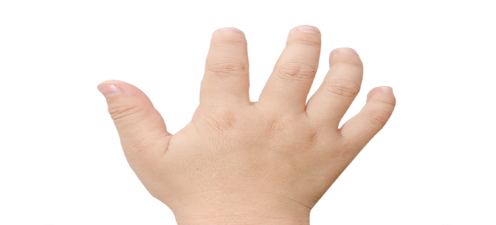

a.❑

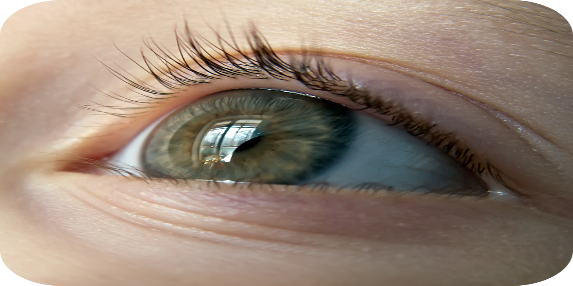

b.❑

2

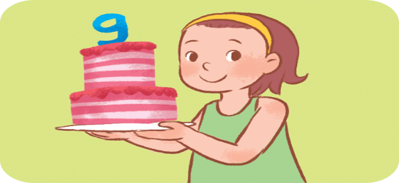

a.❑

b.❑

3

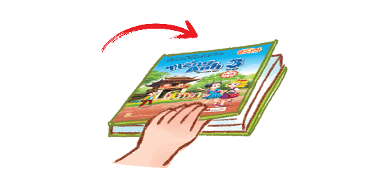

a.❑

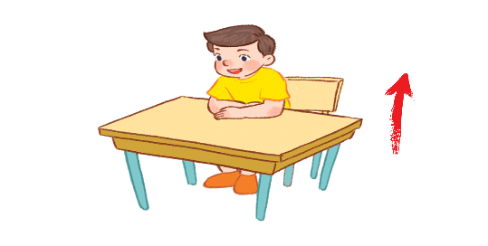

b.❑

4

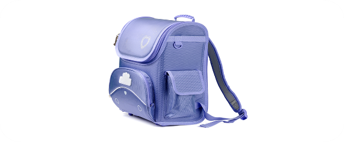

a.❑

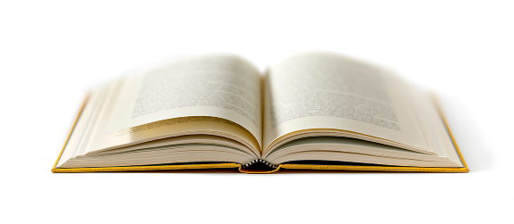

b.❑

Question 2. Listen and number. (1pt) Nghe và đánh số

|  |  |  |

a

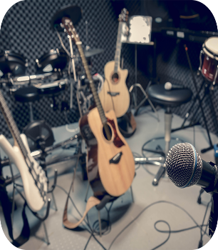

❑

b

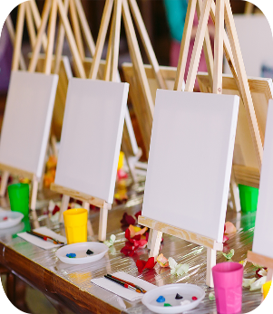

❑

c

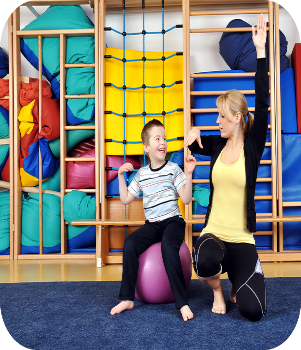

❑

d

❑

Question 3: Listen and circle (1pt) Nghe và khoanh tròn

|

Let’s go to the____________

|     a. library                     b. classroom                       c. computer room

|

Is that our ________________?

|     a. music room             b. gym                                c. playground

| 3. I have_______________

|    a. an eraser                   b. a pencil case                  c. a school bag

| 4. Do you have__________________?

|    a. a pen                         b. a book                            c. a ruler

Question 4: Listen and write (1pt) Nghe và viết

1. Open your _______________ .

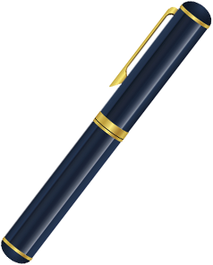

2. I have a _________________ .

3. May I _________________   .              
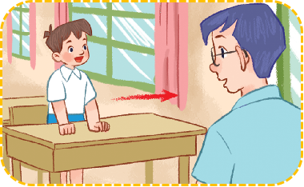

4. Let’s go to the________________  .     
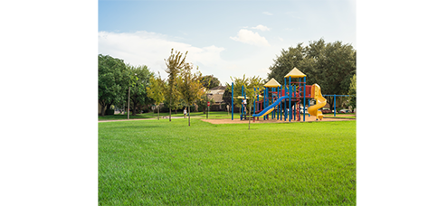

PART II. READING AND WRITING

| Question 5: Read and match. (1pt) Đọc và nối

1. Open your mouth!

a

2. It’s drawing

b

3. Touch your face!

c

4. It’s singing

d

|

|  Question 6: Read and complete (1pt) Đọc và điền vào chỗ trống

colour

have

gym

blue

A: I   (1)  ……….   a book.

B: What  (2) …………….. is it  ?

A:  It’s  (3)   …. ……….

B:  Oh. Let’s go to the (4) …………………

| Question 7: Look at the pictures and write the words. (1pt) Nhìn tranh và viết từ

|

|  |  |

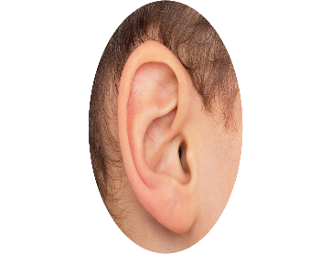

r e a

=>  _ _ _

2.    o o i n g c k
 =>  _ _ _ _ _ _ _

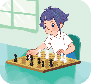

3.      s  e h c s

=>   _ _ _ _ _

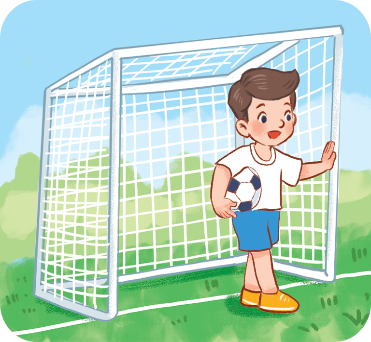

4.     b l a l f t o o

=>  _ _ _ _ _ _ _ _

Question 8: Put the words in order (1pt): (Xếp các từ theo đúng vị trí)

| 1.   is / What  / name   /  your  /  ?

|   |

|

| 2.   name   /  Bill  /   My  /   is  /  .

|   |

|

| 3.   What / are  / colour /  they  /     ?

|   |

|

| 4.       are   /    red  /  They  /  .

|   |

|

|

|

--- THE END ---

ĐÁP ÁN

ĐỀ KIỂM TRA CUỐI KỲ I

MÔN: TIẾNG ANH – KHỐI 3

NĂM HỌC: 2022-2023

PART I: LISTENING

Question 1: Listen and tick (1pt)

1. a(0,25ms)

2. b(0,25ms)

3. b(0,25ms)

4. a(0,25ms)

| Question 2: Listen and number (1pt)

1. c (0,25ms)

2. b(0,25ms)

3. d(0,25ms)

4. a(0,25ms)

| Question 3: Listen and circle (1pt)

1. b(0,25ms)

2. c(0,25ms)

3. a(0,25ms)

4. b (0,25ms)

Question 4: Listen and write (1pt) Nghe và viết

1. book                 2. pen                 3. go out                 4. playground

| PART II. READING AND WRITING

| Question 5: Read and match. (1pt)

1. b(0,25ms)

2. d (0,25ms)

3. a (0,25ms)

4. c (0,25ms)

| Question 6: Read and complete (1pt)

1.

have(0,25ms)

2. colour(0,25ms)

3. blue(0,25ms)

4. gym(0,25ms)

Question 7: Look at the pictures and write the words. (1pt)

1. ear (0,25)

| 2. cooking(0,25)

| 3. chess (0,25)

4. football (0,25)

Question 8: Put the words in order (1pt):

What is your name ?

My name is Bill.

What colour are they ?

They are red.

| III. SPEAKING (2pts)

-------- The End--------
