# g4 ck1 test

Nguồn: g4_ck1_test.docx

[[00_GOOGLE_DRIVE_INDEX|Mục lục tài liệu Google Drive]]

Nội dung trích xuất từ tài liệu gốc; các ô bảng được đọc lần lượt. Bố cục và định dạng có thể khác bản Word.

## Nội dung tài liệu

School: “A” Long Giang Primary School. Name: .............................................................

Class: 4........

KIỂM TRA CUỐI HỌC KỲ I MÔN: TIẾNG ANH – LỚP 4 NĂM HỌC: 2022-2023

Thời gian: 35 phút

SKILL

Listening

Reading

Writing

Speaking

TOTAL

MARK

COMMENT

..........................................................................................................................

..........................................................................................................................

..........................................................................................................................

PART 1: LISTENING (15 minutes)

Question 1: Listen and number (1pt): (Nghe và đánh số)

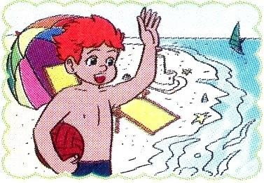

a 

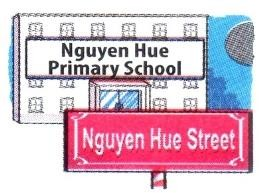

b 

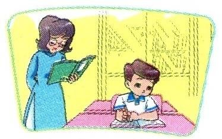

c 

d 

Question 2: Listen and tick (1pt): (Nghe và đánh dấu )

1.

a 

b 

2.

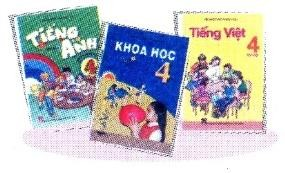

a 

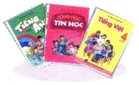

b 

3.

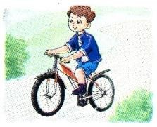

a 

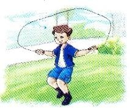

b 

4.

a 

b 

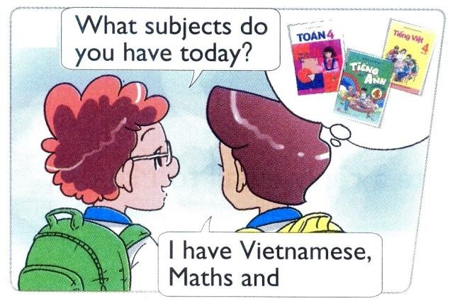

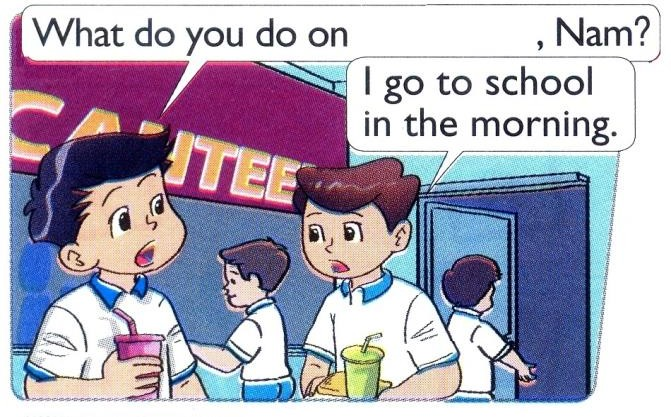
Question 3: Listen and write (tick) or  (cross) (1pt): (Nghe và viết  hoặc )

1.

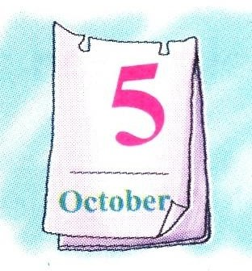



2.

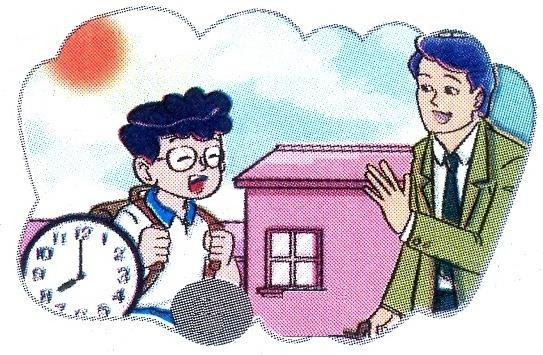



3.



4.

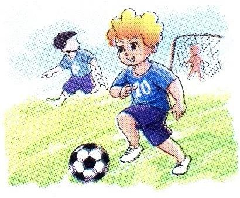



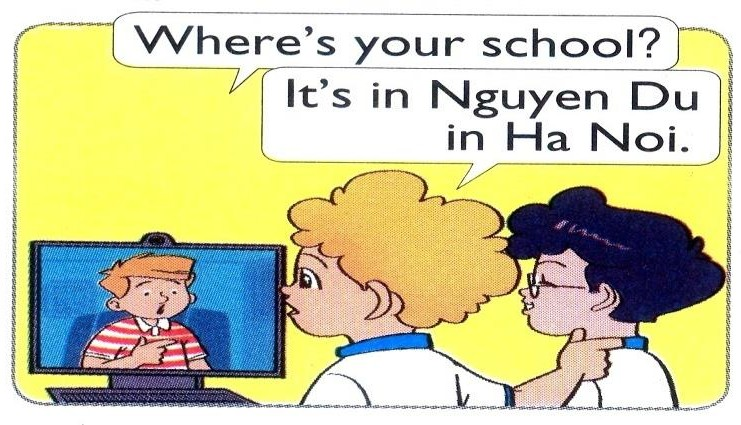

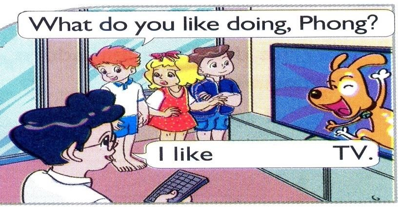
Question 4: Listen and write a missing word (1pt): (Nghe và viết 1 từ còn thiếu)

1.

…………

2.

……………

3.

……………

4.

…………

PART 2: READING (10 minutes)

Question 5: Read and match (1pt): (Đọc và ghép)

1. Where are you from, Akiko?



a. It’s on the second of September.

2. What are Linda and Mai doing?



b. I have Maths, IT and English.

3. When’s your birthday?



c. They’re skipping.

4. What subjects do you have today?



d. I’m from Japan.

Question 6: Read and complete (1pt): (Đọc và hoàn chỉnh)

playing

doing

flying

play

| Peter: | I have a new kite. Let’s fly it.

| Nam: | I’m sorry but I don’t like (1) …………………. kites.

| Peter: | What do you like (2) ………………….?

| Nam: | I like (3) …………………. chess.

| Peter: | OK, let’s (4) ………………….

PART 3: WRITING (10 minutes)

Question 7: Look and write (1pt): (Nhìn và viết)

1.

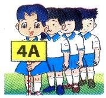

A: What class are you in?

B: I’m in Class ………………

2.

A: What are they doing?

B: They’re ……………… a mask.

3.

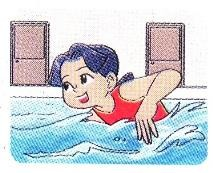

A: What do you like doing? B: I like ………………

4.

A: Where were you yesterday? B: I was at the ………………

Question 8: Put the words in order (1pt): (Xếp các từ theo đúng vị trí)

| 1. What / the date / is / today?

→ ...........................................................

2. My school / Nguyen Du / is in / Street.

→ .............................................................

| 3. collecting / I / stamps / like.

→ ...........................................................

4. nationality / What / you / are?

→ .............................................................

PART 4: SPEAKING (3 minutes for one student)

Question 9: Getting to know each other (1pt):

| What’s your name?

| How old are you?

| What class are you in?

| 
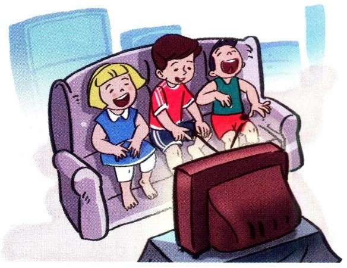
What do you like doing?

Question 10: Describing the picture (1pt):

| How many boys are there in the picture?

| How many girls are there?

| Where are they?

| What are they doing?

--- THE END ---

ANSWER KEYS – GRADE 4 ĐÁP ÁN – LỚP 4

PART 1: LISTENING (15 minutes)

Question 1: Listen and number (1pt):

|  |  | a. 1 | b. 4 | c. 3 | d. 2

Question 2: Listen and tick (1pt):

|  |  | 1. a | 2. b | 3. a | 4. a

Question 3: Listen and write (tick) or  (cross) (1pt):

|  |  | 1.  | 2.  | 3.  | 4. 

Question 4: Listen and write a missing word (1pt):

|  |  |  | Street | 2. watching | 3. English | 4. Fridays

PART 2: READING (10 minutes)

Question 5: Read and match (1pt):

|  |  | a. 3 | b. 4 | c. 2 | d. 1

Question 6: Read and complete (1pt):

|  |  | 1. flying | 2. doing | 3. playing | 4. play

PART 3: WRITING (10 minutes)

Question 7: Look and write (1pt):

|  |  | 1. 4A | 2. painting | 3. swimming | 4. zoo

Question 8: Put the words in order (1pt):

| 1. What is the date today? | 2. My school is in Nguyen Du Street.

| 3. I like collecting stamps. | 4. What nationality are you?

PART 4: SPEAKING (3 minutes for one student)

Question 9: Getting to know each other (1pt):

| 1. My name’s ………… | 2. I’m ………… (years old).

| 3. I’m in Class ………… | 4. I like …………

Question 10: Describing the picture (1pt):

| 1. There are two boys. | 2. There is one girl.

| 3. They are at home. | 4. They’re watching TV.
