# g5 ck1 test

Nguồn: g5_ck1_test.docx

[[00_GOOGLE_DRIVE_INDEX|Mục lục tài liệu Google Drive]]

Nội dung trích xuất từ tài liệu gốc; các ô bảng được đọc lần lượt. Bố cục và định dạng có thể khác bản Word.

## Nội dung tài liệu

School: “A” Long Giang Primary School.

| Name:  |

| Class: 5 |

KIỂM TRA CUỐI HỌC KỲ I

MÔN: TIẾNG ANH – LỚP 5

NĂM HỌC: 2022-2023

Thời gian: 35 phút

SKILL

Listening

Reading

Writing

Speaking

TOTAL

MARK

COMMENT

|  |

|  |

|  |

PART 1: LISTENING (15 minutes)

Question 1: Listen and number (1pt): (Nghe và đánh số)

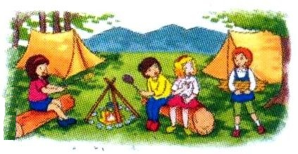

a

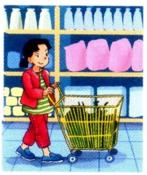

b

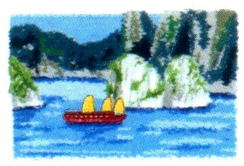

c

d

Question 2: Listen and tick (0.5pt): (Nghe và đánh dấu )

1.

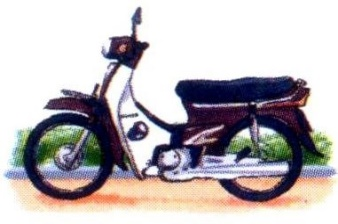

a

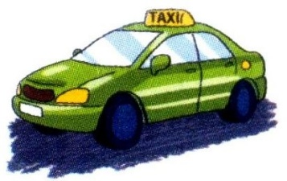

b

2.

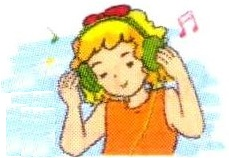

a

b

Question 3: Listen and write (tick) or  (cross) (0.5pt):

(Nghe và viết  hoặc )

1.

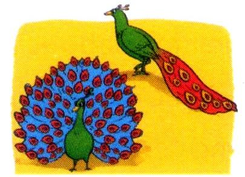

2.

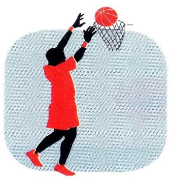

Question 4: Listen and write a missing word (0.5pt): (Nghe và viết 1 từ còn thiếu)

1.

……………………
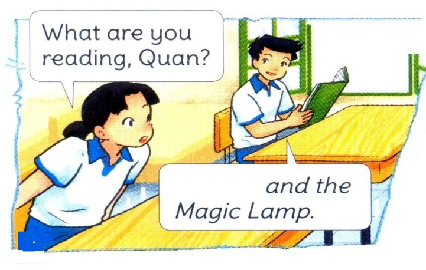

…………

…………

2.

…………………………
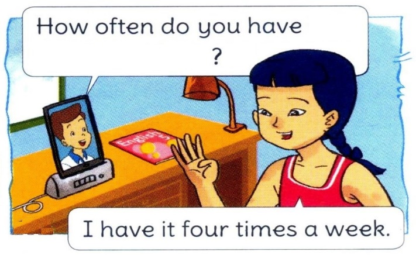

……………

……………

PART 2: READING (10 minutes)

Question 5: Read and match (1pt): (Đọc và ghép)

1.   How many lessons do you have today?

a.   It’s 97, Hai Ba Trung Street.

2.   How did you get there?

b.   They are very scary.

3.   What’s your address, Mai?

c.   I went by bus.

4.   What are the crocodiles like?

d.   I have English, Art and Music.

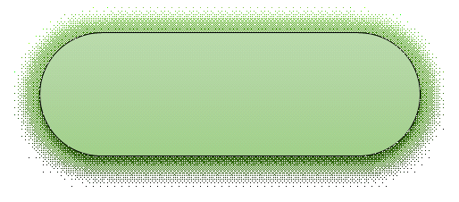

Question 6: Read and complete (1pt): (Đọc và hoàn chỉnh)

swim

weekend

islands

football

Mai: |  | What will you do this (1) ………………?

Linda: |  | I’ll go for a picnic.

Mai: |  | Where will you go?

Linda: |  | I’ll go to Nha Trang.

Mai: |  | What will you do there?

Linda: |       I’ll play (2) ……………… on the beach and (3) ……………… in the sea.

Mai: |  | Will you visit the (4) ………………?

Linda: |  | Yes, I will.

Question 7: Read and tick True (T) or False (F) (0.5pt): (Đọc và tick T hoặc F)

Last weekend, I went to the zoo with my parents. We saw a lot of animals. First, we saw the elephants. They were very big. They moved slowly and quietly. Then we saw the kangaroos. I enjoyed watching them because they jumped very high and ran quickly. In the end, we went to see the monkeys. They looked funny. They swung from tree to tree all the time. They jumped up and down on the trees very quickly. We had a really good time.

T |  F

1. The elephants were very big and moved quietly.  |  |

2. The kagaroos jumped very high and ran slowly.  |  |

PART 3: WRITING (10 minutes)

Question 8: Look and write (1pt): (Nhìn và viết)

1.

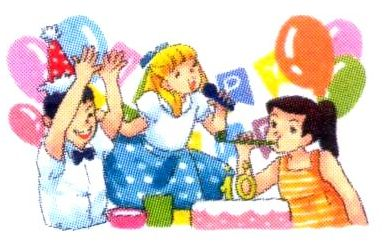

A:  Did you enjoy the party?

B:   Yes, ………………

2.

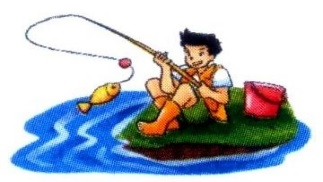

A:   How often do you ………………?

B:   Once a week.

3.

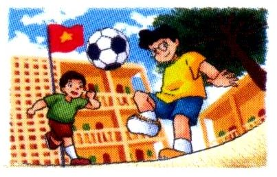

A:   Where will you be this weekend?

B:   I think I’ll be ………………

4.

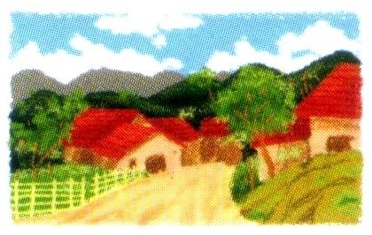

A:   What’s the ……………… like?

B:   It’s far and quiet.

Question 9: Put the words in order (1.5pt): (Xếp các từ theo đúng vị trí)

| 1.   I / tigers / lots / of / saw .

|   |

| 2.   Why / you / learn / do / English ?

|   |

| 3.   The / ate / pandas / slowly .

|   |

| 4.   When / be / will / Teachers’ Day ?

|   |

| 5.   Where / be / you / will / tomorrow ?

|   |

| 6.   An Tiem / hard-working / is .

|   |

PART 4: SPEAKING (3 minutes for one student)

Question 10: Getting to know each other (1pt):

What’s your name?

How old are you?

What class are you in?

What do you like doing?

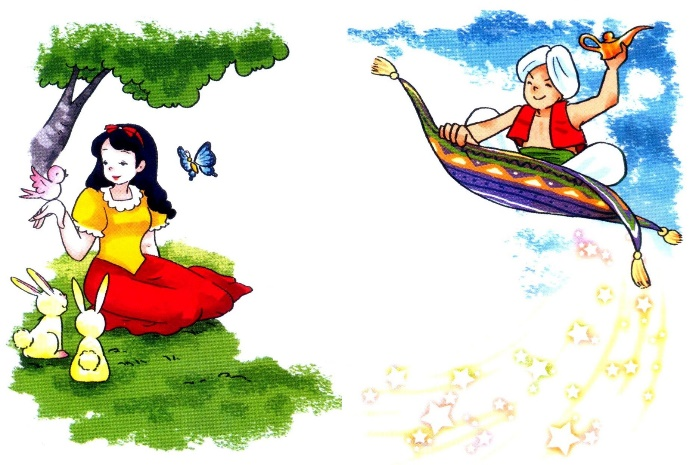
Question 11: Describing the picture (1.5pt):

Who’s the girl?

What’s the girl like?

Who’s the boy?

What’s the boy like?

--- THE END ---

ANSWER KEYS – GRADE 5

ĐÁP ÁN – LỚP 5

PART 1: LISTENING (15 minutes)

Question 1: Listen and number (1pt):

| a. 4 |  |  | b. 1 |  |  | c. 2 |  |  | d. 3

Question 2: Listen and tick (0.5pt):

1. b |  |  | 2. b

Question 3: Listen and write (tick) or  (cross) (0.5pt):

| 1.  |  |  | 2.

Question 4: Listen and write a missing word (0.5pt):

| 1. Aladdin |  | 2. English

PART 2: READING (10 minutes)

Question 5: Read and match (1pt):

| a. 3 |  |  | b. 4 |  |  | c. 2 |  |  | d. 1

Question 6: Read and complete (1pt):

| 1. weekend |  | 2. football |  | 3. swim |  | 4. islands

Question 7: Read and tick True (T) or False (F) (0.5pt):

1. T |  |  | 2. F

PART 3: WRITING (10 minutes)

Question 8: Look and write (1pt):

| 1. I did |  | 2. go fishing |  | 3. at school |  | 4. village

Question 9: Put the words in order (1.5pt):

| 1. I saw lots of tigers. |  |  | 2. Why do you learn English?

| 3. The pandas ate slowly. |  |  | 4. When will Teachers’ Day be?

| 5. Where will you be tomorrow? |  | 6. An Tiem is hard-working.

PART 4: SPEAKING (3 minutes for one student)

Question 10: Getting to know each other (1pt):

1. My name’s ………… |  |  | 2. I’m ………… (years old).

3. I’m in Class ………… |  |  | 4. I like …………

Question 11: Describing the picture (1.5pt):

1. She’s Cinderella. |  |  |  | 2. She’s beautiful and kind.

3. He’s Aladdin. |  |  |  | 4. He’s clever and generous.
