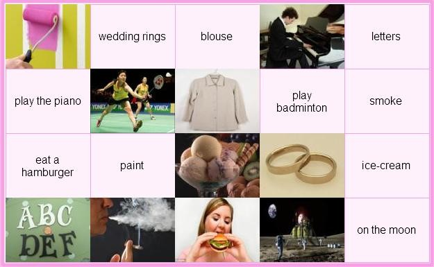
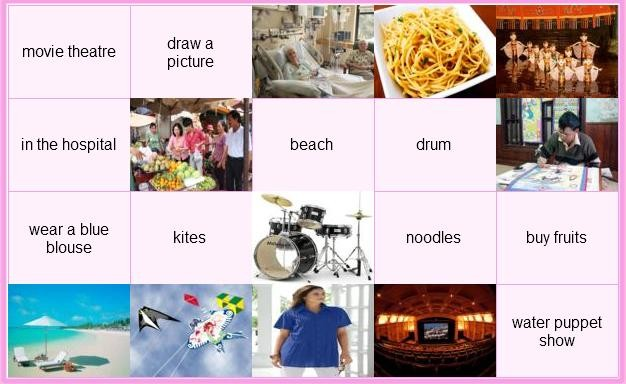
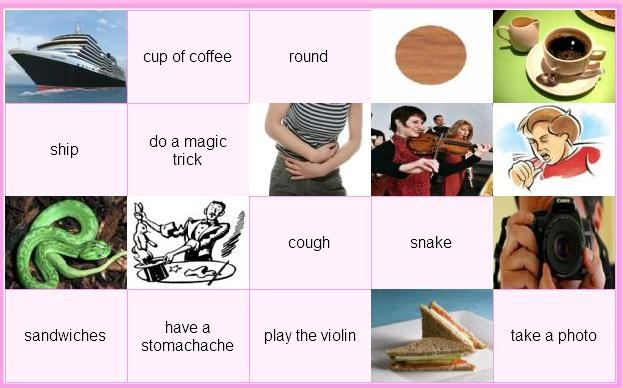
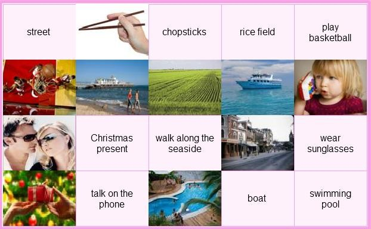
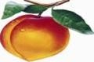
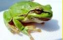

# IOE LOP 5 TRON BO

Nguồn: IOE LOP 5 TRON BO.docx

[[00_GOOGLE_DRIVE_INDEX|Mục lục tài liệu Google Drive]]

Nội dung trích xuất từ tài liệu gốc; các ô bảng được đọc lần lượt. Bố cục và định dạng có thể khác bản Word.

## Nội dung tài liệu

Full name: ……………………………. School: ………………………

| DEFEAT THE GOAL KEEPER:

| Choose the word that has the underlined part pronounced differently:

|  |  |  | bus | B. but | C. put | D. cut

|  | Let's learn some   | .

|  |  |  | much | B. many | C more | D. most

|  | I  | have a motorbike.

|  |  |  | don't | B. doesn't | C. am not | D. not

| Choose the word that has the underlined part pronounced differently:

|  |  |  | do | B. mother | C. brother | D. sometimes

|  | Nam is happy _  | today is his birthday.

|  |  |  | so | B. but | C. and | D. because

|  | Do you like music? - _  |

|  |  | Yes, I am | B. Yes, I do | C. Yes, I don't  D. No, I'm not

| Are your pens in your bag?

|  |  |  | Yes. It is | B. Yes. They are | C. No. It isn't | D. Yes. It is not

|  | I like music because I like   |

|  |  | swimming | B. playing | C. singing   D. going

| Choose the word that has the underlined part pronounced differently

|  |  |  | bag | B. bank | C. parents | D. place

|  | How's the weather  | Hanoi?

|  |  |  | on | B. at | C. for | D. in

| Choose the word that has the underlined part pronounced differently

|  |  |  | five | B. sister | C. fine | D. nine

|  | Mary _  | to the music now.

|  |  | listens | B. listen | C. is listening  D. listening

|  | Stand  | _, please!

|  |  |  | on | B. in | C. up | D. of

|  | There are  | clouds.

|  |  |  | look | B. small | C. cloudy | D. watch

|  | Would you like  | biscuits?

|  |  |  | some | B. an | C. a | D. Ø

|  | She  | a long hair.

|  |  |  | have | B. does | C. has | D. do

|  | There are  | students in my class. Twenty boys and twenty girls.

|  |  |  | forty | B. fifty | C. twenty | D. thirty

|  | Her mother works as a  | at Hue hospital.

|  |  |  | singer | B. farmer | C. nurse | D. postman

|  | How many  | are there?_ Two. Mary and Jane.

|  |  |  | girl | B. boy | C. boys | D. girls

|  | Is this your school bag? _ Yes, it is. It's  | .

|  |  |  | my | B. me | C. mine | D. I

|  |  |  |

| FILL THE BLANK:

|  |  | N__SE | 21. E  | AM

|  | STO__Y | 22. MU__EUM

|  |  | DA  | CE | 23. __ITHER

|  |  | PE  | CH | 24. C__IMB

|  |  | H__AD | 25. J  | LY

|  |  | T__IN | 26. K  | TCHEN

|  |  |  | DO  | N | 27. SK  | RT

|  | NUM__ER | 28. W__FE

|  |  | PL  | ASE | 29. SOC__

|  |  |  | TRO  | SERS | 30. CA  | DY

|  |  |  | M  | Y | 31. PI  | ZA

|  |  |  | BED  | OOM | 32. AL  | AYS

|  |  |  | E  | SY | 33. VIL  | AGE

|  |  |  | NUM  | ER | 34. SUM  | ARY

|  |  |  | COL  | UR | 35. TA  | LE

|  |  |  | THI  | D | 36. P  | OR

|  |  |  | D  | AR | 37. AB  | UT

|  |  |  | CI  | EMA | 38. NU  | SE

|  |  |  | FU  | NY | 39. RI  | H

|  |  |  |   | HREE | 40. BO  | RD

41._  _  _  _  _ is he from? - He's from England.

| Living in Ho Chi Minh City  _  _  so boring.

| Bill is 20 and is a doctor. He _

_  _  _

_ in a hospital.

| He gets a lot of gifts _  _ Christmas.

| Vegetables and fruits are good _  _  _ us.

| Linda lives _  _ London.

| Mrs. Jenney is my teacher. She _  _  _

_  _  _

_ me History.

| He's always busy _  _

_  _  _

_  _ he's a businessman.

| The library opens _  _ 7 a.m.

| What meat would you like _  _  _ dinner, Jane?

| In the evening, I am always busy _  _  _  _ my

| homework.

| What did your little sister do yesterday? - She v_ _ _ _ _ _  in the museum.

| What's _  _  _ dinner today? Bread or rice?

| We have English on Monday and Sunday. We have it  _ _ _ _ _ a week.

There is a picture _ _ Uncle Ho on the wall.

Full name: ……………………………. School:…………………………

BÀI TẬP 1: DEFEAT THE GOALKEEPER

|  | How much are your shoes? -   |

|  |  | They are nice | B. It's 70, 000 dong  C. They are 70,000 dong | D. They are black

|  | How  | _books does he have?

|  |  |  | are | B. much | C. many | D. more

|  | I have two brothers.  | names are Minh and Tung.

|  |  |  | His | B. They | C. Theirs | D. Their

|  | He is going to the _  | to post a letter.

|  |  |  | post office | B. market | C. bookshop | D. cinema

|  | Let's  | to the zoo and see the animals.

|  |  |  | goes | B. to go | C. go | D. going

|  | How's the _  | in Hanoi? _ It's cold and windy.

|  |  |  | people | B. trees | C. life | D. weather

|  | How about  | to the supermarket?

|  |  |  | going | B. go | C. to go | D. went

|  | Hurry  | ! We'll late for school.

|  |  |  | in | B. of | C. up | D. down

|  | You can see lions in the  | .

|  |  | park | B. post office | C. police stationD. zoo

|  | Can you play the guitar? -   |

|  |  | Yes, I can't | B. Yes, I can | C. No, I can D. Yes, I am

| We shouldn't ...... a lot in the evening

|  |  |  | eat | B. to eat | C. eats | D.eating

| What's the matter, Danny? - I'm ......

|  |  |  | nice | B.cold | C. big | D. tall

| The boy ..... his teacher some beautiful flowers.

|  |  |  | like to give | B. like giving | C. likes gives | D. would like to give

| ........ about going to Nha Trang?

|  |  |  | Why | B.What | C.Where | D. When

| We have lots of ...... in the summer.

|  |  |  | rain | B. raining | C. rains | D. rainy

| There are twelve months in a ......

|  |  |  | week | B. year | C. weekend | D. daily

| They buy some fruit but ........ vegetables.

|  |  |  | some | B. any | C. little | D.no

| ......... walk on the grass!

|  |  |  | No | B.Not | C. Don't | D. Doesn't

| Choose the word that has the underlined part pronounced differently

A. camp

B. table

C. travel

D. match

20. Odd one out

A. dog

B. cow

C. pig

D. string

BÀI TẬP 2: FILL THE BLANK

| I want _  _ have a pen friend from England.

| Please write _  _ me!

3. _

_  _ _

_ do you often go in your free time?

| Which _

_  _  _

_  _  _

_ do you have today? - I have English and Maths.

| In the _

_  _  _

_  _  _

_  _  _

_ lessons, we learn how to use the computer.

| Candies are  not good _  _  _ children's teeth.

| How _  _  _  _  _  listening to music?

| Would you like a cup _  _ coffee? - Yes, please.

| Where _  _  _  _ you yesterday? - I was at home.

10. _

_  _  _

_ are three books on the table.

| C_ECK 

| S_IENCE 

| LAN_UAGE 

| S_ISSORS 

| SIC_NESS 

| GLA_S

| AL_AYS 

| CAPI_AL 

| MU_EUM

| AC_IVITY

15.T_OTH 

24.FU_NY 

16.AI_PORT 

25.LE_TER 

17.CONN_CT 

26.MAT_H 

18.CIRC_E 

27. S_ADIUM 

19.AMUSE _ENT 

BÀI TẬP VÒNG 21 (tiếp)

28. SI_N 

| Cool Pair Matching: Match a picture or a Vietnamese word with its English

| equivalence.

II/ Safe Driving

Answer the question.

| I am tired because I have to  _  _  the housework all day.

| George eats too much so he's getting  _  _  _ .

| What

_  _  _

_  do you get up? - I get up at 7 a.m.

| Let's play hide-_  _  _  -seek.

| We danced, sang and t_  _  _  stories in English.

| His job is great because he can meet a  _  _  _  of people.

| We had celebrations  _  _  the schoolyard.

| They are rich  _  _  they don't have to work.

| Kate and I are reading books  _  _  _  _  _  pets.

| Are the students  _

_  _  _

_  _  _  _

| 
_ | to music? No, they're playing volleyball.

| What's his job?- He's a .......

|  |  |  | teacher | B. engineer | C. work | D. house work

| Do you like to ......?

|  |  |  | hear to music | B. listen music | C.listen to music | D. listen of music

| Choose the word that has the underlined part pronounced differently

|  |  |  | bottle | B. job | C. movie | D. chocolate

| Fish is my favourite ....

|  |  |  | drink | B. food | C. fruit | D. juice

| My son often ....... his teeth before going to bed.

|  |  |  | washes | B. brushes | C. clean | D. gets

| Choose the word that has the underlined part pronounced differently

|  |  |  | some | B. come | C. love | D. home

| Choose the odd one

|  |  |  | fifteen | B. twenty | C. one hundred | D. time

| ........ go to the movies tonight? - OK.

|  |  | A.Let's | B. What about | C. Why don't we | D. How about

| What are we going to do? - ......

|  | Let we go camping | B. Why do we go camping?

| C. What about going camping? | D. What about to go camping?

| ....... Music lessons, we learn to sing songs

|  |  |  | On | B. Between | C. At | D. During

| People often go to the ....... to swim,

|  |  |  | Stadium | B. beach | C. mountain | D. city

| My family are going to stay at a ..... house in Nha Trang.

|  |  |  | friend | B. friends | C. friend's | D. friends'

| ....... your mother like noodles? - No, she wouldn't.

|  |  |  | Can | B. Would | C. Can't | D. Does

| There are ...... hundred students in our school.

|  |  |  | three | B. third | C. threeth | D. thirth

| How is your little daughter? - She is fine ........

|  |  |  | thank | B.  thank you | C. thanks you | D. you thank

| How often does your aunt go to the farm? -

|  |  | A.One | B. Once a week | C. Two | D. Once time

| What is your ...... season? - Summer.

|  |  | A.likes | B. interesting | C. favourite | D. good

| Xiao Mei is Chinese. She ....... Chinese.

|  |  |  | says | B. talks | C. speaks | D. tells

| I don't like living in Sapa because it ........

|  |  |  | always rain | B. always to rain | C. rain always | D. always rain

| I'm travelling by bus and ..... a lot of interesting places.

|  |  |  | visit | B. to visit | C. visiting | D. is visiting

| My father is an engineer. - My sister is an engineer, ....

|  |  |  | too | B. either | C. to | D. so

| The ......... is cold and wet.

|  |  |  | time | B. day | C. weather | D. season

| The Bakers are going to visit ...... of interesting places.

|  |  |  | a much | B. a many | C. a lot | D. a little

| Choose the word that has the underlined part pronounced differently.

|  |  |  | all | B. always | C. ball | D. watch

| What's ....... breakfast, mom? - There's some bread and eggs.

|  |  |  | on | B. of | C. for | D. in

| How many ...... are there in a year? Four.

|  |  |  | months | B. days | C. seasons | D. weeks

| Choose the odd one

|  |  |  | carrot | B. rice | C. noodle | D. bread

| My sister doesn't have ......

|  |  | hair long black | B. long black hair | C. black long hair  D. black hair long

| I want to go to the ...... to see some tigers.

|  |  |  | post office | B. bookshop | C. clothing store | D. zoo

| Mr and.Mrs Pike..... dinner at the moment.

|  |  |  | is having | B. are having | C. are eating | D. B & C are correct

Bài tập về nhà buổi 2

Full name: ……………………………. School:……………………………

I/ Cool Pair Matching

Match a picture or a Vietnamese word with its English equivalence.

|  |  |  | 

 | 

 | 

 | 

 | 

.........................   ............................   ............................   .............................   ............................

.........................   ............................   ............................   .............................   ............................

.........................   ............................   ............................   .............................   ............................

.........................   ............................   ............................   .............................   ............................

II/ Safe Driving

Answer the question.

| ....... you understand all of the new words? - Yes, I do.

|  |  |  | Is | B.Are | C.Do | D.Does

| My father works ........ an engineer for his factory.

|  |  |  | for | B.at | C.as | D.of

| My class is ...... 7a.m ....... 11 a.m everyday.

|  |  |  | between/from | B.from/in | C.from/to | D.at/at

| There are a lot of interesting ...... in the festival.

|  |  |  | game | B.activities | C.action | D.baseball

| ...... is your aunt's address? - It's on the table.

|  |  | A.Where | B.How | C.When | D.Which

| Mike is playing soccer with his friends. "Soccer" means

|  |  |  | tennis | B.table tennis | C.fooball | D.badminton

|  |  |  | Why does your mother go to the food stall? - Because she wants some ........ A.books | B.stamps | C.hamburgers | D.T-shirts

| Are you free ...... Friday evening?

|  |  |  | in | B.at | C.on | D.from

| She is learning ...... to use a computer.

|  |  |  | what | B.when | C.where | D.how

| Yesterday they ......... to Ha Long Bay.

|  |  |  | went | B.go | C.are going | D.to go

Buæi 3

Full name: ……………………………. School:……………………………

I/ LEAVE ME OUT! BÀI TẬP 1

|  | HELSP | 6. REAOD

|  | LISTTEN | 7. NIEGHT

|  | THROEW | 8. SCIENSCE

|  | FLOWEAR | 9. SKIRET

|  | WRITSE | 10. WARAM

BÀI TẬP 2

|  | OSTHER | 6. GROSUP

|  | TELEOVISION | 7. PRINST

|  | BRIANG | 8. SEVEAN

|  | SPRIENG | 9. LIGHET

|  | LIBARARY | 10. HEASRT

BÀI TẬP 3

|  | NATLION | 6. MISES

|  | PICKTURE | 7. REPEAST

|  | BORIN | 8. YOFUNG

|  | PHELP | 9. REALDY

|  | IDEAP | 10. PLACKE

BÀI TẬP 4

|  | HAPPYEN | 6. MIAME

|  | BLEACK | 7. STREEST

|  | SEPTEMBEAR | 8. THEAME

|  | DRAWN | 9. CLEASS

|  | TOBY | 10. VISICT

II/ HELP BEAR FIND THE HONEY

|  | We have English  | Friday.

|  |   | _old are you? - I'm seven years old.

|  | Thank you _  | much

|  | W  | is Mary from?

|  |   | color is it? - It's red

|  |   | _are you? - I'm fine. Thanks.

|  | There are four people  | my family.

|  |   | time do you go to bed?

|  | There _  | one living room and one kitchen in my house.

|  | Why do you want to  | to the bookshop?

|  | My brother is a factory _  | . He works in a factory.

|  | We like going to the zoo _  | much.

|  | After dinner, my mother checks my homework b  | bedtime.

|  | My sister takes vegetables  | the market.

|  | Sometimes, I go out  | my friends.

|  | I'd like  | orange, please.

|  | My father w  | hard everyday.

| They are farmers. They work o_ a farm.

|  | The museum  | _behind the park.

|  | Let's go out  | a walk.

|  | Alan wants to be a taxi d  | .

|  | I like  | play the piano, too.

|  | Tom  | _born on October 24th.

|  | There are  | people in my family: my parents, my brother and me.

|  | What _  | your father do? - He is a farmer.

|  | My brother is  | engineer.

|  | Nga is a student in class 5A, Quynh Mai P  | school.

|  | I want to be a singer b  | I like to sing.

|  | The cinema is between the park  | the post office.

|  | I don't know how _  | dance.

BÀI TẬP VỀ NHÀ (BUỔI 3)

Full name: ……………………………. School:……………………………

BÀI TẬP 1: HELP BEAR FIND THE HONEY

| Choose the odd one:

|  |  |  | write | B. sing | C. read | D. friend

| Choose the word that has the underlined part pronouced differently

|  |  |  | pen | B. desk | C. children | D. spell

| Can she play the piano?

|  | Yes, I can B. Yes, he can C. Yes, she can | D. Yes, we can.

|  |   | you understand all of the new words?- Yes, I do.

|  |  |  | Do | B. Are | C. Does | D. Is

|  | How many rooms are there in your   |

|  |  | classroom B. roomates | C. apartment | D. meeting-room

|  |   | is your aunt's address? - It's on the table.

|  |  |  | Where | B. How | C. When | D. Which

|  | Do their parents live _  | Hue City?

|  |  |  | in | B. at | C. on | D. from

| Choose the odd one:

|  |  | breakfast  B. eat | C. dinner | D. lunch

|  | Now, look  | _your book. Who can answer the third question?

|  |  |  | up | B. for | C. in | D. at

|  | I'm going to the  | to borrow some book.

|  |  |  | bookshop | B. café | C. library | D. shelf

BÀI TẬP 2: LEAVE ME OUT!

|  | CHEASS | 11. WATEER

|  | TELERPHONE | 12. MABLE

|  | BIANGO | 13. IDEAR

|  | DOWIN | 14. BUSTY

|  | FINEISH | 15. ENODUGH

|  | FIVELD | 16. PLANKE

|  | NEPAR | 17. LESMON

|  | EXCIATING | 18. SABD

|  | PICANIC | 19. CANODLE

|  | CELEYBRATE | 20. BORAT

VÒNG 25 (CẤPTỈNH)_LỚP 5

I/ Safe Driving

Answer the question.

1. What's his job?- He's a .......

A. teacher

B. engineer

C. work

D. house work

| Do you like to ......?

| hear to music

B. listenmusic

C.listen to music

D. listen of music

3. Choose the word that has the underlined part pronounced differently

A. bottle

B. job

C. movie

D. chocolate

| Fish is my favourite ....

| drink

B. food

C. fruit

D. juice

| My son often ....... his teeth before going to bed/

|  |  |  | washes | B. brushes | C. clean | D. gets

| Choose the word that has the underlined part pronounced differently

A. some

B. come

C. love

D. home

| Choose the odd one

| fifteen

B. twenty

C. one hundred

D. time

| ........ go to the movies tonight? - OK.

|  |  | A.Let's | B. What about | C. Why don't we | D. How about

| What are we going to do? - ......

|  | Let we go camping | B. Why do we go camping?

| C. What about going camping? | D. What about to go camping?

| ....... Music lessons, we learn to sing songs

|  |  |  | On | B. Between | C. At | D. During

| People often go to the ....... to swim,

|  |  |  | Stadium | B. beach | C. mountain | D. city

| My family are going to stay at a ..... house in Nha Trang.

|  |  |  | friend | B. friends | C. friend's | D. friends'

| ....... your mother like noodles? - No, she wouldn't.

|  |  |  | Can | B. Would | C. Can't | D. Does

| There are ...... hundred students in our school.

|  |  |  | three | B. third | C. threeth | D. thirth

| How is your little daughter? - She is fine ........

|  |  |  | thank | B.  thank you | C. thanks you | D. you thank

| How often does your aunt go to the farm? -

|  |  | A.One | B. Once a week | C. Two | D. Once time

| What is your ...... season? - Summer.

|  |  | A.likes | B. interesting | C. favourite | D. good

| Xiao Mei is Chinese. She ....... Chinese.

|  |  |  | says | B. talks | C. speaks | D. tells

| I don't like living in Sapa because it ........

|  |  |  | always rain | B. always to rain | C. rain always | D. always rain

| I'm travelling by bus and ..... a lot of interesting places.

|  |  |  | visit | B. to visit | C. visiting | D. is visiting

| My father is an engineer. - My sister is an engineer, ....

|  |  |  | too | B. either | C. to | D. so

| The ......... is cold and wet.

|  |  |  | time | B. day | C. weather | D. season

| The Bakers are going to visit ...... of interesting places.

|  |  |  | a much | B. a many | C. a lot | D. a little

| Choose the word that has the underlined part pronounced differently

|  |  |  | all | B. always | C. ball | D. watch

| What's ....... breakfast, mom? - There'ssome bread and eggs.

|  |  |  | on | B. of | C. for | D. in

| How many ...... are there in a year? Four.

A. months

B. days

C. seasons

D. weeks

| Choose the odd one

| carrot

B. rice

C. noodle

D. bread

| My sister doesn't have ......

|  |  | hair long black | B. long black hair | C. black long hair  D. black hair long

| I want to go to the ...... to see some tigers.

|  |  |  | post office | B. bookshop | C. clothing store | D. zoo

II/ Fill in the blank

| _  _  _  _  does he do? - He's a police officer.

| How  _  _  _  _  is a pair of shorts? - It is 90.000 dong.

| I'm going to the post  _

_  _  _  _

_  . I want to buy some stamps.

| December is the twelfth  _

_  _  _

_  of the year.

5.  _  _

6.  _  _

_  do you like Informatics? - Because it is interesting.

_  is Ann's English teacher? - Mrs. Susan.

| Why are Science lessons interesting  _  _ _  her?

| How  _  _  _  _  super markets are there in your city?

| My uncle  _

_  _  _

_  as a doctor in the hospital.

| My daughter wants to become a teacher  _  _  English.

| I have a headache. - You should  _  _  _  _  some aspirins.

| What is his  _ _ _  ? - He designs houses.

| He plays soccer  _  _  _  _ his friends in his free time.

| _  _  _  much homework did you have yesterday?

| My children like bears  _

_  _  _

| 
_  _  _ | they can jump and climb.

| When I  _  _  _  a little girl, I liked candies very much.

| What'sthe weather

_  _  _

_  in winter in England?

| On  _  _  _  _  occasion do you wear your favourite clothes?

| It is very cold in winter. There is  _  _  sun. There is only snow.

| is your sister eight years  _  _  _  ?

|  | What's the matter  _  _  _  _ | you?

III/ Cool Pair Matching

Match a picture or a Vietnamese word with its English equivalence.
