# Photo Quiz Reading-giaoandethitienganh.info

Nguồn: Photo Quiz Reading-giaoandethitienganh.info.docx

[[00_GOOGLE_DRIVE_INDEX|Mục lục tài liệu Google Drive]]

Nội dung trích xuất từ tài liệu gốc; các ô bảng được đọc lần lượt. Bố cục và định dạng có thể khác bản Word.

## Nội dung tài liệu

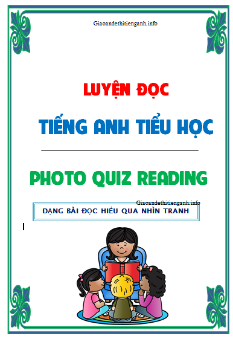

đfđfdf

Photo Quiz - Easy 01

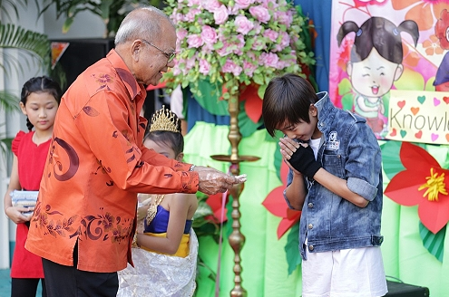

The man has glasses

The man and boy have glasses

The boy has glasses

No-one has glasses

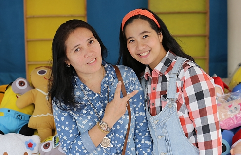

There are two women

There are two boys

There are two girls

There are two men

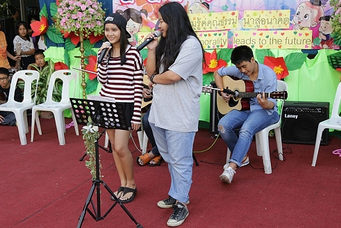

The girls are swimming

The girls are singing

The girls are eating

The girls are sleeping

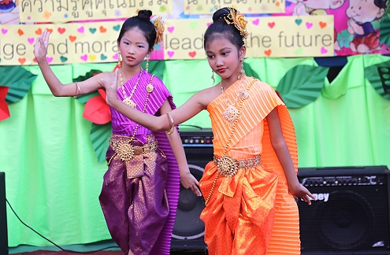

The girls are swimming

The girls are running

The girls are reading

The girls are dancing

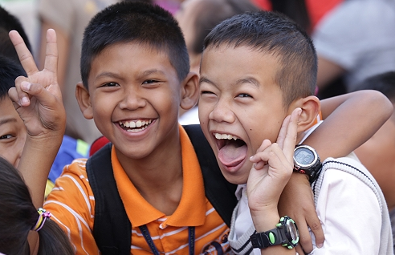

The boys are sad

The boys are angry

The boys are eating

The boys are happy

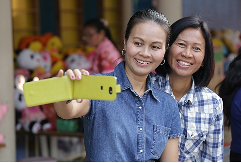

They are wearing green

They are wearing blue

They are wearing yellow

They are wearing pink

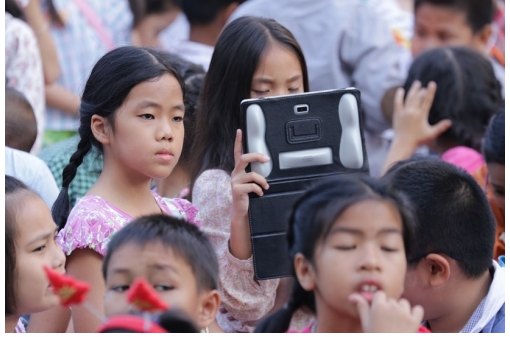

She has a computer

She has a toy

She has a cell phone

She has an iPad

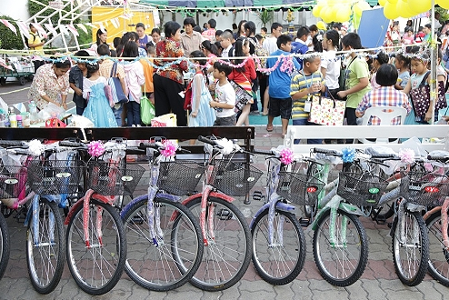

There are three bicycles

I can see bicycles

I can see seven red bicycles

I can see two bicycles

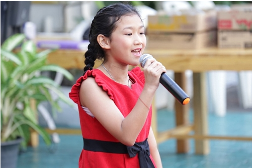

The girl has long hair.

The girl has white hair.

The girl has no hair.

The girl has short hair

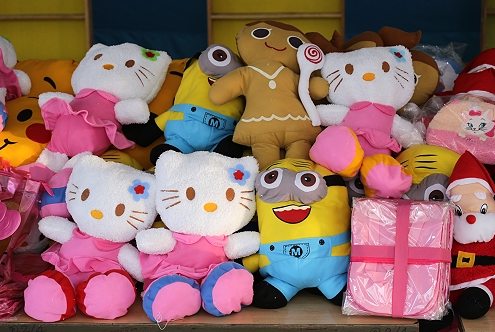

I can see four Hello Kitty dolls

I can see two Hellow Kitty dolls

I can see ten Hellow kitty dolls

I can see one Hello Kitty doll

Photo Quiz - Easy 02

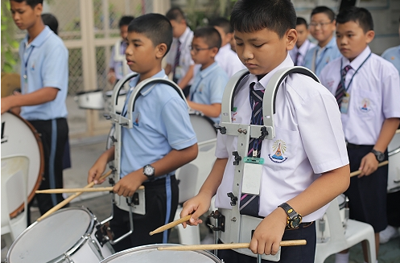

I can see three watches

I can see four watches

I can see two watches

I can see one watch

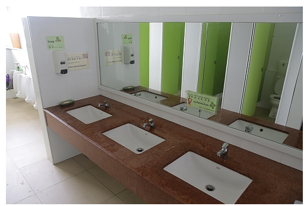

I can see a toothbrush

I can see a mirror

I can see a school bag

I can see a student

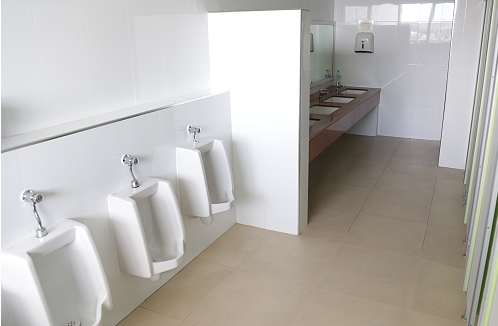

I am in the toilet

I am in the bedroom

I am in the classroom

I am in the kitchen

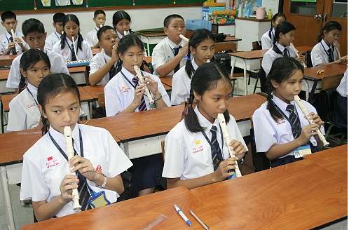

I like to learn English

I like to learn computer

I like to learn Chinese

I like to learn music

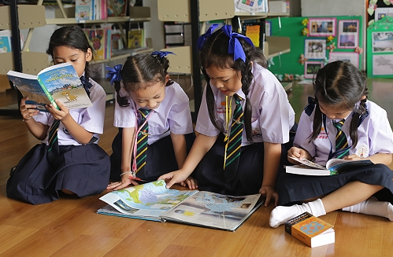

We are writing

We are playing

We are drawing

We are reading

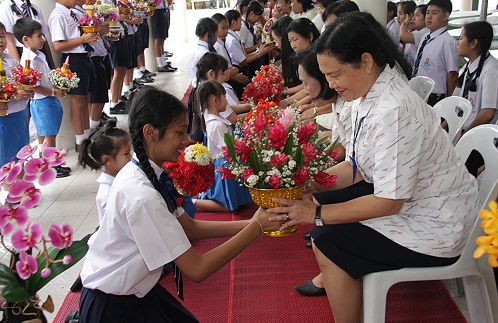

The student is sitting on the chair

The teacher is sitting on the chair

The student is standing up

The teacher is sitting on the floor

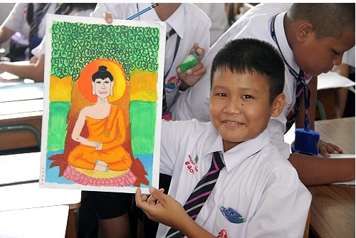

English lesson

Art lesson

Chinese lesson

Computer lesson

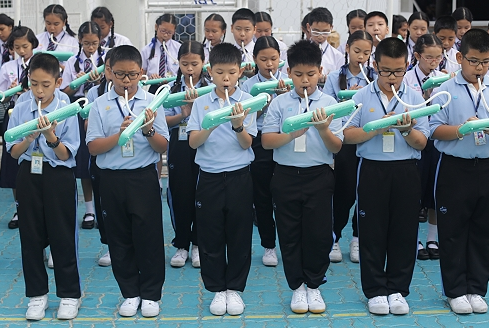

The boys shoes are blue

The boys shoes are black

The boys shoes are white

The boys shoes are green

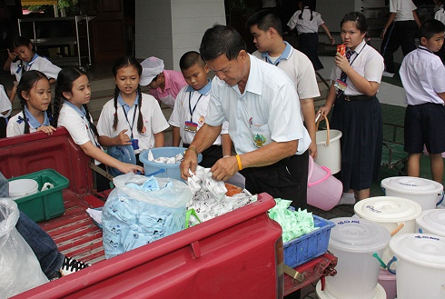

They want to drink Pepsi

They want to drink coffee

They want to drink water

They want to drink milk

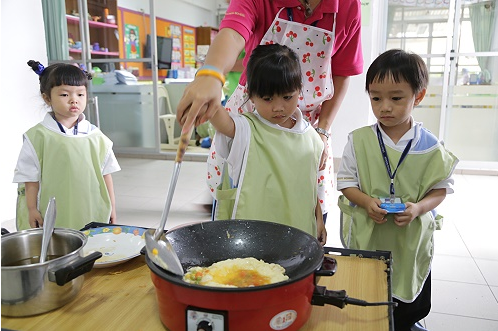

They are eating rice

They are cooking rice

They are eating eggs

They are cooking eggs

Photo Quiz - Easy 03

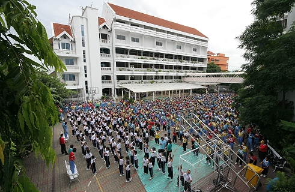

This is a hospital

This is a school

This is my house

This is a clinic

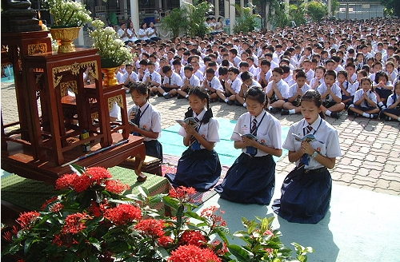

It is rainy

It is snowy

It is sunny

It is cold

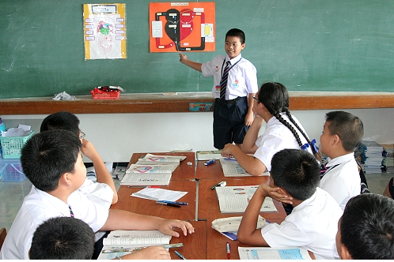

He is a student

He is a doctor

He is a teacher

He is a policeman

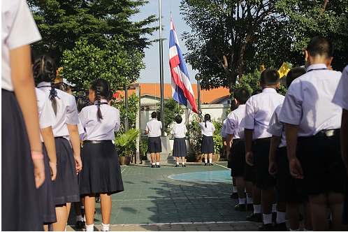

I can see a bicycle

I can see an airplane

I can see the Thai flag

I can see a football

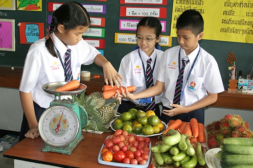

I can see some strawberries

I can see some apples

I can see some carrots

I can see some bananas

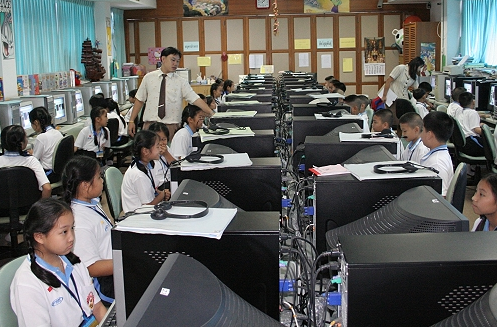

The students are learning Chinese

The students are learning Music

The students are learning Math

The students are learning Computer

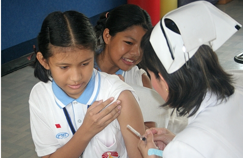

She is a farmer

She is teacher

She is a doctor

She is a nurse

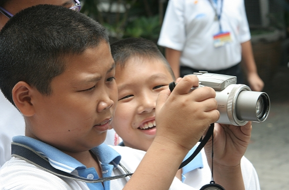

He is taking a photo

He is singing

He is running

He is eating

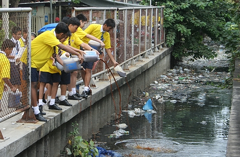

The boys have pink T-Shirts

The boys have blue T-Shirts

The boys have yellow T-Shirts

The boys have red T-Shirts

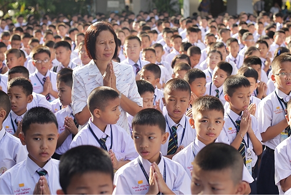

There are twenty students

There are three teachers

There is one teacher

There is one student

Photo Quiz - Easy 04

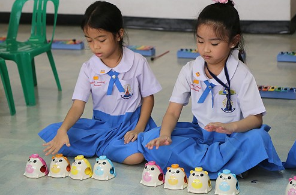

This is her computer lesson

This is her art lesson

This is her P.E. lesson

This is her music lesson

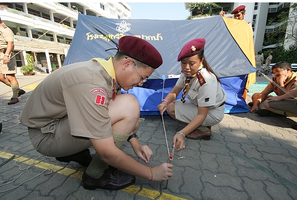

The teacher is a woman

The teacher is a man

The boy is a teacher

The girl is a teacher

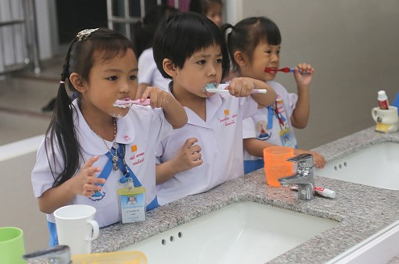

We are brushing our teeth

We are washing our face

We are eating

We are drinking

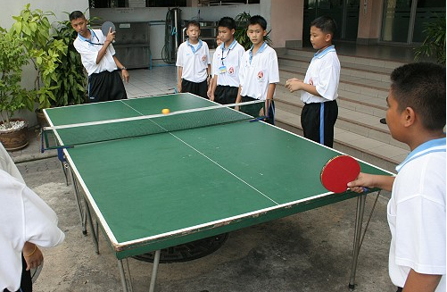

The boys are playing football

The boys are playing badminton

The boys are playing table tennis

The boys are playing basketball

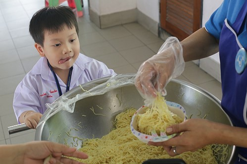

The boy is hungry

The boy is laughing

The boy is thirsty

The boy is crying

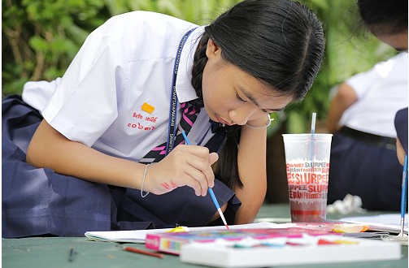

This is her computer lesson

This is her Chinese lesson

This is her math lesson

This is her art lesson

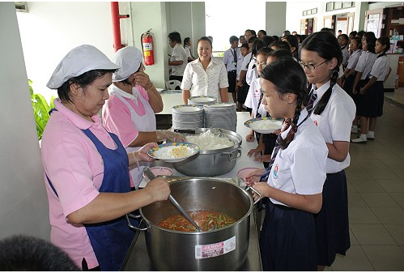

It is lunch time

It is dinner time

It is bed time

It is breakfast time

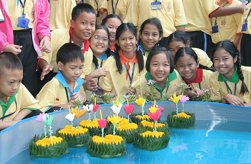

It is Loy Krathong

It is Christmas

It is Halloween

It is Songkran

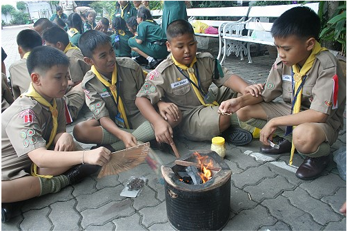

The boys are reading

The boys are eating

The boys are sleeping

The boys are cooking

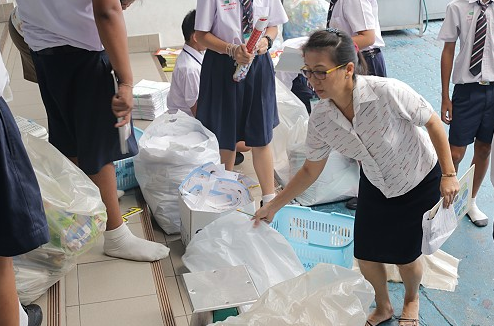

Everyone is a teacher

Everyone is a student

There are more teachers than students

There are more students than teachers

Photo Quiz - Easy 05

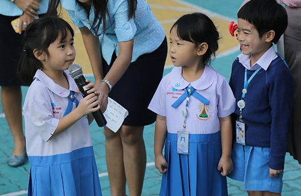

There are one girl and two boys

There are two girls and one boy

There are two boys and one girl

There are one boy and two girls

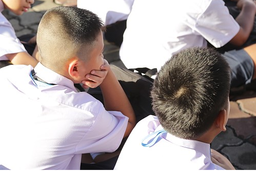

The boys are walking

The boys are standing up

The boys are lying down

The boys are sitting down

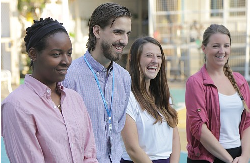

There are two women and two men

There is one man and three women

There is one woman and three men

There are two men and two women

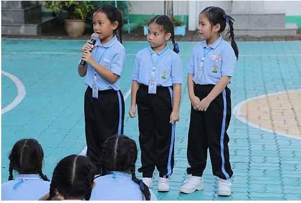

I can see three boys and three girls

I can see three girls

I can see girls and boys

I can see six girls

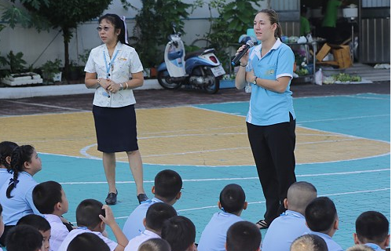

I can see a motorcycle

I can see three teachers

I can see thirty two students

I can see a bicycle

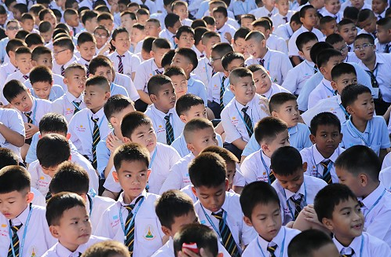

There are twenty students

There are many students

There are five students

There are fifty eight students

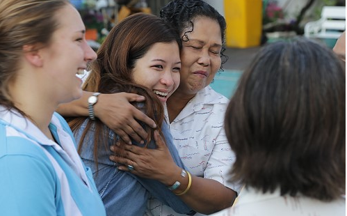

She is sleeping

She is eating

She is singing

She is crying

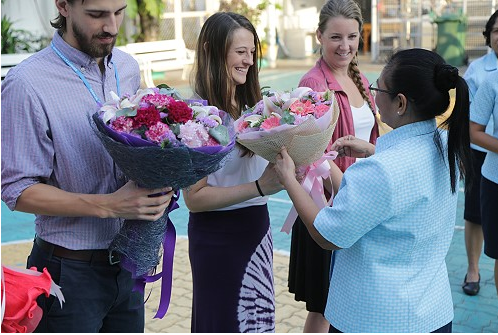

The teachers have sunflowers

The teachers have red roses

The teachers have flowers

The teachers have candy

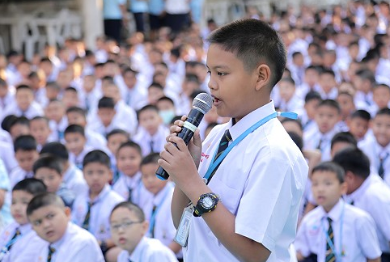

The boy doesn't have a watch

The boy is in the classroom

The boy has long hair

The boy has a watch

There are four students

There are three teachers

There are more teachers than students

There are more students than teachers

Photo Quiz - Easy 06

The girls are swimming

The girls are walking

The girls are running

The girls are dancing

I can see four teachers

I can see four swimmers

I can see four dancers

I can see four singers

I am hungry mum

Can we go to Big C mum

I love you mum!

I am thirsty mum

I can see boys, girls and teachers

I cannot see any girls

I cannot see any boys

I can see boys and girls

I can see a bird in the sky

I can see twelve girls

I can see a picture of the Queen

I can see a picture of the King

The boy is playing the melodian

The boy is playing the keyboard.

The boy is playing the guitar

The boy is playing football

The boy likes music

The boy likes computer

The boy likes pizza

The boy likes running

The two girls are sitting down

The two girls are watching football

The two girls are eating lunch

The two girls are singing

One pink heart and two blue hearts

Three big hearts

One blue heart and two pink hearts

Three pink hearts

The women have bags

The men have bags

The students have bags

The women don't have bags

Photo Quiz - Easy 07

The students have some bananas

The students have some oranges

The students have some apples

The students have some grapes

This is their math lesson

This is their English lesson

This is their art lesson

This is their computer lesson

The students are learning drums

The students are learning keyboard

The students are learning melodian

The students are learning guitar

The teacher is standing up

There are five roses

The roses are red

The students are sad

The students are in the music room

The students are in the science room

The students are in the library

The students are in the computer room

They are pointing at the crab

They are pointing at the girls

They are pointing at the food

They are pointing at the students

The boy has no stickers on his shirt

The girl has no stickers on her shirt

They have shirts on their stickers

They have stickers on their shirts

The students are playing the guitar

The students are playing the melodian

The students are playing the keyboard

The students are playing the drums

The student is helping the student

The student is helping the teacher

The teacher is helping the teacher

The teacher is helping the student

Everyone is wearing caps

The students are wearing caps

The teachers are wearing caps

The teachers are not wearing caps

Photo Quiz - Easy 08

The students are writing.

The students are sitting.

The students are playing.

The students are standing.

The students are in the classroom.

The students are in the library.

The students are in the book store.

The students are in the kitchen.

The student is on the car.

The student is next to the car.

The student is under the car.

The student is in the car.

The students are singing a song.

The teacher is singing a song.

It is story time.

It is time to go home.

The students are sleeping.

The students are reading.

The students are singing.

The students are cooking.

The student has no eggs in her hands.

The student has one egg in her hands.

The student has three eggs in her hands.

The student has two eggs in her hands.

The students are walking.

The students are running.

The students are sitting in line.

The students are standing in line.

The students are sleeping.

The students are standing.

The teacher is sitting.

The teacher is standing.

The student is helping the teacher.

The students are in the car.

The teacher is helping the students.

The student is going home.

They are singing a song.

They are eating snacks.

They are doing their homework.

They are in the clasroom.

Photo Quiz - Easy 09

The students are singing.

The students are playing.

The students are eating.

The students are sleeping.

This is the English lesson

This is the math lesson

This is the art lesson.

This is the computer lesson

The students are about seven years old.

The students are about five years old.

The students are about nine years old.

The students are about one year old.

Some students are wearing shoes.

The students are wearing shoes.

Some students are not wearing shoes.

The students are not wearing shoes.

All of the students are girls.

The student on the left is a girl.

The student on the right is a girl.

The student on the right is a boy.

She is eating fish.

She is wearing a hat.

She is not wearing gloves.

She is wearing gloves.

The students are learning Chinese.

The students are learning math.

The students are learning computer.

The students are learning English.

I cannot see the girl's teeth.

I can see the girl's teeth.

I can see the boy's and girl's teeth.

I can see the boy's teeth.

The students are in the garden.

The students are outside.

The students are inside.

The students are in the classroom.

The pink bucket doesn't have any milk

Most of the buckets are blue

Most of the buckets are pink

There are more pink buckets than blue buckets.

Photo Quiz - Easy 10

There are ten students.

There are ten pandas

There are ten students and ten pandas.

There are ten teachers

The boy is laughing.

The boy is singing.

The boy is eating.

The boy is crying.

They are sad.

They are crying.

They are happy.

They are singing a song.

She wants to eat pineapple.

She is drawing a picture

She is swimming.

She is singing a song

Pictures of students.

Pictures of owls.

Pictures of bats.

Pictures of pandas.

She is teaching Thai

She is teaching Math

She is teaching Chinese

She is teaching English

The students are playing the piano

The students are in their Chinese class

The students are singing a song

The students are in their music class

There are two blue owls.

There are two red owls.

There are seven owls.

There are five owls.

They are learning science.

They are learning English.

They are learning Math.

They are learning History.

This is the library.

This is the playground.

This is the classroom.

This is the kitchen.

Photo Quiz - Medium 01

The woman on the left has short hair

The woman on the left is wearing a watch

The woman on the right is wearing a watch

There are three women in this picture

All of the bicycles are red

There are five bicycles

There are more people than bicycles

There are more bicycles than people

Only one boy is wearing a watch

Both of the boys are wearing watches

The boy on the left is crying

The boy on the right is singing a song

The man is giving something to the boy

The boy is giving something to the man

The man is thanking the boy

The boy is wearing glasses

The girl is playing a game on her iPad

The girl is taking a picture of the dancers

I can see two iPads in the picture

The girl is taking a picture with an iPad

Santa Claus is on the right of the picture

Santa Claus is everywhere in the picture

Santa Claus is in the middle of the picture

Santa Claus is on the left of the picture

The two girls are singing

The two girls are dancing

The two girls are running

The two girls are walking

The girl has long hair and is wearing a red T-Shirt

The girl has short hair and is wearing a red T-Shirt

The girl has long hair and she is wearing a red dress

The girl has short hair and she is wearing a red dress

The woman on the left is taking a selfie

Both women are looking at the smartphone

Both women are wearing green clothes

The woman on the right is looking at the smartphone

The two girls are playing the guitar

The boy on the right is playing the guitar

There are three students singing a song

The girl on the right is playing the guitar

Photo Quiz - Medium 02

The student is helping the teacher to cook

The student is cooking by herself

The teacher is helping the student to cook

The teacher is cooking by herself

The student is learning Chinese

The student is learning English

The student is learning computer

The student is learning art

The boy at the front is wearing a white shirt

The boy on the right is wearing a blue shirt

The boy at the front is wearing a blue shirt

The boy on the left is wearing a white shirt

These are the toilets for teachers

These are the toilets for girls

These are the toilets for boys

These are the toilets for boys and girls

Everyone is wearing black shoes

Everyone is holding the melodian with their right hand

Everyone is wearing white shoes

Everyone is holding the melodian with their left hand

This is my bathroom

This is where I brush my teeth

This is where I wash my hands.

This is my house

There are five buckets

There are seven students

The man is putting bags of milk into buckets

The students are putting bags of milk into buckets

This is the library. We can borrow books to read.

This is the library. We can buy books to read

This is the book shop. We can borrow books to read

This is the book shop. We can buy books to read.

The student is sitting on a chair

The student is standing up

The student is giving flowers to the teacher

The teacher is giving flowers to the student

We are playing the drums

We are playing the keyboard

We are playing the melodian

We are playing the recorder

Photo Quiz - Medium 03

We are praying in a temple

We are singing a song

We are sleeping

We are praying in assembly

We are weighing the carrots

I can only see vegetables on the table

The three girls are holding the carrots

I can only see fruit on the table

My hobby is drawing pictures

My hobby is making cameras

My hobby is taking photographs

My hobby is playing sport

There is one teacher and seven students

There is only one girl in the room

There is only one boy in the room

There are seven students in the room

The students are all wearing red and yellow shirts

The students are all wearing white shirts

The students are wearing different colored shirts

The students are wearing the same colored shirts

The girl is laughing

I think it is going to hurt

The girl is crying

I don't think it is going to hurt

We are praying

We are singing the national song

We are singing a song

We are singing the national anthem

The students look cold

I think it is going to snow

The weather today is sunny and hot

I think it is going to rain

There are two male teachers

The teacher on the right is a man

The teacher on the right is a woman

The teacher on the left is a woman

The water is clean

The water is very clean

The water is a little dirty

The water is very dirty

Photo Quiz - Medium 04

It is lunch time. The students are waiting for their food

It is dinner time. The students are eating

It is breakfast. The students are hungry

It is lunch time. The students are eating their food

The two boys are playing football

The two boys are playing basketball

The two boys are playing tennis

The two boys are playing table tennis

The students are studying music

The students are teaching music

The students are playing a game

The students are learning English

The thirsty boy wants to eat noodles

The hungry boys wants to drink noodles

The thirsty boy wants to drink noodles

The hungry boy wants to eat noodles

The students are wearing shoes

The students are recycling rubbish

The students are all boys

The students are throwing away rubbish

Five students are brushing their teeth

The students are looking at the camera

Three students are washing their face

Three students are brushing their teeth

They are celebrating Loy Krathong

They are celebrating Halloween

They are celebrating Christmas

They are celebrating Songkran

She is painting a picture

She is writing a picture

She is drawing a picture

She is erasing a picture

The boys are hungry. They want to cook some food

The boys are eating

The boys are cold. They make a fire

The boys are thirsty. They want some water

The boy is putting up a tent

The boy is hanging up his washing

The boy is tying a knot

The boy is walking in the playground

Photo Quiz - Medium 05

They are talking

They are hugging

They are kissing

They are laughing

She is giving the teacher some flowers

The man is looking at the teacher

Three teachers have flowers

She is giving the teacher some candy

I can only see boys

It is raining

It is a cold day

I can only see boys and girls

The teacher on the left is wearing glasses

Both of the teachers are wearing glasses

No-one is wearing glasses

The teacher on the right is wearing glasses

The man has a beard and long hair

The man is bald

The woman has a beard and long hair

The man has a moustache

The boy's name is Mike

The boy is not wearing a watch

The boy is eating an ice cream

The boy is speaking into a microphone

The boys both have very long hair

The boys both have very short hair

The boy on the left has shorter hair

The boy on the right has shorter hair

The man is wearing shorts

All of the teachers are wearing skirts

The teachers all have their backs to the camera

There are four female teachers

These are university students

These are high school students

These are primary students

These are kindergarten students

These boys are primary school students

These girls are primary school students

These girls are kindergarten school students

These boys are kindergarten school students

Photo Quiz - Medium 06

The girls are dancing in front of a portrait of the King

The girls are dancing behind a portrait of the Queen

The girls are dancing in front of a portrait of the Queen

The girls are dancing behind a portrait of the King

Two boys are playing the keyboard

Two boys are wearing glasses

The boy is standing up and playing the keyboard

The boy is sitting down and playing the keyboard.

They are mostly girls

There are more girls than boys

There are girls and boys

They are all girls

Most of the women are carrying bags

A few women are carrying bags

Some of the women are carrying bags

All of the women are carrying bags

The girls are standing on one leg

The girls are kneeling down

The girls are jumping up and down

The girls are standing still

There is English writing inside two hearts

There is English writing inside three hearts

There is Chinese writing inside two hearts

There is Chinese writing inside three hearts

The two girls are holding microphones in their right hand

The two girls are holding microphones in their left hand

The two girls are singing the national anthem

The two girls are sitting down and singing a song

The girls are sitting down

The girls are kneeling down

The girls are jumping up and down

The girls are standing

The boy is playing the melodian

The boy is playing the drums

The boy is playing the guitar

The boy is playing the trumpet

The children are hugging their mothers

The children are singing with their mothers

The children are crying with their mothers

The children are talking to their mothers

Photo Quiz - Medium 07

It is Valentine's Day

It is Halloween

It is Christmas

It is Songkran

The student is climbing over the step-ladder

The student is climbing under the step-ladder

The student is climbing around the step-ladder

The student is climbing through the step-ladder

The student is typing in the computer room

The student is looking at the teacher

The student is watching a video in the computer room

The student is looking at the monitor

The teachers are standing down

The teachers are sitting down

The teachers are kneeling down

The teachers are kneeling up

The students are playing the melodian with their right hand

The students are playing the melodian with their left hand

The students are playing the melodian with no hands

The students are holding the melodian with their right hand

The students are in the science room

The students are in the computer room

The students are in the classroom

The students are in the music room

The students are learning about trees.

They are painting elephants in their art lesson

The students are learning about elephants

They are drawing elephants in their art lesson

They are eating lunch

They are cooking crab

They look thirsty

They are making som tam

The students are making pineapple juice

The students are making orange juice

The students are making grape juice

The students are making lime juice

They have a few stickers on their shirts

They have no stickers on their shirts

They have many stickers on their shirts

They have some stickers on their shirts

Photo Quiz - Hard 01

The two men look happy

They are wearing school uniform

They are dancing in a field

They are wearing masks

The shop closes at 9pm

The shop closes at 19:00pm

The shop closes at 7am

The shop closes at 7pm

It is a cold and rainy day

They are standing in front of a large orange

They are standing in front of a large pumpkin

There are six girls in the picture

These flowers are orchids

These flowers are tulips

These flowers are roses

These flowers are sunflowers

This is the monk

This is a monk image

This is a Buddha image

This is the Buddha

They are walking through the bridge

The are walking over the bridge

They are walking in the bridge

They are walking under the bridge

This is a Sitting Buddha

This is a Standing Buddha

This is a Reclining Buddha

This is a Walking Buddha

They are camping in a field

They are staying in a resort

They are staying in a hotel

They are tenting in a field

They are walking under a tunnel

They are walking through a tunnel

They are walking over a tunnel

They are walking on a tunnel

She is watching the sheep

She is eating the sheep

She is feeding the sheep

She is looking at the sheep

Photo Quiz - Hard 02

I am buying a post card

I am buying a letter card

I am buying a postcard

I am buying a picture card

I can see only incense sticks

I can see only candles

I can see only flowers

I can see flowers, candles and incense sticks

They are lighting candles

They are opening candles

They are turning on candles

They are light candles

This is a double bed

This is a twin bed

This is a single bed

This is a small bed

This is a Standing Buddha

This is a Walking Buddha

This is a Reclining Buddha

This is a Seated Buddha

It is an omelet

It is scrambled egg

It is a fried egg

It is a hard boiled egg

She is wetting his feet

She is watering his feet

She is drinking his feet

She is washing his feet

They are picture people

They are camera people

They are photographers

They are photo people

He is singing

He is rowing

He is walking

He is swimming

This is dry squid

This is wet squid

This is dried squid

This is fresh squid

Photo Quiz - Hard 03

They win the race.

They lost the race.

They are the losers of the race.

They are the winners of the race.

The monks are walking down the steps

The monks are walking down the stairs

The monks are walking up the steps

The monks are walking up the stairs

Three children are looking at the camera.

One child is looking at the camera.

Two children are not looking at the camera.

Four children are looking at the camera.

The boy is cycling along the road.

The boy is cycling in the road.

The boy is cycle on the road.

The boy is cycling in the field.

This is a flying camera.

This is a drone.

This is a bird.

This is an airplane.

I can see half a hard boiled egg

It is chicken fried rice

I can see a hard boiled egg

I can see two hard boiled eggs

The women are the odd one out.

They all have an umbrella.

They are all wearing glasses.

The man is the odd one out.

It is a sunny day.

I can see steam. The water is cold.

I can see steam. The water is hot.

It is raining.

He is cycling

He is a bicycle

He is a cyclist

He is a cycle

He is selling fruit for 20 Baht each

He is selling fruit for 20 Baht a kilo

She is selling fruit for 20 Baht each

She is selling fruit for 20 Baht a kilo

Giaoandethitienganh.info chuyên

1. Cung cấp tài liệu tiếng anh file word các cấp phong phú, chất lượng.

2. Tải tài liệu không giới hạn số lần tải, không giới hạn tài liệu tải.

3. Tài liệu tiếng anh rất đa dạng, file word chỉnh sửa được.

4. Phí đăng ký chỉ 100k/năm. Vĩnh viễn chỉ 300k/ thành viên cũ; 350k/thành viên mới.

Hân hạnh mời bạn ghé thăm!

Xem chi tiết:  https://www.giaoandethitienganh.info/2019/11/huong-dan-nhan-mat-khau.html
