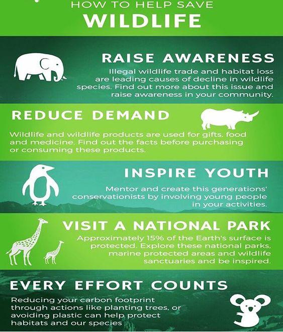
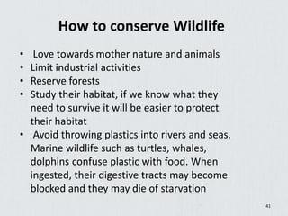

# Speaking Test 4  Units 9-10 

Nguồn: Speaking Test 4 _Units 9-10_.docx

[[00_GOOGLE_DRIVE_INDEX|Mục lục tài liệu Google Drive]]

Nội dung trích xuất từ tài liệu gốc; các ô bảng được đọc lần lượt. Bố cục và định dạng có thể khác bản Word.

## Nội dung tài liệu

Full name: ……………………………………………….

Class: …………………………………………………….

School: …………………………………………………...

Mark:

SPEAKING TEST 4 (UNITS 9 – 10)

TASK 1

Let’s talk about your experience of school bullying and how you overcame it.

The following questions may help you.

1.

When did the incident happen?

2.

Why were you bullied?

3.

What kind of bullying did you face up to and what happened to you?

4.

How did you feel while you were being bullied?

5.

How did you overcome it?

TASK 2

Work in pairs. Each of you receives a card. Use the clues on your card to make questions about your friend’s picture. Use the picture on your card to answer your friend’s questions.

CARD A

How to conserve wildlife

Ask your friends about his/ her picture. Listen to his/ her answers.

1.

What/ the purpose/ notice?

2.

How many/ ways/ we/ help/ conserve/ wildlife?

3.

Why/ we/ need/ follow/ these ways?

4.

What way(s)/ students/ do/ protect/ these wildlife animals?

5.

Which one/ the most important? Why?

Answer your friend’s questions about this picture.

CARD B

How to conserve wildlife

Ask your friends about his/ her picture. Listen to his/ her answers.

1.

What/ the purpose/ notice?

2.

How many/ ways/ we/ help/ conserve/ wildlife?

3.

Why/ we/ need/ follow/ these ways?

4.

What way(s)/ students/ do/ protect/ these wildlife animals?

5.

Which one/ the most important? Why?

Answer your friend’s questions about this picture.
