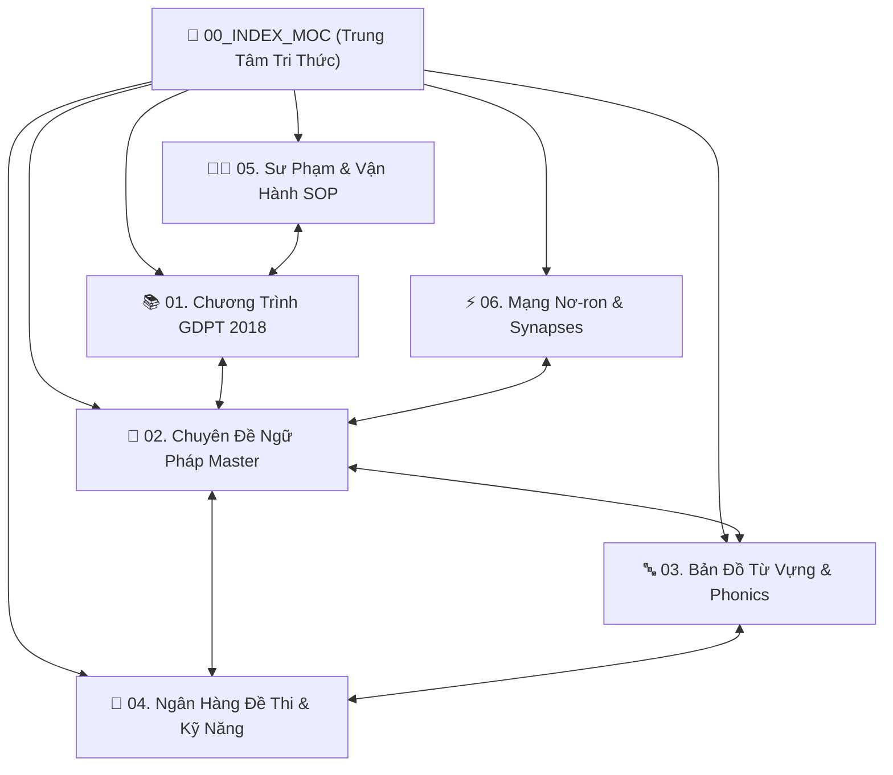

# 🧠 BẢN ĐỒ TRI THỨC TỔNG THỂ (MASTER MAP OF CONTENT)

Chào mừng bạn đến với **Second Brain Tiếng Anh Cô Dung** — hệ thống tri thức số hóa thế hệ mới liên kết đa chiều, chuẩn hóa theo khung chương trình GDPT 2018 của Bộ Giáo dục & Đào tạo Việt Nam và Khung tham chiếu Ngôn ngữ Chung Châu Âu (CEFR: Pre-A1 đến C1).

> [!abstract] Kiến Trúc Second Brain 6 Trụ Cột (Hexagonal Knowledge Engine)
> Vault tri thức này được thiết kế theo phương pháp **Zettelkasten** kết hợp với **Map of Content (MOC)**. Mọi quy tắc ngữ pháp, rễ từ vựng và câu hỏi thi đều có liên kết hai chiều (WikiLinks), giúp người học và giáo viên truy xuất kiến thức tức thì.

---

## 🗺️ 6 Trụ Cột Tri Thức Cốt Lõi

---

### 📚 1. Phân Hệ Chương Trình GDPT 2018
- [[GDPT_Master_Curriculum_MOC|🗺️ Bản đồ tổng chương trình GDPT 12 năm]]
- [[Tieu_Hoc_Lop_1_5|🌱 Bậc Tiểu học (Lớp 1-5): Nền tảng Phonics & Cambridge Starters/Movers/Flyers]]
- [[THCS_Lop_6_9|🌿 Bậc THCS (Lớp 6-9): Chinh phục KET A2 & Luyện thi Vào 10 Chuyên]]
- [[THPT_Lop_10_12|🌳 Bậc THPT (Lớp 10-12): Chuẩn B1/B2 PET/FCE & Kỳ thi Tốt nghiệp THPT Quốc Gia]]
- [[Global_Success_Vs_Friends_Plus_Comparative|⚖️ Bảng so sánh đối sánh Global Success vs Friends Plus]]
- [[Cambridge_CEFR_Framework_Alignment|🎯 Khung quy chiếu năng lực CEFR & Khung 6 bậc Việt Nam]]

---

### 📐 2. Chuyên Đề Ngữ Pháp Chuyên Sâu (Master Grammar Base)
- [[Grammar_Master_MOC|📐 Tổng hợp Chuyên Đề Ngữ Pháp Toàn Diện]]
- [[Present_Tenses_Deep_Dive|⏱️ Thì Hiện Tại Đơn & Hiện Tại Tiếp Diễn]]
- [[Past_Tenses_and_Narrative_Structures|📜 Quá Khứ Đơn, Quá Khứ Tiếp Diễn & Quá Khứ Hoàn Thành]]
- [[Future_Tenses_and_Modality|🚀 Tương Lai Đơn, Tương Lai Gần & Tương Lai Hoàn Thành]]
- [[Tense_Coordination_and_Sequence|🔗 Phối Hợp Thì & Mệnh Đề Trạng Ngữ Chỉ Thời Gian]]
- [[Conditionals_Type_0_1_2_3_Mixed_Inversion|🎲 Câu Điều Kiện Loại 0-3, Hỗn Hợp & Đảo Ngữ Câu Điều Kiện]]
- [[Reported_Speech_and_Reporting_Verbs|🗣️ Câu Tường Thuật & 20 Động Từ Tường Thuật Phức Hợp]]
- [[Passive_Voice_and_Causative_Forms|🛡️ Thể Bị Động Nâng Cao & Cấu Trúc Nhờ Vả (Have/Get sth done)]]
- [[Relative_Clauses_Defining_NonDefining_Reduced|🧬 Mệnh Đề Quan Hệ Xác Định, Không Xác Định & Rút Gọn Mệnh Đề]]
- [[Inversion_and_Cleft_Sentences|⚡ Đảo Ngữ Toàn Diện & Câu Chẻ Nhấn Mạnh (Cleft Sentences)]]
- [[Subjunctive_Mood_and_Hypothetical_Structures|🎭 Thể Giả Định, It's High Time & Cấu Trúc Would Rather]]
- [[Gerunds_and_Infinitives_Verb_Patterns|🔄 Danh Động Từ (Gerunds) & Động Từ Nguyên Thể (Infinitives)]]
- [[Comparatives_Superlatives_Double_Comparatives|📈 So Sánh Hơn, So Sánh Nhất & So Sánh Kép (The More... The More)]]
- [[Phrasal_Verbs_Top_100|🎯 Top 100 Cụm Động Từ Kinh Điển Thường Ra Đề]]
- [[Conjunctions_Connectors_Cohesive_Devices|🧩 Liên Từ, Trạng Từ Liên Kết & Phép Nối Văn Bản]]

---

### 🔤 3. Bản Đồ Từ Vựng & Ngữ Âm (Vocabulary Atlas)
- [[Vocabulary_Atlas_MOC|🔤 Bản Đồ Tổng Quan Từ Vựng & Âm Vị]]
- [[Phonics_and_IPA_Sound_System|🎙️ Hệ Thống 44 Âm Quốc Tế IPA & Phonics Tiểu Học]]
- [[Word_Formation_Prefixes_Suffixes_Roots|🧱 Cấu Tạo Từ: Tiền Tố, Hậu Tố & Gốc Từ Tiếng Anh]]
- [[Lexicon_Primary_G1_G5|🍼 Vốn Từ Bậc Tiểu Học (Grade 1-5 Lexicon)]]
- [[Lexicon_Secondary_G6_G9|🎒 Vốn Từ Bậc THCS (Grade 6-9 Lexicon)]]
- [[Lexicon_HighSchool_G10_G12|🎓 Vốn Từ Bậc THPT & Ôn Thi THPT Quốc Gia (Grade 10-12)]]
- [[Lexicon_Academic_IELTS_C1_C2|💎 Vốn Từ Học Thuật Cao Cấp C1-C2 & IELTS Academic 7.5+]]
- [[Collocations_and_Fixed_Phrases|🔗 Collocations & Cụm Cố Định Thường Gặp]]
- [[False_Friends_and_Common_Confusables|⚠️ Cặp Từ Dễ Nhầm Lẫn Kinh Điển (Confusable Words)]]

---

### 📝 4. Ngân Hàng Đề Thi & Kỹ Năng Làm Bài
- [[Exams_MOC|📝 Bản Đồ Ngân Hàng Đề Thi & Ma Trận Đánh Giá]]
- [[Sentence_Transformation_Techniques_700|✍️ 700 Mô Hình Viết Lại Câu Tuyển Sinh & HSG]]
- [[Error_Identification_Strategies|🔍 Chiến Thuật Nhận Diện & Sửa Lỗi Sai Trong Đề Thi]]
- [[Reading_Comprehension_Paraphrase_Skills|📖 Kỹ Năng Đọc Hiểu & Kỹ Thuật Paraphrase Đoán Nghĩa]]
- [[Phonetics_Stress_Rules_and_Tricks|🎯 Bí Kíp Ăn Điểm Phát Âm Đuôi -ed, -s/-es & Trọng Âm]]
- [[High_School_Entrance_Exam_Vao_10_Mastery|🏛️ Cẩm Nang Ôn Thi Tuyển Sinh Vào Lớp 10 Chuyên]]
- [[THPT_Quoc_Gia_Exam_Strategy|🎯 Chiến Thuật Đạt Điểm 9+ Tiếng Anh THPT Quốc Gia]]

---

### 👩‍🏫 5. Nghiệp Vụ Sư Phạm & Vận Hành (Pedagogy & SOP)
- [[Pedagogy_MOC|👩‍🏫 Bản Đồ Nghiệp Vụ Sư Phạm & Quy Chuẩn Lớp Học]]
- [[Differentiated_Instruction_Framework|🎯 Phương Pháp Dạy Học Phân Hóa Năng Lực Học Sinh]]
- [[Formative_Summative_Assessment_Rubrics|📊 Tiêu Chí Đánh Giá Quá Trình & Đánh Giá Tổng Kết]]
- [[Teacher_Panel_Game_Portal_Integration_SOP|🎮 Quy Trình Giáo Viên Mở Cổng Game Tương Tác Trên Web]]
- [[Leader_Operational_SOP_and_Audit_Workflow|📋 Quy Trình Vận Hành & Giám Sát Tự Động Dành Cho Leader]]

---

### ⚡ 6. Mạng Nơ-ron & Tương Tác Đa Nguồn (Synapses)
- [[Synapses_Master_MOC|⚡ Bản Đồ Kết Nối Đa Chiều Nơ-ron Tri Thức]]
- [[Mindmap_Grammar_Syntactic_Trees|🌳 Cây Cú Pháp Ngữ Pháp & Sơ Đồ Tư Duy]]
- [[Spaced_Repetition_and_Active_Recall_System|⏰ Hệ Thống Lặp Lại Ngắt Quãng (Spaced Repetition) & Trí Nhớ Vĩnh Cửu]]
- [[Multi_Source_Knowledge_Crawl_Matrix|🌐 Ma Trận Cào Dữ Liệu 15 Nguồn Giáo Dục Hàng Đầu]]

## 📥 Kho 35 Tài Liệu Giáo Án & Đề Thi Mới Đồng Bộ (Google Drive)
- [[00_GOOGLE_DRIVE_INDEX|📁 Thư Mục Trung Tâm: Mục Lục Toàn Bộ 35 Tài Liệu Google Drive]]

### Nhóm Tài Liệu Phân Hệ GDPT
- [[drive-nhom-7-chuyen-e-phoi-hop-thi-thpt-huong-khe-d9cc7ef9|Nhóm 7. Chuyên Đề Phối Hợp Thì Thpt Hương Khê]]
- [[drive-photo-quiz-reading-giaoandethitienganh-info-6433023a|Photo Quiz Reading-Giaoandethitienganh.Info]]
- [[drive-unit-5-lesson-5d-speaking-page-73-e4725c58|Unit 5 - Lesson 5D - Speaking - Page 73]]
- [[drive-unit-5-lesson-5f-skills-reading-page-76-56753164|Unit 5 - Lesson 5F - Skills Reading - Page 76]]
- [[drive-although-despite-key-39982d3b|Although Despite Key]]
- [[drive-because-because-of-key-e15b69cf|Because Because Of Key]]
- [[drive-so-that-in-order-to-key-b1ded2bc|So That In Order To Key]]
- [[drive-viet-lai-cau-1-100-b72ba5fe|Viet Lai Cau 1 100]]
- [[drive-yen-lap-g7-ea81ca75|Yen Lap G7]]
- [[drive-grade-6-u8-global-success-84c3528b|Grade 6 - U8 - Global Success]]

### Nhóm Tài Liệu Chuyên Đề Ngữ Pháp
- [[drive-phrasal-verbs-ab32816d|Phrasal Verbs]]
- [[drive-conditional-sentences-key-fe8b7273|Conditional Sentences Key]]
- [[drive-phrasal-verbs-key-debcaeec|Phrasal Verbs Key (Bản trùng)]]
- [[drive-relative-clause-key-ca933f8f|Relative Clause Key]]
- [[drive-reported-speech-key-35c13cb9|Reported Speech Key]]

### Nhóm Tài Liệu Từ Vựng & Phonics
- [[drive-1000-word-formation-cd360c3f|1000 Word Formation]]
- [[drive-22000-tu-toefl-ielts-harold-levine-b48772e8|22000 Tu Toefl Ielts Harold Levine]]
- [[drive-becoming-independent-vocab-972b3e6a|Becoming Independent Vocab]]
- [[drive-cities-urbanisation-vocab-73d9904c|Cities Urbanisation Vocab]]
- [[drive-our-heritage-vocab-d749c408|Our Heritage Vocab]]

### Nhóm Tài Liệu Đề Thi & Ngân Hàng Câu Hỏi
- [[drive-1000-cau-trac-nghiem-ngu-phap-hsg-268c76ae|1000 Cau Trac Nghiem Ngu Phap Hsg]]
- [[drive-31-viet-lai-cau-thi-hsg-lop-10-11-12-223fbdc9|Viet Lai Cau - Thi Hsg Lop 10 11 12]]
- [[drive-chuyen-de-so-1-viet-lai-cau-thi-hsg-lop-10-11-12-045c09d3|Chuyen De So 1 Viet Lai Cau - Thi Hsg Lop 10 11 12 (Bản trùng)]]
- [[drive-ioe-lop-5-tron-bo-3d9eda8c|Ioe Lop 5 Tron Bo]]
- [[drive-key-chuyen-de-so-1-viet-lai-cau-thi-hsg-10-11-12-371e03a0|Key- Chuyen De So 1 Viet Lai Cau Thi Hsg 10 11 12]]
- [[drive-speaking-test-4-units-9-10-26d51a71|Speaking Test 4 Units 9-10]]
- [[drive-chuyen-de-ngu-phap-18444328|Chuyen De Ngu Phap]]
- [[drive-g3-ck1-test-eb751cc4|G3 Ck1 Test]]
- [[drive-g4-ck1-test-f16f49cc|G4 Ck1 Test]]
- [[drive-g5-ck1-test-9ab6f4b1|G5 Ck1 Test]]
- [[drive-g7-hsg-de2-7c5b41f9|G7 Hsg De2]]
- [[drive-hsg-lop-11-6fed2b0b|Hsg Lop 11]]
- [[drive-hsg-lop-12-quang-nam-437fe0cf|Hsg Lop 12 Quang Nam]]
- [[drive-e-hsg-anh-8-so-23-801e422c|Đề Hsg Anh 8 Số 23]]
- [[drive-e-hsg-anh-8-so-24-af2d9e46|Đề Hsg Anh 8 Số 24]]
