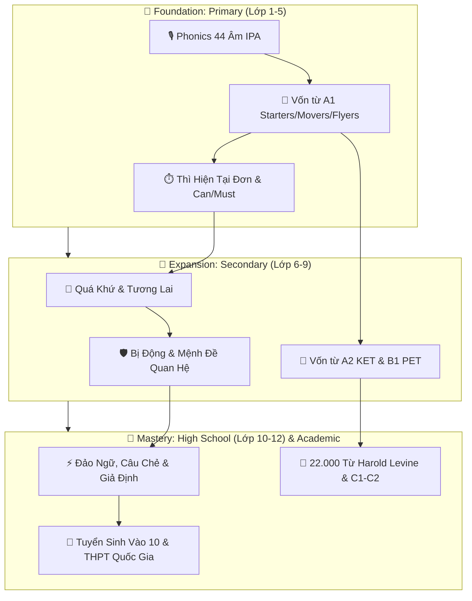

# 🎨 BẢN ĐỒ NƠ-RON TƯ DUY (OBSIDIAN CANVAS & SYNAPTIC MAPS)

Không gian đồ thị liên kết trực quan hỗ trợ học tập thông qua hình ảnh và sơ đồ dòng chảy logic:

## 🔗 Các Giao Lộ Tri Thức Trọng Tâm
- Từ [[Phonics_and_IPA_Sound_System]] dẫn tới [[Phonetics_Stress_Rules_and_Tricks]].
- Từ [[Word_Formation_Prefixes_Suffixes_Roots]] dẫn tới [[Etymology_Latin_Greek_Roots_22000]].
- Từ [[Tense_Coordination_and_Sequence]] dẫn tới [[Error_Identification_Strategies]].
